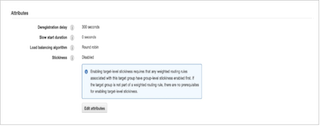

# Infrastructuuruitlijning (time-outs en verbindingslimieten)

Er zijn instellingen met AEM en Adobe Commerce en omringende infrastructuren zoals taakverdelingsmechanismen die uitlijning vereisen. Deze instellingen hebben betrekking op verbindingsgrenzen en time-outinstellingen.

Een verkeerde aanpassing tussen deze grenzen zou betekenen dat de verbindingen aan AEM kant zouden kunnen worden vertraagd, terwijl de Handel van de Adobe meer verbindingen kan behandelen. Op dezelfde manier voor de onderbrekingsmontages, zou een wangroepering timeout fouten aan AEM kant kunnen betekenen, terwijl de Handel van de Adobe nog een verzoek verwerkt.

Voor de time-outinstellingen moeten de instellingen worden gecontroleerd en uitgelijnd om te voorkomen dat er 503 time-outfouten verschijnen wanneer deze onder belasting zijn. Er zijn verschillende instellingen voor de infrastructuur en time-out van de toepassing die u wilt controleren:

## AEM

Ervan uitgaande dat de infrastructuur een taakverdelingsmechanisme voor AWS-toepassingen en meerdere verzenders/uitgevers bevat, moet voor het taakverdelingsmechanisme rekening worden gehouden met de volgende instellingen:

1. De gezondheidscontroles van uitgevers moeten worden herzien om te voorkomen dat verzenders onnodig vroeg uit de dienst vallen vanwege de oplaadpieken. De time-outinstellingen van de taakverdelingscontrole moeten worden afgestemd op de time-outinstellingen van de uitgever.

   

1. De doelgroepkleverheid van de Dispatcher kan worden uitgeschakeld en het taakverdelingsalgoritme van de Round Robin kan worden gebruikt. Hierbij wordt ervan uitgegaan dat er geen AEM specifieke functionaliteit is of AEM gebruikerssessies worden gebruikt waarvoor de sessiestandaardigheid moet worden ingesteld. Het veronderstelt dat gebruikerslogin en zittingsbeheer slechts op de Handel van Adobe via GraphQL is.

   

1. Houd er rekening mee dat als u sessiestandaardigheid inschakelt, aanvragen naar Snelheid niet in de cache kunnen worden opgeslagen. Standaard worden pagina&#39;s niet met de koptekst Set-Cookies in de cache geplaatst. Met Adobe Commerce worden cookies zelfs ingesteld op cacheable pages (TTL > 0), maar met de standaard snelle VCL worden deze cookies gestript op cacheable pages, zodat snel caching werkt. Als pagina&#39;s niet in cache worden geplaatst, controleert u eventueel gebruikte aangepaste cookies en uploadt u ook de Fastly VCL en controleert u de site opnieuw.

## Time-outinstellingen voor verzending

De /timeout in de verzender &quot;renders&quot;opties specificeert de verbindingstijd die tot de AEM publicatieinstantie in milliseconden toegang heeft. Deze moet worden gecontroleerd en de standaardinstelling &quot;0&quot; (onbepaalde time-out) moet worden gebruikt als er een afzonderlijk taakverdelingsmechanisme aanwezig is voor het afhandelen van de time-outinstellingen.

Als er geen taakverdelingsmechanisme in de infrastructuur is, zouden de onderbrekingsmontages in plaats daarvan in de verzender /timeout montages moeten worden gespecificeerd, met een waarde die de onderbrekingsmontages GraphQL in de uitgever aanpast.

## Uitgevers

GrafiekQL van uitgever verbindingsgrenzen en onderbrekingen: Aanvankelijk, zouden de Max verbindingen van HTTP in de Adobe Commerce CIF montages van de Configuratie van de Cliënt GraphQL van de Fabriek OSGI aan de standaard Fastly maximumverbindingsgrens moeten worden geplaatst, die momenteel aan 200 wordt geplaatst. Zelfs als er meerdere uitgevers in het AEM bedrijf zijn, moet de limiet voor elke uitgever hetzelfde zijn, overeenkomstig de instelling Snelst. De reden hiervoor is dat in sommige gevallen één uitgever meer verkeer zou kunnen verwerken dan de andere uitgevers, als een verbonden verzender bijvoorbeeld uit het landbouwbedrijf wordt gehaald. Dit zou betekenen dat al verkeer door de enige resterende verzender en uitgevers zou worden verpletterd, in dit geval kan één enkele uitgever alle verbindingen van HTTP dan nodig hebben.

De &quot;standaardmethode van HTTP&quot;zou van POST aan GET moeten worden geplaatst. Slechts worden de verzoeken van de GET in het voorgeheugen ondergebracht in het geheime voorgeheugen van de Handel GraphQL van Adobe en zodat zou de standaardmethode altijd aan GET moeten worden geplaatst.

De time-out van de http-verbinding en de http-socket moet worden ingesteld op een waarde die overeenkomt met de time-out Fastly.

De volgende afbeelding toont de Magento CIF GraphQL Client Configuration Factory. De hier getoonde instellingen zijn alleen voorbeelden en moeten per geval worden aangepast:

In de volgende afbeeldingen ziet u de snelste achtergrondconfiguraties. De hier getoonde instellingen zijn alleen voorbeelden en moeten per geval worden aangepast:

