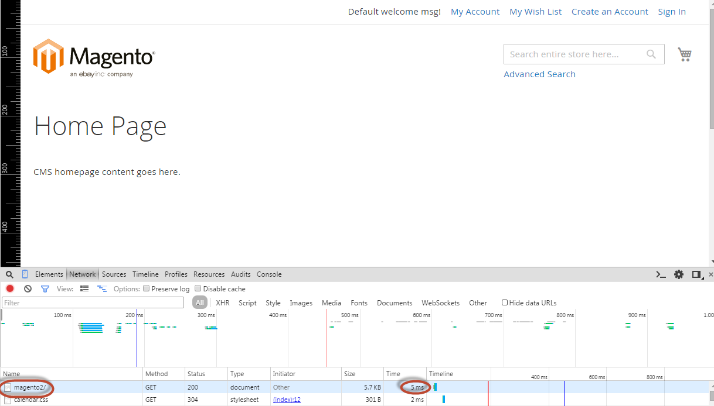

# Laatste verificatie van de Varnish-configuratie

Nu u `default.vcl` gebruikt die voor u door Commerce wordt geproduceerd, kunt u sommige definitieve controles uitvoeren om ervoor te zorgen dat Varnish werkt.

## HTTP-antwoordheaders verifiëren

Gebruik `curl` of een ander hulpprogramma om HTTP-antwoordheaders weer te geven wanneer u een Commerce-pagina in een webbrowser bezoekt.

Eerst, zorg ervoor u [&#x200B; ontwikkelaarwijze &#x200B;](../cli/set-mode.md#change-to-developer-mode) gebruikt; anders, zult u niet de kopballen zien.

Bijvoorbeeld:

```bash
curl -I -v --location-trusted 'http://192.0.2.55/magento2'
```

Belangrijke koppen:

```
X-Magento-Cache-Control: max-age=86400, public, s-maxage=86400
Age: 0
X-Magento-Cache-Debug: MISS
```

>[!INFO]
>
>Deze waarde is ook acceptabel: `X-Magento-Cache-Debug: HIT` .

## De laadtijden van de pagina controleren

Als Varnish werkt, moet een Commerce-pagina met cacheable blokken binnen 150 ms worden geladen. Voorbeelden van dergelijke pagina&#39;s zijn de pagina&#39;s van de eerste en de winkelcategorie.

Met een browsercontrole kunt u de laadtijden van de pagina meten.

Als u bijvoorbeeld de Chrome-controle wilt gebruiken:

1. Open Commerce-pagina&#39;s die in de cache kunnen worden opgeslagen in Chrome.
1. Klik met de rechtermuisknop ergens op de pagina.
1. Klik in het pop-upmenu op **[!UICONTROL Inspect Element]**
1. Klik in het deelvenster Inspecteur op de tab **[!UICONTROL Network]** .
1. Vernieuw de pagina.
1. Blader naar de bovenkant van het deelvenster met de controle, zodat u de URL kunt zien van de pagina die u bekijkt.

   In de volgende afbeelding ziet u een voorbeeld van het laden van de indexpagina `magento2` .

    bekijkt

   De laadtijd van de pagina wordt weergegeven naast de pagina-URL. In dit geval is de laadtijd 5 ms. Zo kunt u bevestigen dat Varnish de pagina in het cachegeheugen heeft opgeslagen.

1. Klik op de pagina-URL (in de kolom Naam) om HTTP-antwoordheaders weer te geven.

   U kunt de kopballen van HTTP bekijken die meer in detail in de Verify sectie van de reactiekoppen van HTTP worden besproken.

## De Commerce-cache controleren

Controleer of de map `<magento_root>/var/page_cache` leeg is:

1. Meld u aan bij uw Commerce-server of schakel over naar de eigenaar van het bestandssysteem.
1. Voer de volgende opdracht in:

   ```bash
   rm -rf <magento_root>/var/page_cache/*
   ```

1. Open een of meer cacheable Commerce-pagina&#39;s.
1. Controleer de map `var/page_cache/` .

   Als de directory leeg is, gefeliciteerd! U hebt Varnish en Commerce geconfigureerd om samen te werken!

1. Als u de map `var/page_cache/` hebt gewist, start u Varnish opnieuw.

>[!TIP]
>
>Als u 503 (Ontbroken de Ophalen van de Achterkant) fouten ontmoet, zie [&#x200B; het Oplossen van problemen 503 (de Dienst niet beschikbaar) fouten &#x200B;](https://experienceleague.adobe.com/docs/commerce-knowledge-base/kb/troubleshooting/miscellaneous/troubleshooting-503-errors.html?lang=nl-NL) in het _Adobe Commerce Help Center_.
