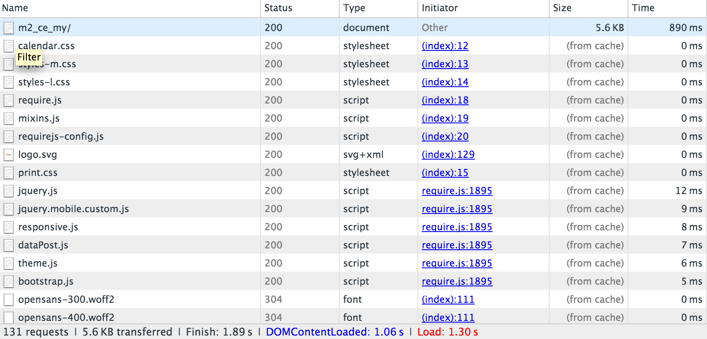

# Varnish configureren

[Varnish Cache] is een open-source webtoepassingsaccelerator (ook wel een _HTTP-accelerator_ of _HTTP-reverse-proxy in cache plaatsen_). Varnish slaat (of geheime voorgeheugens) dossiers of fragmenten van dossiers in geheugen op, die Varnish toelaat om de reactietijd en het verbruik van de netwerkbandbreedte op toekomstige, gelijkwaardige verzoeken te verminderen. In tegenstelling tot webservers als Apache en nginx, werd Varnish uitsluitend ontworpen voor gebruik met het HTTP-protocol.

Handel 2.4.2 wordt getest met Varnish 6.4. Handel 2.4.x is verenigbaar met Varnish 6.x

>[!WARNING]
>
>Wij _sterk aanbevelen_ Als u Varnish gebruikt in productie. De ingebouwde volledige paginacoching-aan of het dossiersysteem of [database]—is veel langzamer dan Varnish, en Varnish wordt ontworpen om het verkeer van HTTP te versnellen.

Zie voor meer informatie over Varnish:

- [De Big Varnish Picture]
- [Opstartopties vervagen]
- [Vernish en de Prestaties van de Website]

## Varnish topologiediagram

Het volgende cijfer toont een basismening van Varnish in uw topologie van de Handel.


In de bovenstaande afbeelding resulteren HTTP-aanvragen van gebruikers via internet in een groot aantal aanvragen voor CSS, HTML, JavaScript en afbeeldingen (gezamenlijk aangeduid als _elementen_). Varnish bevindt zich vóór de webserver en verzendt deze aanvragen bij de webserver.

Wanneer de webserver elementen retourneert, worden cacheable elementen in het Varnish opgeslagen. Elke volgende aanvraag voor deze elementen wordt door Varnish ingewilligd (de aanvragen bereiken dus niet de webserver). Varnish retourneert bijzonder snel inhoud in de cache. De resultaten zijn snellere reactietijden om de inhoud aan gebruikers en een verminderd aantal verzoeken terug te keren die door de Handel moeten worden vervuld.

Elementen die in het cachegeheugen van Varnish zijn geplaatst, verlopen met een configureerbaar interval of worden vervangen door nieuwere versies van dezelfde elementen. U kunt de cache ook handmatig wissen met de beheerfunctie of de [`magento cache:clean`](../cli/manage-cache.md#clean-and-flush-cache-types) gebruiken.

## Procesoverzicht

Dit onderwerp bespreekt hoe te om Varnish met een minimale reeks parameters aanvankelijk te installeren en te testen dat het werkt. Vervolgens exporteert u een Varnish-configuratie vanuit Commerce Admin en test u deze opnieuw.

Het proces kan als volgt worden samengevat:

1. Installeer Varnish en test het door tot om het even welke pagina van de Handel toegang te hebben om te zien of krijgt u de antwoordkopballen van HTTP die erop wijzen Varnish werkt.
1. Installeer de software van de Handel en gebruik Admin om een de configuratiedossier van Varnish tot stand te brengen.
1. Vervang het bestaande Varnish-configuratiebestand door het bestand dat door de beheerder is gegenereerd.
1. Test alles opnieuw.

   Als er niets in uw `<magento_root>/var/page_cache` directory, hebt u Varnish met Handel met succes gevormd!

>[!NOTE]
- Behalve waar genoteerd, moet u alle bevelen ingaan die in dit onderwerp als gebruiker met worden besproken `root` rechten.
- Dit onderwerp is geschreven voor Varnish op CentOS en Apache 2.4. Als u Varnish in een verschillende omgeving instelt, kunnen sommige opdrachten anders zijn. Raadpleeg de documentatie bij Varnish voor meer informatie.


## Bekende problemen

We kennen de volgende kwesties met Varnish:

- [Varnish biedt geen ondersteuning voor SSL]

   Als alternatief, gebruiksSSL beëindiging of een SSL beëindigingsvolmacht.

- Als u de inhoud van het dialoogvenster `<magento_root>/var/cache` directory, moet u Varnish opnieuw beginnen.

- Mogelijke fout bij het installeren van Commerce:

   ```terminal
   Error 503 Service Unavailable
   Service Unavailable
   XID: 303394517
   Varnish cache server
   ```

   Als deze fout optreedt, bewerkt u `default.vcl` en voeg een time-out toe aan de `backend` stanza, als hieronder:

   ```conf
   backend default {
       .host = "127.0.0.1";
       .port = "8080";
       .first_byte_timeout = 600s;
   }
   ```

## Overzicht van het in cache plaatsen van Varnish

Varnish caching werkt met Commerce met behulp van:

- [`nginx.conf.sample`](https://github.com/magento/magento2/blob/2.4/nginx.conf.sample) van de Magento 2 bewaarplaats van GitHub
- `.htaccess` gedistribueerd configuratiebestand voor Apache dat bij de Handel wordt geleverd
- `default.vcl` configuratie voor Varnish die wordt gegenereerd met de [Beheer](../cache/configure-varnish-commerce.md)

>[!INFO]
Dit onderwerp behandelt slechts de standaardopties in de voorafgaande lijst. Er zijn vele andere manieren om caching in complexe scenario&#39;s (bijvoorbeeld, gebruikend een Netwerk van de Levering van de Inhoud) te vormen; deze methoden vallen buiten het toepassingsgebied van deze gids .

Op het eerste browser verzoek, worden de cacheable activa geleverd aan cliëntbrowser van Varnish en caching op browser.

Daarnaast gebruikt Varnish een eenheidtag (ETag) voor statische activa. Met ETag kunt u bepalen wanneer statische bestanden op de server veranderen. Hierdoor worden statische elementen naar de client verzonden wanneer deze op de server worden gewijzigd. Dit kan op een nieuw verzoek van een browser of wanneer de client het cachegeheugen van de browser vernieuwt, meestal door op F5 of Control+F5 te drukken.

De volgende secties bevatten meer details.

## Caching door browser request

In deze sectie wordt een browsercontrole gebruikt om te tonen hoe elementen in de eerste aanvraag aan de browser worden geleverd en vervolgens uit de lokale browsercache worden geladen.

### Eerste browserverzoek

`nginx.conf.sample` en `.htaccess` bieden opties voor het in cache plaatsen van clients. Wanneer het eerste verzoek van browser voor een cacheable voorwerp wordt gemaakt, levert Varnish het aan de cliënt.

In de volgende afbeelding ziet u een voorbeeld met een browsercontrole:


In het voorgaande voorbeeld wordt een aanvraag voor de hoofdpagina storefront getoond (`m2_ce_my`). CSS- en JavaScript-elementen worden in cache geplaatst in de clientbrowser.

>[!NOTE]
De meeste statische elementen hebben een HTTP 200 (OK)-statuscode die aangeeft dat het element van de server is opgehaald.

### Tweede browserverzoek

Als dezelfde browser dezelfde pagina opnieuw opvraagt, worden deze elementen geleverd vanuit de lokale browsercache, zoals in de volgende afbeelding wordt getoond.



Let op het verschil in responstijd tussen het eerste en het tweede verzoek. Ook hier hebben statische elementen een antwoordcode van 200 (OK), omdat ze voor het eerst worden geleverd via de lokale cache.

## Hoe de Handel Etag gebruikt

In het volgende voorbeeld worden responsheaders voor een bepaald statisch element weergegeven.


`calendar.css` heeft een ETag- antwoordkopbal wat betekent het CSS dossier op cliëntbrowser kan worden vergeleken met die op de server.

Daarnaast worden statische elementen geretourneerd met de HTTP-statuscode 304 (Niet gewijzigd), zoals in de volgende afbeelding wordt getoond.


De 304-statuscode treedt op omdat de gebruiker de lokale cache ongeldig heeft gemaakt en de inhoud op de server niet is gewijzigd. Vanwege de 304-statuscode is het statische element _content_ niet wordt overgedragen; alleen HTTP-headers worden naar de browser gedownload.

Als de inhoud op de server verandert, downloadt de client het statische element met een HTTP 200 (OK)-statuscode en een nieuwe ETag.

<!-- Link Definitions -->

[database]: https://developer.adobe.com/commerce/php/development/cache/partial/database-caching/
[De Big Varnish Picture]: https://www.varnish-cache.org/docs/trunk/users-guide/intro.html
[Varnish Cache]: https://varnish-cache.org
[Opstartopties vervagen]: https://www.varnish-cache.org/docs/trunk/reference/varnishd.html#ref-varnishd-options
[Vernish en de Prestaties van de Website]: https://www.varnish-cache.org/docs/trunk/users-guide/performance.html#users-performance
[Varnish biedt geen ondersteuning voor SSL]: https://www.varnish-cache.org/docs/3.0/phk/ssl.html
