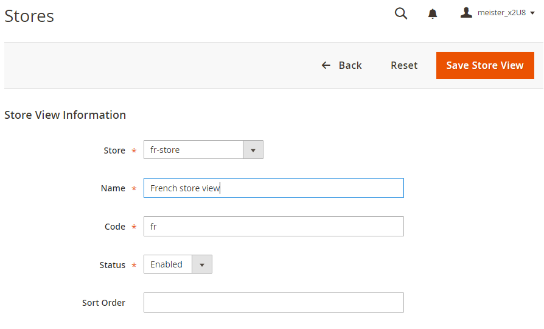

# Meerdere weergaven instellen in Beheer

Voor deze taak moet u een hoofdcategorie (en desgewenst extra categorieën) voor elke winkel maken. De taken die in dit onderwerp worden besproken verstrekken één manier aan opstelling veelvoudige opslag. Raadpleeg de volgende bronnen in de Handleiding voor Handel voor aanvullende informatie:

- [Categorieën](https://docs.magento.com/user-guide/catalog/categories.html)
- [Websites toevoegen](https://docs.magento.com/user-guide/stores/stores-all-create-website.html)
- [URL&#39;s opslaan](https://docs.magento.com/user-guide/stores/store-urls.html)
- [Inhoud](https://docs.magento.com/user-guide/cms/content-menu.html)

>[!INFO]
>
>Alleen gebruiken we bijvoorbeeld een Franse website met webcode `french` in dit onderwerp. Voor stapsgewijze zelfstudies raadpleegt u [Zelfstudie: Meerdere websites instellen met Apache](ms-apache.md) en [Zelfstudie: Meerdere websites met nginx instellen](ms-nginx.md)

## Stap 1: Hoofdcategorieën maken

Het maken van een hoofdcategorie is optioneel, maar in deze zelfstudie wordt getoond hoe u dit kunt doen als u wilt dat elke website een unieke hoofdcategorie heeft. U kunt desgewenst extra categorieën maken.

Een hoofdcategorie maken:

1. Meld u aan bij de beheerder als een gebruiker die geautoriseerd is om categorieën te maken.
1. Klikken **Catalogus** > **Categorieën**.
1. Klikken **Hoofdcategorie toevoegen**.
1. In de **Categorienaam** Voer een unieke naam in om deze categorie te identificeren.
1. Controleer of Categorie inschakelen is ingesteld op **Ja**.

   Voor informatie over de andere opties op deze pagina raadpleegt u [Basiscategorieën](https://docs.magento.com/user-guide/catalog/category-root.html).

   In de volgende afbeelding ziet u een voorbeeld.

   

1. Klikken **Opslaan**.
1. Herhaal deze taken zo vaak als nodig om wortelcategorieën voor uw opslag tot stand te brengen.

## Stap 2: Websites maken

Een website maken:

1. Meld u aan bij de beheerder als een gebruiker die geautoriseerd is om websites te maken, weergaven op te slaan en op te slaan.
1. Klikken **Winkels** > **Instellingen** > **Alle winkels**.
1. Op de _Winkels_ pagina, klikt u op **Website maken**.

   - **Naam**—Voer een naam in om de website te identificeren.
   - **Code**—Voer een unieke code in; Als u bijvoorbeeld een Franse winkel hebt, kunt u `french`
   - **Sorteervolgorde**—Voer een optionele numerieke sorteervolgorde in.

   In de volgende afbeelding ziet u een voorbeeld.

   

1. Klikken **Website opslaan**.
1. Herhaal deze taken zo vaak als nodig is om uw websites te maken.

## Stap 3: Opslagruimten maken

Een winkel maken:

1. In de _Beheer_ deelvenster, klikt u op **Winkels** > **Instellingen** > **Alle winkels**.
1. Op de _Winkels_ pagina, klikt u op **Winkel maken**.

   - **Website**—Klik op de naam van de website waaraan u deze winkel wilt koppelen.
   - **Naam**—Voer een naam in om de winkel te identificeren.
   - **Code**—Voer een unieke code in om de winkel te identificeren.
   - **Basiscategorie**—Klik de naam van de wortelcategorie voor deze opslag.

   In de volgende afbeelding ziet u een voorbeeld.

   

1. Klikken **Opslag opslaan**.
1. Herhaal deze taken zo vaak als nodig is om uw winkels te maken.

## Stap 4: Winkelweergaven maken

Een winkelweergave maken:

1. In de _Beheer_ deelvenster, klikt u op **Winkels** > **Instellingen** > **Alle winkels**.
1. Klik op de pagina Winkels op **Winkelweergave maken**.

   - **Winkel**—Klik op de naam van de winkel waaraan u deze winkelweergave wilt koppelen.
   - **Naam**—Voer een naam in om deze winkelweergave te identificeren.
   - **Code**—Voer een unieke naam in om deze winkelweergave te identificeren.
   - **Status**—Selecteren **Ingeschakeld**.

   In de volgende afbeelding ziet u een voorbeeld.

   

1. Klikken **Winkelweergave opslaan**.
1. Herhaal deze taken zo vaak als nodig is om uw winkelweergaven te maken.

## Stap 5: De URL van de websitebasis wijzigen

Een website openen met een unieke URL als `http://french.magento.mg`, moet u de basis-URL voor elke site wijzigen in Beheer.

De URL van de websitebasis wijzigen:

1. In de _Beheer_ deelvenster, klikt u op **Winkels** > **Instellingen** > **Configuratie** > **Algemeen** > **Web**.
1. Van de **Winkelweergave** Klik boven aan de pagina op de naam van een van uw websites, zoals in de volgende afbeelding wordt getoond.

   

1. Vouw in het rechterdeelvenster uit **Basis-URL&#39;s**.
1. In de _Basis-URL&#39;s_ sectie, duidelijk **Systeemwaarde gebruiken**.
1. Voer de `http://french.magento.mg` URL in de **Basis-URL** en **URL basiskoppeling** velden.

1. De vorige stap in de _Basis-URL&#39;s (veilig)_ sectie.

   >[!INFO]
   >
   >Als u een basis-URL instelt voor de implementatie van Adobe Commerce op cloudinfrastructuur, moet u de eerste periode vervangen door drie streepjes. Als de basis-URL bijvoorbeeld `french.branch-sbg7pPa-f3dueAiM03tpy.us.magentosite.cloud`, enter `http://french---branch-sbg7pPa-f3dueAiM03tpy.us.magentosite.cloud`. Gebruik een punt als u een basis-URL instelt voor lokale tests.

1. Klikken **Config opslaan**.

1. Herhaal deze taken voor andere websites.

## Stap 6: De code van de winkel toevoegen aan de basis-URL

De handel geeft u de optie om de opslagcode aan het plaatsbasis URL toe te voegen, die het proces vereenvoudigt om veelvoudige opslag te vestigen. Als u deze optie gebruikt, hoeft u geen mappen te maken in het bestandssysteem Commerce om op te slaan `index.php` en `.htaccess`.

Dit voorkomt `index.php` en `.htaccess` in toekomstige upgrades niet meer synchroon te zijn met de Koophandel.

Zie de [Handboek voor handel](https://docs.magento.com/user-guide/stores/store-urls.html).

U voegt als volgt de code van de winkel toe aan de basis-URL:

1. In de _Beheer_ deelvenster, klikt u op **Winkels** > **Instellingen** > **Configuratie** > **Algemeen** > **Web**.
1. Van de **Winkelweergave** lijst boven aan de pagina klikt u op **Standaardconfiguratie** zoals het volgende cijfer toont.

   

1. Vouw in het rechterdeelvenster uit **URL-opties**.
1. Wis de **Systeemwaarde gebruiken** selectievakje naast _Winkelcode toevoegen aan URL&#39;s_.
1. Van de _Winkelcode toevoegen aan URL&#39;s_ lijst, klikt u op **Ja**.

   

1. Klikken **Config opslaan**.
1. Maak desgevraagd de cache leeg. (**Systeem** > **Cachebeheer**).

## Stap 7: De standaard basis-URL van de winkelweergave wijzigen

U moet deze stap als laatste uitvoeren omdat u de toegang tot de beheerder verliest. uw toegangswinst nadat u opstelling virtuele gastheren zoals die in de web-server-specifieke onderwerpen worden besproken.

De standaard basis-URL van de winkelweergave wijzigen:

1. In de _Beheer_ deelvenster, klikt u op **Winkels** > **Instellingen** > **Configuratie** > **Algemeen** > **Web**.

1. Van de _Winkelweergave_ lijst boven aan de pagina klikt u op **Standaardconfiguratie**.

   

1. Vouw in het rechterdeelvenster uit **Basis-URL&#39;s**.
1. In de _Basis-URL&#39;s_ sectie, duidelijk **Systeemwaarde gebruiken**.
1. Voer de `http://magento.mg` URL in de **Basis-URL** en **URL basiskoppeling** velden.

1. De vorige stap in de **Basis-URL&#39;s (veilig)** sectie.

   >[!INFO]
   >
   >Als u een basis-URL voor Adobe Commerce instelt op cloudinfrastructuur, moet u de eerste punt vervangen door drie streepjes. Als de basis-URL bijvoorbeeld `french.branch-sbg7pPa-f3dueAiM03tpy.us.magentosite.cloud`, enter `http://french---branch-sbg7pPa-f3dueAiM03tpy.us.magentosite.cloud`

1. Klikken **Config opslaan**.

>[!INFO]
>
>De website-, opslag- en winkelweergavecode kan alleen letters (a-z of A-Z), getallen (0-9) en onderstrepingstekens (_) bevatten. Het eerste teken moet ook een letter zijn. Als hoofdletters of hoofdletters worden gebruikt, is de overeenkomst intern niet hoofdlettergevoelig voor overschrijvingen van configuratie-instellingen via omgevingsvariabelen. Zie [Omgevingsvariabelen gebruiken om configuratie-instellingen te overschrijven](../reference/override-config-settings.md#environment-variables).