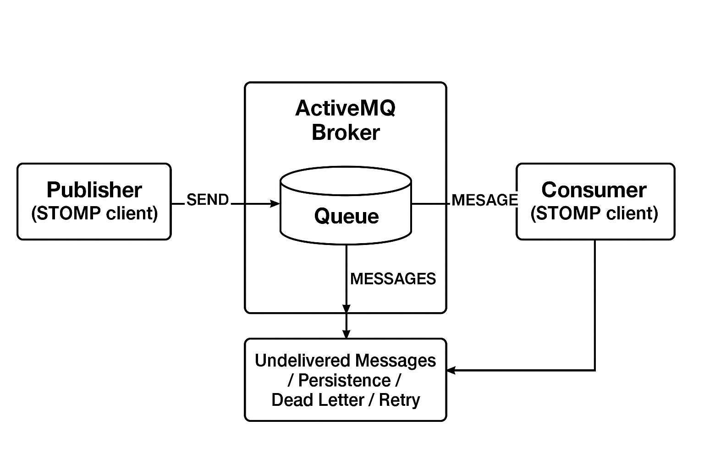

# Overzicht van wachtrij met berichten

Het Kader van de Rij van het Bericht (MQF) is een systeem dat een module toestaat om berichten aan rijen te publiceren. Het bepaalt ook de [ consumenten ](consumers.md) die de berichten asynchroon zullen ontvangen. MQF steunt veelvoudige overseinenmakers:

- **[[!DNL RabbitMQ]](https://www.rabbitmq.com)** - de primaire overseinenmakelaar, die een scalable platform voor het verzenden van en het ontvangen van berichten verstrekt. Het omvat een mechanisme voor het opslaan van niet geleverde berichten en is gebaseerd op de Geavanceerde specificatie van het een rij vormen van het Bericht van het Protocol (AMQP) 0.9.1.
- **[Apache ActiveMQ Artemis ](https://activemq.apache.org/components/artemis/)** - een alternatieve overseinenmakelaar die STOMP (het Eenvoudige Text Oriented Messaging Protocol) voor betrouwbaar en scalable overseinen gebruikt. Inleiding in Adobe Commerce 2.4.5 en latere versies.

## Konijn-MQ (AMQP)

Het volgende diagram illustreert het Kader van de Rij van het Bericht:

- Een uitgever is een component die berichten naar een uitwisseling verzendt. Het weet aan welke uitwisseling te publiceren aan en het formaat van de berichten het verzendt.

- Een uitwisseling ontvangt berichten van uitgevers en verzendt hen naar rijen. Hoewel [!DNL RabbitMQ] veelvoudige types van uitwisseling steunt, gebruikt Commerce onderwerpuitwisseling slechts. Een onderwerp omvat een verpletterende sleutel, die tekstkoorden bevat die door punten worden gescheiden. De indeling voor een onderwerpnaam is `string1.string2` : bijvoorbeeld `customer.created` of `customer.sent.email` .

  De makelaar staat u toe om vervangingen te gebruiken wanneer het plaatsen van regels voor het door:sturen van berichten. U kunt een asterisk (`*`) gebruiken om _één_ koord of een pond teken (`#`) te vervangen om 0 of meer koorden te vervangen. `customer.*` filtert bijvoorbeeld op `customer.create` en `customer.delete` , maar niet `customer.sent.email` . `customer.#` filtert echter op `customer.create` , `customer.delete` en `customer.sent.email` .

- Een wachtrij is een buffer die berichten opslaat.

- Een consument ontvangt berichten. Het weet welke rij te verbruiken is. Het kan bewerkers van het bericht aan een specifieke rij in kaart brengen.

## Apache ActiveMQ Artemis (STOMP)

Als alternatief voor RabbitMQ, steunt Adobe Commerce ook [ Apache ActiveMQ Artemis ](https://activemq.apache.org/components/artemis/) als overseinenmakelaar gebruikend het Eenvoudige Text Oriented Messaging Protocol (STOMP).

>[!NOTE]
>
>ActiveMQ Artemis is geïntroduceerd in Adobe Commerce 2.4.5 en latere versies.

Het volgende diagram illustreert het STOMP-framework met ActiveMQ-artemis:

### onderdelen van STOMP Framework

- A **uitgever** is een component die berichten naar een bestemming (rij of onderwerp) verzendt. Het weet welke bestemming aan te publiceren en het formaat van de berichten het verzendt.

- A **bestemming** in STOMP dient een gelijkaardige rol aan uitwisselingen in AMQP, die berichten van uitgevers ontvangen en hen verpletteren. STOMP gebruikt directe doeladressering met een hiërarchisch naamgevingspatroon met behulp van punten: bijvoorbeeld `customer.created` of `inventory.updated` .

  Adobe Commerce gebruikt **ANYCAST** richtend wijze voor STOMP bestemmingen, die punt aan punt berichtlevering verstrekt. In de ANYCAST-modus worden berichten aan slechts één consument geleverd vanuit een pool van beschikbare consumenten, waardoor taakverdeling en werkdistributie over meerdere consumenteninstanties mogelijk zijn.

- A **rij** is een buffer die berichten opslaat. Met ANYCAST het richten, zorgt de rij ervoor dat de berichten aan slechts één consument worden geleverd, zelfs wanneer de veelvoudige consumenten met de zelfde bestemming worden verbonden.

- A **consument** ontvangt berichten van bestemmingen. Het weet welke bestemming om aan in te tekenen en berichten met verschillende erkenningswijzen (auto, cliënt, of cliënt-individu) kan verwerken.

## MySQL-adapter (fallback)

Een basissysteem van de berichtrij kan ook opstelling zijn zonder externe berichtbrokers te gebruiken. In dit systeem slaat een MySQL-adapter berichten op in de database. Drie databasetabellen (`queue`, `queue_message` en `queue_message_status` ) beheren de werkbelasting van de wachtrij met berichten. Cron jobs zorgen ervoor dat de consumenten berichten kunnen ontvangen. Deze oplossing is niet erg schaalbaar. Externe berichtenmakelaars zoals [!DNL RabbitMQ] of Apache ActiveMQ Artemis moeten waar mogelijk worden gebruikt voor productieomgevingen.

## Verwante informatie

Voor installatie- en configuratieinstructies:

- [RabbitMQ installeren en configureren](../../installation/prerequisites/rabbitmq.md)
- [ActiveMQ-artemis installeren en configureren](../../installation/prerequisites/activemq.md)
- [Berichtenrijen beheren](manage-message-queues.md)
- [Gebruikers in de wachtrij met berichten](consumers.md)
