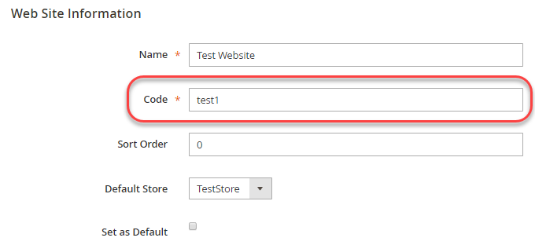

# Configuratie-instellingen overschrijven

Dit onderwerp bespreekt hoe te om een milieu veranderlijke naam af te leiden die een configuratiepad kent. U kunt de configuratie-instellingen van Adobe Commerce overschrijven met behulp van omgevingsvariabelen. U kunt bijvoorbeeld de waarde van de live URL van een betalingsprocessor overschrijven op uw productiesysteem.

U kunt de waarde van _met voeten treden om het even welke_ configuratie die milieuvariabelen plaatst; nochtans, adviseert Adobe u verenigbare montages gebruikend het gedeelde configuratiedossier, `config.php`, en het systeem-specifieke configuratiedossier, `env.php`, zoals besproken in [ het algemene overzicht van de Plaatsing ](../deployment/overview.md) handhaaft.

>[!TIP]
>
>Controle uit [ vormt milieu&#39;s ](https://experienceleague.adobe.com/docs/commerce-cloud-service/user-guide/configure/env/stage/variables-intro.html?lang=nl-NL) onderwerp in _Commerce op de gids van de Infrastructuur van de Wolk_.

## Omgevingsvariabelen

Een omgevingsvariabele naam bestaat uit het bereik gevolgd door het configuratiepad in een bepaalde indeling. De volgende secties bespreken hoe te om een veranderlijke naam in detail te bepalen.

U kunt variabelen voor om het even welk van het volgende gebruiken:

- [ Gevoelige waarden ](config-reference-sens.md) moeten worden geplaatst gebruikend of omgevingsvariabelen of het [`magento config:sensitive:set`](../cli/set-configuration-values.md) bevel.
- Systeemspecifieke waarden moeten worden ingesteld met:

   - Omgevingsvariabelen
   - De opdracht [`magento config:set`](../cli/set-configuration-values.md)
   - De Admin die door het [`magento app:config:dump` bevel ](../cli/export-configuration.md) wordt gevolgd

De wegen van de configuratie kunnen in worden gevonden:

- [Verwijzing naar gevoelige en systeemspecifieke configuratiepaden](config-reference-sens.md)
- [Verwijzing naar betalingspaden](config-reference-payment.md)
- [Referentie voor Commerce B2B-uitbreidingspaden](config-reference-b2b.md)
- [Verwijzing naar andere configuratiepaden](config-reference-general.md)

### Namen van variabelen

De algemene indeling van namen van systeeminstellingenvariabelen is als volgt:

`<SCOPE>__<SYSTEM__VARIABLE__NAME>`

`<SCOPE>` kan als volgt zijn:

- Globaal werkingsgebied (namelijk het globale plaatsen voor _alle_ werkingsgebied)

  Algemene bereikvariabelen hebben de volgende indeling:

  `CONFIG__DEFAULT__<SYSTEM__VARIABLE__NAME>`

- Een specifiek bereik (de instelling heeft dus alleen invloed op een opgegeven winkelweergave of website)

  De variabelen van het het meningswerkingsgebied van de opslag, bijvoorbeeld, hebben het volgende formaat:

  `CONFIG__STORES__ <STORE_VIEW_CODE>__<SYSTEM__VARIABLE__NAME>`

  Zie voor meer informatie over het bereik:

   - [Stap 1: Zoek de waarde van het bereik van de website- of winkelweergave](#step-1-find-the-website-or-store-view-scope-value)
   - [ het onderwerp van de Gids van de Gebruiker van Commerce op werkingsgebied ](https://experienceleague.adobe.com/nl/docs/commerce-admin/start/setup/websites-stores-views#scope-settings)
   - [ Snelle verwijzing van het Bereik ](https://experienceleague.adobe.com/nl/docs/commerce-admin/config/scope-change#scope-quick-reference)

`<SYSTEM__VARIABLE__NAME>` is het configuratiepad met dubbele onderstrepingstekens die worden vervangen door `/` . Voor meer informatie, zie [ Stap 2: Plaats systeemvariabelen ](#step-2-set-global-website-or-store-view-variables).

### Variabele-indeling

`<SCOPE>` wordt van `<SYSTEM__VARIABLE__NAME>` door twee onderstrepingstekens gescheiden.

`<SYSTEM__VARIABLE__NAME>` wordt afgeleid uit een configuratie die _configuratieweg_ plaatst, die een `/` afgebakend koord is dat uniek het plaatsen identificeert. Vervang elk `/` -teken in het configuratiepad door twee onderstrepingstekens om de systeemvariabele te maken.

Als een configuratiepad een onderstrepingsteken bevat, blijft het onderstrepingsteken in de variabele.

Een volledige lijst met configuratiepaden vindt u in:

- [Verwijzing naar gevoelige en systeemspecifieke configuratiepaden](config-reference-sens.md)
- [Verwijzing naar betalingspaden](config-reference-payment.md)
- [Referentie voor configuratiepaden voor Commerce Enterprise B2B-extensies](config-reference-b2b.md)
- [Verwijzing naar andere configuratiepaden](config-reference-general.md)

## Stap 1: Zoek de waarde van het bereik van de website- of winkelweergave

Deze sectie bespreekt hoe u de waarden van de systeemconfiguratie per _werkingsgebied_ (opslagmening of website) kunt vinden en plaatsen. Om globale werkingsgebiedvariabelen te plaatsen, zie [ Stap 2: Plaats globaal, website, of de variabelen van de opslagmening ](#step-2-set-global-website-or-store-view-variables).

Bereik waarden zijn afkomstig uit de tabellen `store` , `store_group` en `store_website` .

- De tabel `store` geeft de namen en codes van de winkelweergave op
- De tabel `store_website` geeft de namen en codes van websites op

U kunt de codewaarden ook vinden gebruikend Admin.

De tabel lezen:

- `Path in Admin` column

  Waarden vóór de komma zijn paden in de beheerdersnavigatie. Waarden na de komma zijn opties in het rechterdeelvenster.

- `Variable name` kolom is de naam van de overeenkomstige omgevingsvariabele.

  U kunt desgewenst systeemwaarden voor deze configuratieparameters opgeven als omgevingsvariabelen.

   - De volledige variabelenaam is altijd ALL CAPS
   - Een variabelenaam beginnen met `CONFIG__` (twee onderstrepingstekens noteren)
   - U kunt het gedeelte `<STORE_VIEW_CODE>` of `<WEBSITE_CODE>` van een variabelenaam vinden in de beheerdersdatabase of in de Commerce-database, zoals aangegeven in de volgende secties.
   - U kunt `<SYSTEM__VARIABLE__NAME>` vinden zoals die in [ Stap 2 wordt besproken: Plaats globaal, website, of de variabelen van de opslagmening ](#step-2-set-global-website-or-store-view-variables).

### Een website of weergavebereik van de winkel zoeken in Admin

In de volgende tabel ziet u hoe u naar een website kunt zoeken of de weergavewaarde kunt opslaan in Admin.

| Beschrijving | Pad in Admin | Naam variabele |
|--------------|--------------|----------------------|
| Winkelweergaven maken, bewerken en verwijderen | **[!UICONTROL Stores]** > **[!UICONTROL All Stores]** | `CONFIG__STORES__<STORE_VIEW_CODE>__<SYSTEM__VARIABLE__NAME>` |
| Websites maken, bewerken en verwijderen | **[!UICONTROL Stores]** > **[!UICONTROL All Store]s** | `CONFIG__WEBSITES__<WEBSITE_CODE>__<SYSTEM__VARIABLE__NAME>` |

Als u bijvoorbeeld een website wilt zoeken of een waarde voor het weergavebereik wilt opslaan in Admin:

1. Meld u aan bij de beheerder als een gebruiker die geautoriseerd is om websites te bekijken.
1. Klik **[!UICONTROL Stores]** > **[!UICONTROL All Store]s**.
1. Klik op de naam van een website- of opslagweergave.

   Het rechterdeelvenster wordt op vergelijkbare wijze weergegeven als het volgende.

   

1. De bereiknaam wordt weergegeven in het veld **[!UICONTROL Code]** .
1. Ga met [ Stap 2 verder: Plaats globale, website, of de variabelen van de opslagmening ](#step-2-set-global-website-or-store-view-variables).

### Een website zoeken of weergavebereik in de database opslaan

Deze waarden ophalen uit de database:

1. Meld u als eigenaar van het bestandssysteem aan bij uw ontwikkelsysteem als u dat nog niet hebt gedaan.
1. Voer de volgende opdracht in:

   ```bash
   mysql -u <database-username> -p
   ```

1. Voer bij de aanwijzing `mysql>` de volgende opdrachten in de getoonde volgorde in:

   ```shell
   use <database-name>;
   ```

1. Gebruik de volgende SQL-query&#39;s om de relevante waarden te zoeken:

   ```shell
   SELECT * FROM STORE;
   SELECT * FROM STORE_WEBSITE;
   ```

   Hieronder volgt een monster:

   ```shell
   mysql> SELECT * FROM STORE_WEBSITE;
   +------------+-------+--------------+------------+------------------+------------+
   | website_id | code  | name         | sort_order | default_group_id | is_default |
   +------------+-------+--------------+------------+------------------+------------+
   |          0 | admin | Admin        |          0 |                0 |          0 |
   |          1 | base  | Main Website |          0 |                1 |          1 |
   |          2 | test1 | Test Website |          0 |                3 |          0 |
   +------------+-------+--------------+------------+------------------+------------+
   ```

1. Gebruik de waarde uit de kolom `code` als de naam van het bereik, niet de waarde `name` .

   Als u bijvoorbeeld een configuratievariabele wilt instellen voor Testwebsite, gebruikt u de volgende indeling:

   ```shell
   CONFIG__WEBSITES__TEST1__<SYSTEM__VARIABLE__NAME>
   ```

   waarbij `<SYSTEM__VARIABLE__NAME>` afkomstig is uit de volgende sectie.

## Stap 2: globale variabelen, website- of opslagweergavevariabelen instellen

In deze sectie wordt besproken hoe systeemvariabelen moeten worden ingesteld.

- Als u waarden wilt instellen voor het algemene bereik (dat wil zeggen alle websites, winkels en winkelweergaven), start u de naam van de variabele met `CONFIG__DEFAULT__` .

- Om een waarde voor een bepaalde opslagmening of een website te plaatsen, begin de veranderlijke naam zoals die in [ Stap 1 wordt besproken: Vind de werkingsgebiedwaarde ](#step-1-find-the-website-or-store-view-scope-value):

   - `CONFIG__WEBSITES`
   - `CONFIG__STORES`

- Het laatste deel van de variabelenaam is de configuratiepad, die uniek is voor elke configuratie-instelling.

[ zie sommige voorbeelden ](#examples).

In de volgende tabel staan enkele voorbeeldvariabelen.

| Beschrijving | Weg in Admin (het weglaten van **opslag** > **Montages** > **Configuratie**) | Naam variabele |
|--------------|--------------|----------------------|
| hostnaam Elasticsearch-server | Catalogus > **Catalogus**, **Hostname van de Server van Elasticsearch** | `<SCOPE>__CATALOG__SEARCH__ELASTICSEARCH_SERVER_HOSTNAME` |
| Elasticsearch-serverpoort | Catalogus > **Catalogus**, **de Haven van de Server van Elasticsearch** | `<SCOPE>__CATALOG__SEARCH__ELASTICSEARCH_SERVER_PORT` |
| Land van verzending | Verkoop > **Verzendinstellingen** | `<SCOPE>__SHIPPING__ORIGIN__COUNTRY_ID` |
| Aangepaste Admin-URL | Geavanceerd > **Admin** | `<SCOPE>__ADMIN__URL__CUSTOM` |
| Aangepast beheerpad | Geavanceerd > **Admin** | `<SCOPE>__ADMIN__URL__CUSTOM_PATH` |

## Voorbeelden

In deze sectie ziet u hoe u waarden van bepaalde voorbeeldvariabelen kunt vinden.

### hostnaam Elasticsearch-server

U kunt als volgt de variabelenaam zoeken voor globale HTML-minificatie:

1. Bepaal het bereik.

   Het is het algemene bereik, dus de naam van de variabele begint met `CONFIG__DEFAULT__`

1. De rest van de variabelenaam is `CATALOG__SEARCH__ELASTICSEARCH_SERVER_HOSTNAME` .

   **Resultaat**: De veranderlijke naam is `CONFIG__DEFAULT__CATALOG__SEARCH__ELASTICSEARCH_SERVER_HOSTNAME`

### Land van verzending

U kunt als volgt de variabelenaam zoeken voor de oorsprong van het verzendland:

1. Bepaal het bereik.

   Vind het werkingsgebied in het [ gegevensbestand ](#find-a-website-or-store-view-scope-in-the-database) zoals die in Stap 1 wordt besproken: Vind de website of waarde van het het werkingsgebied van de opslagmening. (U kunt de waarde in Admin zoals aangetoond in de [ lijst in Stap 2 ook vinden: Plaats globale, website, of de variabelen van de opslagmening ] (#step-2-set-global-website-or-store-view-variables.

   Het bereik kan bijvoorbeeld `CONFIG__WEBSITES__DEFAULT` zijn.

1. De rest van de variabelenaam is `SHIPPING__ORIGIN__COUNTRY_ID` .

   **Resultaat**: De veranderlijke naam is `CONFIG__WEBSITES__DEFAULT__SHIPPING__ORIGIN__COUNTRY_ID`

## Omgevingsvariabelen gebruiken

Stel configuratiewaarden in als variabelen met behulp van de [`$_ENV` ](https://php.net/manual/en/reserved.variables.environment.php) associated array van PHP. U kunt de waarden instellen in elk PHP script dat wordt uitgevoerd wanneer Commerce wordt uitgevoerd.

>[!TIP]
>
>Het instellen van variabelewaarden in `index.php` of `pub/index.php` werkt niet altijd zoals verwacht, omdat verschillende ingangspunten van de toepassing kunnen worden gebruikt, afhankelijk van de configuratie van de webserver. Door `$_ENV` -instructies in het `app/bootstrap.php` -bestand te plaatsen, ongeacht de verschillende ingangspunten van de toepassing, worden de `$_ENV` -instructies altijd uitgevoerd omdat het `app/bootstrap.php` -bestand wordt geladen als onderdeel van de Commerce-architectuur.

Hierna volgt een voorbeeld van het instellen van twee `$_ENV` -waarden:

```php
$_ENV['CONFIG__DEFAULT__CATALOG__SEARCH__ELASTICSEARCH_SERVER_HOSTNAME'] = 'http://search.example.com';
$_ENV['CONFIG__DEFAULT__GENERAL__STORE_INFORMATION__MERCHANT_VAT_NUMBER'] = '1234';
```

Een geleidelijke voorbeeld wordt getoond in [ Vastgestelde configuratiewaarden gebruikend omgevingsvariabelen ](../deployment/example-environment-variables.md).

>[!WARNING]
>
>- Als u waarden wilt gebruiken die u instelt in de array `$_ENV` , moet u `variables_order = "EGPCS"` (Environment, Get, Post, Cookie en Server) in uw `php.ini` -bestand instellen. Voor details, zie [ PHP documentatie ](https://www.php.net/manual/en/ini.core.php).
>
>- Voor Adobe Commerce op wolkeninfrastructuur, als u probeert om configuratiemontages met voeten te treden gebruikend de [ Interface van het Web van het Project ](https://experienceleague.adobe.com/docs/commerce-cloud-service/user-guide/project/overview.html?lang=nl-NL#configure-the-project), moet u de veranderlijke naam met `env:` prepend. Bijvoorbeeld:
>
>
