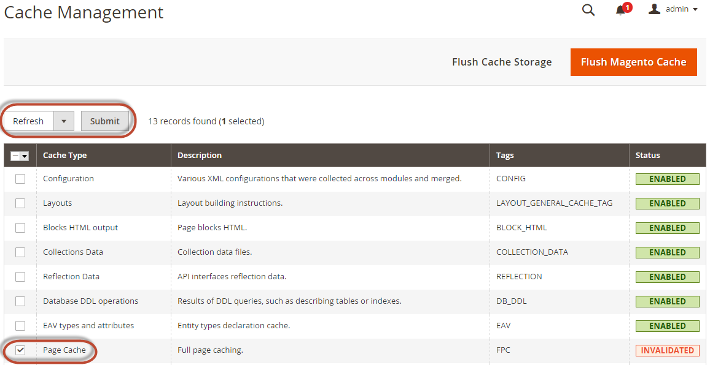

# Configuratie van zoekmachine

In deze sectie worden de minimale instellingen besproken die u moet kiezen om Elasticsearch of OpenSearch te testen met implementaties op locatie van Adobe Commerce.

>[!TIP]
>
>In versies 2.4.4 en 2.4.3-p2, zijn alle gebieden geëtiketteerd **Elasticsearch** ook van toepassing op OpenSearch.
>>Toen de steun voor Elasticsearch 8.x in versie 2.4.6 werd geïntroduceerd, werden de nieuwe etiketten gecreeerd om tussen Elasticsearch en configuraties te onderscheiden OpenSearch.

Voor extra details over het vormen van uw onderzoeksmotor, zie de [ Gids van de Gebruiker ](https://experienceleague.adobe.com/docs/commerce-admin/catalog/catalog/search/search-configuration.html).

## De zoekfunctie configureren vanuit de beheerder

>[!TIP]
>
>Voor instructies bij bevordering aan een nieuwe versie van de onderzoeksmotor, zie [ verbeteringseerste vereisten ](../../upgrade/prepare/prerequisites.md).

Om uw systeem te vormen om Elasticsearch of OpenSearch te gebruiken:

1. Meld u als beheerder aan bij de beheerder.
1. Klik op **[!UICONTROL Stores]** > [!UICONTROL Settings] > **[!UICONTROL Configuration]** > **[!UICONTROL Catalog]** > **[!UICONTROL Catalog]** > **[!UICONTROL Catalog Search]** .
1. Selecteer in de lijst **[!UICONTROL Search Engine]** de corresponderende versie van uw zoekprogramma.

   In de volgende tabel staan de vereiste opties voor het configureren en testen van de verbinding met Commerce. Tenzij u de serverinstellingen van uw zoekmachine hebt gewijzigd, werken de standaardwaarden beter. Ga verder met de volgende stap.

   | Optie | Beschrijving |
   |--- |--- |
   | **[!UICONTROL Server Hostname]** | Voer de volledig gekwalificeerde hostnaam of het IP-adres in van de computer waarop Elasticsearch of OpenSearch wordt uitgevoerd.<br> Adobe Commerce op wolkeninfrastructuur: Krijg deze waarde van uw integratiesysteem. |
   | **[!UICONTROL Server Port]** | Voer de proxypoort van de webserver in. Het gebrek is 9200 <br> Adobe Commerce op wolkeninfrastructuur: Krijg deze waarde van uw integratiesysteem. |
   | **[!UICONTROL Index Prefix]** | Voer het voorvoegsel van de index van het zoekprogramma in. Als u één exemplaar voor meer dan één installatie van Commerce (het Opvoeren en de milieu&#39;s van de Productie) gebruikt, moet u een uniek voorvoegsel voor elke installatie specificeren. Anders kunt u het standaardvoorvoegsel magento2 gebruiken. |
   | **[!UICONTROL Enable HTTP Auth]** | Klik **[!UICONTROL Yes]** slechts als u authentificatie voor uw server van het onderzoeksmotor toeliet. Geef in dat geval een gebruikersnaam en wachtwoord op in de opgegeven velden. |
   | **[!UICONTROL Server Timeout]** | Voer de hoeveelheid tijd (in seconden) in die moet worden gewacht wanneer u probeert verbinding te maken met de Elasticsearch- of OpenSearch-server. |

1. Klik op **[!UICONTROL Test Connection]**.

   Monsterrespons:

   

   Doorgaan met:

   - [Apache configureren voor uw zoekmachine](../../installation/prerequisites/search-engine/configure-apache.md)
   - [Nginx voor uw zoekmachine configureren](../../installation/prerequisites/search-engine/configure-nginx.md)

   of u ziet:

   

Zo ja, probeer dan het volgende:

- Zorg ervoor dat de zoekmachine-server actief is.
- Als de server zich op een andere host dan Commerce bevindt, meldt u zich aan bij de Commerce-server en pingelt u de host van de zoekmachine. Los de kwesties van de netwerkconnectiviteit op en test opnieuw de verbinding.
- Onderzoek het bevelvenster waarin u Elasticsearch of OpenSearch voor stapelsporen en uitzonderingen begon. U moet deze oplossen voordat u verdergaat. Zorg er met name voor dat u de zoekfunctie hebt gestart als een gebruiker met `root` rechten.
- Zorg ervoor dat [ de firewall van UNIX en SELinux ](../../installation/prerequisites/search-engine/overview.md#firewall-and-selinux) allebei gehandicapt zijn, of opstellingsregels om uw onderzoeksmotor en Commerce toe te laten om met elkaar te communiceren.
- Controleer de waarde van het veld **[!UICONTROL Server Hostname]** . Controleer of de server beschikbaar is. U kunt in plaats daarvan het IP-adres van de server proberen.
- Gebruik de opdracht `netstat -an | grep <listen-port>` om te controleren of de poort die in het veld **[!UICONTROL Server Port]** is opgegeven, niet door een ander proces wordt gebruikt.

  Als u bijvoorbeeld wilt zien of de zoekmachine op de standaardpoort wordt uitgevoerd, gebruikt u de volgende opdracht:

  ```bash
  netstat -an | grep 9200
  ```

  Als het op haven 9200 loopt, toont het gelijkaardig aan het volgende:

  ```
  `tcp        0      0 :::9200            :::-         LISTEN`
  ```

## Zoekopdracht in catalogus opnieuw indexeren en de cache van de volledige pagina vernieuwen

Nadat u de configuratie van de zoekmachine hebt gewijzigd, moet u de zoekindex van de catalogus opnieuw indexeren en de volledige paginacache vernieuwen met de opdrachtregel of de beheerderslijn.

De cache vernieuwen met behulp van Admin:

1. Klik in Beheer op **[!UICONTROL System]** > **[!UICONTROL Cache Management]** .
1. Schakel het selectievakje naast **[!UICONTROL Page Cache]** in.
1. Van de **[!UICONTROL Actions]** lijst in het hogere recht, verfrist de klik **zich**.

   

De cache reinigen met de opdrachtregel: [`bin/magento cache:clean`](../cli/manage-cache.md#clean-and-flush-cache-types)

Herindexeren met de opdrachtregel:

1. Login aan uw server van Commerce als, of schakelaar aan, de [ eigenaar van het dossiersysteem ](../../installation/prerequisites/file-system/overview.md).
1. Voer een van de volgende opdrachten in:

   Voer de volgende opdracht in om alleen de zoekindex van de catalogus opnieuw te indexeren:

   ```bash
   bin/magento indexer:reindex catalogsearch_fulltext
   ```

   Voer de volgende opdracht in om alle indexen opnieuw te indexeren:

   ```bash
   bin/magento indexer:reindex
   ```

1. Wacht tot het opnieuw indexeren voltooit.

   >[!INFO]
   >
   >In tegenstelling tot de cache worden indexeerders bijgewerkt door een uitsnijdtaak. Zorg ervoor [ uitsnede wordt toegelaten ](../cli/configure-cron-jobs.md) alvorens u begint uw onderzoeksmotor te gebruiken.
