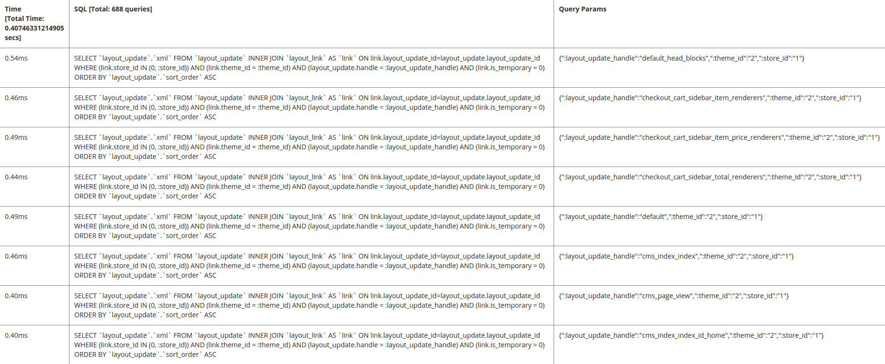

# De databaseanalyse configureren

De het gegevensbestandanalyse van de Handel toont alle vragen die op een pagina worden uitgevoerd, met inbegrip van de tijd voor elke vraag en welke parameters werden toegepast.

## Stap 1: De implementatieconfiguratie wijzigen

Wijzigen `<magento_root>/app/etc/env.php` om de volgende verwijzing naar de [databaseanalyseklasse](https://github.com/magento/magento2/tree/2.4/lib/internal/Magento/Framework/DB/Profiler.php):

```php?start_inline=1
        'profiler' => [
            'class' => '\Magento\Framework\DB\Profiler',
            'enabled' => true,
        ],
```

Hier volgt een voorbeeld:

```php?start_inline=1
 'db' =>
  array (
    'table_prefix' => '',
    'connection' =>
    array (
      'default' =>
      array (
        'host' => 'localhost',
        'dbname' => 'magento',
        'username' => 'magento',
        'password' => 'magento',
        'model' => 'mysql4',
        'engine' => 'innodb',
        'initStatements' => 'SET NAMES utf8;',
        'active' => '1',
        'profiler' => [
            'class' => '\Magento\Framework\DB\Profiler',
            'enabled' => true,
        ],
      ),
    ),
  ),
```

## Stap 2: De uitvoer configureren

Vorm de output in uw toepassing van de Handel bootstrap dossier; dit kan `<magento_root>/pub/index.php` of de locatie kan zich bevinden in een virtuele hostconfiguratie van een webserver.

In het volgende voorbeeld worden de resultaten in een tabel met drie kolommen weergegeven:

- Totale tijd (geeft de totale hoeveelheid tijd weer om alle query&#39;s op de pagina uit te voeren)
- SQL (geeft alle SQL-query&#39;s weer; de rijkopbal toont de telling van vragen)
- De Params van de vraag (toont de parameters voor elke SQL vraag)

Om de output te vormen, voeg het volgende na toe `$bootstrap->run($app);` lijn in uw laarzentrekkerbestand:

```php?start_inline=1
/** @var \Magento\Framework\App\ResourceConnection $res */
$res = \Magento\Framework\App\ObjectManager::getInstance()->get('Magento\Framework\App\ResourceConnection');
/** @var Magento\Framework\DB\Profiler $profiler */
$profiler = $res->getConnection('read')->getProfiler();
echo "<table cellpadding='0' cellspacing='0' border='1'>";
echo "<tr>";
echo "<th>Time <br/>[Total Time: ".$profiler->getTotalElapsedSecs()." secs]</th>";
echo "<th>SQL [Total: ".$profiler->getTotalNumQueries()." queries]</th>";
echo "<th>Query Params</th>";
echo "</tr>";
foreach ($profiler->getQueryProfiles() as $query) {
    /** @var Zend_Db_Profiler_Query $query*/
    echo '<tr>';
    echo '<td>', number_format(1000 * $query->getElapsedSecs(), 2), 'ms', '</td>';
    echo '<td>', $query->getQuery(), '</td>';
    echo '<td>', json_encode($query->getQueryParams()), '</td>';
    echo '</tr>';
}
echo "</table>";
```

## Stap 3: De resultaten weergeven

Ga naar een willekeurige pagina in uw winkel of Admin om de resultaten weer te geven. Hieronder volgt een monster:


