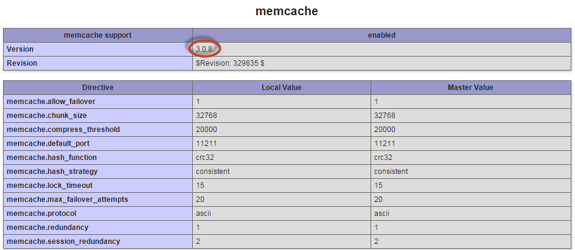

# In cache plaatsen op Ubuntu

In deze sectie vindt u instructies voor het installeren van een memcached op Ubuntu.

>[!INFO]
>
>Adobe raadt u aan om memcached versie 3.0.5 of hoger te gebruiken.

Omdat PHP geen native ondersteuning heeft voor memcache, moet je een extensie installeren voor PHP om deze te kunnen gebruiken. Er zijn twee PHP-extensies beschikbaar en het is belangrijk te decoderen welke extensie moet worden gebruikt:

- `memcache` (_geen d_) - een oudere maar populaire uitbreiding die niet regelmatig wordt gehandhaafd.
De `memcache` uitbreiding momenteel _werkt niet_ met PHP 7. Zie [&#x200B; PHP documentatie voor memcache &#x200B;](https://www.php.net/manual/en/book.memcache.php).

  De exacte naam is `php5-memcache` voor Ubuntu.

- `memcached` (_met a`d`_) - een nieuwere en bewaarde uitbreiding die met PHP 7 compatibel is. Zie [&#x200B; PHP documentatie voor in het geheugen ondergebracht &#x200B;](https://www.php.net/manual/en/book.memcached.php).

  De exacte naam is `php5-memcached` voor Ubuntu.

## In de Ubuntu-cache plaatsen en configureren

**om geheugen op Ubuntu** te installeren en te vormen:

1. Als gebruiker met `root` voorrechten, ga het volgende bevel in:

   ```bash
   apt-get -y update
   ```

   ```bash
   apt-get -y install php5-memcached memcached
   ```

1. Wijzig de instelling voor de configuratie-instellingen voor `CACHESIZE` en `-l` in de cache:

   1. Open `/etc/memcached.conf` in een teksteditor.
   1. Zoek de parameter `-m` .
   1. De waarde ten minste wijzigen `1GB`
   1. Zoek de parameter `-l` .
   1. De waarde wijzigen in `127.0.0.1` of `localhost`
   1. Sla de wijzigingen in `memcached.conf` op en sluit de teksteditor af.
   1. Start de cache opnieuw.

      ```bash
      service memcached restart
      ```

1. Start de webserver opnieuw.

   Voor Apache, `service apache2 restart`

1. Ga verder met de volgende sectie.

## De werking van een geheugen controleren voordat u Magento installeert

Adobe raadt u aan een memcachegeheugen te testen om te controleren of dit werkt voordat u Commerce installeert. Dit neemt slechts een paar minuten in beslag en kan het oplossen van problemen later vereenvoudigen.

### Controleren of het in de cache geplaatste item wordt herkend door de webserver

Om te controleren of het in een cache plaatsen wordt herkend door de webserver:

1. Maak een `phpinfo.php` -bestand in de hoofdmap van de webserver:

   ```php
   <?php
   // Show all information, defaults to INFO_ALL
   phpinfo();
   ```

1. Ga naar die pagina in uw webbrowser. Bijvoorbeeld:

   ```http
   http://192.0.2.1/phpinfo.php
   ```

1. Zorg ervoor dat in het geheugen opgeslagen weergaven als volgt zijn:

   

   Controleer of u versie 3.0.5 of hoger uit het geheugen gebruikt.

   Als de webserver niet wordt weergegeven in de cache, start u de webserver opnieuw en vernieuwt u de browserpagina. Als de extensie nog steeds niet wordt weergegeven, controleert u of u de extensie `php-pecl-memcached` hebt geïnstalleerd.

### Controleren of geheugen gegevens in cache kan plaatsen

Deze test gebruikt een PHP script om te controleren of in een cache opgeslagen en opgehaalde cachegegevens kunnen worden opgeslagen.

Voor meer informatie over deze test, zie [&#x200B; hoe te om Memcache op Ubuntu leerprogramma te installeren en te gebruiken &#x200B;](https://www.digitalocean.com/community/tutorials/how-to-install-and-use-memcache-on-ubuntu-14-04).

Maak `cache-test.php` in de hoofdmap van de webserver met de volgende inhoud:

```php
$meminstance = new Memcached();

$meminstance->addServer("<memcached hostname or ip>", <memcached port>);

$result = $meminstance->get("test");

if ($result) {
    echo $result;
} else {
    echo "No matching key found. Refresh the browser to add it!";
    $meminstance->set("test", "Successfully retrieved the data!") or die("Could not save anything to memcached...");
}
```

Waar `<memcached hostname or ip>` `localhost` , `127.0.0.1` of de hostnaam of het IP-adres van de memcache is. De `<memcached port>` is de listen poort; standaard is dit `11211` .

Ga naar die pagina in een webbrowser. Bijvoorbeeld

```http
http://192.0.2.1/cache-test.php
```

De eerste keer dat u naar de pagina gaat, wordt het volgende weergegeven: `No matching key found. Refresh the browser to add it!`

Vernieuw de browser. Het bericht verandert in `Successfully retrieved the data!`

Tot slot kunt u de memachetoetsen bekijken gebruikend Telnet:

```bash
telnet localhost <memcache port>
```

Bij de herinnering, ga

```shell
stats items
```

Het resultaat is vergelijkbaar met het volgende:

```
STAT items:2:number 1
STAT items:2:age 106
STAT items:2:evicted 0
STAT items:2:evicted_nonzero 0
STAT items:2:evicted_time 0
STAT items:2:outofmemory 0
STAT items:2:tailrepairs 0
STAT items:2:reclaimed 0
STAT items:2:expired_unfetched 0
STAT items:2:evicted_unfetched 0
```

Opslag in het geheugen leegmaken en Telnet afsluiten:

```shell
flush_all
```

```shell
quit
```

[&#x200B; Aanvullende informatie over de test van Telnet &#x200B;](https://darkcoding.net/software/memcached-list-all-keys/)
