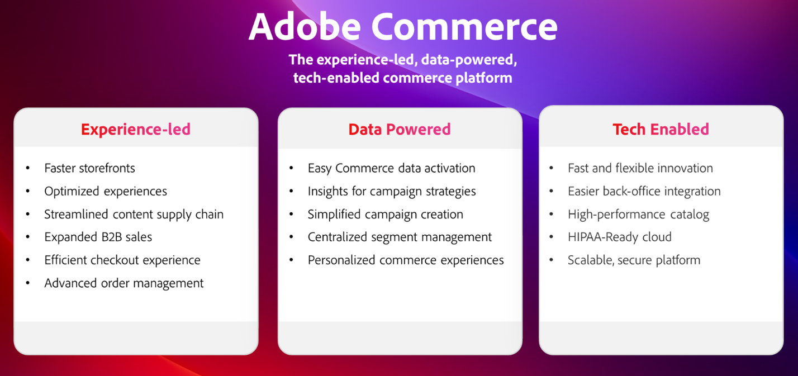

# Overzicht van de Adoben Summit voor Adobe Commerce 2024

Adobe Summit 2024 was een opmerkelijke gebeurtenis die de Adobe Commerce-gemeenschap samenbracht, waaronder toonaangevende klanten, visionaire partners en ons Adobe Commerce-team om contact te maken, te verkennen en te leren. Alle inhoud met sessies met Hanesbrands, Coca-Cola, Nestle, Unilever, Canon en meer zijn [**nu beschikbaar op aanvraag**](https://business.adobe.com/summit/2024/sessions.html?Track=Commerce)!

Hieronder volgen enkele hoogtepunten uit Adobe Summit 2024.

## Adobe Commerce roadmap-sessie

We hebben de conferentie afgezet met een innovatief pakket [**Adobe Commerce Roadmap-sessie**](https://business.adobe.com/summit/2024/sessions/adobe-commerce-2024-product-roadmap-review-s432.html) waar we hebben laten zien hoe Adobe Commerce bedrijven in staat stelt om sneller te innoveren en de verkoop te versnellen met een ervaren platform.

Bekijk deze sessie voor meer informatie over hoe Adobe Commerce levert:

- **[Snellere ervaring met opslag](https://experienceleague.adobe.com/developer/commerce/storefront/):** Onze nieuwe krachtige opslagarchitectuur, Edge Delivery Services, verhoogt plaatssnelheid, SEO-classificaties, en organisch verkeer. Bovendien stroomlijnt een nieuwe integratie met Adobe Experience Manager Assets de toeleveringsketen voor inhoud met toegang tot de ontwikkeling van GenAI-inhoud en workflowbeheer.

- **[Hyper-gepersonaliseerde koopreizen](https://experienceleague.adobe.com/en/docs/commerce-admin/customers/customers-menu/personalize-scale):** Automatisch gegevens verzamelen en delen in real-time, winkelklikken, geschiedenis van de achterste bestelling en nu, gegevens van het klantprofiel met andere Adobe Experience Cloud-oplossingen. Automatiseer de opzet van de campagne met Use Case Playbooks en personaliseer mobiele apps voor de handel en upload/cross-sell aanbiedingen met Adobe Real-Time CDP-gebruikers.

- **[Vereenvoudigde composable ontwikkeling](https://developer.adobe.com/commerce/extensibility/app-development/learning-path/):** Sneller innoveren met lagere kosten met Adobe Developer App Builder. Vereenvoudig integratie aan uw ERP en andere backend systemen met de nieuwe reserve-bureau integratiestarterkit. Configureer websites en pas de interface van Admin aan via een uniforme ontwikkelaarservaring, waaronder API-orchestratie, gebeurtenisbeheer en serverloze uitbreidbaarheid.

- **[Geavanceerd B2B Commerce- en bestelbeheer](https://experienceleague.adobe.com/en/docs/commerce-admin/b2b/introduction):** Verhoog de B2B-verkoop met geavanceerde quoting-tools en de configuratie van een bovenliggende-onderliggende account ter ondersteuning van grote, globale accounts en B2B2X-gebruiksgevallen. Maak sneller dan ooit verbinding met IBM Sterling Order Management dankzij onze nieuwe, vooraf gebouwde integratie om de operationele efficiëntie te maximaliseren met voorraadbeheer in real time, geautomatiseerde bestelling, retourneert beheer en een volledige set dashboards en workflows.

## Krachtige klant en partnerzittingen

Onze innovatieve gemeenschap van klanten en partners van Adobe Commerce deelde ook hun strategieën, beste praktijken, en lessen.

De volledige leisteen van Commerce-sessies verkennen [hier](https://business.adobe.com/summit/2024/sessions.html?Track=Commerce) en bekijk een aantal van de heetste sessies hieronder:

- [Hoe Unilever zijn distributieve handelsroute naar de markt wereldwijd digitaliseerde](https://business.adobe.com/summit/2024/sessions/how-unilever-digitized-its-distributive-trade-rout-s430.html) met Prashaant Huria, VP &amp; CTO, Unilever; *Prashant is geselecteerd als [Ervaar zelf van het jaar](https://www.adobeexperienceawards.com/stories2024) in APAC*

- [E-Comm Masterclass: Hanesbrands creëert de snelste Storefront ter wereld](https://business.adobe.com/summit/2024/sessions/ecomm-masterclass-hanesbrands-creates-the-worlds-f-s435.html) met Emmylou Jordan, SrManager Global Business Insights and Data Analytics, Hanesbrands

- [Coca-Cola: ontgrendelen van gegevens om op de consument gerichte Commerce-ervaringen te creëren](https://business.adobe.com/summit/2024/sessions/cocacola-unlocking-data-to-create-consumercentric-s434.html) met Vinay Gopinath, Director of Global Adtech/Martech Platforms, The Coca-Cola Company

- [Hoe Canon de Tarieven en het Verkeer van de Omzetting die Adobe Commerce gebruiken verhoogde](https://business.adobe.com/summit/2024/sessions/how-canon-increased-conversion-rates-and-traffic-u-s438.html) met Matthew Mandato, Manager Martech Engagement Ops, Canon USA

- [Nestle Purina: Bouw een Composable Platform voor Bedrijfs Agility met Adobe Commerce](https://business.adobe.com/summit/2024/sessions/purina-takes-composable-commerce-approach-to-boost-s437.html) met Ben Robie, Sr. Technical Manager D2C, Nestle Purina

## Innovatie-showcase met Adobe Commerce Rockstars

Elk jaar geven we een licht op wat de meest innovatieve klanten en partnerontwikkelaars met Adobe Commerce maken. Kijk uit de **[Adobe Commerce Rockstar Showcase](https://business.adobe.com/summit/2024/sessions/adobe-commerce-rockstar-showcase-s431.html)** waar we hoorden uit de Top 3-reacties, gekozen uit meer dan 65:

- **Storefront-innovatie met Edge Delivery Services en Luma Bridge**

  Martin Altmann, hoofdconsultant &amp; Adobe Practice Lead, Comwrap Reply

- **Integratie van App Builder voor beheer van toonaangevende bestellingen**

  Shikha Raina, Architect, Bounteous

- **Aanbevolen productinhoud voor Master GPT GenAI**

  Yaroslav Rogoza, CTO, Atwix

Kijk wie er in 2024 in Adobe Commerce Rockstar zat!

Maak alle grote sessies vrij door **[duiken in de inhoud op aanvraag](https://business.adobe.com/summit/2024/sessions.html?Track=Commerce)** en altijd up-to-date blijven met de nieuwste innovaties voor Adobe Commerce op [**Experience League**](https://experienceleague.adobe.com/en/docs/commerce-admin/start/about).
