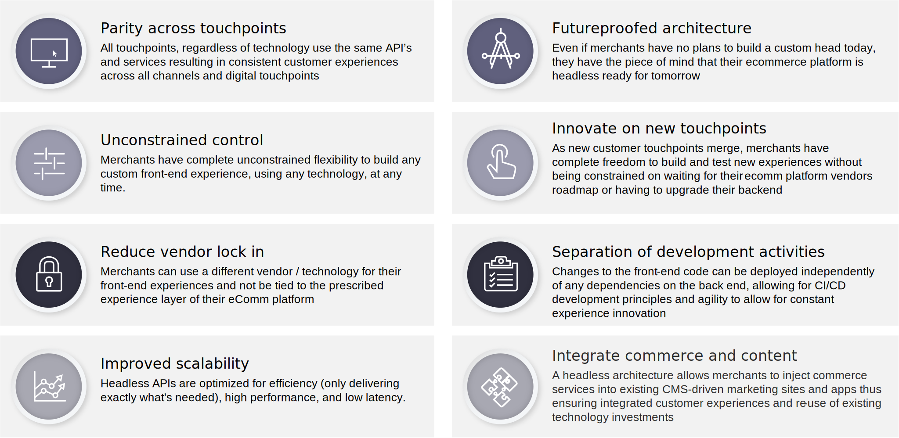

# Headless Commerce

## Waarom zonder hoofd?

Om te beginnen is de handel in oudere ondernemingen duur en moeilijk te schalen door siloes; verouderde structuren worden versterkt door perronbeperkingen; en innovatie wordt een uitdaging .

De klanten verwachten een zaken om met hen in wisselwerking te staan en met hen over alle kanalen in dienst te nemen. Klantgerichte organisaties willen toekomstbestendige platforms bouwen die zich kunnen aanpassen aan veranderende verwachtingen van klanten.

Hoofdloze handel is op API gebaseerde handel. Het ontkoppelt bedrijfslogica, evenals transactie en gegevensaspecten van handel, van presentatie. Headless is een geïntegreerd framework dat volledige flexibiliteit biedt voor alle kanalen en aanraakpunten, met een frontend ervaringslaag die gescheiden is van het platform zelf. Dit staat merken toe de behendigheid om inhoud zoals producten, gegevens, en orden aan om het even welk aanraakpunt zowel nu als in de toekomst te leveren, terwijl het kunnen om het op om het even welke manier tonen zij houden.

Hoofdloze architectuur is de technische scheiding van het hoofd van de rest van de handelstoepassing. Adobe Commerce is volledig zonder kop met een ontkoppelde architectuur die alle handelsdiensten en gegevens door een laag GraphQL API verstrekt. Deze architectuur staat frontend teams toe om hun frontends onafhankelijk van Adobe Commerce te ontwikkelen, die de behendigheid verstrekken om nieuwe aanraakpunten met nieuwe technologieën snel te bouwen en te testen.

Adobe Commerce GraphQL APIs kan ook met microdiensten worden uitgebreid die op I/O Runtime van Adobe worden opgesteld. Dit verstrekt ongeëvenaarde behendigheid om, omnichannel bedrijfsprocessen te integreren uit te breiden en aan te passen zonder codeaanpassingen aan het achterste eind te vereisen, die ervoor zorgt het kernplatform gemakkelijk zonder invloed aan frontend touchpoints kan worden bevorderd. Adobe Commerce GraphQL-API&#39;s zijn open sourced en maken deel uit van ons engineeringprogramma voor de gebruikersgemeenschap, met aanzienlijke bijdragen en toezicht van onze gemeenschap van ontwikkelaars.

