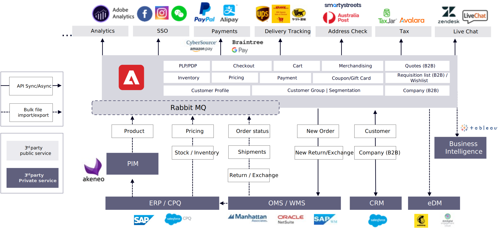

# Typische integratiepunten en gegevensstromen

Er zijn twee belangrijke benaderingen van integratie en gegevensstromen, die zeer gelijkaardig zijn maar één zeer belangrijk verschil hebben.

## Monolithisch

Het volgende diagram beschrijft een monolithische benadering die Adobe Commerce als zowel backend systeem als storefront toepassing gebruikt:

## Koploos

In het volgende diagram wordt een benadering zonder kop beschreven waarbij Adobe Commerce wordt gebruikt als back-endsysteem dat is geïntegreerd met een DXP/CMS/aangepaste toepassing als storefront-toepassing:

Het enige verschil tussen de monolithische en headless benadering is storefront integratie, die de gebruikerservaring voor klanten beïnvloedt. Met Monolithic wordt Adobe Commerce-winkel rechtstreeks gebruikt om te integreren met services van derden, terwijl de kop van de winkel afhankelijk is van de eigen winkel om zich aan te passen aan en te integreren met dezelfde services. Voor sommige services, zoals betaling en Single Sign-On (SSO), is zowel de storefront- als Adobe Commerce-aanpassing nodig om de integratiestroom te voltooien.

## Systemen van derden

Sommige populaire services hebben al een groot aantal extensies die ondersteuning bieden voor Adobe Commerce of veelgebruikte winkeloplossingen, zoals PWA Studio, Adobe Experience Manager en Vue Storefront, die u kunt vinden op hun website voor extensies of op websites van verwante derden. Zelfs als er geen uitbreiding bestaat, zijn de inspanningen om de integratie tussen Adobe Commerce en andere koploze winkelcentra ten uitvoer te leggen vergelijkbaar. Alle derdediensten hebben gewoonlijk documenten om te verklaren hoe te met hen te integreren. Deze diensten zijn slechts enkele voorbeelden; verschillende landen en markten kunnen verschillende keuzes hebben .

## Enterprise-integratie

Voor de integratie van ondernemingssystemen, die ook gewoonlijk backendintegratie worden genoemd, is er een effect op de bedrijfsgegevensstroom. Op basis van verschillende bedrijfstypen en -behoeften kan het drie verschillende integratieopties gebruiken, die we al hebben geïntroduceerd.

Product-verplichte gegevens zoals SKU&#39;s, inventaris, en basisprijzen komen gewoonlijk van ERP&#39;s, terwijl de verkoopprijzen gewoonlijk door elk verkoopkanaal (bijvoorbeeld Adobe Commerce) of CPQ (B2B of particuliere verkoop) worden beheerd. Omdat de product-verplichte gegevens (behalve voorraad) niet zeer vaak veranderen, is de beste praktijk om geplande partijupdates door REST API of bulkdossierinvoer te gebruiken. Voor inventarisatie is het de beste manier om dagelijks een volledige update te krijgen voor productinventaris die met verschillende verkoopkanalen wordt gedeeld om oververkoop te voorkomen. Bovendien zijn er binnen 24 uur incrementele wijzigingen gepland voor uw ERP.

De catalogus, de meta-gegevens, en de marketing inhoud van het product kunnen afzonderlijk door elk verkoopkanaal (bijvoorbeeld, Adobe Commerce) of van een centrale PIM worden beheerd. Aangezien metagegevens ook niet vaak worden gewijzigd, kunt u het beste geplande batchupdates gebruiken via de REST API of het importeren van grote hoeveelheden bestanden.

De gegevens van de orde omvatten orde, citaat (B2B), lading, terugkeer, en uitwisselingsgegevens die gewoonlijk van een gecentraliseerd systeem van OMS en WMS worden beheerd. Ordergegevens moeten zo snel mogelijk worden gesynchroniseerd, dus REST API is meestal de beste optie. Voor betere prestaties, denk na verminderend het aantal API vraag. Voor de orderstatus, verzendingen, retourneren en gegevens uitwisselen, kunt u overwegen REST-batch-update-API&#39;s in uren of minuten te plannen.

B2B-gegevens worden gewoonlijk beheerd vanuit een gecentraliseerde CRM. Een real-time API wordt gebruikt om bestaande klanten te verifiëren en nieuwe klanten tot stand te brengen. Voor B2B, zou het het introduceren van meer APIs kunnen vereisen om verschillende bedrijfwerknemer, groep, en prijslijst tussen Adobe Commerce en uw CRM of CPQ te synchroniseren.

Er zijn sommige andere systeemintegratie zoals eDM voor e-mailmarketing en bedrijfsintelligentie voor zaken gegevens analyse-die gewoonlijk of via REST API of dossieruitvoer/invoer, die gewoonlijk door bestaande uitbreidingen worden gesteund.
