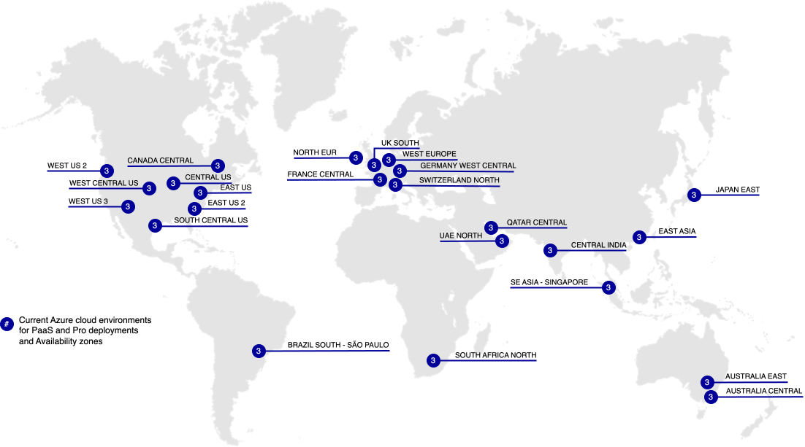

# Cloud-gebieden

De volgende secties bevatten informatie over de verschillende AWS- en Azure-regio&#39;s die beschikbaar zijn voor Adobe Commerce op cloudinfrastructuur.

## AWS-regio&#39;s

>[!NOTE]
>
> Alleen ter plaatse in China en Rusland.

## Azure-gebieden

>[!NOTE]
>
> Alleen ter plaatse in China en Rusland.
