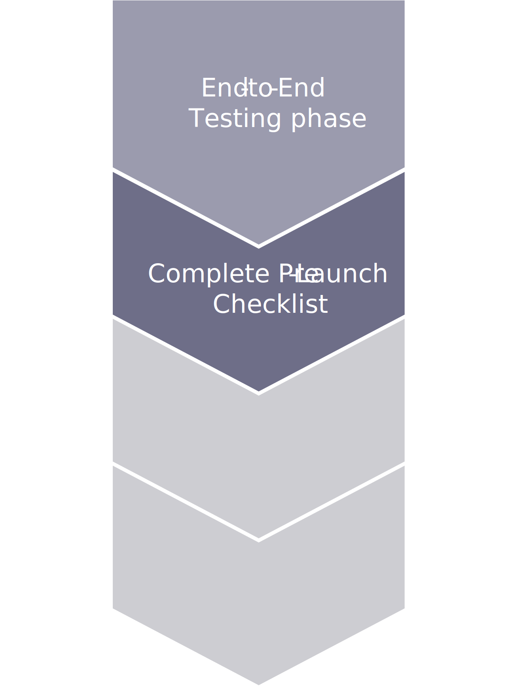

# Pre-launch steps

When you have completed deployment and testing in the staging environments, you can begin site-launch preparation. Staging is een omgeving in de buurt van de productie die wordt uitgevoerd op vergelijkbare hardware, configuraties, architectuur en services. Het kan uw onderbreking verminderen en uw uitbreiding, de dienst, douaneconfiguraties, en bedrijfsmatige gebruikersaanvaarding testende vitale componenten maken om uw plaatsen en opslag vrij te geven.

The pre-launch checklist is required to verify prior to launch state, which includes the following major verifications:

- Code freeze for deployment
- Zorg ervoor dat de uitvaltijd van tevoren werd meegedeeld vóór ten minste één dag voor onderhoudsrelease en één week voor de eerste keer dat de toepassing werd gestart
- Implementatiescripts worden volledig ingesteld/geconfigureerd voor productie-/staging-/integratieomgevingen
- Databases are all set up and identical between Staging and Production environments
- SSL (TLS) certificates are validated for Staging/Production environments
- E-mailservices zijn goed geconfigureerd en werken goed voor transactie-e-mails
- CDN is geconfigureerd voor productieomgevingen voor staging/productie
- Beveiligingsscan instellen voor Staging-/Productieomgevingen
   - Adobe Commerce security scan
- Prestatiebeoordeling uitvoeren met
   - JMeter
   - Siege
   - Webpage Test
   - Google-paginasnelheid
- Validate all third-party integrations that will be functioning in application (OMS, CRM)
- Enable performance-monitor tool (New Relics)
- Activiteiten op het gebied van gegevensmigratie tijdens een repetitie (indien van toepassing)

The main differences between Adobe Commerce on-premises and cloud implementations are the deployment scripts and tools, as well as the setup for SSL, Mail service, and CDN. However, the process is still the same.

Voor het SSL-certificaat (TLS) levert de Adobe Commerce-optie op een cloudinfrastructuur een snel jokertekencertificaat. To start using it, you need to pass the validation: add the Fastly TXT record to apex domain name within your DNS settings. De Fastly TXT-record kan worden gevonden in de spreadsheet aan boord, anders moet u een ticket indienen om het te verkrijgen. Replace this text with your questions/comments here. Als u uw eigen SSL(TLS)-certificaat gebruikt in plaats van een snelvervangingscertificaat, verzendt u een ondersteuningsticket met het certificaat dat u aan de installatie hebt gekoppeld.

Adobe Commerce on cloud infrastructure provides SendGrid Mail functionality for your transactional emails. For Pro plans, you need to add SendGrid records to your DNS settings. SendGrid records can be found in the on-boarding spreadsheet, otherwise SI or merchant should submit support tickets to obtain them. Om te beginnen, te hoeven u om het even welke veranderingen in uw DNS niet aan te brengen; SendGrid is vooraf geconfigureerd voor u.

## Volledige checklist voor het starten

De volledige checklist vóór de lancering toont alle belangrijke activiteiten waarvan volledigheid noodzakelijk is om zich aan de lanceringsstaat te bewegen.

- Go-live risk mitigation plans updated
- Correct domain names provided
- Uitgaande e-mailberichten zijn getest
- SSL certificate is provisioned and configured
- De alle belangrijke configuratie van de toepassing van de Handel van Adobe wordt correct bijgewerkt
- Basis-URL&#39;s en Basis-Admin-URL worden op de juiste wijze ingesteld op de uiteindelijke hostnaam
- Admin passwords are changed
- Alle gebruikers met toegang tot een toepassing die geen toegang meer nodig heeft, worden verwijderd
- Betalingsconfiguratie voor productieomgeving (voor sommige gebruikers wordt de sandboxmodus gebruikt voor het testen)
- Test data (customer, wishlist, reviews, orders, and related data) from Production database is cleared

