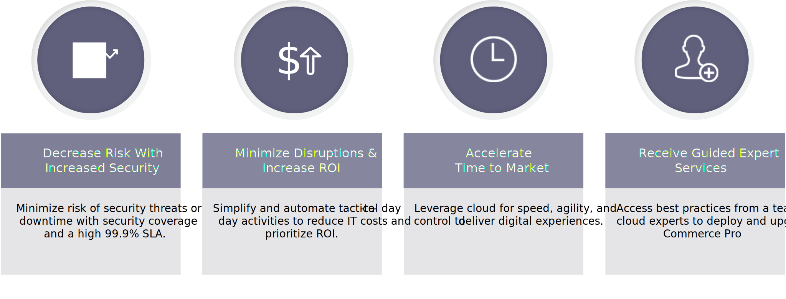

# Beheerde services van Adobe

De Handel van de Adobe is een platform voor het leveren van e-commerce mogelijkheden, met inbegrip van uit-van-de-doos eigenschappen, een capaciteit aan te passen, en derdesintegratie.

Adobe&#39;s Managed Services is een gehoste en beheerde toepassing en infrastructuur voor Adobe Commerce op het gebied van cloudinfrastructuur Pro-plannen.

## Voordelen

## Beveiliging

De stapel van de Veiligheid van de Adobe voor Managed Services bouwt veiligheid in op elk niveau gebruikend automatisering en consistentie om menselijke fout te verminderen. De ontwikkelings en verrichtingenteams erven automatisch veiligheidscontroles van verschillende niveaus van de stapel.

De partners van het Platform zoals de Diensten van het Web van Amazon en Microsoft Azure verzekeren maximumveiligheidsdekking wanneer het toepassen van platformaanpassingen, terwijl het team van Managed Services van Adobe de diensten van de kernveiligheid zoals naleving, registreren, authentificatie, aftasten, en controle, evenals serverveiligheid en veilige toepassingsconfiguratie verleent. De handel van Dentsu zal voor douaneontwikkeling &amp; integratie, en de bijbehorende veiligheidsprocessen voor douanecode verantwoordelijk zijn.

Het volgende diagram toont Adobe Beheerde de technologiestapel van de veiligheidstechnologie van de Dienst:

