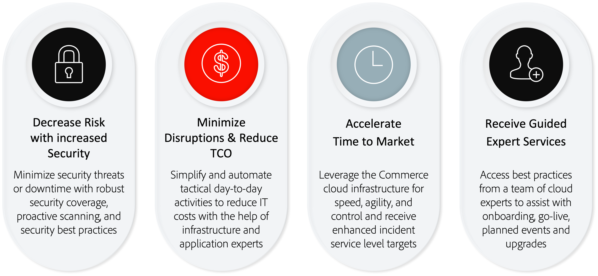

# Adobe Managed Services

Adobe Commerce is een platform voor het aanbieden van e-commercemogelijkheden met robuuste functies voor &#39;out-of-the-box&#39;, uitgebreide aanpassingsopties en integratie van derden.

Adobe Managed Services biedt gehoste en beheerde toepassing en infrastructuur voor Adobe Commerce op cloudinfrastructuur Pro-plannen.

## Voordelen

### Vergelijking van implementatieopties

De Adobe Managed Services biedt belangrijke voordelen over op-gebouw en niet beheerde wolkenimplementaties, met inbegrip van:

- **Verbeterde doelstellingen van het de dienstniveau (SLTs)** - Snellere reactietijden dan standaardAdobe Commerce steun.
- **Verbeterde overeenkomsten van het de dienstniveau (SLAs)** - 99.9% toepassingsniveau dat regelmatige Adobe Commerce op de klanten van de wolkeninfrastructuur bovenop het 99.99% infrastructuurniveau krijgt.
- **Aangewezen de Expertise van de Wolk** - Managed Services voorziet klanten van een aangewezen Ingenieur van het Succes van de Klant (CSE) die als toepassing en de deskundige van de wolkeninfrastructuur dient. CSE werkt met klanten en hun partners, die hen van beste praktijken en begeleiding voorzien om tijd aan markt te versnellen, die omvatten:
   - Handleiding en ondersteuning via het instapproces
   - provisioning en platforminstellingen beheren
   - Advies over architectuurprincipes voor integratie en aanpassingen
   - Beheer van incidenten en bedrijfscontinuïteit van de harde schijf
   - Gebeurtenisondersteuning bieden via planning, uitvoering en bewaking
   - Cloud-ondersteuning en -expertise (proactieve optimalisatie, rapportage en aanbevolen procedures)

Bekijk de volgende informatie voor een gedetailleerdere vergelijking van de belangrijkste Managed Services-voordelen:

## Taken en verantwoordelijkheden

Adobe biedt een reeks services voor de levering, ontwikkeling, staging en productie van Adobe Commerce op Managed Services-systemen. Voor de ontwikkeling en de plaatsing van de oplossing om zo efficiënt mogelijk te werk te gaan, is het belangrijk dat de klant en de partner hun rollen begrijpen en vervullen, zoals hieronder beschreven:

<table>
    <thead>
        <tr>
            <th></th>
            <th>Klant</th>
            <th>Partner</th>
            <th>Klantsuccesvolle technicus</th>
        </tr>
    </thead>
    <tbody>
        <tr>
            <td colspan="4" style="background:lightgray;"><strong>Inrichting</strong></td>
        </tr>
        <tr>
            <td>Selectie van Cloud Region</td>
            <td>Eigenaar</td>
            <td>Medewerker</td>
            <td>Advisor</td>
        </tr>
        <tr>
            <td>Instantieprovisioning</td>
            <td></td>
            <td></td>
            <td>Eigenaar</td>
        </tr>
        <tr>
            <td>Interne netwerkconfiguratie en -beveiliging</td>
            <td></td>
            <td></td>
            <td>Eigenaar</td>
        </tr>
        <tr>
            <td>Adobe Commerce-toepassingsprovisioning</td>
            <td></td>
            <td></td>
            <td>Eigenaar</td>
        </tr>
        <tr>
            <td>Adobe Commerce Source Code Access</td>
            <td></td>
            <td></td>
            <td>Eigenaar</td>
        </tr>
        <tr>
            <td>CDN-servicevoorziening</td>
            <td></td>
            <td></td>
            <td>Eigenaar</td>
        </tr>
        <tr>
            <td>Lokale ontwikkelomgeving</td>
            <td>Medewerker</td>
            <td>Eigenaar</td>
            <td></td>
        </tr>
        <tr>
            <td colspan="4" style="background:lightgray;"><strong>Ontwikkeling en kwaliteitscontrole</strong></td>
        </tr>
        <tr>
            <td>Vereisten verzamelen en projectbeheer</td>
            <td>Medewerker</td>
            <td>Eigenaar</td>
            <td>Advisor</td>
        </tr>
        <tr>
            <td>Ontwikkeling van toepassingen</td>
            <td>Medewerker</td>
            <td>Eigenaar</td>
            <td>Advisor</td>
        </tr>
        <tr>
            <td>Testen van toepassingen</td>
            <td>Medewerker</td>
            <td>Eigenaar</td>
            <td>Advisor</td>
        </tr>
        <tr>
            <td colspan="4" style="background:lightgray;"><strong>Staging en overgang</strong></td>
        </tr>
        <tr>
            <td>Implementatie van code voor ontwikkeling, integratie en staging</td>
            <td>Medewerker</td>
            <td>Eigenaar</td>
            <td>Advisor</td>
        </tr>
        <tr>
            <td>Inhoud implementeren</td>
            <td>Medewerker</td>
            <td>Eigenaar</td>
            <td>Advisor</td>
        </tr>
        <tr>
            <td>Ontwikkeling van een testtoepassing voor gebruikeraanvaarding</td>
            <td>Eigenaar</td>
            <td>Medewerker</td>
            <td>Advisor</td>
        </tr>
        <tr>
            <td>Testen van gebruikersacceptatie</td>
            <td>Eigenaar</td>
            <td>Medewerker</td>
            <td>Advisor</td>
        </tr>
        <tr>
            <td>Eisen voor aangepaste bewaking</td>
            <td>Medewerker</td>
            <td>Eigenaar</td>
            <td>Advisor</td>
        </tr>
        <tr>
            <td>Door de klant verstrekte SSL-certificaten</td>
            <td>Eigenaar</td>
            <td></td>
            <td>Medewerker</td>
        </tr>
        <tr>
            <td>Prestaties en ontwikkeling van tests laden</td>
            <td>Medewerker</td>
            <td>Eigenaar</td>
            <td>Advisor</td>
        </tr>
        <tr>
            <td>Prestaties en taaktesten</td>
            <td>Medewerker</td>
            <td>Eigenaar</td>
            <td>Advisor</td>
        </tr>
        <tr>
            <td>Ontwikkeling van aanpassingen en kwaliteitscontrole</td>
            <td>Medewerker</td>
            <td>Eigenaar</td>
            <td>Advisor</td>
        </tr>
        <tr>
            <td>Voltooiing van uitvoering</td>
            <td>Eigenaar</td>
            <td>Medewerker</td>
            <td>Medewerker</td>
        </tr>
        <tr>
            <td>Runbook Review</td>
            <td></td>
            <td></td>
            <td>Eigenaar</td>
        </tr>
        <tr>
            <td colspan="4" style="background:lightgray;"><strong>Starten</strong></td>
        </tr>
        <tr>
            <td>Go-live checklist</td>
            <td>Medewerker</td>
            <td>Medewerker</td>
            <td>Eigenaar</td>
        </tr>
        <tr>
            <td>Go-live-vergaderruimte</td>
            <td>Medewerker</td>
            <td>Medewerker</td>
            <td>Eigenaar</td>
        </tr>
        <tr>
            <td>Implementatie van productiecode</td>
            <td>Medewerker</td>
            <td>Medewerker</td>
            <td>Eigenaar</td>
        </tr>
        <tr>
            <td colspan="4" style="background:lightgray;"><strong>Productie</strong></td>
        </tr>
        <tr>
            <td>Bewaking van de productie-infrastructuur</td>
            <td></td>
            <td></td>
            <td>Eigenaar</td>
        </tr>
        <tr>
            <td>Hoofdcontrole van toepassingen</td>
            <td>Medewerker</td>
            <td>Medewerker</td>
            <td>Eigenaar</td>
        </tr>
        <tr>
            <td>Respons productiegebeurtenis</td>
            <td>Medewerker</td>
            <td>Medewerker</td>
            <td>Eigenaar</td>
        </tr>
        <tr>
            <td>Onderhoud op het niveau van infrastructuur en besturingssysteem</td>
            <td></td>
            <td></td>
            <td>Eigenaar</td>
        </tr>
        <tr>
            <td>Aangepaste onderhoud- en beveiligingspatches</td>
            <td>Medewerker</td>
            <td>Eigenaar</td>
            <td>Advisor</td>
        </tr>
        <tr>
            <td>Toegang tot productupdates en upgrades van Adobe Commerce</td>
            <td>Medewerker</td>
            <td>Medewerker</td>
            <td>Eigenaar</td>
        </tr>
        <tr>
            <td>Adobe Commerce-productupdates en -upgrades toepassen</td>
            <td>Medewerker</td>
            <td>Eigenaar</td>
            <td>Advisor</td>
        </tr>
        <tr>
            <td>Goedkeuringskaart wijzigen om productieimplementaties goed te keuren</td>
            <td>Medewerker</td>
            <td>Medewerker</td>
            <td>Eigenaar</td>
        </tr>
        <tr>
            <td>Productie Toepassingsbeheer</td>
            <td>Eigenaar</td>
            <td>Medewerker</td>
            <td>Advisor</td>
        </tr>
        <tr>
            <td>Aanpassing van de productie-infrastructuur</td>
            <td>Medewerker</td>
            <td>Medewerker</td>
            <td>Eigenaar</td>
        </tr>
        <tr>
            <td>Schaalbare productiearchitectuur</td>
            <td></td>
            <td></td>
            <td>Eigenaar</td>
        </tr>
        <tr>
            <td>Productieback-ups en herstel</td>
            <td></td>
            <td>Medewerker</td>
            <td>Eigenaar</td>
        </tr>
        <tr>
            <td colspan="4" style="background:lightgray;"><strong>Beveiliging en naleving</strong></td>
        </tr>
        <tr>
            <td>SOC-2 Audit van de dienst</td>
            <td></td>
            <td></td>
            <td>Eigenaar</td>
        </tr>
        <tr>
            <td>PCI-certificering van de infrastructuur</td>
            <td></td>
            <td></td>
            <td>Eigenaar</td>
        </tr>
        <tr>
            <td>PCI-certificering van de aangepaste toepassing</td>
            <td>Eigenaar</td>
            <td>Medewerker</td>
            <td></td>
        </tr>
        <tr>
            <td>Beveiligingscontroles van de kerntoepassingen</td>
            <td>Eigenaar</td>
            <td>Medewerker</td>
            <td>Advisor</td>
        </tr>
        <tr>
            <td>Beveiligingscontroles van de aanpassingen en extensies</td>
            <td>Eigenaar</td>
            <td>Medewerker</td>
            <td></td>
        </tr>
        <tr>
            <td>Penetratietests van de exemplaren van de toepassingen van de klant</td>
            <td>Eigenaar</td>
            <td>Medewerker</td>
            <td></td>
        </tr>
        <tr>
            <td>Web Application Firewall Rules (WAF)</td>
            <td>Medewerker</td>
            <td>Medewerker</td>
            <td>Eigenaar</td>
        </tr>
        <tr>
            <td>Controle van indringerdetectie</td>
            <td></td>
            <td></td>
            <td>Eigenaar</td>
        </tr>
        <tr>
            <td>Controle van toepassings- en DB-gebeurtenissen</td>
            <td>Medewerker</td>
            <td>Medewerker</td>
            <td>Eigenaar</td>
        </tr>
        <tr>
            <td>Gebeurteniscontrole webtoepassingsfirewall</td>
            <td>Medewerker</td>
            <td>Medewerker</td>
            <td>Eigenaar</td>
        </tr>
        <tr>
            <td>Gebruikersbeheer en integratie met SSO</td>
            <td>Eigenaar</td>
            <td>Medewerker</td>
            <td>Medewerker</td>
        </tr>
        <tr>
            <td>Reactie van beveiligingsgebeurtenis</td>
            <td>Medewerker</td>
            <td>Medewerker</td>
            <td>Eigenaar</td>
        </tr>
        <tr>
            <td>Het vestigen, het beveiligen, en het handhaven van verbinding aan collectieve netwerken en middelen </td>
            <td>Eigenaar</td>
            <td>Advisor</td>
            <td>Advisor</td>
        </tr>
    </tbody>
</table>

## Beveiliging

De beveiligingsstapel van de Adobe voor Managed Services bouwt beveiliging op elk niveau op met behulp van automatisering en consistentie om menselijke fouten te beperken. De ontwikkelings en verrichtingenteams erven automatisch veiligheidscontroles van verschillende niveaus van de stapel.

Platformpartners, zoals Amazon Web Services en Microsoft Azure, zorgen voor maximale beveiligingsdekking bij het toepassen van platformaanpassingen, terwijl het Managed Services-team van Adobe basisbeveiligingsservices biedt, zoals compatibiliteit, registratie, verificatie, scannen en controle, en serverbeveiliging en beveiligde toepassingsconfiguratie. Zie {de Veiligheid van 0} Adobe Commerce [&#128279;](https://business.adobe.com/products/magento/secure-ecommerce.html) voor meer informatie.

Het volgende diagram toont de de veiligheidstechnologiestapel van Managed Services van de Adobe:

## Hulp bij upgrades

Het Managed Services-team speelt een actieve rol bij het plannen en ondersteunen van het upgradeproces. Uw Ingenieur van het Succes van de Klant (CSE) werkt met uw team van het verbeteringsproject, met inbegrip van projectmanagers, en ontwikkelaars (interne vakinhouddeskundigen, Adobe verklaarde partners, of beroeps van Adobe Consulting) om uw team te helpen correcte planning en naleving van beste praktijken tijdens de verbetering verzekeren.

Managed Services CSE&#39;s hebben met Adobe Commerce-klanten samengewerkt om upgrades uit te voeren in grote omgevingen. Uw CSE kan u helpen deskundige kennis gebruiken om verbeteringssucces te maximaliseren terwijl het minimaliseren van onderbreking en het verminderen van algemene risico. Bovendien werken CSEs van Managed Services met uw specifieke het opvoeren milieu voor de verbetering zodat de bestaande productieprocessen niet worden beïnvloed terwijl het bevestigen van de verbetering.

Adobe biedt een reeks services voor de levering, ontwikkeling, staging en productie van uw Managed Services-systeem. De volgende lijst verstrekt een overzicht van de rollen die elke deelnemer in het verbeteringsproces speelt:

<table>
<thead>
  <tr>
    <th>Stap</th>
    <th>Taak</th>
    <th>Klant</th>
    <th>Ontwikkelingspartner*</th>
    <th>Managed Services</th>
  </tr>
</thead>
<tbody>
  <tr>
    <td rowspan="3">Abonnementsupgrade</td>
    <td>Upgradeprojectplan maken</td>
    <td>Eigenaar</td>
    <td>Medewerker</td>
    <td>De medewerker   CSE verstrekt verbeteringsmalplaatje en verbeteringsplansteekproeven; biedt raad en beste praktijken uiteinden aan.</td>
  </tr>
  <tr>
    <td>Noodzakelijke infrastructuurwijzigingen bepalen</td>
    <td></td>
    <td>Medewerker</td>
    <td>De revisies van de eigenaar   CSE het opvoeren en productisinfrastructuur om juiste grootte te verzekeren.</td>
  </tr>
  <tr>
    <td>Bespreek verbeteringsingewikkeldheid   identificeer en documentpakketten, kwesties &amp; moeilijke situaties, en 3de partij &amp; douanemodules</td>
    <td>Medewerker</td>
    <td>Eigenaar</td>
    <td>De medewerker   CSE verstrekt de rapporten en de aanbevelingen van het Hulpmiddel van de Verenigbaarheid van de Verbetering.</td>
  </tr>
  <tr>
    <td rowspan="3">Upgrade uitvoeren</td>
    <td>De infrastructuurdiensten van de verbetering   [MariaDB, Redis, Open Onderzoek, en Konijn MQ] (het Opvoeren en de Productie)</td>
    <td></td>
    <td></td>
    <td>Eigenaar   CSE coördineert de dienstverbeteringen van de infrastructuurdienst.  CSE plant conferentievergaderingsgebeurtenis voor verbeteringen.  CSE staat met gegevensmigratie van Productie aan het Opvoeren bij.</td>
  </tr>
  <tr>
    <td>Commerce-codebasis en -aanpassingen bijwerken; code opnieuw compileren en code opnieuw refactoring uitvoeren</td>
    <td>Medewerker</td>
    <td>Eigenaar</td>
    <td></td>
  </tr>
  <tr>
    <td>Controles en probleemoplossing na de upgrade uitvoeren</td>
    <td></td>
    <td>Eigenaar</td>
    <td>De medewerker   CSE voert post-verbeterings runbook uit om kwesties met betrekking tot verbetering te ontdekken en te verbeteren.</td>
  </tr>
  <tr>
    <td rowspan="3">UAT en Starten</td>
    <td>Prestatietests en beveiligingstests uitvoeren</td>
    <td>Medewerker</td>
    <td>Eigenaar</td>
    <td>De medewerker   CSE staat met lading het testen bij door prestaties van toepassing en infrastructuur te controleren.  CSE staat bij het vormen van het Hulpmiddel van het Scannen van de Veiligheid van Commerce bij.</td>
  </tr>
  <tr>
    <td>Testen van gebruikerstoegang tijdens afspelen</td>
    <td>Eigenaar</td>
    <td>Medewerker</td>
    <td>De medewerker   CSE bevestigt de toepassing en de infrastructuur correct na verbetering uitvoeren.</td>
  </tr>
  <tr>
    <td>Starten naar productie</td>
    <td>Medewerker</td>
    <td>Eigenaar</td>
    <td>Bijdrager   CSE programma's lanceert de gebeurtenis van de conferentievergadering.</td>
  </tr>
  <tr>
    <td>Post-Launch</td>
    <td></td>
    <td>Medewerker</td>
    <td>Medewerker</td>
    <td>De eigenaar   CSE controleert prestaties van toepassing en infrastructuur.</td>
  </tr>
</tbody>
</table>
