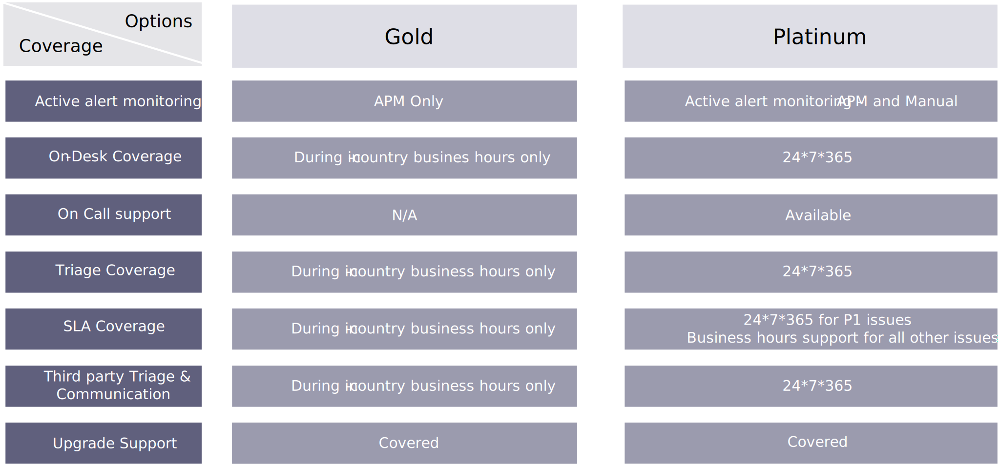

# Serviceovereenkomsten (SLA&#39;s)

De dienst-vlakke overeenkomst (SLA) bepaalt het niveau van de dienst die door een klant van de dienstverlener wordt verwacht, met eenvoudige metriek waardoor die dienst wordt gemeten, evenals de verhaalsmogelijkheden of sancties, als om het even welk, overeengekomen de dienstniveaus niet worden bereikt.

De SLA&#39;s voor verschillende soorten incidentkritiek kunnen worden gecontracteerd, onderhouden en gemeten. Bovendien kan het type reactie meerdere standaarden hebben (Gold, Platinum), op basis van het serviceniveau dat de klant nodig heeft.

De volgende lijst beschrijft een typische metrische verdeling van SLA met veelvoudige de dienstniveaus:

<table>
<thead>
  <tr>
    <th>Type probleem</th>
    <th>Gevolgen</th>
    <th>Voorbeeld</th>
    <th colspan="2">Responstijd/hersteltijd tijdens ondersteunde kantooruren</th>
  </tr>
</thead>
<tbody>
  <tr>
    <td colspan="3"></td>
    <td>Goud</td>
    <td>Platina</td>
  </tr>
  <tr>
    <td>P1</td>
    <td>Kritieke impact</td>
    <td>Service uitgeschakeld of onbruikbaar</td>
    <td>1 uur / 4 uur</td>
    <td>1 uur/4 uur</td>
  </tr>
  <tr>
    <td></td>
    <td></td>
    <td>Service is niet beschikbaar</td>
    <td></td>
    <td></td>
  </tr>
  <tr>
    <td></td>
    <td></td>
    <td>Service is onbruikbaar voor eindgebruikers</td>
    <td></td>
    <td></td>
  </tr>
  <tr>
    <td>P2</td>
    <td>Hoge impact</td>
    <td>Service ernstig verstoord</td>
    <td>2 uur / 12 uur</td>
    <td>2 uur/8 uur</td>
  </tr>
  <tr>
    <td></td>
    <td></td>
    <td>De prestaties van de service zijn verslechterd</td>
    <td></td>
    <td></td>
  </tr>
  <tr>
    <td></td>
    <td></td>
    <td>Service beschikbaar, maar levert significante foutberichten</td>
    <td></td>
    <td></td>
  </tr>
  <tr>
    <td>P3</td>
    <td>Gemiddelde impact</td>
    <td>Gedeeltelijk verminderde service</td>
    <td>8 uur / 16 uur</td>
    <td>8 uur / 12 uur</td>
  </tr>
  <tr>
    <td></td>
    <td></td>
    <td>Foutberichten gegenereerd, geen merkbare gevolgen voor de eindgebruiker</td>
    <td></td>
    <td></td>
  </tr>
  <tr>
    <td></td>
    <td></td>
    <td>Vragen over functies die worden gebruikt bij het starten van de klant</td>
    <td></td>
    <td></td>
  </tr>
</tbody>
</table>

## Dekkingsopties

De dekkingsopties voor toegezegde SLAs variëren met verschillende soorten het aanbieden. Doorgaans ziet het bereik van Gold- en Platinum-supportservices er ongeveer als volgt uit:

