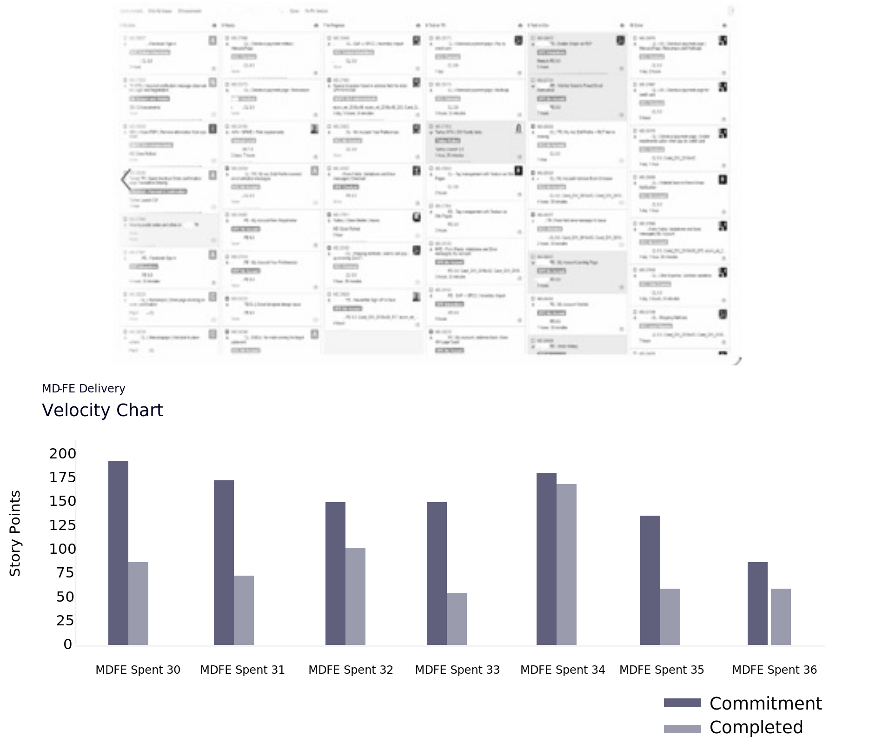

# Projectbeheer

Projectbeheer is een toezichtfunctie die is afgestemd op de governancestructuur van de organisatie en de levenscyclus van het project omvat. Het voorziet de projectmanager en het team van structuur, processen, besluitvormingsmodellen, en hulpmiddelen om het project te beheren en te controleren, terwijl ook het verzekeren van de succesvolle levering van het project. Projectgovernance is een cruciaal element, met name voor complexe en strategische projecten.

Het governancemodel definieert, documenteert en communiceert aangepaste en effectieve praktijken om een uitgebreide methode te bieden voor het beheren van het project en het periodiek zichtbaar maken op elk niveau om succes te waarborgen. Het bevat een kader voor het nemen van besluiten; omschrijft de rollen, verantwoordelijkheden en aansprakelijkheid voor de uitvoering van het project; en regelt de doeltreffendheid. De governancestructuur rolt van het uitvoeringsteam helemaal naar het uitvoerend management en definieert de activiteiten, rapportage, escalatie en informatiestroom.

Op diverse niveaus, onderzoeken de teams specifieke sprint en projectmetriek om de vooruitgang te begrijpen en correctieve acties te nemen zonodig. Deze gegevens op sprintniveau kunnen de snelheid en uitbarsting van elke sprint omvatten.

## Regelmatige vergaderdetails

- Driemaandelijkse bedrijfsherziening

   - Bespreek groeiescalatiestrategieën

   - Huidig succes en doelen benadrukken

   - Uitlijnen op gewenste resultaten voor de komende kwartalen

- Maandelijkse stuurgroep

   - De voortgang van het project coördineren en evalueren

   - Besluitvorming inzake belangrijke-effectposten (indien van toepassing)

   - Dentsule zorgt ervoor dat klanttevredenheid en zorgen worden vastgelegd en aangepakt

- Wekelijks projectcomité

   - Beslissen over de doelstellingen, het plan en de organisatie van de week

   - Architectuurbeslissingen nemen waar nodig

   - Evalueren en reageren op rapporten over de projectstatus

   - Demonstreert het platform en de functies

   - Verzoeken/problemen/suggesties doorverwijzen

- Dagelijkse vergadering

   - Bespreek en vervolg actiepunten, waaronder huidige sprint/boards/openstaande tickets

   - Voortgang van project controleren

## Prestatie-KPI&#39;s

Afgezien van de sprintmetriek is het ook van essentieel belang om project en kwaliteitsprestaties KPIs te meten. Dit draagt niet alleen bij tot het waarborgen van het kwaliteitsniveau in het hele plan, maar het houdt het team op de rails en verhindert het project van de rails te gaan.

## Storyboard en snelheid

## Afdrukken en vrijgeven

De uitdagingen of de veranderingen komen tijdens de duur van om het even welk project voor. Door de juiste mensen binnen uw organisatie de mogelijkheid te geven om te volgen, te meten en te roteren wanneer een uitdaging wordt aangegaan, wordt de kans groter dat u uit het project komt omdat u uw doelstellingen hebt bereikt en tevreden bent met het resultaat.

<table>
<thead>
  <tr>
    <th>Meting van de belangrijkste prestaties</th>
    <th>Maateenheid</th>
    <th>Gerapporteerde cijfers</th>
  </tr>
</thead>
<tbody>
  <tr>
    <td>Dekking testen</td>
    <td>%</td>
    <td>Aantal testvoorschriften waarop de testgevallen betrekking hebben VS Totaal aantal testvoorschriften op basis van tests</td>
  </tr>
  <tr>
    <td>Dichtheid beschermen</td>
    <td>%</td>
    <td>Aantal gevonden geldige defecten VS Totaal van uitgevoerde testgevallen</td>
  </tr>
  <tr>
    <td>Lekking naar SIT/UAT/productie defect</td>
    <td>%</td>
    <td>Defecten gerapporteerd in Productie VS Defecten gerapporteerd in Productie + Defecten gerapporteerd door QA+UAT</td>
  </tr>
  <tr>
    <td>Doeltreffendheid testen</td>
    <td>%</td>
    <td>Geldige Defecten opgeheven/Geldige Defecten opgeheven Geweigerde gebreken</td>
  </tr>
  <tr>
    <td>Codekwaliteit</td>
    <td># + %</td>
    <td>Complexiteit, LoC, Overtredingen, Codedekking voor sprint</td>
  </tr>
</tbody>
</table>
