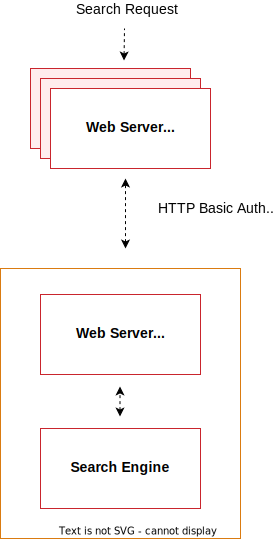

# Voorwaarden voor zoekmachines

Vanaf Adobe Commerce 2.4, moeten alle installaties worden gevormd om [ Elasticsearch ](https://www.elastic.co) of [ OpenSearch ](https://opensearch.org/) als oplossing van het catalogusonderzoek te gebruiken.

>[!NOTE]
>
>Ondersteuning voor OpenSearch is toegevoegd in 2.4.4. OpenSearch is een compatibele Elasticsearch. Alle instructies voor het configureren van Elasticsearch 7 zijn van toepassing op OpenSearch. [ migreer van Elasticsearch aan OpenSearch ](../../../upgrade/prepare/opensearch-migration.md) verstrekt begeleiding bij het schakelen naar OpenSearch.

## Ondersteunde versies

U moet Elasticsearch of OpenSearch installeren en configureren voordat u Adobe Commerce 2.4.4 en hoger installeert.

Verwijs naar de [ Vereisten van het Systeem ](../../system-requirements.md) voor specifieke versieinformatie.

## Aanbevolen configuratie

We raden het volgende aan:

* [Nginx voor uw zoekmachine configureren](configure-nginx.md)
* [Apache configureren voor uw zoekmachine](configure-apache.md)

## Installatielocatie

De volgende taken veronderstellen dat u uw systeem volgens het volgende diagram hebt gevormd:



Het voorgaande diagram toont:

* De Commerce-toepassing en het zoekprogramma zijn op verschillende hosts geïnstalleerd.

  Als u op aparte hosts werkt, is proxy vereist. (Het groeperen van zich de onderzoeksmotor is voorbij het werkingsgebied van deze gids, maar u kunt meer informatie in de [ Elasticsearch vinden die documentatie ](https://www.elastic.co/guide/en/elasticsearch/guide/current/distributed-cluster.html) groeperen.)

* Elke host heeft een eigen webserver. De webservers hoeven niet hetzelfde te zijn.

  De Commerce-toepassing kan bijvoorbeeld Apache uitvoeren en het zoekprogramma kan nginx uitvoeren.

* Beide Webservers gebruiken de Veiligheid van de Laag van het Vervoer (TLS).

  Het instellen van TLS valt buiten het bereik van onze documentatie.

Zoekverzoeken worden als volgt verwerkt:

1. Een zoekverzoek van een gebruiker wordt ontvangen door de Commerce-webserver, die het doorstuurt naar de zoekprogrammaserver.

   U vormt de onderzoeksmotor om met de gastheer en de haven van de volmacht te verbinden. We raden de SSL-poort van de webserver aan (standaard ingesteld op 443).

1. De zoekmachine-webserver (die luistert op poort 443) vult de aanvraag aan bij de zoekmachine-server (standaard luistert deze naar poort 9200).

1. De toegang tot de onderzoeksmotor wordt verder beschermd door de Basisauthentificatie van HTTP. Voor een verzoek om de onderzoeksmotor te bereiken, moet het over SSL *reizen en* een geldige gebruikersbenaming en een wachtwoord verstrekken.

1. Het zoekprogramma verwerkt het verzoek.

1. De mededeling keert langs de zelfde route terug, met de server die van het Web van de Elasticsearch als veilige omgekeerde volmacht dienst doet.

## Vereisten

De in deze sectie besproken taken vereisen het volgende:

* [Firewall en SELinux](#firewall-and-selinux)
* [De JDK (Java Software Development Kit) installeren](#install-the-java-software-development-kit)
* [De zoekfunctie installeren](#install-the-search-engine)
* [Elasticsearch bijwerken](#upgrading-elasticsearch)

### Firewall en SELinux

Beveiligingsgerelateerde software (iptables, SELinux, AppArmor) kan standaard worden geconfigureerd om communicatie tussen subsystemen te blokkeren. Het is misschien een goed idee om deze te controleren als er problemen zijn.

#### Regels instellen voor iptables en SELinux

Raadpleeg de volgende bronnen als u regels wilt instellen voor communicatie met de firewall of SELinux ingeschakeld:

* [ iptables hoe-aan ](https://help.ubuntu.com/community/IptablesHowTo)
* [ hoe te om iptables regels (fedora project) uit te geven ](https://fedoraproject.org/wiki/How_to_edit_iptables_rules)
* [ Inleiding aan SELinux (CentOS.org) ](https://www.centos.org)
* [ SELinux hoe-aan Wiki (CentOS.org) ](https://wiki.centos.org/HowTos/SELinux)

### De Java Software Development Kit installeren

Voer de volgende opdracht in om te bepalen of Java al is geïnstalleerd:

```bash
java -version
```

Als het bericht `java: command not found` wordt weergegeven, moet u de Java SDK installeren zoals beschreven in de volgende sectie.

Zie een van de volgende secties:

* [De nieuwste JDK installeren op CentOS](#install-the-jdk-on-centos)
* [De nieuwste JDK installeren op Ubuntu](#install-the-jdk-on-ubuntu)

#### De JDK installeren op CentOS

Zie dit [ Digitale zelfstudie van de Oceaan ](https://www.digitalocean.com/community/tutorials/how-to-install-java-on-centos-and-fedora#install-oracle-java-8).

Ben zeker om JDK te installeren en *niet* JRE.

```bash
yum -y install java-1.8.0-openjdk
```

>[!NOTE]
>
>Java versie 8 is mogelijk niet voor alle besturingssystemen beschikbaar. Bijvoorbeeld, kunt u [ de lijst van beschikbare pakketten voor Ubuntu ](https://packages.ubuntu.com/) zoeken.

#### De JDK installeren op Ubuntu

Als u JDK 1.8 op Ubuntu wilt installeren, voert u de volgende opdrachten in als een gebruiker met `root` -rechten:

```bash
apt-get -y update
```

```bash
apt-get install -y openjdk-8-jdk
```

Voor andere opties, zie {de documentatie van het Oracle 0} ](https://docs.oracle.com/javase/8/docs/technotes/guides/install/install_overview.html).[

### De zoekfunctie installeren

Volg [ Installerend Elasticsearch ](https://www.elastic.co/guide/en/elasticsearch/reference/current/install-elasticsearch.html) of [ installeer en vorm OpenSearch ](https://opensearch.org/docs/latest/opensearch/install/index/) voor uw platform-specifieke stappen.

Om te verifiëren dat de Elasticsearch werkt, ga het volgende bevel op de server in waarop het loopt:

```bash
curl -XGET '<host>:9200/_cat/health?v&pretty'
```

Er wordt een bericht weergegeven dat lijkt op het volgende:

```terminal
epoch      timestamp cluster       status node.total node.data shards pri relo init unassign pending_tasks
1519701563 03:19:23  elasticsearch green           1         1      0   0    0    0        0             0
```

Voer de volgende opdrachten in om te controleren of OpenSearch werkt:

```bash
curl -XGET https://<host>:9200 -u 'admin:admin' --insecure
```

```bash
curl -XGET https://<host>:9200/_cat/plugins?v -u 'admin:admin' --insecure
```

## Elasticsearch bijwerken

Verwijs naar [ Bevorderende Elasticsearch ](https://www.elastic.co/guide/en/elasticsearch/reference/current/setup-upgrade.html) voor volledige instructies bij het steunen van uw gegevens, het ontdekken van potentiële migratiekwesties, en het testen van verbeteringen alvorens aan productie op te stellen. Afhankelijk van uw huidige versie van Elasticsearch is het mogelijk dat een volledige clusterherstart al dan niet vereist is.

Voor Elasticsearch is JDK 1.8 of hoger vereist. Zie [ installeer de Uitrusting van de Ontwikkeling van de Software van Java ](#install-the-java-software-development-kit) om te controleren welke versie van JDK geïnstalleerd is.

## Aanvullende bronnen

Zie de [ Elasticsearch ](https://www.elastic.co/guide/en/elasticsearch/reference/current/index.html) of [ OpenSearch ](https://opensearch.org/docs/latest/) documentatie.
