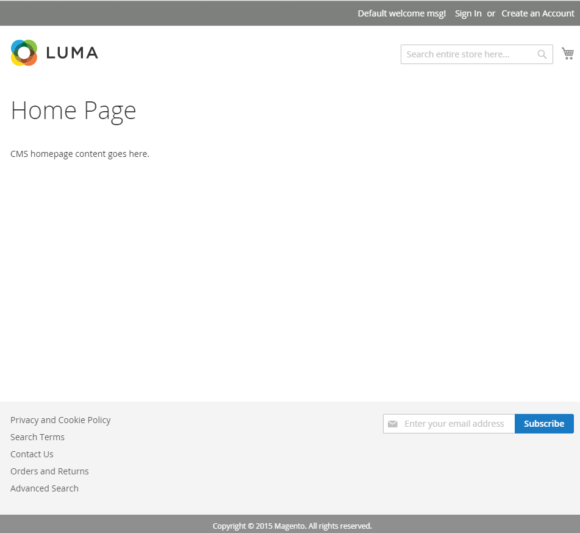
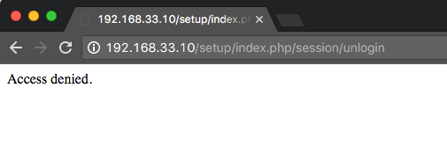

# Documenthoofdmap wijzigen om de beveiliging te verbeteren

In een standaardinstallatie met een Apache-webserver wordt Adobe Commerce geïnstalleerd in de standaardhoofdmap van het web: `/var/www/html/magento2`.

De `magento2/` map bevat het volgende:

- `pub/`
- `setup/`
- `var/`

De aanvrage wordt betekend aan `/var/www/html/magento2/pub`. De rest van het bestandssysteem is kwetsbaar omdat het vanuit een browser toegankelijk is.
De webroot instellen op de `pub/` voorkomt dat sitebezoekers vanuit een browser toegang krijgen tot gevoelige gebieden van het bestandssysteem.

In dit onderwerp wordt beschreven hoe u de Apache-hoofdmap op een bestaande instantie wijzigt om bestanden van de `pub/` directory, die veiliger is.

## Een opmerking over nginx

Als u [nginx](../prerequisites/web-server/nginx.md) en de [`nginx.conf.sample`](https://github.com/magento/magento2/blob/2.4/nginx.conf.sample) bestand dat is opgenomen in de installatiemap, worden bestanden waarschijnlijk al verzonden vanuit de `pub/` directory.

Als u het bestand gebruikt in uw serverblok dat uw site definieert, wordt `nginx.conf.sample` de configuratie treedt de de documentmontages van uw server met voeten om dossiers van te dienen `pub/` directory. Zie bijvoorbeeld de laatste regel in de volgende configuratie:

```conf
# /etc/nginx/sites-available/magento

upstream fastcgi_backend {
   server  unix:/run/php/php7.4-fpm.sock;
}

server {

         listen 80;
         server_name 192.168.33.10;
         set $MAGE_ROOT /var/www/html/magento2ce;
         include /var/www/html/magento2ce/nginx.conf.sample;
}
```

## Voordat u begint

Als u deze zelfstudie wilt voltooien, hebt u toegang nodig tot een werkende installatie die op een LAMP-stapel wordt uitgevoerd:

- Linux
- Apache (2.4+)
- MySQL (5.7+)
- PHP (7.4)
- Elasticsearch (7.x) of OpenSearch (1.2)
- Adobe Commerce of Magento Open Source (2.4+)

>[!NOTE]
>
>Zie [Vereisten](../prerequisites/overview.md) en de [Installatiehandleiding](../overview.md) voor meer informatie .

## 1. De serverconfiguratie bewerken

De naam en locatie van het virtuele hostbestand zijn afhankelijk van de versie van Apache die u uitvoert. In dit voorbeeld worden de naam en locatie van het virtuele hostbestand op Apache v2.4 weergegeven.

1. Meld u aan bij uw toepassingsserver.
1. Bewerk uw virtuele hostbestand:

   ```bash
   vim /etc/apache2/sites-available/000-default.conf
   ```

1. Voeg het pad toe aan uw `pub/` aan de `DocumentRoot` richtlijn :

   ```conf
   <VirtualHost *:80>
   
            ServerAdmin webmaster@localhost
            DocumentRoot /var/www/html/magento2ce/pub
   
            ErrorLog ${APACHE_LOG_DIR}/error.log
            CustomLog ${APACHE_LOG_DIR}/access.log combined
   
            <Directory "/var/www/html">
                        AllowOverride all
            </Directory>
    </VirtualHost>
   ```

1. Apache opnieuw starten:

   ```bash
   systemctl restart apache2
   ```

## 2. Werk uw basis-URL bij

Als u een mapnaam toevoegt aan de hostnaam of het IP-adres van de server om de basis-URL te maken wanneer u de toepassing hebt geïnstalleerd (bijvoorbeeld `http://192.168.33.10/magento2`), moet u deze verwijderen.

>[!NOTE]
>
>Vervangen `192.168.33.10` met de hostnaam van uw server.

1. Meld u aan bij de database:

   ```bash
   mysql -u <user> -p
   ```

1. Geef de database op die u hebt gemaakt toen u de toepassing installeerde:

   ```shell
   use <database-name>
   ```

1. De basis-URL bijwerken:

   ```shell
   UPDATE core_config_data SET value='http://192.168.33.10' WHERE path='web/unsecure/base_url';
   ```

## 3. Werk het bestand env.php bij

De volgende node toevoegen aan de `env.php` bestand.

```conf
'directories' => [
    'document_root_is_pub' => true
]
```

Zie de [env.php reference](../../configuration/reference/config-reference-envphp.md) voor meer informatie .

## 4. Overschakelmodi

[Toepassingsmodi](../../configuration/bootstrap/application-modes.md), met inbegrip van `production` en `developer`, zijn bedoeld om de veiligheid te verbeteren en de ontwikkeling te vergemakkelijken. Zoals de namen suggereren, dient u over te schakelen op `developer` modus wanneer u de toepassing uitbreidt of aanpast en schakelt naar `production` modus wanneer deze wordt uitgevoerd in een live omgeving.

Het schakelen tussen wijzen is een belangrijke stap om te verifiëren dat uw serverconfiguratie behoorlijk werkt. U kunt tussen wijzen schakelen gebruikend het CLI hulpmiddel:

1. Ga naar de installatiemap.
1. Overschakelen op `production` -modus.

   ```bash
   bin/magento deploy:mode:set production
   ```

   ```bash
   bin/magento cache:flush
   ```

1. Vernieuw de browser en controleer of de winkel goed wordt weergegeven.
1. Overschakelen op `developer` -modus.

   ```bash
   bin/magento deploy:mode:set developer
   ```

   ```bash
   bin/magento cache:flush
   ```

1. Vernieuw de browser en controleer of de winkel goed wordt weergegeven.

## 5. Controleer de opslagplaats

Ga naar de winkel in webbrowser om te controleren of alles werkt.

1. Open een webbrowser en voer op de adresbalk de hostnaam of het IP-adres van de server in. Bijvoorbeeld: `http://192.168.33.10`.

   In de volgende afbeelding ziet u een voorbeeldwinkelpagina. Als het als volgt toont, was uw installatie een succes!

   

   Zie de [sectie Problemen oplossen](https://support.magento.com/hc/en-us/articles/360032994352) als op de pagina een waarde van 404 wordt weergegeven (Niet gevonden) of als er geen andere elementen worden geladen, zoals afbeeldingen, CSS en JS.

1. Probeer een toepassingsmap vanuit een browser te openen. Voeg de mapnaam toe aan de hostnaam of het IP-adres van de server op de adresbalk:

   Als u een bericht van 404 of &quot;Toegang ontkend&quot;ziet, hebt u met succes toegang tot het dossiersysteem beperkt.

   
