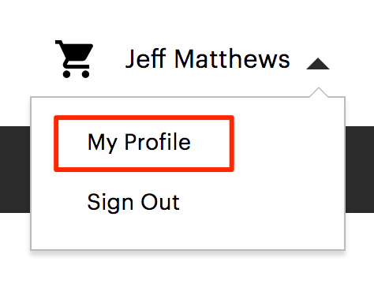

# Een extensie installeren

Code die het gedrag van Adobe Commerce uitbreidt of aanpast, wordt een extensie genoemd. U kunt desgewenst extensies verpakken en distribueren op het tabblad [Commerce Marketplace](https://marketplace.magento.com) of een ander extensiedistributiesysteem.

Extensies zijn:

- Modules (Adobe Commerce-mogelijkheden uitbreiden)
- Thema&#39;s (wijzig de vormgeving van uw winkel en Admin)
- Taalpakketten (lokaliseer de winkel en Admin)

>[!TIP]
>
>Dit onderwerp verklaart hoe te om de bevellijn te gebruiken om uitbreidingen te installeren u van de Commerce Marketplace koopt. U kunt dezelfde procedure gebruiken om te installeren _alle_ extensie; u hebt alleen de Composer-naam en -versie van de extensie nodig. Open de extensies om deze te zoeken `composer.json` en noteer de waarden voor `"name"` en `"version"`.

Voordat u gaat installeren, kunt u het volgende doen:

1. Maak een back-up van uw database.
1. Onderhoudsmodus inschakelen:

   ```bash
   bin/magento maintenance:enable
   ```

Als u een extensie wilt installeren, moet u:

1. Haal een extensie op van de Commerce Marketplace of een andere extensieontwikkelaar.
1. Als u een extensie installeert via de Commerce Marketplace, moet u ervoor zorgen dat de extensie `repo.magento.com` de opslagplaats bestaat in uw `composer.json` bestand:

   ```bash
   "repositories": [
       {
           "type": "composer",
           "url": "https://repo.magento.com/"
       }
   ]
   ```

1. Haal de Composer-naam en -versie van de extensie op.
1. Werk de `composer.json` in uw project met de naam en de versie van de extensie.
1. Controleer of de extensie correct is geïnstalleerd.
1. De extensie inschakelen en configureren.

## De naam en versie van de extensiecomposer ophalen

Als u de Composer-naam en -versie van de extensie al kent, slaat u deze stap over en gaat u verder met [Werk uw `composer.json` file](#update-your-composer-file).

De naam en versie van de componist van de extensie ophalen uit de Commerce Marketplace:

1. Aanmelden bij [Commerce Marketplace](https://marketplace.magento.com) met de gebruikersnaam en het wachtwoord waarmee u de extensie hebt aangeschaft.

1. Klik in de rechterbovenhoek op **Uw naam** > **Mijn profiel**.

   

1. Klikken **Mijn aankopen**.

   

1. Zoek de extensie die u wilt installeren en klik op **Technische details**.

   

>[!TIP]
>
>U kunt ook de naam en versie van de Composer vinden van _alle_ extensie (of u de extensie hebt aangeschaft op Commerce Marketplace of op een andere locatie) in de extensie `composer.json` bestand.

## Uw Composer-bestand bijwerken

De naam en versie van de extensie toevoegen aan uw `composer.json` bestand:

1. Navigeer naar de projectmap en werk de projectmap bij `composer.json` bestand.

   ```bash
   composer require <component-name>:<version>
   ```

   Bijvoorbeeld:

   ```bash
   composer require j2t/module-payplug:2.0.2
   ```

1. Voer uw [verificatietoetsen](../prerequisites/authentication-keys.md). Uw openbare sleutel is uw gebruikersnaam; uw persoonlijke sleutel is uw wachtwoord.

1. Wacht op Composer om het bijwerken van uw projectgebiedsdelen te voltooien en ervoor te zorgen dat er geen fouten zijn:

   ```terminal
   Updating dependencies (including require-dev)
   Package operations: 1 install, 0 updates, 0 removals
     - Installing j2t/module-payplug (2.0.2): Downloading (100%)
   Writing lock file
   Generating autoload files
   ```

## De extensie verifiëren

Voer de volgende opdracht uit om te controleren of de extensie correct is geïnstalleerd:

```bash
bin/magento module:status J2t_Payplug
```

Standaard is de extensie waarschijnlijk uitgeschakeld:

```terminal
Module is disabled
```

De extensienaam heeft de notatie `<VendorName>_<ComponentName>`; dit is een andere indeling dan de naam van de componist. Gebruik deze indeling om de extensie in te schakelen. Voer de volgende handelingen uit als u niet zeker bent van de naam van de extensie:

```bash
bin/magento module:status
```

En zoek de extensie onder &quot;Lijst met uitgeschakelde modules&quot;.

## De extensie inschakelen

Sommige extensies werken alleen correct als u gegenereerde statische weergavebestanden wist. Gebruik de `--clear-static-content` om statische weergavebestanden te wissen wanneer u een extensie inschakelt.

1. De extensie inschakelen en statische weergavebestanden wissen:

   ```bash
   bin/magento module:enable J2t_Payplug --clear-static-content
   ```

   U zou de volgende output moeten zien:

   ```terminal
   The following modules have been enabled:
   - J2t_Payplug
   
   To make sure that the enabled modules are properly registered, run 'setup:upgrade'.
   Cache cleared successfully.
   Generated classes cleared successfully. Please run the 'setup:di:compile' command to generate classes.
   Generated static view files cleared successfully.
   ```

1. De extensie registreren:

   ```bash
   bin/magento setup:upgrade
   ```

1. Uw project opnieuw compileren: in de productiemodus ontvangt u mogelijk het bericht &quot;Voer de compilatieopdracht van het Magento opnieuw uit&quot;. De toepassing vraagt u niet om het compileerbevel op de wijze van de Ontwikkelaar in werking te stellen.

   ```bash
   bin/magento setup:di:compile
   ```

1. Controleer of de extensie is ingeschakeld:

   ```bash
   bin/magento module:status J2t_Payplug
   ```

   De uitvoer moet controleren of de extensie niet meer is uitgeschakeld:

   ```terminal
   Module is enabled
   ```

1. De cache reinigen:

   ```bash
   bin/magento cache:clean
   ```

1. Configureer de extensie naar wens in Admin.

>[!TIP]
>
>Als u fouten tegenkomt bij het laden van de storefront in een browser, gebruikt u de volgende opdracht om de cache te wissen: `bin/magento cache:flush`.

## Een extensie upgraden

Een module of extensie bijwerken of bijwerken:

1. Download het bijgewerkte bestand van Marketplace of een andere ontwikkelaar van extensies. Noteer de naam en de versie van de module.

1. Exporteer de inhoud naar de hoofdmap van de toepassing.

1. Voer een van de volgende handelingen uit als er een Composer-pakket voor de module bestaat.

   Bijwerken per modulenaam:

   ```bash
   composer update vendor/module-name
   ```

   Bijwerken per versie:

   ```bash
   composer require vendor/module-name ^x.x.x
   ```

1. Voer de volgende opdrachten uit om de cache te upgraden, te implementeren en schoon te maken.

   ```bash
   bin/magento setup:upgrade --keep-generated
   ```

   ```bash
   bin/magento setup:static-content:deploy
   ```

   ```bash
   bin/magento cache:clean
   ```
