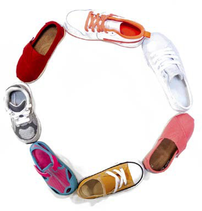

# Klikken en verzamelen

Klik en verzamel is een integraal onderdeel geworden van omni-channel strategieën omdat dit de toename van het verbruik, de ervaring van de klant en het investeringsrendement bevordert. Klikken en verzamelen is niet meer alleen voor grote supermarkten, maar maakt ook deel uit van zowel B2B- als B2C-organisaties.

## Tips

De ondernemingen zouden deze tien uiteinden moeten volgen om de goede klik te leveren en de dienst te verzamelen:

- Leveren
- Aanbieding
- Beschikbaarheid van voorraden
- Winkellocatie
- Mobiel
- Opslagopties
- Uitvoeringsopties
- Status van bestelling
- Aanvullende kosten
- In-store verzameling

### Leveren

Wanneer het beslissen om te voeren klik en verzamelt, moeten de ondernemingen overwegen hoe zij van plan zijn om te leveren klik en aan klanten, zoals de diensttypes verzamelen:

- **Online betaling en verzamelen in-opslag** - de gebruiker betaalt voor het product online en nadat de betaling wordt bevestigd de opslag brengt de klant op de hoogte wanneer het product klaar is om te worden verzameld gebaseerd op de selectie van de klantenopslag. Als u de betaling int, kunt u het product beter reserveren.

- **het product van de Reserve online, betaling en inzameling in opslag** - In dit de diensttype betaalt de klant niet online wanneer het reserveren van een product. In dit type van dienst, kan de klant hun mening veranderen en zou niet het product kunnen kopen.

- **Integratie** - nadat het leveringstype wordt geselecteerd, moeten de ondernemingen op integratiestructuur beslissen (waar de orden worden verzonden, waar de orden worden vervuld). De voorraad kan worden aangelegd vanuit een centraal entrepot of rechtstreeks vanuit afzonderlijke opslagplaatsen.

- **Keert terug** - de terugkeer kan complex zijn. De ondernemingen moeten een duidelijke strategie hebben om rendementen voor geleverde producten en producten te beheren die gebruikend klikken en worden bevolen te verzamelen. De ondernemingen moeten klanten toestaan om producten terug te keren die zij door te klikken en ontvangen om de klantendienst van begin tot eind te verlenen.

## Aanbieding

Bedrijven moeten hun klik op de markt brengen en service verzamelen. Als niemand zich van de dienst bewust is, dan is het niet nuttig en zal niet het vereiste rendement op investering produceren. Hoewel de klik en de inzamelingsdiensten gewoonlijk het zelfde zijn, is het nog essentieel om aan de klant uit te leggen de stappen om te gebruiken klikken en te verzamelen.

## Beschikbaarheid van voorraden

De ondernemingen moeten voorraadniveaus in real time aan klanten tonen wanneer zij klikken en verzamelen selecteren. Dit toont het voorraadniveau aan klanten in hun aangewezen opslag. Om dit goed te laten functioneren, moet het pakhuis en het e-commerce platform worden geïntegreerd om de inventarisniveaus in controle te houden en klaagklachten van klanten te vermijden.

## Winkellocatie

De ondernemingen moeten ervoor zorgen dat zij alle opslaginformatie tonen van waar de klanten hun orde door klik kunnen verzamelen en verzamelen. De winkel moet informatie bevatten, zoals het adres van de winkel, de timing van de winkel (inclusief feestdagen) en het contactnummer.

## Mobiel

Met de groei van mobiele gebruikers, zouden de ondernemingen hun e-commercewebsite moeten nemen om ontvankelijk te zijn. De ondernemingen zouden de zelfde ervaring aan klanten op alle apparaten moeten verstrekken.

## Opslagopties

Sommige winkels zijn voor sommige klanten mogelijk niet gemakkelijk toegankelijk. Het is een goed idee om andere plaatsen voor klik en inzameling, zoals het postbureau of het gemakwinkel te verstrekken.

## Uitvoeringsopties

Als niet alle producten die een bedrijf op de website verkoopt, beschikbaar zijn voor klikken en verzamelen, moet het bedrijf de verzendmethode weergeven die voor dat product is opgegeven. Dit kan een beetje onhandig voor klanten zijn, zodat is het beter om klik aan te bieden en voor zoveel mogelijk producten te verzamelen.

## Status van bestelling

Communicatie is zeer belangrijk voor de klantendienst zelfs wanneer het komt om te klikken en te verzamelen. Het is belangrijk dat de orderstatus na aankoop wordt meegedeeld, bijvoorbeeld waar en wanneer zij hun bestelling moeten verzamelen, en of zij persoonlijke identificatie moeten aanbrengen om hun bestelling te verzamelen. De status moet niet alleen via SMS of e-mail worden doorgegeven, maar ook op de site in de volgorde van bijhouden.

## Aanvullende kosten

Sommige merken brengen extra servicekosten in rekening als de bestelling minder is dan een bepaalde waarde voor klikken en verzamelen. Uit onderzoek is echter gebleken dat het beschikbaar stellen van een vrije klik en het verzamelen van gegevens de voetafdruk van de website vergroot en de omrekeningskoersen verhoogt, wat op zijn beurt het rendement van investeringen verhoogt.

## In-store verzameling

Ongeacht of het bedrijf B2B of B2C is, moet het de beste klantendienst verlenen. Het is van essentieel belang dat in-store informatie aan klanten wordt verstrekt, zoals waar het inzamelingspunt in de winkel wordt gevestigd. Wijs een sectie in de winkel aan voor klikken en verzamelen. Zorg ervoor dat klanten niet lang hoeven te wachten om hun bestelling te verzamelen. Sommige merken voorzien ook klik en verzamelen parkeerplaatsen, waar de gebruiker de details voor klik ingaat en parkeerplaatsen verzamelt en de winkelwerknemers hun orde aan hen brengen.

Dit zijn slechts enkele voorbeelden van personalisatie. Er zijn ontelbare meer eigenschappen en mogelijkheden die volgens de vereisten van de zaken kunnen worden onderzocht. Het bijhouden van voortdurend veranderende markttendensen kan moeilijk zijn, maar het helpt algemene klantenervaring verbeteren.
