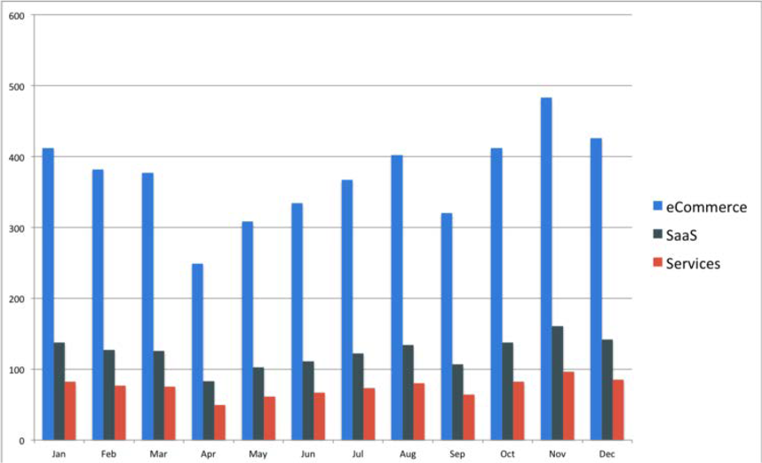

# Klantenservice

De elektronische handel is digitaal gebaseerd en het enige team dat met de echte klant achter de transactie in wisselwerking staat is het team van de Dienst van de Klant. Klanten verwachten een ervaring van hoge kwaliteit en als zij niet krijgen dat de detailhandel hen als klanten zou kunnen verliezen. De teams van de Dienst van de klant in de industrie van de Handel ontvangen het hoogste aantal vraag, berichten, en e-mails in vergelijking met andere industrieën.

De detailhandelaars moeten pro-actief in termen van klantendienst zijn omdat niet alleen de merknaam op het spel staat, maar vooral zijn loyaliteit van de klant. Om ervoor te zorgen dat detailhandelaren erin slagen de beste klantervaring te bieden, zijn er enkele best practices die zij kunnen volgen:

- **Kanaal** voor meervoudige ondersteuning - Het bieden van service via e-mail of telefoon is niet genoeg in het tijdperk van vandaag. De klantendienst moet op diverse kanalen, zoals levende chats, e-mail, telefoongesprekken, sociale media, en of tekstberichten worden verleend. Elk van deze heeft hun eigen voor- en nadelen die detailhandelaren moeten analyseren.

- **De gepersonaliseerde dienst**-Al klantenactiviteit wordt gedaan online, die detailhandelaren kunnen volgen om klantengedrag te begrijpen. Wanneer een klant bijvoorbeeld het team van de klantenservice bereikt, beschikt het team vooraf over de benodigde gegevens, zoals naam, e-mailadres, ordergeschiedenis en geretourneerde gegevens. Dit helpt de Klantenservice om snel en nauwkeurig service te bieden en biedt klanten ook een persoonlijke service.

- **De zelfbediening**-Klanten kunnen ook van zelfbediening, zoals het verstrekken van FAQ, privacybeleid, termijnen en voorwaarden, en forums worden voorzien.

De detailhandelaars zouden zich in de schoenen van de klant moeten zetten om hun probleem te begrijpen en de beste klantenervaring te verstrekken. De ervaring van de klant houdt de klant loyaal en bevordert het merk.

## B2B versus B2C

De dienst van de klant is belangrijk voor zowel B2B als B2C ondernemingen, maar het concept klantendienst is verschillend tussen beide:

- B2B-bedrijven hebben vaak te maken met veel van de belanghebbenden en complexere kwesties die meer tijd en moeite vergen om op te lossen, terwijl B2C-bedrijven meestal bestaan uit regelmatige kwesties.

- B2B-bedrijven hebben minder klanten, maar het is van essentieel belang om de beste klantenservice te bieden om die klanten te behouden. B2B-producten zijn meestal ook complexer en groter, zodat het rendement van investeringen aanzienlijk wordt beïnvloed.

- In B2C-bedrijven praat het team van de klantenservice met één persoon die de transactie heeft uitgevoerd, terwijl er bij B2B-bedrijven meerdere belanghebbenden zijn, zodat het team van de klantenservice oproepen van verschillende belanghebbenden kan ontvangen als er problemen zijn.

- B2B-klantenserviceteams moeten een band hebben met de klanten om een beter inzicht te krijgen in hun vereisten, terwijl B2C-bedrijven zelden een relatie hebben met klanten

De detailhandelaars zouden zich in de schoenen van de klant moeten zetten om hun probleem te begrijpen en de beste klantenervaring te verstrekken. De ervaring van de klant houdt de klant loyaal en bevordert het merk.
