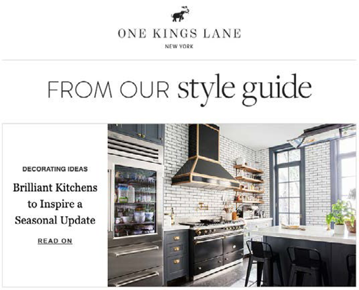

# E-mailmarketing

E-mailmarketing (in eenvoudige termen) stuurt marketingberichten naar leads en huidige klanten via e-mails om producten aan klanten te promoten, aan te trekken en te verkopen. Marketing teams hebben volledige controle over het ophalen van klantgegevens en het verzenden van gepersonaliseerde inhoud aan klanten via directe e-mailcampagnes. E-mail fungeert als een hulpmiddel om een relatie tussen uw klanten en uw merk op te bouwen.

Waarom zou u e-mailmarketing moeten overwegen?

- Laat u een verband met huidige en toekomstige klanten bouwen

- Helpt de verkoop van schijven en verhoogt de conversiesnelheid

- Helpt bedrijfsgroei te versnellen

- Vereist geen derde partij, zoals Instagram of Facebook

## Welkom-e-mail

De eerste indruk laatste maken is van essentieel belang in een elektronische handel. Als het eerste e-mailbericht dat u naar nieuwe klanten verzendt, effectief is, blijft het geheugen van de klant ongewijzigd. Probeer het ontwerp eenvoudig en origineel te houden. Sommige merken bieden bijvoorbeeld kortingen in de e-mail wanneer de klant zich aanmeldt.

## Gecumuleerde e-mail

Gebogen e-mail is een van de beste vormen van e-mail, omdat abonnees hierdoor meer over het product kunnen leren. U kunt ook gekrulde e-mailberichten verzenden op basis van de segmentatie van de klant.

## E-mailadres voor betrokkenheid

Klanten kunnen gemakkelijk e-mails over het hoofd zien, maar als e-mails als service-e-mails worden verzonden, is de kans dat een klant de e-mail verwijdert zonder ernaar te kijken lager. E-mails over betrokkenheid kunnen de vorm aannemen van een promotiecampagne voor gebruikers, zoals gratis verzending.

## E-mail met verwijzing

Word of mouth is een van de beste marketingstrategieën. Bijvoorbeeld, verzendend verwijzings e-mail naar een bestaande klant. Bijvoorbeeld, &quot;verwijs een Vriend en ontvang $10!&quot; Via e-mail met verwijzing worden klanten gemotiveerd het woord op organische wijze te verspreiden, zodat u meer klanten krijgt.

## E-mail met korting

Het aanbieden van kortingen via e-mail is een efficiënte marketingstrategie. Je moet abonnees kortingen aanbieden om hun loyaliteit te behouden.

## E-mailadres voor afschrijving

Klanten verlaten hun winkelwagen om verschillende redenen, zoals hoge verzendkosten of een onbevredigend retourbeleid. U kunt proberen deze klanten om te zetten in geslaagde kopers door hen een herinnering per e-mail te sturen over het product dat zij in hun winkelwagentje achterlieten. Daarnaast kunt u stimulansen bieden om de afhandeling te voltooien, zoals gratis verzending, een korting of een voucher voor de volgende aankoop. Hierdoor wordt de conversiesnelheid verhoogd.

## Bevestiginge-mail bestellen

Bevestigingse-mails bestellen helpen niet alleen de verkoop op te voeren, maar geven klanten ook het vertrouwen dat ze hun bestelling plaatsen, wat de ervaring en loyaliteit van klanten vergroot.

## E-mail met enquête

Nadat klanten hun bestellingen hebben ontvangen, stuurt u een e-mail met een follow-upenquête naar hun ervaringen en suggesties voor verbetering. Sommige detailhandelaren verstrekken ook een cadeaubon als klanten het onderzoek voltooien omdat de meeste tijd klanten geen onderzoeken voltooien omdat er geen motivatie voor hen is om dit te doen.

