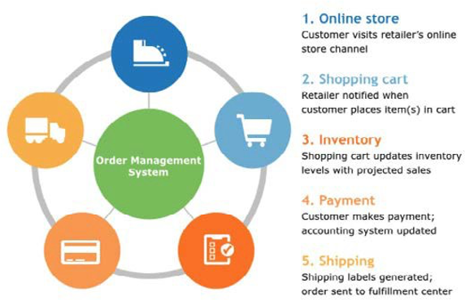

# Orderbeheersysteem (OMS)

Het online winkelen neemt snel toe en bedrijven concurreren om de beste service te leveren om klanten naar hun site aan te trekken. Om concurrerend voordeel te hebben, moeten de detailhandelaren hun digitale voetafdruk uitbreiden, die het verkopen online, andere markten, en zelfs partnerschappen omvat.

Een OMS voor e-commerce is het back-end systeem dat verantwoordelijk is voor het beheer van online bestellingen, waaronder verpakking, verzending, retournering en abonnementen. Een OMS moet detailhandelaren in staat stellen één stap voor hun concurrenten te zijn en schaalbaarder, flexibeler en aanpasbaar te zijn. De OMS moet het bedrijf in staat stellen aan de vraag van de klant te voldoen en gemakkelijk met de markt te veranderen.

Een OMS biedt integratie en automatisering via de reis van de klantenbestelling in de achterkant, waardoor detailhandelaren een betere ervaring voor klanten kunnen bieden. Een OMS helpt detailhandelaren bestellingen te verwerken die via meerdere kanalen binnenkomen en het verpakken en verzenden naar verschillende locaties te vergemakkelijken, terwijl ze hun klanten real-time updates bieden via verschillende mediums.

OMS is belangrijk voor een e-commercesite omdat het merken helpt groeien. Klanten hebben hoge verwachtingen, wat geen ruimte voor fouten laat. Enkele redenen waarom een OMS essentieel is, zijn onder meer:

- **Biedt snellere levering**—In een leeftijd van de volgende dag of 2 dag verschepen, moeten de ondernemingen manieren zoeken om hun bestellingen uit te duwen sneller aangezien het venster voor de voltooiing van bestellingen smaller wordt. OMS wordt onmiddellijk op de hoogte gebracht wanneer een orde wordt geplaatst, en OMS kan het dichtste pakhuis aan de ordebestemming kiezen helpen levering versnellen. Het OMS stuurt geautomatiseerde bestelgegevens naar het pakhuisteam om de bestelling voor te bereiden en in te pakken om te verzenden met behulp van een kosteneffectieve verzendmethode.

- **Beperkte fouten**: Een OMS helpt menselijke fouten te verminderen. Deze fouten kunnen tijdrovend en duur zijn. Een OMS brengt het team op de hoogte wanneer de voorraadniveaus laag zijn, wanneer een product niet verkoopt, of welk product het hoogste terugkeertarief heeft. Hierdoor kunnen bedrijven de verzendfouten corrigeren en de reden voor het retourneren analyseren.

- **Meer schaalbaarheid**—In tegenstelling tot oudere handmatige systemen worden OMS geschaald op basis van de behoefte van het bedrijf. OMS-software biedt bedrijven de mogelijkheid om te schalen met de markt.

- **Meer mogelijkheden voor meerdere kanalen**—In een tijdperk van meerkanaalsverkoop via websites, markten of partnerschappen (Facebook en Instagram) kan het volgen van bestellingen complex zijn, omdat ze naar verschillende locaties worden verzonden met behulp van een of meer verzendmethoden. Een OMS brengt het samen en verhoogt klantenervaring.

## Belangrijkste kenmerken

- Integreert met het bedrijfssysteem of de systemen
- Elimineert handmatige processen
- Biedt internationaal services
- Rapporten genereren om ordergegevens te voorspellen en te begrijpen

Bedrijven/detailhandelaren moeten de juiste OMS selecteren die het beste bij hun bedrijfsbehoeften passen. De ondernemingen zouden met de volgende overwegingen moeten beginnen:

- Begrijp hun klantenorden, producten, inventaris, verschepen, en verpakking

- Beslissen hoe en wanneer OMS met bedrijfsystemen tijdens het ordeproces communiceert

- Bepaal wat de OMS zou moeten doen wanneer een orde is geplaatst (bijvoorbeeld, welke bedrijfsystemen het met zou moeten communiceren?) en wat de volgende stap moet zijn na deze mededeling

- Bepalen welke taken in het entrepot moeten worden geautomatiseerd, zoals het berekenen van de verzendkosten, het toewijzen van de verzendmethode, het aanbrengen van verpakkingsslips en het bijwerken van de inventaris

- Communiceer uit voorraadproducten aan verkopers, productieteam, en leveranciers om het product te hervoorraden

- Klanten en interne teams op de hoogte stellen van de voortgang van de verzending

- Terugbetalingen automatiseren, inventariseren bijwerken en informatie naar klanten en interne teams verzenden na een terugkeer

- Bepaal of de onderneming zich een volwaardig OMS (of delen daarvan) kan veroorloven

- Plan een project om OMS uit te voeren en het team op te leiden om het te gebruiken

Een OMS kan helpen kosten controleren, ROI verhogen, het uitvoeringsproces versnellen, en de klant en interne teamervaring verbeteren.

Het beheer van orders in B2B-ondernemingen is complex in vergelijking met B2C-activiteiten. B2B-bedrijven hebben doorgaans hogere kosten voor het behouden van klanten omdat zij een andere aankoopcyclus hebben dan B2C-bedrijven. De B2B-aankoopcyclus duurt langer omdat hiervoor een aanvraag tot het indienen van voorstellen (RFP&#39;s) en inkooporders (PO&#39;s) is vereist. B2B-orders zijn meestal herschikkingen waarbij B2C-orders vaak een hoog volume en kleiner zijn.

## Proces voor B2B

- De verkoper voert de bestelgegevens van de klant in in de OMS of de klant kan ook een bestelling online plaatsen, waardoor de ordergegevens naar de OMS worden verzonden

- De klant ontvangt de bevestiging van de bestelling

- De producten worden toegewezen aan de orde

- De gegevens van de bestelling worden naar het pakhuis van de producten verzonden

- De voorraad wordt bijgewerkt

- De status van de bestelling wordt naar de klant verzonden

- De bestelling wordt naar de klant verzonden

Het beheer van orders kan doeltreffend zijn voor B2B- en B2C-bedrijven waar de OMS:

- Hiermee kan de toepassing met meerdere kanalen of meerdere kanalen worden uitgevoerd

- Is gewoonlijk cloudgebaseerd, waardoor organisaties papierloos kunnen gaan en de algehele efficiëntie kunnen verbeteren

- Hiermee kunt u de informatie van meerdere kanalen centraliseren

- Hiermee vermindert u de complexiteit nadat deze is geïmplementeerd

- Helpt bestellingen bij te houden

- Verbetert klantenervaring

- Helpt het leveringsproces te versnellen

Wanneer het uitvoeren van OMS, moeten de B2B ondernemingen begrijpen dat zij geen klanten zoals B2C ondernemingen zullen kunnen dienen. Een OMS moet voor zowel B2B- als B2C-ondernemingen verschillend worden geïmplementeerd, afhankelijk van hun vereisten.
