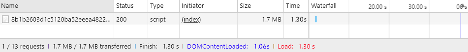

# Geavanceerd [!DNL JavaScript] bundeling

Bundling [!DNL JavaScript] Modules voor betere prestaties gaan over het verminderen van twee dingen:

1. Het aantal serveraanvragen.
1. De grootte van die serververzoeken.

In een modulaire toepassing, kan het aantal serververzoeken in honderden bereiken. De volgende schermafbeelding toont bijvoorbeeld alleen het begin van de lijst met [!DNL JavaScript] modules die op de homepage van een schone installatie worden geladen.


## Samenvoegen en bundelen

Uit de doos, [!DNL Commerce] biedt twee manieren om het aantal serververzoeken te verminderen: samenvoegen en bundelen. Deze instellingen zijn standaard uitgeschakeld. U kunt deze in de beheerinterface inschakelen in **[!UICONTROL Stores]** > **Instellingen** > **[!UICONTROL Configuration]** > **[!UICONTROL Advanced]** > **[!UICONTROL Developer]** > **[!UICONTROL [!DNL JavaScript] Settings]** of vanaf de opdrachtregel.


### Basisbundeling

Om ingebouwde bundeling van de bevellijn toe te laten:

```bash
php -f bin/magento config:set dev/js/enable_js_bundling 1
```

Dit is een native [!DNL Commerce] mechanisme dat alle in het systeem aanwezige elementen combineert en deze onder bundels van hetzelfde formaat verdeelt (bundle_0.js, bundle_1.js ... bundle_x.js):

![[!DNL Commerce] bundeling](../assets/performance/images/magentoBundling.png)

Beter, maar browser laadt ALLE [!DNL JavaScript] bundels, niet alleen de benodigde bundels.

[!DNL Commerce] het bundelen vermindert het aantal verbindingen per pagina, maar voor elke paginaverzoek laadt het alle bundels, zelfs wanneer de gevraagde pagina slechts van dossiers binnen één of twee van de bundels kan afhangen. De prestaties verbeteren nadat de bundels in de cache van de browser zijn geplaatst. Maar omdat de browser deze bundels synchroon laadt, is het eerste bezoek van de gebruiker aan een [!DNL Commerce] storefront kan enige tijd duren om te renderen en de gebruikerservaring te beschadigen.

### Basissamenvoeging

Ingebouwde samenvoeging via de opdrachtregel inschakelen:

```bash
php -f bin/magento config:set dev/js/merge_files 1
```

Met deze opdracht voegt u alle synchrone versies samen [!DNL JavaScript] in één bestand. Samenvoegen inschakelen zonder bundelen ook in te schakelen is niet nuttig omdat [!DNL Commerce] gebruikt RequireJS. Als u bundelen niet inschakelt, [!DNL Commerce] alleen samenvoegt RequireJS en de configuratie ervan. Wanneer u zowel bundelen als samenvoegen inschakelt, [!DNL Commerce] één [!DNL JavaScript] bestand:



## Rendertijden in de praktijk

De vorige gebundelde en samengevoegde laadtijden zien er goed uit in een ontwikkelomgeving. Maar in de echte wereld kunnen veel dingen de rendering vertragen: langzame verbindingen, grote verbindingsdrempels, beperkte netwerken. Bovendien renderen mobiele apparaten niet zo snel als desktops.

Om uw storefront plaatsing voor de echte wereld te testen en voor te bereiden, adviseren wij u met het inheemse throttling profiel van Chrome van &quot;Traag 3G.&quot; te testen Met Trage 3G weerspiegelen onze vorige gebundelde uitvoertijden nu de verbindingsrealiteiten van veel gebruikers:


Bij trage 3G-connectiviteit duurt het ongeveer 44 seconden om alle bundels te laden voor de startpagina van een schone [!DNL Commerce] installatie.

Hetzelfde geldt wanneer u de bundels samenvoegt tot één bestand. Gebruikers konden nog steeds ongeveer 42 seconden wachten op het laden van de eerste pagina, zoals hier wordt getoond:


Met een geavanceerdere benadering van [!DNL JavaScript] door bundeling kunnen we deze laadtijden verbeteren .

## Geavanceerde bundeling

Herinner me, het doel van [!DNL JavaScript] het bundelen moet het aantal en de grootte van gevraagde activa voor elke pagina verminderen die in browser wordt geladen. Hiervoor willen we onze bundels maken, zodat elke pagina in onze winkel alleen een gemeenschappelijke bundel en een paginaspecifieke bundel hoeft te downloaden voor elke pagina die wordt geopend.

U kunt dit bereiken door uw bundels op paginatypen te definiëren. U kunt categorieën indelen [!DNL Commerce]Deze pagina&#39;s bestaat uit verschillende paginatypen, waaronder Categorie, Product, CMS, Klant, Winkel en Afhandeling. Elke pagina die in één van deze paginatypen wordt gecategoriseerd heeft een verschillende reeks module RequireJS gebiedsdelen. Wanneer u uw modules RequireJS door paginatype bundelt, zult u omhoog met slechts een handvol bundels beëindigen die de gebiedsdelen van om het even welke pagina in uw opslag behandelen.

U zou bijvoorbeeld kunnen eindigen met een bundel voor de afhankelijkheden die voor alle pagina&#39;s gelden, een bundel voor pagina&#39;s met alleen CMS, een bundel voor pagina&#39;s met alleen Catalog, een andere bundel voor pagina&#39;s met alleen zoeken en een bundel voor pagina&#39;s met uitchecken.

U kunt ook pakketten maken op basis van het doel: voor algemene functies, productgerelateerde functies, verzendfuncties, uitcheckfuncties, belastingen en formuliervalidaties. Hoe u uw bundels bepaalt is aan u en de structuur van uw opslag. Sommige bundelingstrategieën werken mogelijk beter dan andere.

Een schone [!DNL Commerce] de installatie maakt het bereiken van voldoende goede prestaties mogelijk door bundels op paginatypen te splitsen, maar voor sommige aanpassingen is mogelijk een diepgaande analyse en andere distributies van bedrijfsmiddelen vereist.

### Vereiste gereedschappen

In de volgende stappen moet u de volgende programma&#39;s installeren en vertrouwd maken met deze programma&#39;s:

- [nodejs](https://nodejs.org/en/download/)
- [r.js](http://requirejs.org/docs/optimization.html#download)
- [[!DNL PhantomJS]](https://phantomjs.org/) (optioneel)

### Voorbeeldcode

Volledige versies van de voorbeeldcode die in dit artikel worden gebruikt, zijn hier beschikbaar:

- [build.js](../assets/performance/code-samples/build.js)
- [deps.js](../assets/performance/code-samples/deps.js)
- [deps-map.sh](../assets/performance/code-samples/deps-map.sh.txt)

### Deel 1: Een bundelconfiguratie maken

#### 1\. Een bestand build.js toevoegen

Een `build.js` in het [!DNL Commerce] hoofdmap. Dit dossier zal de volledige bouwstijlconfiguratie voor uw bundels bevatten.

```javascript
({
    optimize: 'none',
    inlineText: true
})
```

Later wijzigen we de `optimize:` instellen op_ `none` tot `uglify2` om de uitvoer van de bundel te minimaliseren. Maar voor nu, tijdens de ontwikkeling, kunt u het laten staan aan `none` voor snellere builds.

#### 2\. Vereiste JS-afhankelijkheden, vormen, paden en kaarten toevoegen

Voeg de volgende RequireJS bouwstijlconfiguratieknopen toe, `deps`, `shim`, `paths`, en `map`, aan uw bouwstijldossier:

```javascript
({
    optimize: 'none',
    inlineText: true,

    deps: [],
    shim: {},
    paths: {},
    map: { "*": {} },
})
```

#### 3\. De eisen-config.js-instantiewaarden samenvoegen

In deze stap, zult u alle veelvouden moeten samenvoegen `deps`, `shim`, `paths`, en `map` configuratieknooppunten van de winkel `requirejs-config.js` in de overeenkomstige knooppunten in uw `build.js` bestand. Om dit te doen, kunt u openen **[!UICONTROL Network]** in het deelvenster Gereedschappen voor ontwikkelaars van uw browser en navigeer naar een willekeurige pagina in uw winkel, zoals de startpagina. In het lusje van het Netwerk, zult u de instantie van uw opslag zien van `requirejs-config.js` bestand boven, hier gemarkeerd:


Binnen dit dossier, zult u veelvoudige ingangen voor elk van de configuratieknopen vinden (`deps`, `shim`, `paths`, `map`). U moet deze veelvoudige knoopwaarden in de enige configuratieknooppunt van uw build.js- dossier samenvoegen. Als de `requirejs-config.js` instance heeft ingangen voor 15 afzonderlijke `map` knooppunten, moet u de vermeldingen voor alle 15 knooppunten samenvoegen in de enkele `map` knoop in uw `build.js` bestand. Hetzelfde geldt voor de `deps`, `shim`, en `paths` knooppunten. Zonder een script om dit proces te automatiseren kan het enige tijd duren.

U moet het pad wijzigen `mage/requirejs/text` tot `requirejs/text` in `paths` configuratieknooppunt als volgt:

```javascript
({
    //...
    paths: {
        //...
        "text": "requirejs/text"
    },
})
```

#### 4\. Een moduleknooppunt toevoegen

Aan het einde van de `build.js` bestand, voeg de modules toe[] array als plaatsaanduiding voor de bundels die u later voor de winkel definieert.

```javascript
({
    optimize: 'none',
    inlineText: true,

    deps: [],
    shim: {},
    paths: {},
    map: { "*": {} },

    modules: [],
})
```

#### 5\. RequireJS-afhankelijkheden ophalen

U kunt alle [!DNL RequireJS] module gebiedsdelen van de de paginatypen van uw opslag door te gebruiken:

1. [!DNL PhantomJS] van de bevellijn (veronderstellend u hebt [!DNL PhantomJS] geïnstalleerd).
1. Vereisen JS bevel in de console van uw browser.

#### Te gebruiken [!DNL PhantomJS]:

In de [!DNL Commerce] hoofdmap, een nieuw bestand maken met de naam `deps.js` en kopieert u de onderstaande code. Deze code gebruikt [!DNL [!DNL PhantomJS]] om een pagina te openen en te wachten totdat de browser alle pagina-elementen laadt. Vervolgens worden alle [!DNL RequireJS] afhankelijkheden voor een bepaalde pagina.

```javascript
"use strict";
var page = require('webpage').create(),
    system = require('system'),
    address;

if (system.args.length === 1) {
    console.log('Usage: $phantomjs deps.js url');
    phantom.exit(1);
} else {
    address = system.args[1];
    page.open(address, function (status) {
        if (status !== 'success') {
            console.log('FAIL to load the address');
        } else {
            setTimeout(function () {
                console.log(page.evaluate(function () {
                    return Object.keys(window.require.s.contexts._.defined);
                }));
                phantom.exit();
            }, 5000);
        }
    });
}
```

Open een terminal in de [!DNL Commerce] hoofdmap en voer het script uit op elke pagina in de winkel die een specifiek paginatype vertegenwoordigt:

<pre>
phantomjs deps.js <i>URL naar specifieke pagina</i> &gt; <i>text-file-representing-pageType-dependences</i>
</pre>

Hier ziet u bijvoorbeeld vier pagina&#39;s uit de voorbeeldwinkel met het thema Luma die de vier paginatypen vertegenwoordigen die we gebruiken om onze vier pakketten te maken (homepage, categorie, product, winkelwagen):

```terminal
phantomjs deps.js http://m2.loc/ > bundle/homepage.txt
phantomjs deps.js http://m2.loc/women/tops-women/jackets-women.html > bundle/category.txt
phantomjs deps.js http://m2.loc/beaumont-summit-kit.html > bundle/product.txt
phantomjs deps.js http://m2.loc/checkout/cart/?SID=m2tjdt7ipvep9g0h8pmsgie975 > bundle/cart.txt (prepare a shopping cart)
..............
```

#### De browserconsole gebruiken:

Als u niet wilt gebruiken [!DNL PhantomJS], kunt u het volgende bevel van de browser in werking stellen console terwijl het bekijken van elk paginatype in uw winkel:

```shell
Object.keys(window.require.s.contexts._.defined)
```

Deze opdracht (wordt gebruikt binnen de [!DNL PhantomJS] script) dezelfde lijst maken van [!DNL RequireJS] gebiedsdelen en toont hen binnen de browser console. Het nadeel van deze benadering is dat u uw eigen bundel-/paginatype tekstbestanden moet maken.

#### 6\. De uitvoer opmaken en filteren

Nadat u de [!DNL RequireJS] afhankelijkheden in tekstbestanden van het paginatype kunt u de komma&#39;s in uw bestanden vervangen door nieuwe regels met de volgende opdracht in elk bestand voor afhankelijkheden van het paginatype:

```terminal
sed -i -e $'s/,/\\\n/g' bundle/category.txt
sed -i -e $'s/,/\\\n/g' bundle/homepage.txt
sed -i -e $'s/,/\\\n/g' bundle/product.txt
....
```

U zou ook alle menins voor elk dossier moeten verwijderen omdat de dubbele gebiedsdelen mengt. Gebruik het volgende bevel op elk gebiedsdeeldossier:

```terminal
sed -i -e 's/mixins\!.*$//g' bundle/homepage.txt
sed -i -e 's/mixins\!.*$//g' bundle/category.txt
sed -i -e 's/mixins\!.*$//g' bundle/product.txt
...
```

#### 7\. Unieke en algemene bundels identificeren

Het doel is een gemeenschappelijke bundel te creëren van [!DNL JavaScript] bestanden nodig voor alle pagina&#39;s. Op die manier hoeft de browser alleen de algemene bundel te laden samen met een of meer specifieke paginatypen.

Een terminal openen in het dialoogvenster [!DNL Commerce] de wortelfolder en gebruikt het volgende bevel om te verifiëren dat u gebiedsdelen hebt u in afzonderlijke bundels kunt verdelen:

```bash
sort bundle/*.txt |uniq -c |sort -n
```

Dit bevel voegt en sorteert de gebiedsdelen samen die in worden gevonden `bundle/*.txt` bestanden.  De output toont ook het aantal dossiers die elk gebiedsdeel bevatten:

```terminal
1 buildTools,
1 jquery/jquery.parsequery,
1 jsbuild,
2 jquery/jquery.metadata,
2 jquery/validate,
2 mage/bootstrap,
3 jquery
3 jquery/ui
3 knockoutjs/knockout
...
```

Deze uitvoer toont aan dat `buildTools` is een afhankelijkheid in slechts één van de bundel/*.txt dossiers. De `jquery/jquery.metadata` de afhankelijkheid is in twee (2) dossiers en `es6-collections` is in drie (3) bestanden.

Onze uitvoer toont slechts drie paginatypen (homepage, categorie en product), wat ons het volgende vertelt:

- Drie gebiedsdelen zijn uniek aan slechts één paginatype (aangetoond door aantal 1).
- Drie meer gebiedsdelen komen op twee paginatypen voor (die door aantal 2 worden getoond).
- De laatste drie gebiedsdelen zijn gemeenschappelijk voor alle drie van onze paginatypen (die door aantal 3 worden getoond).

Dit vertelt ons dat wij de pagina-ladingssnelheden van onze opslag waarschijnlijk kunnen verbeteren door onze gebiedsdelen in verschillende bundel te verdelen, zodra wij weten welke paginatypes vereisen welke gebiedsdelen.

#### 8\. Een bestand voor afhankelijkheidsverdeling maken

Als u wilt weten welke paginatypen welke afhankelijkheden nodig zijn, maakt u een nieuw bestand in het dialoogvenster [!DNL Commerce] hoofdmap, genaamd `deps-map.sh` en kopieer in de onderstaande code:

```shell
awk 'END {
 for (R in rec) {
   n = split(rec[R], t, "/")
   if (n > 1)
     dup[n] = dup[n] ? dup[n] RS sprintf("\t%-20s -->\t%s", rec[R], R) : \
       sprintf("\t%-20s -->\t%s", rec[R], R)
   }
 for (D in dup) {
   printf "records found in %d files:\n\n", D
   printf "%s\n\n", dup[D]
   }
 }
{
 rec[$0] = rec[$0] ? rec[$0] "/" FILENAME : FILENAME
}' bundle/*.txt
```

U kunt het script ook vinden op [https://www.unix.com/shell-programming-and-scripting/140390-get-common-lines-multiple-files.html](https://www.unix.com/shell-programming-and-scripting/140390-get-common-lines-multiple-files.html)

Een terminal openen in het dialoogvenster [!DNL Commerce] hoofdmap en voer het bestand uit:

```bash
bash deps-map.sh
```

De uitvoer van dit script, dat wordt toegepast op onze drie voorbeeldpaginatypen, moet er ongeveer als volgt uitzien (maar veel langer):

```terminal
bundle/product.txt   -->   buildTools,
bundle/category.txt  -->   jquery/jquery.parsequery,
bundle/product.txt   -->   jsbuild,

bundle/category.txt/bundle/homepage.txt -->    jquery/jquery.metadata,
bundle/category.txt/bundle/homepage.txt -->    jquery/validate,
bundle/category.txt/bundle/homepage.txt -->    mage/bootstrap,

bundle/category.txt/bundle/homepage.txt/bundle/product.txt --> jquery,
bundle/category.txt/bundle/homepage.txt/bundle/product.txt --> jquery/ui,
bundle/category.txt/bundle/homepage.txt/bundle/product.txt --> knockoutjs/knockout,
```

Dit is genoeg informatie om een bundelconfiguratie te bouwen.

#### 9\. Maak bundels in het bestand build.js

Open de `build.js` configuratiebestand en voeg uw bundels toe aan de `modules` knooppunt. Elke bundel moet de volgende eigenschappen definiëren:

- `name`— de naam van de bundel. Bijvoorbeeld een naam van `bundles/cart` genereert een `cart.js` bundelen in een `bundles` subdirectory.

- `create`— een booleaanse vlag om de bundel (waarden: `true` of `false`).

- `include`— een array met elementen (tekenreeksen) die zijn opgenomen als afhankelijkheden voor de pagina. RequireJS traceert alle gebiedsdelen en omvat hen in de bundel tenzij uitgesloten.

- `exclude`— een array van bundels of elementen die van de bundel moeten worden uitgesloten.

```javascript
{
    name: 'bundles/catalog',
    create: true,
    include: [
        'addToWishlist',
        'priceBundle',
        'priceUtils',
        'priceOptions',
        'sticky',
        'productSummary',
        'slide'
    ],
    exclude: [
        'requirejs/require',
        'bundles/default',
        'mage/bootstrap'
    ],
}
```

Dit voorbeeld wordt opnieuw gebruikt `mage/bootstrap` en `requirejs/require` elementen, waarbij een hogere prioriteit wordt toegekend aan de belangrijkste componenten en componenten die synchroon moeten worden geladen. De aanwezige bundels zijn:

- `requirejs/require`—de enige synchroon geladen bundel
- `mage/bootstrap`—de laarzentrekkerbundel met UI-componenten
- `bundles/default`—standaardbundel vereist voor alle pagina&#39;s
- `bundles/cart`—een bundel die vereist is voor de wagenpagina
- `bundles/shipping`—gemeenschappelijke bundel voor winkelwagentje en afhandelingspagina (ervan uitgaande dat de afhandeling nooit rechtstreeks wordt geopend, wordt de afhandelingspagina nog sneller geladen als de winkelwagentje eerder werd geopend en de verzendbundel al was geladen)
- `bundles/checkout`—alles voor kassa
- `bundles/catalog`—alles voor product- en categoriepagina&#39;s

### Deel 2: Bundels genereren

In de onderstaande stappen wordt het basisproces beschreven voor een efficiëntere productie [!DNL Commerce] bundels. U kunt dit proces op elke gewenste manier automatiseren, maar u moet het nog steeds gebruiken `nodejs` en `r.js` om daadwerkelijk uw bundels te genereren. En of uw thema&#39;s [!DNL JavaScript]-related aanpassingen en kan niet het zelfde opnieuw gebruiken `build.js` bestand, moet u mogelijk meerdere `build.js` configuraties per thema.

#### 1. Statische winkelsites genereren

Voordat u bundels genereert, voert u de statische implementatieopdracht uit:

```bash
php -f bin/magento setup:static-content:deploy -f -a frontend
```

Dit bevel produceert statische opslagplaatsingen voor elk thema en elke scène u opstelling hebt. Als u bijvoorbeeld het thema Luma en een aangepast thema met landinstellingen in het Engels en Frans gebruikt, genereert u vier statische implementaties:

- ...luma/nl_NL
- ...luma/fr_FR
- ...custom/nl_NL
- ...custom/fr_FR

Herhaal de onderstaande stappen voor elk winkelthema en elke landinstelling om bundels voor alle winkelthema&#39;s en -landinstellingen te genereren.

#### 2. De statische opslaginhoud verplaatsen naar een tijdelijke map

Eerst, moet u de statische inhoud van de doelfolder naar één of andere tijdelijke folder verplaatsen omdat RequireJS alle inhoud binnen de doelfolder vervangt.

```bash
mv pub/static/frontend/Magento/{theme}/{locale} pub/static/frontend/Magento/{theme}/{locale}_tmp
```

Bijvoorbeeld:

```bash
mv pub/static/frontend/Magento/luma/en_US pub/static/frontend/Magento/luma/en_US_tmp
```

#### 3. De optimalisator voor r.js uitvoeren

Voer vervolgens de optimalisatiefunctie voor r.js uit op het tabblad `build.js` bestand van [!DNL Commerce]hoofdmap van. Paden naar alle mappen en bestanden zijn relatief ten opzichte van de werkmap.

```bash
r.js -o build.js baseUrl=pub/static/frontend/Magento/luma/en_US_tmp dir=pub/static/frontend/Magento/luma/en_US
```

Deze opdracht genereert bundels in een `bundles` subdirectory van de doelmap, wat in dit geval resulteert in `pub/static/frontend/Magento/luma/en_US/bundles`.

De inhoud van de nieuwe bundelmap weergeven kan er als volgt uitzien:

```bash
ll pub/static/frontend/Magento/luma/en_US/bundles
```

```terminal
total 1900
drwxr-xr-x  2 root root    4096 Mar 28 11:24 ./
drwxr-xr-x 70 root root    4096 Mar 28 11:24 ../
-rw-r--r--  1 root root  116417 Mar 28 11:24 cart.js
-rw-r--r--  1 root root  187090 Mar 28 11:24 catalog.js
-rw-r--r--  1 root root  307619 Mar 28 11:24 checkout.js
-rw-r--r--  1 root root 1240608 Mar 28 11:24 default.js
-rw-r--r--  1 root root   74233 Mar 28 11:24 shipping.js
```

#### 4. Configureer RequireJS om bundels te gebruiken

Voeg een `onModuleBundleComplete` callback na de `modules` knooppunt in `build.js` bestand:

```javascript
[
    {
       //...
       exclude: [
           'requirejs/require',
           'bundles/default',
           'bundles/checkout',
           'bundles/cart',
           'bundles/shipping',
           'mage/bootstrap'
       ],
   },
],
bundlesConfigOutFile: `${config.dir}/requirejs-config.js`,
onModuleBundleComplete: function(data) {
    if (this.bundleConfigAppended) {
        return;
    }
    this.bundleConfigAppended = true;

    // bundlesConfigOutFile requires a simple require.config call in order to modify the configuration
    const bundleConfigPlaceholder = `
(function (require) {
require.config({});
})(require);
    `;

    fs.appendFileSync(this.bundlesConfigOutFile, bundleConfigPlaceholder);
}
```

#### 5. Implementatie opnieuw uitvoeren, opdracht

Voer de volgende opdracht uit om te implementeren:

```bash
r.js -o app/design/frontend/Magento/luma/build.js baseUrl=pub/static/frontend/Magento/luma/en_US_tmp dir=pub/static/frontend/Magento/luma/en_US
```

Openen `requirejs-config.js` in de `pub/static/frontend/Magento/luma/en_US` directory om te verifiëren dat RequireJS het dossier met de vraag van de bundelconfiguratie toevoegde:

```javascript
require.config({
    bundles: {
        "bundles/default": ["mage/template", "mage/apply/scripts", "mage/apply/main", "mage/mage", "mage/translate", "mage/loader"],
        "bundles/cart": ["Magento_Ui/js/lib/validation/utils", "Magento_Ui/js/lib/validation/rules", "Magento_Ui/js/lib/validation/validation"]
    }
}
```

>[!NOTE]
>
>Wanneer het vormen van bundels, zorg ervoor u zet `requirejs.config()` vraag in de orde u hen uitgevoerd wilt, aangezien de vraag in de orde wordt uitgevoerd zij verschijnen.

#### 6. De resultaten testen

Nadat de pagina is geladen, ziet u dat de browser verschillende afhankelijkheden en bundels laadt. Hier volgen bijvoorbeeld de resultaten voor het profiel &#39;Langzaam 3G&#39;:


De laadtijd van de pagina voor een lege startpagina is nu twee keer zo snel als het gebruik van de native [!DNL Commerce] bundelen. Maar we kunnen het nog beter doen.

#### 7. De bundels optimaliseren

Zelfs als er wordt gecomprimeerd, wordt [!DNL JavaScript] bestanden zijn nog steeds groot. Minimaal hen met RequireJS, die gullifier voor miniaturen gebruikt [!DNL JavaScript] goed resultaat.

Om optimaliseer in te schakelen uw `build.js` bestand, toevoegen `uglify2` als de waarde voor de eigenschap optimize boven aan het dialoogvenster `build.js` bestand:

```javascript
({
    optimize: 'uglify2',
    inlineText: true
})
```

De resultaten kunnen significant zijn:


De laadtijden zijn nu drie keer sneller dan bij native toepassingen [!DNL Commerce] bundelen.
