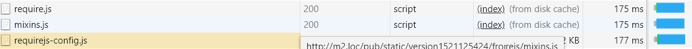

# Geavanceerde [!DNL JavaScript] bundeling

Bij bundeling van [!DNL JavaScript] -modules voor betere prestaties gaat het om het reduceren van twee dingen:

1. Het aantal serveraanvragen.
1. De grootte van die serververzoeken.

In een modulaire toepassing, kan het aantal serververzoeken in honderden bereiken. De volgende schermafbeelding toont bijvoorbeeld alleen het begin van de lijst met [!DNL JavaScript] -modules die op de startpagina van een schone installatie zijn geladen.


## Samenvoegen en bundelen

Uit het vak biedt [!DNL Commerce] twee manieren om het aantal serveraanvragen te verminderen: samenvoegen en bundelen. Deze instellingen zijn standaard uitgeschakeld. U kunt hen binnen Admin UI in **[!UICONTROL Stores]** > **Montages** > **[!UICONTROL Configuration]** > **[!UICONTROL Advanced]** > **[!UICONTROL Developer]** > **[!UICONTROL [!DNL JavaScript] Settings]**, of van de bevellijn aanzetten.


### Basisbundeling

Om ingebouwde bundeling van de bevellijn toe te laten:

```bash
php -f bin/magento config:set dev/js/enable_js_bundling 1
```

Dit is een native [!DNL Commerce] mechanisme dat alle elementen in het systeem combineert en deze onder bundels van hetzelfde formaat distribueert (bundle_0.js, bundle_1.js ... bundle_x.js):

![[!DNL Commerce] bundling &#x200B;](../assets/performance/images/magentoBundling.png)

Beter, maar browser laadt nog ALLE [!DNL JavaScript] bundels, niet alleen nodig.

[!DNL Commerce] het bundelen vermindert het aantal verbindingen per pagina, maar voor elke paginaverzoek laadt het alle bundels, zelfs wanneer de gevraagde pagina slechts van dossiers binnen één of twee van de bundels kan afhangen. De prestaties verbeteren nadat de bundels in de cache van de browser zijn geplaatst. Maar omdat de browser deze bundels synchroon laadt, kan het eerste bezoek van de gebruiker aan een [!DNL Commerce] winkel even duren om de gebruikerservaring te renderen en te beschadigen.

### Basissamenvoeging

Ingebouwde samenvoeging via de opdrachtregel inschakelen:

```bash
php -f bin/magento config:set dev/js/merge_files 1
```

Met deze opdracht voegt u alle synchrone [!DNL JavaScript] bestanden samen in één bestand. Het inschakelen van samenvoeging zonder dat bundeling wordt ingeschakeld, is niet nuttig omdat [!DNL Commerce] gebruik maakt van RequireJS. Als u bundeling niet inschakelt, voegt [!DNL Commerce] alleen RequireJS en de bijbehorende configuratie samen. Wanneer u zowel bundelen als samenvoegen inschakelt, maakt [!DNL Commerce] één [!DNL JavaScript] -bestand:


## Rendertijden in de praktijk

De vorige gebundelde en samengevoegde laadtijden zien er goed uit in een ontwikkelomgeving. Maar in de echte wereld kunnen veel dingen het renderen vertragen: langzame verbindingen, grote verbindingsdrempels, beperkte netwerken. Bovendien renderen mobiele apparaten niet zo snel als desktops.

Om uw storefront plaatsing voor de echte wereld te testen en voor te bereiden, adviseren wij u met het Chrome inheemse throttling profiel van &quot;Traag 3G.&quot; te testen Met Trage 3G weerspiegelen onze vorige gebundelde uitvoertijden nu de verbindingsrealiteiten van veel gebruikers:

 bundelt

Bij trage 3G-connectiviteit duurt het ongeveer 44 seconden om alle bundels te laden voor de startpagina van een schone [!DNL Commerce] -installatie.

Dit geldt ook voor het samenvoegen van de bundels in één bestand. Gebruikers konden nog steeds ongeveer 42 seconden wachten op het laden van de eerste pagina, zoals hier wordt getoond:


Met een geavanceerdere aanpak van [!DNL JavaScript] -bundeling kunnen we deze laadtijden verbeteren.

## Geavanceerde bundeling

Het doel van [!DNL JavaScript] -bundeling is het aantal en de grootte van aangevraagde elementen te verminderen voor elke pagina die in de browser wordt geladen. Hiervoor willen we onze bundels maken, zodat elke pagina in onze winkel alleen een gemeenschappelijke bundel en een paginaspecifieke bundel hoeft te downloaden voor elke pagina die wordt geopend.

U kunt dit bereiken door uw bundels op paginatypen te definiëren. U kunt de pagina&#39;s van [!DNL Commerce] indelen in verschillende paginatypen, zoals Categorie, Product, CMS, Klant, Winkel en Afhandeling. Elke pagina die in één van deze paginatypen wordt gecategoriseerd heeft een verschillende reeks module RequireJS gebiedsdelen. Wanneer u uw modules RequireJS door paginatype bundelt, zult u omhoog met slechts een handvol bundels beëindigen die de gebiedsdelen van om het even welke pagina in uw opslag behandelen.

U kunt bijvoorbeeld een bundel maken voor de afhankelijkheden die op alle pagina&#39;s van toepassing zijn, een bundel voor alleen CMS-pagina&#39;s, een bundel voor alleen Catalog-pagina&#39;s, een andere bundel voor alleen Search-pagina&#39;s en een bundel voor uitcheckpagina&#39;s.

U kunt ook pakketten maken op doeleinde: voor algemene functies, productgerelateerde functies, verzendfuncties, afrekenfuncties, belastingen en formuliervalidaties. Hoe u uw bundels bepaalt is aan u en de structuur van uw opslag. Sommige bundelingstrategieën werken mogelijk beter dan andere.

Met een schone [!DNL Commerce] -installatie kunnen voldoende goede prestaties worden bereikt door bundels te splitsen op paginatypen, maar voor sommige aanpassingen kan een diepgaande analyse en andere distributies van elementen nodig zijn.

### Vereiste gereedschappen

In de volgende stappen moet u de volgende programma&#39;s installeren en vertrouwd zijn met deze programma&#39;s:

- [&#x200B; nodejs &#x200B;](https://nodejs.org/en/download/)
- [&#x200B; r.js &#x200B;](http://requirejs.org/docs/optimization.html#download)
- [[!DNL PhantomJS] &#x200B;](https://phantomjs.org/) (optioneel)

### Voorbeeldcode

Volledige versies van de voorbeeldcode die in dit artikel worden gebruikt, zijn hier beschikbaar:

- [build.js](../assets/performance/code-samples/build.js)
- [deps.js](../assets/performance/code-samples/deps.js)
- [deps-map.sh](../assets/performance/code-samples/deps-map.sh.txt)

### Deel 1: Een bundelconfiguratie maken

#### 1\. Een bestand build.js toevoegen

Maak een `build.js` -bestand in de hoofdmap van [!DNL Commerce] . Dit dossier zal de volledige bouwstijlconfiguratie voor uw bundels bevatten.

```javascript
({
    optimize: 'none',
    inlineText: true
})
```

Later wijzigen we de instelling `optimize:` van_ `none` in `uglify2` om de uitvoer van de bundel te minimaliseren. Maar voor nu, tijdens de ontwikkeling, kunt u het plaatsen aan `none` verlaten om snellere bouwstijlen te verzekeren.

#### 2\. Vereiste JS-afhankelijkheden, vormen, paden en kaarten toevoegen

Voeg de volgende RequireJS knopen van de bouwstijlconfiguratie, `deps`, `shim`, `paths`, en `map`, aan uw bouwstijldossier toe:

```javascript
({
    optimize: 'none',
    inlineText: true,

    deps: [],
    shim: {},
    paths: {},
    map: { "*": {} },
})
```

#### 3 De eisen-config.js-instantiewaarden samenvoegen

In deze stap moet u alle meerdere `deps` -, `shim` -, `paths` - en `map` configuratieknooppunten uit het `requirejs-config.js` -bestand van uw winkel samenvoegen tot de corresponderende knooppunten in uw `build.js` -bestand. Hiertoe opent u het tabblad **[!UICONTROL Network]** in het deelvenster Gereedschappen voor ontwikkelaars van uw browser en navigeert u naar elke pagina in uw winkel, zoals de startpagina. Op het tabblad Netwerk ziet u de instantie van het `requirejs-config.js` -bestand van uw winkel bovenaan, die hier wordt gemarkeerd:



In dit bestand vindt u meerdere items voor elk van de configuratieknooppunten (`deps` , `shim` , `paths` , `map` ). U moet deze veelvoudige knoopwaarden in de enige configuratieknooppunt van uw build.js- dossier samenvoegen. Als de `requirejs-config.js` -instantie van uw winkel bijvoorbeeld items bevat voor 15 aparte `map` knooppunten, moet u de items voor alle 15 knooppunten samenvoegen tot één `map` -knooppunt in uw `build.js` -bestand. Hetzelfde geldt voor de knooppunten `deps` , `shim` en `paths` . Zonder een script om dit proces te automatiseren kan het enige tijd duren.

U moet het pad `mage/requirejs/text` als volgt wijzigen in `requirejs/text` in `paths` -configuratienode:

```javascript
({
    //...
    paths: {
        //...
        "text": "requirejs/text"
    },
})
```

#### 4\. Een moduleknooppunt toevoegen

Aan het eind van het `build.js` dossier, voeg de modules [] serie als placeholder voor de bundels toe u voor uw storefront later zult bepalen.

```javascript
({
    optimize: 'none',
    inlineText: true,

    deps: [],
    shim: {},
    paths: {},
    map: { "*": {} },

    modules: [],
})
```

#### 5 RequireJS-afhankelijkheden ophalen

U kunt alle [!DNL RequireJS] module gebiedsdelen van de de paginatypen van uw opslag terugwinnen door te gebruiken:

1. [!DNL PhantomJS] via de opdrachtregel (ervan uitgaande dat u [!DNL PhantomJS] hebt geïnstalleerd).
1. Vereisen JS bevel in de console van uw browser.

#### Als u [!DNL PhantomJS] wilt gebruiken:

Maak in de hoofdmap van [!DNL Commerce] een nieuw bestand met de naam `deps.js` en kopieer het bestand in de onderstaande code. Deze code gebruikt [!DNL [!DNL PhantomJS]] om een pagina te openen en te wachten totdat de browser alle pagina-elementen laadt. Vervolgens worden alle [!DNL RequireJS] -afhankelijkheden voor een bepaalde pagina uitgevoerd.

```javascript
"use strict";
var page = require('webpage').create(),
    system = require('system'),
    address;

if (system.args.length === 1) {
    console.log('Usage: $phantomjs deps.js url');
    phantom.exit(1);
} else {
    address = system.args[1];
    page.open(address, function (status) {
        if (status !== 'success') {
            console.log('FAIL to load the address');
        } else {
            setTimeout(function () {
                console.log(page.evaluate(function () {
                    return Object.keys(window.require.s.contexts._.defined);
                }));
                phantom.exit();
            }, 5000);
        }
    });
}
```

Open een terminal in de hoofdmap van [!DNL Commerce] en voer het script uit op elke pagina in uw winkel die een specifiek paginatype vertegenwoordigt:

<pre>
phantomjs deps.js <i> url-aan-specifiek-pagina </i> &gt; <i> tekst-dossier-vertegenwoordigen-pagina-gebiedsdelen </i>
</pre>

Hier ziet u bijvoorbeeld vier pagina&#39;s uit de voorbeeldwinkel met het thema Luma die de vier paginatypen vertegenwoordigen die we gebruiken om onze vier pakketten te maken (homepage, categorie, product, winkelwagen):

```
phantomjs deps.js http://m2.loc/ > bundle/homepage.txt
phantomjs deps.js http://m2.loc/women/tops-women/jackets-women.html > bundle/category.txt
phantomjs deps.js http://m2.loc/beaumont-summit-kit.html > bundle/product.txt
phantomjs deps.js http://m2.loc/checkout/cart/?SID=m2tjdt7ipvep9g0h8pmsgie975 > bundle/cart.txt (prepare a shopping cart)
..............
```

#### De browserconsole gebruiken:

Als u [!DNL PhantomJS] niet wilt gebruiken, kunt u het volgende bevel van de console van uw browser in werking stellen terwijl het bekijken van elk paginatype in uw winkel:

```shell
Object.keys(window.require.s.contexts._.defined)
```

Met deze opdracht (gebruikt in het script [!DNL PhantomJS] ) wordt dezelfde lijst met [!DNL RequireJS] -afhankelijkheden gemaakt en weergegeven binnen de browserconsole. Het nadeel van deze benadering is dat u uw eigen bundel-/paginatype tekstbestanden moet maken.

#### 6 De uitvoer opmaken en filteren

Nadat u de [!DNL RequireJS] gebiedsdelen in paginatype tekstdossiers samenvoegt, kunt u het volgende bevel op elk pagina-type gebiedsdeeldossier gebruiken om de komma&#39;s in uw dossiers met nieuwe lijnen te vervangen:

```bash
sed -i -e $'s/,/\\\n/g' bundle/category.txt
sed -i -e $'s/,/\\\n/g' bundle/homepage.txt
sed -i -e $'s/,/\\\n/g' bundle/product.txt
....
```

U zou ook alle menins voor elk dossier moeten verwijderen omdat de dubbele gebiedsdelen mengt. Gebruik het volgende bevel op elk gebiedsdeeldossier:

```bash
sed -i -e 's/mixins\!.*$//g' bundle/homepage.txt
sed -i -e 's/mixins\!.*$//g' bundle/category.txt
sed -i -e 's/mixins\!.*$//g' bundle/product.txt
...
```

#### 7\ Unieke en algemene bundels identificeren

Het doel is om een gemeenschappelijke bundel [!DNL JavaScript] dossiers tot stand te brengen nodig door alle pagina&#39;s. Op die manier hoeft de browser alleen de algemene bundel te laden samen met een of meer specifieke paginatypen.

Open een terminal in de hoofdmap van [!DNL Commerce] en gebruik de volgende opdracht om te controleren of u afhankelijkheden hebt die u in afzonderlijke bundels kunt splitsen:

```bash
sort bundle/*.txt |uniq -c |sort -n
```

Met deze opdracht voegt u de afhankelijkheden die in de `bundle/*.txt` -bestanden zijn gevonden samen en sorteert u deze.  De output toont ook het aantal dossiers die elk gebiedsdeel bevatten:

```
1 buildTools,
1 jquery/jquery.parsequery,
1 jsbuild,
2 jquery/jquery.metadata,
2 jquery/validate,
2 mage/bootstrap,
3 jquery
3 jquery/ui
3 knockoutjs/knockout
...
```

Deze uitvoer toont aan dat `buildTools` afhankelijk is van een bundel/*.txt-bestand. De `jquery/jquery.metadata` -afhankelijkheid is in twee (2) bestanden en `es6-collections` is in drie (3) bestanden.

Onze uitvoer toont slechts drie paginatypen (homepage, categorie en product), wat ons het volgende vertelt:

- Drie gebiedsdelen zijn uniek aan slechts één paginatype (aangetoond door aantal 1).
- Drie meer gebiedsdelen komen op twee paginatypen voor (die door aantal 2 worden getoond).
- De laatste drie gebiedsdelen zijn gemeenschappelijk voor alle drie van onze paginatypen (die door aantal 3 worden getoond).

Dit vertelt ons dat wij de pagina-ladingssnelheden van onze opslag waarschijnlijk kunnen verbeteren door onze gebiedsdelen in verschillende bundel te verdelen, zodra wij weten welke paginatypes vereisen welke gebiedsdelen.

#### &#x200B;8. Een bestand voor afhankelijkheidsverdeling maken

Als u wilt weten welke paginatypen welke afhankelijkheden nodig hebben, maakt u een nieuw bestand in de hoofdmap van [!DNL Commerce] met de naam `deps-map.sh` en kopieert u dit bestand in de onderstaande code:

```shell
awk 'END {
 for (R in rec) {
   n = split(rec[R], t, "/")
   if (n > 1)
     dup[n] = dup[n] ? dup[n] RS sprintf("\t%-20s -->\t%s", rec[R], R) : \
       sprintf("\t%-20s -->\t%s", rec[R], R)
   }
 for (D in dup) {
   printf "records found in %d files:\n\n", D
   printf "%s\n\n", dup[D]
   }
 }
{
 rec[$0] = rec[$0] ? rec[$0] "/" FILENAME : FILENAME
}' bundle/*.txt
```

U kunt het manuscript in [&#x200B; https://www.unix.com/shell-programming-and-scripting/140390-get-common-lines-multiple-files.html &#x200B;](https://www.unix.com/shell-programming-and-scripting/140390-get-common-lines-multiple-files.html) ook vinden

Open een terminal in de hoofdmap van [!DNL Commerce] en voer het bestand uit:

```bash
bash deps-map.sh
```

De uitvoer van dit script, dat wordt toegepast op onze drie voorbeeldpaginatypen, moet er ongeveer als volgt uitzien (maar veel langer):

```
bundle/product.txt   -->   buildTools,
bundle/category.txt  -->   jquery/jquery.parsequery,
bundle/product.txt   -->   jsbuild,

bundle/category.txt/bundle/homepage.txt -->    jquery/jquery.metadata,
bundle/category.txt/bundle/homepage.txt -->    jquery/validate,
bundle/category.txt/bundle/homepage.txt -->    mage/bootstrap,

bundle/category.txt/bundle/homepage.txt/bundle/product.txt --> jquery,
bundle/category.txt/bundle/homepage.txt/bundle/product.txt --> jquery/ui,
bundle/category.txt/bundle/homepage.txt/bundle/product.txt --> knockoutjs/knockout,
```

Dit is genoeg informatie om een bundelconfiguratie te bouwen.

#### &#x200B;9. Maak pakketten in het bestand build.js

Open het configuratiebestand van `build.js` en voeg uw bundels toe aan het knooppunt `modules` . Elke bundel moet de volgende eigenschappen definiëren:

- `name`— de naam van de bundel. Met de naam `bundles/cart` wordt bijvoorbeeld een `cart.js` bundel in een submap `bundles` gegenereerd.

- `create`— een Booleaanse markering om de bundel te maken (waarden: `true` of `false`).

- `include`— een array met elementen (tekenreeksen) die zijn opgenomen als afhankelijkheden voor de pagina. RequireJS traceert alle gebiedsdelen en omvat hen in de bundel tenzij uitgesloten.

- `exclude`— een array van bundels of elementen die van de bundel moeten worden uitgesloten.

```javascript
{
    name: 'bundles/catalog',
    create: true,
    include: [
        'addToWishlist',
        'priceBundle',
        'priceUtils',
        'priceOptions',
        'sticky',
        'productSummary',
        'slide'
    ],
    exclude: [
        'requirejs/require',
        'bundles/default',
        'mage/bootstrap'
    ],
}
```

In dit voorbeeld worden elementen `mage/bootstrap` en `requirejs/require` opnieuw gebruikt, waarbij een hogere prioriteit wordt ingesteld op de belangrijkste componenten en componenten die synchroon moeten worden geladen. De aanwezige bundels zijn:

- `requirejs/require` - de enige synchroon geladen bundel
- `mage/bootstrap` - de laarzentrekkerbundel met UI-componenten
- `bundles/default`—standaardbundel vereist voor alle pagina&#39;s
- `bundles/cart` - een bundel die is vereist voor de basispagina
- `bundles/shipping` - gebruikelijke bundel voor winkelwagentje en afhandelingspagina (ervan uitgaande dat uitchecken nooit rechtstreeks wordt geopend, wordt de afhandelingspagina nog sneller geladen als de winkelpagina eerder is geopend en de verzendbundel al is geladen)
- `bundles/checkout` - alles voor uitchecken
- `bundles/catalog` - alles voor product- en categoriepagina&#39;s

### Deel 2: Bundels genereren

De onderstaande stappen beschrijven het basisproces voor het genereren van efficiëntere [!DNL Commerce] -bundels. U kunt dit proces op elke gewenste manier automatiseren, maar u moet toch `nodejs` en `r.js` gebruiken om daadwerkelijk uw bundels te genereren. En als uw thema&#39;s zijn aangepast aan [!DNL JavaScript] en hetzelfde `build.js` -bestand niet opnieuw kunnen gebruiken, moet u mogelijk verschillende `build.js` configuraties per thema maken.

#### &#x200B;1. Genereer statische winkelsites

Voordat u bundels genereert, voert u de statische implementatieopdracht uit:

```bash
php -f bin/magento setup:static-content:deploy -f -a frontend
```

Dit bevel produceert statische opslagplaatsingen voor elk thema en elke scène u opstelling hebt. Als u bijvoorbeeld het thema Luma en een aangepast thema met landinstellingen in het Engels en Frans gebruikt, genereert u vier statische implementaties:

- ...luma/nl_NL
- ...luma/fr_FR
- ...custom/nl_NL
- ...custom/fr_FR

Herhaal de onderstaande stappen voor elk winkelthema en elke landinstelling om bundels voor alle winkelthema&#39;s en -landinstellingen te genereren.

#### &#x200B;2. Verplaats de statische opslaginhoud naar een tijdelijke map

Eerst, moet u de statische inhoud van de doelfolder naar één of andere tijdelijke folder verplaatsen omdat RequireJS alle inhoud binnen de doelfolder vervangt.

```bash
mv pub/static/frontend/Magento/{theme}/{locale} pub/static/frontend/Magento/{theme}/{locale}_tmp
```

Bijvoorbeeld:

```bash
mv pub/static/frontend/Magento/luma/en_US pub/static/frontend/Magento/luma/en_US_tmp
```

#### &#x200B;3. Voer de optimalisatiefunctie voor r.js uit

Voer vervolgens de optimalisator voor r.js uit op het `build.js` -bestand vanuit de hoofdmap van [!DNL Commerce] . Paden naar alle mappen en bestanden zijn relatief ten opzichte van de werkmap.

```bash
r.js -o build.js baseUrl=pub/static/frontend/Magento/luma/en_US_tmp dir=pub/static/frontend/Magento/luma/en_US
```

Deze opdracht genereert bundels in een submap `bundles` van de doelmap, wat in dit geval resulteert in `pub/static/frontend/Magento/luma/en_US/bundles` .

De inhoud van de nieuwe bundelmap weergeven kan er als volgt uitzien:

```bash
ll pub/static/frontend/Magento/luma/en_US/bundles
```

```
total 1900
drwxr-xr-x  2 root root    4096 Mar 28 11:24 ./
drwxr-xr-x 70 root root    4096 Mar 28 11:24 ../
-rw-r--r--  1 root root  116417 Mar 28 11:24 cart.js
-rw-r--r--  1 root root  187090 Mar 28 11:24 catalog.js
-rw-r--r--  1 root root  307619 Mar 28 11:24 checkout.js
-rw-r--r--  1 root root 1240608 Mar 28 11:24 default.js
-rw-r--r--  1 root root   74233 Mar 28 11:24 shipping.js
```

#### &#x200B;4. Configureer RequireJS om bundels te gebruiken

Om RequireJS te krijgen om uw bundels te gebruiken, voeg een `onModuleBundleComplete` callback na de `modules` knoop in het `build.js` dossier toe:

```javascript
[
    {
       //...
       exclude: [
           'requirejs/require',
           'bundles/default',
           'bundles/checkout',
           'bundles/cart',
           'bundles/shipping',
           'mage/bootstrap'
       ],
   },
],
bundlesConfigOutFile: `${config.dir}/requirejs-config.js`,
onModuleBundleComplete: function(data) {
    if (this.bundleConfigAppended) {
        return;
    }
    this.bundleConfigAppended = true;

    // bundlesConfigOutFile requires a simple require.config call in order to modify the configuration
    const bundleConfigPlaceholder = `
(function (require) {
require.config({});
})(require);
    `;

    fs.appendFileSync(this.bundlesConfigOutFile, bundleConfigPlaceholder);
}
```

#### &#x200B;5. Voer de opdracht opnieuw uit

Voer de volgende opdracht uit om te implementeren:

```bash
r.js -o app/design/frontend/Magento/luma/build.js baseUrl=pub/static/frontend/Magento/luma/en_US_tmp dir=pub/static/frontend/Magento/luma/en_US
```

Open `requirejs-config.js` in de `pub/static/frontend/Magento/luma/en_US` folder om te verifiëren dat RequireJS het dossier met bundelconfiguratievraag toevoegde:

```javascript
require.config({
    bundles: {
        "bundles/default": ["mage/template", "mage/apply/scripts", "mage/apply/main", "mage/mage", "mage/translate", "mage/loader"],
        "bundles/cart": ["Magento_Ui/js/lib/validation/utils", "Magento_Ui/js/lib/validation/rules", "Magento_Ui/js/lib/validation/validation"]
    }
}
```

>[!NOTE]
>
>Wanneer het vormen van bundels, zorg ervoor u `requirejs.config()` vraag in de orde plaatst u hen uitgevoerd wilt, aangezien de vraag in de orde wordt uitgevoerd zij verschijnen.

#### &#x200B;6. Test de resultaten

Nadat de pagina is geladen, ziet u dat de browser verschillende afhankelijkheden en bundels laadt. Hier volgen bijvoorbeeld de resultaten voor het profiel &#39;Langzaam 3G&#39;:


De laadtijd van de pagina voor een lege startpagina is nu twee keer zo snel als het gebruik van native [!DNL Commerce] -pakketten. Maar we kunnen nog beter.

#### &#x200B;7. De bundels optimaliseren

Zelfs als deze worden gecomprimeerd, zijn de [!DNL JavaScript] -bestanden nog steeds groot. U kunt ze miniateren met RequireJS, dat versterker gebruikt om [!DNL JavaScript] tot een goed resultaat te beperken.

Als u de optimalisator in uw `build.js` -bestand wilt inschakelen, voegt u `uglify2` toe als waarde voor de eigenschap optimize boven aan het `build.js` -bestand:

```javascript
({
    optimize: 'uglify2',
    inlineText: true
})
```

De resultaten kunnen significant zijn:


De laadtijden zijn nu drie keer sneller dan bij native [!DNL Commerce] -bundeling.
