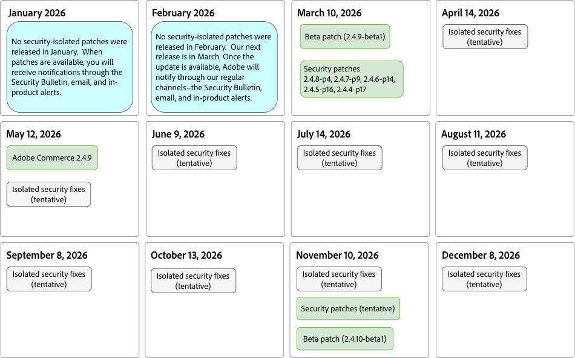

# Patchrelease-schema

Adobe streeft voortdurend naar het juiste evenwicht tussen het maken van productverbeteringen eenvoudig en voorspelbaar terwijl het leveren van verbeteringen aan vroege adopters sneller (zie [ versioning beleid ](versioning-policy.md)).

Het doel van dit programma is data te verstrekken voor wanneer Adobe van plan is de versie van [ flarden ](versioning-policy.md#patch-release) voor elke gesteunde versielijn van de kernAdobe Commerce PHP toepassing aan te kondigen. De versies van de flard zijn kansen om de kern codebase te bevorderen om uw platform veilig, betrouwbaar, en prestatieshoog te houden.

>[!NOTE]
>
>Om meer over nieuwe eigenschappen, wolkeninfrastructuur, en uitbreidingsversies te leren, zie de [ de versiedocumentatie van de Diensten van Adobe Commerce ](https://experienceleague.adobe.com/en/docs/commerce/user-guides/release-information/release-notes-all).

Naast de geplande kwaliteit, veiligheid, en bètaflarden die op deze pagina worden vermeld, verleent Adobe toegang tot [ individuele flarden ](versioning-policy.md#individual-patch) door het [ Hulpmiddel van de Patches van de Kwaliteit ](../tools/quality-patches-tool/usage.md). Met dit gereedschap kunt u algemene informatie over alle afzonderlijke patches die beschikbaar zijn voor de geïnstalleerde versie van Adobe Commerce, toepassen, herstellen en weergeven.

Adobe Commerce-patchreleases worden uitgebracht op basis van de volgende richtlijnen:

- **Geïsoleerd dossier van het veiligheidspatch** - Individuele, niet-cumulatieve [ dossiers van het veiligheidspatch ](versioning-policy.md#isolated-security-patch-file) worden vrijgegeven onafhankelijk om snellere sanering toe te laten en in het volgende volledige veiligheidspatch opgenomen. Om een geïsoleerd dossier van het veiligheidspatch toe te passen, moeten de klanten op de recentste veiligheid-enige flardversie (de recentste - p versie) voor hun gesteunde versielijn zijn, aangezien de geïsoleerde veiligheidsmoeilijke situaties exclusief tegen die versie worden getest.

- **de flarden van de Veiligheid** - bij minimium, [ veiligheidspatches ](versioning-policy.md#security-patch-release) worden vrijgegeven jaarlijks voor alle [ gesteunde ](lifecycle-policy.md) versielijnen. Deze patches omvatten alle eerder vrijgegeven beveiligings-, compatibiliteits- en kwaliteitshotfixes.  Adobe kan indien nodig extra beveiligingspatches vrijgeven, maar dit is niet gegarandeerd.

- **Reparatie** - een volledig [ flard ](versioning-policy.md#patch-release) voor Adobe Commerce 2.4.x LTS versielijn (3 jaar steunperiode) wordt jaarlijks vrijgegeven (Mei).

- **- Één** alpha- flardflard van 0} Alpha [ voor Adobe Commerce 2.4.x LTS wordt de versielijn jaarlijks vrijgegeven.](versioning-policy.md#alpha-patch-release)

- **de flarden van Beta** - Één [ bètaflarden ](versioning-policy.md#beta-patch-release) voor Adobe Commerce 2.4.x LTS de versielijn wordt jaarlijks vrijgegeven.

Zie de volgende afbeelding voor meer informatie:

<!-- The SVG source for the following image is located here: /help/assets/release/release-calendar.drawio.svg -->

## Waarschuwingskanalen vrijgeven

Adobe brengt klanten via de volgende kanalen op de hoogte van nieuwe patchreleases:

- [ Bulletins en Advisories van de Veiligheid van Adobe ](https://helpx.adobe.com/security/security-bulletin.html#magento)
- E-mail
- Waarschuwingen in producten

>[!NOTE]
>
> Voor versiedata voor elke minder belangrijke, flard, en veiligheidsversie en data voor het eind van regelmatige steun, zie [ Vrijgegeven versies ](https://experienceleague.adobe.com/en/docs/commerce-operations/release/versions).
