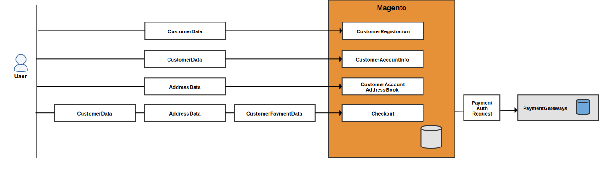

# Referentie persoonlijke gegevens van klant (versie 1.x)

>[!NOTE]
>
>Dit is een van de onderwerpen die Adobe Commerce-handelaren en -ontwikkelaars helpen zich voor te bereiden op naleving van privacyregels. Raadpleeg uw juridisch adviseur om te bepalen of en hoe uw bedrijf aan om het even welke wettelijke verplichtingen moet voldoen.

Gebruik de volgende dataflow diagrammen en de afbeeldingen van de gegevensbestandentiteit ter referentie wanneer het ontwikkelen van nalevingsprogramma&#39;s voor privacyverordeningen zoals:

- [GDPR](gdpr.md)
- [CCPA](ccpa.md)

## Dataflow-diagrammen

In de dataflow-diagrammen worden de typen gegevens weergegeven die klanten en beheerders kunnen invoeren en ophalen in de winkel en in Admin.

### Punten voor gegevensinvoer vóór

Een gebruiker kan klant-, adres- en betalingsgegevens invoeren bij het registreren voor een account, tijdens het afrekenen en vergelijkbare gebeurtenissen.

### Punten voor gegevenstoegang vóór

Commerce laadt klantgegevens wanneer de klant zich aanmeldt en bekijkt verschillende pagina&#39;s of checkt deze uit.

### Punten voor achtergrondgegevensinvoer

Een handelaar kan klant, adres, en betalingsinformatie van Admin ingaan om een klant of orde tot stand te brengen.

### Gegevenstoegangspunten op de achtergrond

Commerce laadt klanteninformatie wanneer een handelaar verscheidene types van netten bekijkt, op een net klikt om gedetailleerde informatie te zien, en diverse andere taken uitvoert.

## Database-entiteiten

Magento 1 slaat klanteninformatie in klant, verkoop, en andere gegevensbestandlijsten op.

### Klantgegevens

Magento 1 slaat klanteninformatie in `customer_entity` en `customer_address_entity` tabellen. Beide lijsten hebben verscheidene verwijzingstabellen die de attributen van de douaneklanten kunnen bevatten.

#### `customer_entity` en referentietabellen

De volgende kolommen in de `customer_entity`tabel bevat klantgegevens:

| Kolom | Gegevenstype |
| --- | --- |
| `email` | varchar(255) |

Deze tabellen verwijzen naar `customer_entity` en kan aangepaste klantkenmerken bevatten:

| Tabel | Kolom | Gegevenstype |
| --- | --- | --- |
| `customer_entity_datetime` | `value` | datetime |
| `customer_entity_decimal` | `value` | decimaal (12,4) |
| `customer_entity_int` | `value` | int(11) |
| `customer_entity_text` | `value` | text |
| `customer_entity_varchar` | `value` | varchar(255) |

#### `customer_address_entity` en referentietabellen

De volgende tabelverwijzingen `customer_address_entity` en kan aangepaste klantkenmerken bevatten:

| Tabel | Kolom | Gegevenstype |
| --- | --- | --- |
| `customer_address_entity_datetime` | `value` | datetime |
| `customer_address_entity_decimal` | `value` | decimaal (12,4) |
| `customer_address_entity_int` | `value` | int(11) |
| `customer_address_entity_text` | `value` | text |
| `customer_address_entity_varchar` | `value` | varchar(255) |

### Ordergegevens

De `sales_flat_order` en verwante tabellen bevatten de naam, het factuuradres en het verzendadres van de klant, alsmede gerelateerde informatie.

#### `sales_flat_order` table

De volgende kolommen in de `sales_order` tabel bevat klantgegevens:

| Kolom | Gegevenstype |
| --- | --- |
| `customer_id` | int(10) |
| `customer_email` | varchar(128) |
| `customer_firstname` | varchar(128) |
| `customer_gender` | int(11) |
| `customer_lastname` | varchar(128) |
| `customer_middlename` | varchar(128) |
| `customer_prefix` | varchar(32) |
| `customer_suffix` | varchar(32) |
| `customer_taxvat` | varchar(32) |
| `remote_ip` | varchar(32) |

#### `sales_flat_order_address` table

De `sales_flat_order_address` de tabel bevat het adres van de klant.

| Kolom | Gegevenstype |
| --- | --- |
| `customer_id` | int(10) |
| `fax` | varchar(255) |
| `region` | varchar(255) |
| `postcode` | varchar(255) |
| `lastname` | varchar(255) |
| `street` | varchar(255) |
| `city` | varchar(255) |
| `email` | varchar(255) |
| `telephone` | varchar(255) |
| `firstname` | varchar(255) |
| `prefix` | varchar(255) |
| `suffix` | varchar(255) |
| `middlename` | varchar(255) |
| `company` | varchar(255) |
| `vat_id` | text |

#### `sales_flat_order_grid` table

De volgende kolommen in de `sales_flat_order_grid` tabel bevat klantgegevens:

| Kolom | Gegevenstype |
| --- | --- |
| `customer_id` | int(10) |
| `shipping_name` | varchar(255) |
| `billing_name` | varchar(255) |

#### `sales_flat_order_payment` table

De volgende kolommen in de `sales_flat_order_payment` tabel bevat klantgegevens:

| Kolom | Gegevenstype |
| --- | --- |
| `cc_exp_month` | varchar(255) |
| `cc_ss_start_year` | varchar(255) |
| `echeck_bank_name` | varchar(128) |
| `echeck_type` | varchar(255) |
| `cc_ss_start_month` | varchar(255) |
| `cc_owner` | varchar(255) |
| `cc_exp_year` | varchar(255) |
| `echeck_routing_number` | varchar(255) |
| `echeck_account_name` | varchar(255) |

### Offertegegevens

Aanhalingstekens bevatten de naam, het e-mailadres, het adres en verwante gegevens van een klant.

#### `sales_flat_quote` table

De volgende kolommen in de `sales_flat_quote` tabel bevat klantgegevens:

| Kolom | Gegevenstype |
| --- | --- |
| `customer_id` | int(10) |
| `customer_tax_class_id` | int(10) |
| `customer_group_id` | int(10) |
| `customer_email` | varchar(255) |
| `customer_prefix` | varchar(40) |
| `customer_firstname` | varchar(255) |
| `customer_middlename` | varchar(40) |
| `customer_lastname` | varchar(255) |
| `customer_suffix` | varchar(40) |
| `customer_dob` | datetime |
| `customer_note` | varchar(255) |
| `remote_ip` | varchar(255) |
| `customer_gender` | varchar(255) |

#### `sales_flat_quote_address` table

De volgende kolommen in de `sales_flat_quote_address` tabel bevat klantgegevens:

| Kolom | Gegevenstype |
| --- | --- |
| `email` | varchar(255) |
| `prefix` | varchar(40) |
| `firstname` | varchar(255) |
| `middlename` | varchar(40) |
| `lastname` | varchar(255) |
| `suffix` | varchar(40) |
| `company` | varchar(255) |
| `street` | varchar(255) |
| `city` | varchar(255) |
| `region` | varchar(255) |
| `postcode` | varchar(255) |
| `fax` | varchar(255) |

#### `sales_flat_quote_payment` table

De `sales_flat_quote_payment` de tabel bevat creditcardgegevens en andere transactiegegevens.

| Kolom | Gegevenstype |
| --- | --- |
| `cc_last_4` | varchar(255) |
| `cc_owner` | varchar(255) |
| `cc_exp_month` | small(5) |
| `cc_exp_year` | small(5) |
| `cc_ss_owner` | varchar(255) |
| `cc_ss_start_month` | small(5) |
| `cc_ss_start_year` | small(5) |

### Gegevens archiveren

De volgende tabellen en kolommen bevatten klantgegevens:

| Tabel | Kolom | Gegevenstype |
| --- | --- | --- |
| `enterprise_sales_creditmemo_grid_archive` | `billing_name` | varchar(255) |
| `enterprise_sales_invoice_grid_archive` | `billing_name` | varchar(255) |
| `enterprise_sales_order_grid_archive` | `billing_name` | varchar(255) |
| `enterprise_sales_order_grid_archive` | `customer_id` | int(10) |
| `enterprise_sales_order_grid_archive` | `shipping_name` | varchar(255) |
| `enterprise_sales_shipment_grid_archive` | `shipping_name` | varchar(255) |

### Verkoopgegevens

De volgende tabellen en kolommen bevatten klantgegevens:

| Tabel | Kolom | Gegevenstype |
| --- | --- | --- |
| `sales_flat_creditmemo_grid` | `billing_name` | varchar(255) |
| `sales_flat_invoice_grid` | `billing_name` | varchar(255) |

### RMA-gegevens

De volgende RMA-tabellen en -kolommen bevatten klantgegevens:

| Tabel | Kolom | Gegevenstype |
| --- | --- | --- |
| `enterprise_rma` | `customer_custom_email` | varchar(255) |
| `enterprise_rma_grid` | `customer_id` | int(10) |
| `enterprise_rma_grid` | `customer_name` | varchar(255) |

### Diverse gegevens

De volgende tabellen en kolommen bevatten klantgegevens:

| Tabel | Kolom | Gegevenstype |
| --- | --- | --- |
| `core_email_queue_recipients` | `recipient_email` | varchar(128) |
| `core_email_queue_recipients` | `recipient_name` | varchar(255) |
| `customer_flowpassword` | `email` | varchar(255) |
| `customer_flowpassword` | `ip` | varchar(50) |
| `enterprise_giftregistry_person` | `email` | varchar(150) |
| `enterprise_giftregistry_person` | `firstname` | varchar(100) |
| `enterprise_giftregistry_person` | `lastname` | varchar(100) |
| `enterprise_giftregistry_person` | `middlename` | text |
| `enterprise_invitation` | `customer_id` | int(10) |
| `enterprise_invitation` | `email` | varchar(255) |
| `enterprise_invitation` | `referral_id` | int(10) |
| `enterprise_reminder_rule_coupon` | `customer_id` | int(10) |
| `enterprise_reminder_rule_coupon` | `emails_failed` | small(5) |
| `enterprise_scheduled_operations` | `email_receiver` | varchar(150) |
| `enterprise_scheduled_operations` | `email_sender` | varchar(150) |
| `gift_message` | `customer_id` | int(10) |
| `gift_message` | `recipient` | varchar(255) |
| `gift_message` | `sender` | varchar(255) |
| `newsletter_subscriber` | `customer_id` | int(10) |
| `newsletter_subscriber` | `subscriber_email` | varchar(150) |
| `persistent_session` | `customer_id` | int(10) |
| `persistent_session` | `info` | text |
| `poll_vote` | `customer_id` | int(10) |
| `poll_vote` | `ip_address` | varbinary(16) |
| `rating_option_vote` | `customer_id` | int(10) |
| `rating_option_vote` | `remote_ip` | varchar(50) |
| `rating_option_vote` | `remote_ip_long` | varbinary(516) |
| `send_friend_log` | `ip` | varbinary(16) |

Andere tabellen die verwijzen naar de klant:

- `catalog_compare_item`
- `downloadable_link_purchased`
- `enterprise_customerbalance`
- `enterprise_customersegment_customer`
- `enterprise_giftregistry_entity`
- `enterprise_reminder_rule_log`
- `enterprise_reward`
- `log_customer`
- `log_visitor_online`
- `oauth_token`
- `product_alert_price`
- `product_alert_stock`
- `report_compared_product_index`
- `report_viewed_product_index`
- `review_detail`
- `sales_billing_agreement`
- `sales_flat_shipment`
- `sales_recurring_profile`
- `salesrule_coupon_usage`
- `salesrule_customer`
- `tag`
- `tag_relation`
- `wishlist`
