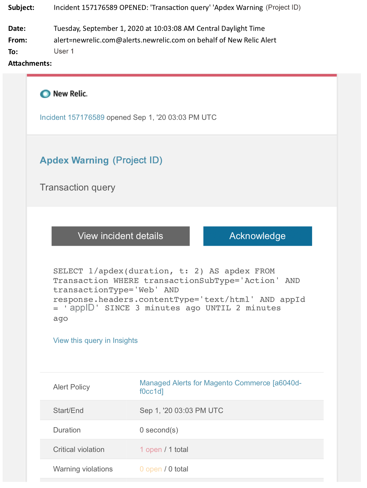

# Beheerde waarschuwingen voor Adobe Commerce: [!DNL Apdex] waarschuwingswaarschuwing

Dit artikel bevat stappen voor het oplossen van problemen wanneer u een [!DNL Apdex] waarschuwingsbericht voor Adobe Commerce ontvangt in [!DNL New Relic] . De [!DNL Apdex] score meet de tevredenheid van gebruikers over de responstijd van webtoepassingen en -services. Er moet onmiddellijk actie worden ondernomen om dit probleem op te lossen. De waarschuwing ziet er ongeveer als volgt uit, afhankelijk van het waarschuwingsberichtkanaal dat u hebt geselecteerd.

{width="500"}

## Betrokken producten en versies

* Adobe Commerce on cloud Infrastructure Pro-planarchitectuur
* Adobe Commerce on cloud Infrastructure Starter-planarchitectuur

## Probleem

U zult een beheerde alarm in [!DNL New Relic] ontvangen als u tot [ Beheerde alarm voor Adobe Commerce ](managed-alerts-for-magento-commerce.md) hebt ondertekend en één of meerdere waakzame drempels zijn overschreden. Deze waarschuwingen zijn door Adobe ontwikkeld om handelaren een standaardset te bieden met inzichten van support en engineering.

<u> **doe!** </u>

* Abort om het even welke plaatsing die tot dit alarm wordt gepland wordt ontruimd.
* Zet uw site onmiddellijk in de onderhoudsmodus als uw site helemaal niet reageert of niet meer reageert. Voor stappen, verwijs naar [ toelaten of onbruikbaar maken onderhoudswijze ](https://experienceleague.adobe.com/en/docs/commerce-operations/installation-guide/tutorials/maintenance-mode) in de Gids van de Installatie van Commerce. Zorg ervoor om uw IP aan de Vrijgestelde IP adreslijst toe te voegen om ervoor te zorgen dat u nog tot uw plaats voor het oplossen van problemen kunt toegang hebben. Voor stappen, verwijs naar [ handhaaf de lijst van vrijgestelde IP adressen ](https://experienceleague.adobe.com/en/docs/commerce-operations/installation-guide/tutorials/maintenance-mode#maintain-the-list-of-exempt-ip-addresses) in de Gids van de Installatie van Commerce.

<u>**niet!**</u>

* Start aanvullende marketingcampagnes die extra pagina&#39;s naar uw site kunnen brengen.
* Voer indexeerders of extra kranen uit die extra druk op CPU of schijf kunnen veroorzaken.
* Voer belangrijke administratieve taken uit (bijvoorbeeld Commerce Admin, gegevensimport/export).
* Wis uw cache.

## Oplossing

Volg deze stappen om de oorzaak te identificeren en problemen op te lossen.

1. Om de bron van het probleem te identificeren, gebruik [[!DNL New Relic APM's]  pagina van de Transactie ](https://docs.newrelic.com/docs/apm/applications-menu/monitoring/transactions-page-find-specific-performance-problems) om transacties met prestatieskwesties te identificeren:
   * Transacties oplopend sorteren [!DNL Apdex scores] . [[!DNL Apdex] ](https://docs.newrelic.com/docs/apm/new-relic-apm/apdex/apdex-measure-user-satisfaction) verwijst naar gebruikerstevredenheid aan de reactietijd van uw Webtoepassingen en de diensten. A [ laag  [!DNL Apdex]  score ](managed-alerts-for-magento-commerce-apdex-warning-alert.md) kan op een knelpunt (een transactie met een hogere reactietijd) wijzen. Meestal is dit de database, [!DNL Redis] of PHP. Voor stappen, verwijs naar [[!DNL New Relic]  transacties van de Mening met hoogste  [!DNL Apdex]  ontevredenheid ](https://docs.newrelic.com/docs/apm/new-relic-apm/apdex/view-your-apdex-score#apdex-dissat).
   * De transacties van de soort door hoogste productie, de langzaamste gemiddelde reactietijd, het meest tijdrovend, en andere drempels. Voor stappen, verwijs naar [[!DNL New Relic]  Vondst specifieke prestatiesproblemen ](https://docs.newrelic.com/docs/apm/applications-menu/monitoring/transactions-page-find-specific-performance-problems).
1. De pagina van de Infrastructuur van APM van het gebruik ](https://docs.newrelic.com/docs/infrastructure/infrastructure-ui-pages/infra-hosts-ui-page/) om middel intensieve processen te identificeren. [[!DNL New Relic]  Voor stappen, verwijs naar [[!DNL New Relic]  de pagina van de Gastheren van de Controle van de Infrastructuur: [!UICONTROL Processes] lusje ](https://docs.newrelic.com/docs/infrastructure/infrastructure-ui-pages/infra-hosts-ui-page/#processes).
1. Als services als [!DNL Redis] of MySQL de belangrijkste bron van geheugenverbruik zijn, kunt u het volgende proberen:
   * Controleer of u de meest recente versie hebt. In nieuwere versies kunnen soms geheugenlekken worden gecorrigeerd. Als u niet over de nieuwste versie beschikt, kunt u een upgrade uitvoeren. Voor stappen, verwijs naar [ Diensten van de Verandering ](https://experienceleague.adobe.com/docs/commerce-cloud-service/user-guide/configure/service/services-yaml.html) in Commerce op de Gids van de Wolk.
1. Als de kwestie niet door de dienstversies wordt veroorzaakt:
   * Controleren op andere MySQL-problemen, zoals langdurige query&#39;s, primaire sleutels niet gedefinieerd en dubbele indexen. Voor stappen, verwijs naar [ Veelvoorkomende gegevensbestandKwesties in Adobe Commerce op wolkeninfrastructuur ](https://experienceleague.adobe.com/docs/commerce-operations/implementation-playbook/best-practices/maintenance/resolve-database-performance-issues.html) in het Playbook van de Implementatie van Commerce.
   * Controleren op andere PHP problemen. Herzie lopende processen door `ps aufx` in CLI/Terminal in werking te stellen. In de eindoutput zult u cron banen en processen zien die momenteel worden uitgevoerd. Controleer de uitvoer op de uitvoeringstijd van het proces. Als er een kruin met een lange uitvoeringstijd is, kan de kruin hangen. Voor het oplossen van problemenstappen, verwijs naar [ Trage prestaties, langzame en lange lopende kronnen ](https://experienceleague.adobe.com/en/docs/commerce-knowledge-base/kb/troubleshooting/miscellaneous/slow-performance-slow-and-long-running-crons) en [ baan van het Gewas geplakt in &quot;lopende&quot;status ](https://experienceleague.adobe.com/en/docs/commerce-knowledge-base/kb/troubleshooting/miscellaneous/cron-job-is-stuck-in-running-status) in de Kennisbank van de Steun van Commerce.
1. Zodra een potentiële bron van de kwestie wordt geïdentificeerd, SSH in het milieu om verder te onderzoeken. Voor stappen, verwijs naar [ SSH in uw milieu ](https://experienceleague.adobe.com/en/docs/commerce-cloud-service/user-guide/develop/secure-connections#ssh) in Commerce op de Gids van de Wolk.
1. Als u nog worstelt om de bron te identificeren, herzie recente tendensen om kwesties met recente codeplaatsingen of configuratieveranderingen (bijvoorbeeld, nieuwe klantengroepen en grote veranderingen in de catalogus) te identificeren. U wordt aangeraden de afgelopen zeven dagen van activiteit te controleren op correlaties in codeimplementaties of -wijzigingen.
1. Als u niet binnen een redelijke termijn een oplossing kunt vinden, verzoek om een vergrote of plaats in onderhoudswijze als u nog niet hebt gedaan. Voor stappen, verwijs naar [ hoe te om tijdelijke resize ](https://experienceleague.adobe.com/en/docs/commerce-knowledge-base/kb/how-to/how-to-request-temporary-magento-upsize) in de Kennisbank van de Steun van Commerce te verzoeken, en [ laat of maak onderhoudswijze ](https://experienceleague.adobe.com/en/docs/commerce-operations/installation-guide/tutorials/maintenance-mode) in de Gids van de Installatie van Commerce toe onbruikbaar.
1. Als [ upsize ](https://experienceleague.adobe.com/en/docs/commerce-knowledge-base/kb/how-to/how-to-request-temporary-magento-upsize) de plaats aan normale verrichtingen terugkeert, denk na om permanent te verzoeken (uw Team van de Rekening van Adobe contacteren), of probeer om het probleem in uw Dedicated Staging te reproduceren door een ladingstest in werking te stellen en vragen te optimaliseren, of code die druk op de diensten vermindert. Verwijs naar [ Lading en stress het testen ](https://experienceleague.adobe.com/en/docs/commerce-cloud-service/user-guide/develop/test/staging-and-production#load-and-stress-testing) in Commerce op de Gids van de Wolk.
