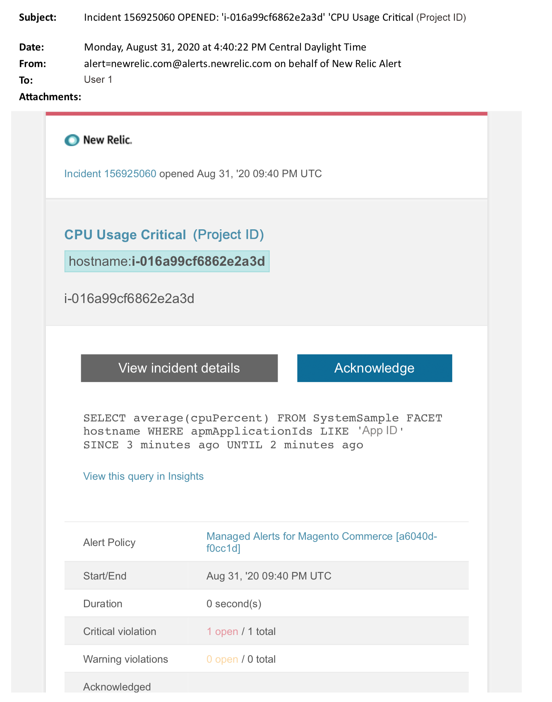

# Beheerde waarschuwingen over Adobe Commerce: kritieke CPU-waarschuwing

Dit artikel bevat stappen voor het oplossen van problemen wanneer u een CPU-kritieke waarschuwing voor Adobe Commerce ontvangt in [!DNL New Relic] . Er moet onmiddellijk actie worden ondernomen om dit probleem op te lossen. De waarschuwing ziet er ongeveer als volgt uit, afhankelijk van het waarschuwingsberichtkanaal dat u hebt geselecteerd.

{width="500"}

## Betrokken producten en versies

Adobe Commerce on cloud Infrastructure Pro-planarchitectuur

## Probleem

U zult een beheerde alarm in [!DNL New Relic] ontvangen als u tot [&#x200B; Beheerde alarm voor Adobe Commerce &#x200B;](managed-alerts-for-magento-commerce.md) hebt ondertekend en één of meerdere waakzame drempels zijn overschreden. Deze waarschuwingen zijn door Adobe Commerce ontwikkeld om klanten een standaardset te bieden met inzichten van support en engineering.

<u>**doe!**</u>:

* Abort om het even welke plaatsing die tot dit alarm wordt gepland wordt ontruimd.
* Zet uw site onmiddellijk in de onderhoudsmodus als uw site helemaal niet reageert of niet meer reageert. Voor stappen, verwijs naar [&#x200B; toelaten of onbruikbaar maken onderhoudswijze &#x200B;](https://experienceleague.adobe.com/nl/docs/commerce-operations/installation-guide/tutorials/maintenance-mode) in de Gids van de Installatie van Commerce. Zorg ervoor om uw IP aan de Vrijgestelde IP adreslijst toe te voegen om ervoor te zorgen dat u nog tot uw plaats voor het oplossen van problemen kunt toegang hebben. Voor stappen, verwijs naar [&#x200B; handhaaf de lijst van vrijgestelde IP adressen &#x200B;](https://experienceleague.adobe.com/nl/docs/commerce-operations/installation-guide/tutorials/maintenance-mode#maintain-the-list-of-exempt-ip-addresses) in de Gids van de Installatie van Commerce.

<u>**niet!**</u>:

* Start aanvullende marketingcampagnes die extra pagina&#39;s naar uw site kunnen brengen.
* Voer indexen of extra kranen uit, wat extra druk op de CPU of schijf kan veroorzaken.
* Voer belangrijke administratieve taken uit (zoals de Commerce Admin, gegevensimport/export).
* Wis uw cache.

Uw site reageert mogelijk niet meer (als u nog geen site-uitval hebt) als u een van de acties &quot;Niet uitvoeren&quot; uitvoert voordat u de oorzaak van de waarschuwing hebt onderzocht en opgelost.

## Oplossing

Volg deze stappen om de oorzaak te identificeren en problemen op te lossen.

>[!WARNING]
>
>Omdat dit een kritiek alarm is, wordt het hoogst geadviseerd u **Stap 1** voltooit alvorens u probeert om de kwestie (Stap 2 vanaf) problemen op te lossen.

Controleer of het Adobe Commerce-ondersteuningsticket bestaat. Voor stappen, verwijs naar [&#x200B; Spoor uw steunkaartjes &#x200B;](https://experienceleague.adobe.com/nl/docs/commerce-knowledge-base/kb/help-center-guide/magento-help-center-user-guide#track-support-case) in de Kennisbank van de Steun van Commerce. Ondersteuning kan een drempelwaardewaarschuwing van [!DNL New Relic] hebben ontvangen, een ticket hebben gemaakt en aan het probleem hebben gewerkt. Als er geen ticket bestaat, maakt u er een. Het ticket moet de volgende informatie bevatten:

1. Reden van contactpersoon: selecteer **[!UICONTROL New Relic CRITICAL alert received]**.
1. Beschrijving van de signalering.
1. [[!DNL New Relic]  verbinding van het Ongeval &#x200B;](https://docs.newrelic.com/docs/alerts-applied-intelligence/new-relic-alerts/alert-incidents/view-violation-event-details-incidents). Dit is inbegrepen in uw [&#x200B; Beheerde alarm voor Adobe Commerce &#x200B;](managed-alerts-for-magento-commerce.md).
1. De pagina van de Transactie van APM van het gebruik [[!DNL New Relic]  om transacties met prestatieskwesties te identificeren:](https://docs.newrelic.com/docs/apm/applications-menu/monitoring/transactions-page-find-specific-performance-problems)
   * Transacties sorteren door oplopende Apdex-scores. [[!DNL Apdex] &#x200B;](https://docs.newrelic.com/docs/apm/new-relic-apm/apdex/apdex-measure-user-satisfaction) verwijst naar gebruikerstevredenheid aan de reactietijd van uw Webtoepassingen en de diensten. A [&#x200B; laag  [!DNL Apdex]  score &#x200B;](managed-alerts-for-magento-commerce-apdex-warning-alert.md) kan op een knelpunt (een transactie met een hogere reactietijd) wijzen. Gewoonlijk, is het verwant met het gegevensbestand, [!DNL Redis], of PHP. Voor stappen, verwijs naar de transacties van de Mening van New Relic [&#x200B; met hoogste  [!DNL Apdex]  ontevredenheid &#x200B;](https://docs.newrelic.com/docs/apm/new-relic-apm/apdex/view-your-apdex-score#apdex-dissat).
   * De transacties van de soort door hoogste productie, langzaamste gemiddelde reactietijd, het meest tijdrovend, en andere drempels. Voor stappen, verwijs naar [!DNL New Relic] [&#x200B; vind specifieke prestatiesproblemen &#x200B;](https://docs.newrelic.com/docs/apm/applications-menu/monitoring/transactions-page-find-specific-performance-problems).
1. Als u nog worstelen om de bron te identificeren, gebruik [[!DNL New Relic]  de pagina van de Infrastructuur van 0&rbrace; APM &lbrace;om middel-zware diensten te identificeren. &#x200B;](https://docs.newrelic.com/docs/infrastructure/infrastructure-ui-pages/infra-hosts-ui-page) Voor stappen, verwijs naar [!DNL New Relic] [&#x200B; de controlepagina van de Gastheren van de Infrastructuur: Het lusje van Processen &#x200B;](https://docs.newrelic.com/docs/infrastructure/infrastructure-ui-pages/infra-hosts-ui-page/#processes).
1. Als u de bron identificeert, SSH in het milieu om verder te onderzoeken. Voor stappen, verwijs naar [&#x200B; SSH in uw milieu &#x200B;](https://experienceleague.adobe.com/docs/commerce-cloud-service/user-guide/develop/secure-connections.html?lang=nl-NL) in Commerce op de Gids van de Wolk.
1. Als u nog steeds moeite hebt om de bron te identificeren:
   * Recente trends van het overzicht om kwesties met recente codeplaatsingen of configuratieveranderingen (bijvoorbeeld, nieuwe klantengroepen en grote veranderingen in de catalogus) te identificeren. U wordt aangeraden de afgelopen zeven dagen van activiteit te controleren op correlaties in codeimplementaties of -wijzigingen.
   * Overweeg om te controleren op en vlakke catalogi uit te schakelen. Voor stappen, verwijs naar [&#x200B; Trage prestaties, langzame en lange lopende kronen &#x200B;](https://experienceleague.adobe.com/nl/docs/commerce-knowledge-base/kb/troubleshooting/miscellaneous/slow-performance-slow-and-long-running-crons) in de Kennisbank van de Steun van Commerce.
   * Als u vermoedt dat u een aanval van DDoS ervaart, probeer blokkerend beide verkeer. Voor stappen, verwijs naar [&#x200B; hoe te om kwaadwillig verkeer voor Adobe Commerce op wolkeninfrastructuur op Fastly niveau &#x200B;](https://experienceleague.adobe.com/nl/docs/commerce-knowledge-base/kb/how-to/block-malicious-traffic-for-magento-commerce-on-fastly-level) in de Kennisbank van de Steun van Commerce te blokkeren.
1. Als het probleem tijdelijk lijkt, voert u reductiestappen uit zoals een upgrade of plaatst u de site in de onderhoudsmodus. Voor stappen, verwijs naar [&#x200B; hoe te om tijdelijke resize &#x200B;](https://experienceleague.adobe.com/nl/docs/commerce-knowledge-base/kb/how-to/how-to-request-temporary-magento-upsize) in de Kennisbank van de Steun van Commerce en [&#x200B; toe te laten of onderhoudswijze &#x200B;](https://experienceleague.adobe.com/nl/docs/commerce-operations/installation-guide/tutorials/maintenance-mode) in de Gids van de Installatie van Commerce onbruikbaar te maken. Als de upsize de plaats aan normale verrichtingen terugkeert, overweeg om permanent te verzoeken (uw Team van de Rekening van Adobe) of probeer om het probleem in uw Dedicated Staging te reproduceren door een ladingstest in werking te stellen en vragen of code te optimaliseren die druk op de diensten vermindert. Voor stappen, verwijs naar [&#x200B; Lading en stress het testen &#x200B;](https://experienceleague.adobe.com/nl/docs/commerce-cloud-service/user-guide/develop/test/staging-and-production#load-and-stress-testing) in Commerce op de Gids van de Wolk.
