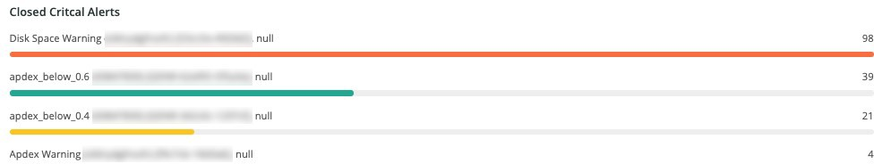

# Het tabblad [!UICONTROL Alerts]

Het tabblad [!UICONTROL Alerts] bevat een reeks waarschuwingen, waaronder open en directe waarschuwingen.

## [!UICONTROL Open Alert Details]

Het frame **[!UICONTROL Open Alert Details]** bevat een aantal open kritieke waarschuwingen over de geselecteerde tijdlijn. De waarschuwingen omvatten door Adobe gemaakte waarschuwingen en eventuele waarschuwingen die door de partner of handelaar zijn gemaakt.

## [!UICONTROL Closed Critical Alerts]

Het frame **[!UICONTROL Closed Critical Alerts]** bevat een aantal gesloten kritieke waarschuwingen over de geselecteerde tijdlijn. De waarschuwingen omvatten door Adobe gemaakte waarschuwingen en eventuele waarschuwingen die door de partner of handelaar zijn gemaakt.

## [!UICONTROL Critical Alert Details]

In het frame **[!UICONTROL Critical Alert Details]** wordt een telling weergegeven van de kritieke waarschuwingsgegevens over de geselecteerde tijdlijn, inclusief tijdstempel, naam van de voorwaarde en of de waarschuwingsgebeurtenis geopend of gesloten is.

## [!UICONTROL Infrastructure Alert Details]

In het frame **[!UICONTROL Infrastructure Alert Details]** worden toepassingen, hosts en andere infrastructuurgebeurtenissen in de geselecteerde tijdlijn weergegeven.
