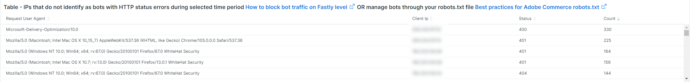
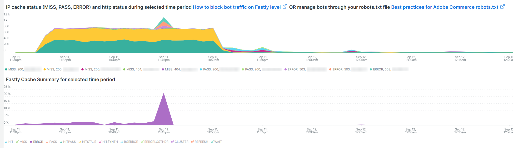
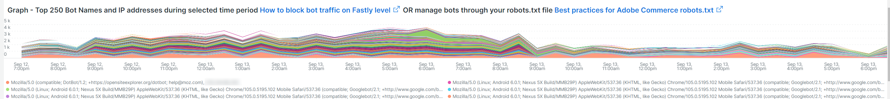
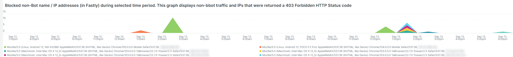
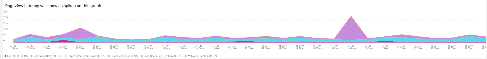

# De [!UICONTROL bots] tab

Dit tabblad bevat informatie die aangeeft hoe u kunt bepalen of en wat [!DNL bots] veroorzaken problemen met de site.

## Overzicht op hoog niveau van [!DNL bots]:

* A [!DNL bot] is een stuk software dat herhaalde geautomatiseerde taken in werking stelt. Met kunstmatige intelligentie en het leren van machines evolueert, de taken, de methodes, en de interactie van [!DNL bots] veranderen. Er zijn *goed* [!DNL bots] dat is gunstig voor sites door ze aan zoekmachines op internet toe te voegen . Hierdoor worden internetgebruikers door zoekprogrammaresultaten naar de site geleid. A *goed* [!DNL bot] past de grenzen die op de [!DNL bot] door `robots.txt` bestand of instellingen in een zoekprogrammaconsole. Grensgrenzen kunnen de toegang tot de site of delen van de site beperken.
* Verkeerd [!DNL bots] negeren `robots.txt` of ze kunnen een goede [!DNL bot] door het gebied van de verzoekgebruikersagent van de HTTP- verzoekgegevens. Sommige dingen die kwaadaardig zijn [!DNL bots] do:
   * Voeg lading aan een plaats toe om wettige gebruikers toegang tot de plaats te ontkennen.
   * Inhoud zonder toestemming scrubben en opnieuw gebruiken.
   * Ongewenste accounts registreren voor services of adressen voor het doorsturen van e-mailberichten naar andere sites ([!DNL SPAM bots]).
   * Onechte weergaven maken ([!DNL Viewbots]).
   * Producten of tickets kopen ([!DNL Focused bots]).
* Beheer [!DNL bots]
   * [!DNL Observation for Adobe Commerce] heeft weergaven van [!DNL bot] verkeer:
      * Het toont totaal niet in cache geplaatst [!DNL bot] activiteit die de belasting weergeeft die een [!DNL bot] wordt toegevoegd aan een site en wanneer dat gebeurt.
      * Het toont de [!DNL bots] die fouten genereren. Doorgaans als een [!DNL bot] voegt belasting toe die siteproblemen veroorzaakt, die [!DNL bot] of IP het adres heeft de hoogste frequentie van fouten.
      * Het toont [!DNL bot] namen (de waarden van het verzoekgebruikersagentengebied) en IP adressen om door te leiden:
         * [!DNL Fastly] (snelheidsbeperking of [!DNL VCLs] die IP adressen, waaiers blokkeren, of [!DNL bots] op naam).
         * Goed toevoegen [!DNL bot] informatie aan de `robots.txt field` de snelheid van de toegang tot de site te beperken of te beperken.
         * Beheer [!DNL Bing] of [!DNL Google bots] via de console van de zoekmachine.

## [!UICONTROL Total Bot traffic by bot name]:

* De **[!UICONTROL Total Bot traffic by bot name during selected time period]** de tabel bevat het geaggregeerde aantal niet in cache opgeslagen aanvragen waarbij de [!UICONTROL request_user_agent] veld heeft een tekenreeks [!DNL bots] in de waarde. Dit kan de naam zijn [!DNL bot] als de [!UICONTROL request_user_agent] veldwaarde kan voor spoofed worden gebruikt. De waarde onder de [!UICONTROL Count] kolom is de belangrijkste.

## [!UICONTROL Total Bot Traffic by Bot name/IP address]

* De **[!UICONTROL Total Bot Traffic by Bot name/IP address during selected time period How to block bot traffic on Fastly level OR manage bots through your robots.txt file Best practices for Adobe Commerce robots.txt]** de lijst toont de zelfde gegevens zoals de vorige lijst, maar voegt IP adressen toe die de verzoeken namens genoemde maken [!DNL bot]. Als kwaadaardig [!DNL bots] goed [!DNL bots], moet het IP-adres of de IP-adressen worden geverifieerd via websites die misbruik van IP-adressen vaststellen of via *kinus* diensten of [!DNL DNS lookups]. Bijvoorbeeld: [!DNL Google] publiceert hun [[!DNL googlebot] IP-adressen](https://developers.google.com/search/apis/ipranges/googlebot.json) en [!DNL Microsoft] beschikt over een controlemiddel voor [[!DNL Bingbots]](https://www.bing.com/webmasters/help/Verify-Bingbot-2195837f).

## [!UICONTROL Graph - Bots with HTTP status errors]

* De **[!UICONTROL Graph - Bots with HTTP status errors during selected time period How to block bot traffic on Fastly level OR manage bots through your robots.txt file Best practices for Adobe Commerce robots.txt]** grafiek geeft fouten weer [!DNL bots] die zich op het gebied van de verzoekgebruikersagent verklaren. Dit betekent niet noodzakelijk dat de fout wordt veroorzaakt door het volume van de [!DNL bot] of ander verkeer. De fouten zouden kunnen zijn dat de [!DNL bot] verzoekt om informatie die niet bestaat of er een ander probleem in het verzoek is.
* Als er een piek van fouten op IP adressen tijdens plaatsinstabiliteit of stroomonderbreking is, zouden zij in het plaatsprobleem kunnen zijn verdacht.

## [!UICONTROL Table - IPs that do not identify as bots]

* De **[!UICONTROL Table - IPs that do not identify as bots with HTTP status errors during selected time period How to block bot traffic on Fastly level OR manage bots through your robots.txt file Best practices for Adobe Commerce robots.txt]** de lijst zal IP verzoeken met niet-200 codes van de http status tonen die NIET zich als [!DNL bots] in het veld voor de gebruikersagent van de aanvraag. Deze IP adressen zouden kwaadwillige IP adressen kunnen zijn, vooral als de tellingen hoog voor de geselecteerde tijdspanne zijn.
* Als de aantallen niet-200 http statuscode laag zijn en de IP adreswaaiers niet gelijkaardig zijn, zouden de adressen niet aan de plaatskwesties kunnen bijdragen.

## [!UICONTROL Table – Cache Status 'ERROR']

* Wanneer IP de adressen een hoge frequentie van fouten produceren, vraag wat zij doen? De **[!UICONTROL Table – Cache Status 'ERROR' detail table (what are these IPs doing?) How to block bot traffic on Fastly level OR manage bots through your robots.txt file Best practices for Adobe Commerce robots.txt]** de lijst zal gevraagde URL samen met de statuswaarde van HTTP voor verzoeken tonen die een geheim voorgeheugenstatus hebben [!UICONTROL ERROR] waarde. De frequentie wordt beperkt door URL zodat het aantal laag kan zijn. Herinner dat het IP adres duizenden verzoeken tijdens de geselecteerde tijdspanne kan maken. Dit is een weergave tegen maximaal 2000 verzoeken tijdens het tijdframe (de weergavelimiet voor records).

## [!UICONTROL Show 5XX status distribution]

* De **[!UICONTROL Show 5XX status distribution across IP addresses (top 200 addresses) How to block bot traffic on Fastly level OR manage bots through your robots.txt file Best practices for Adobe Commerce robots.txt]** frame is krachtig. Het toont de IP adressen die 5XX http statuscodes tijdens de geselecteerde tijdspanne hebben. Als een IP adres een hoog volume van verzoeken maakt en de plaats wordt beïnvloed aan het punt waar het niet het verkeer kan behandelen, dan zullen de IP adressen die de hoogste frequentie van verzoeken maken typisch het hoogste volume van fouten hebben. 5XX http de statuscodes wijzen typisch op een plaats die worstelt om op verzoeken te antwoorden.
* Hoe breder de balk, des te groter het percentage fouten dat het IP-adres bevat in het totale aantal fouten van 5 x gedurende die periode. Opmerking: een IP adres zou veelvoudige segmenten in de grafiek kunnen hebben als het veelvoudige http statuscodes (voorbeeld 502 en 503 http statussen) heeft.
* De typische distributie zou aan de rechterkant van de bar worden aangewezen waar de IP adressen in breedte gelijk zijn of er zouden een paar brede bars met zeer lage aantallen zijn.
* Als u de muisaanwijzer boven het staafsegment houdt, wordt het aantal aangegeven fouten tijdens de geselecteerde tijdsperiode weergegeven.

## [!UICONTROL IP cache status (MISS, PASS, ERROR) and HTTP status]

* Dit **[!UICONTROL IP cache status (MISS, PASS, ERROR) and HTTP status during selected time period How to block bot traffic on Fastly level OR manage bots through your robots.txt file Best practices for Adobe Commerce robots.txt]** het kader toont de telling van de HTTPS- statuscode en niet-caching verzoeken door IP over het geselecteerde tijdkader. Dit wijst op de evenredige lading van elk IP adres en het totale volume. Het zal de IP adressen met de meeste verzoeken tonen.

## [!UICONTROL Fastly Cache Summary for selected time period]

* Als u op de knop [!UICONTROL Error] in de onderstaande grafiek kunt u de laatste twee grafieken met elkaar vergelijken. Zo kunt u aangeven waar het laden bijdraagt aan siteproblemen.

## [!UICONTROL Graph - IPs that do not identify as bots]

* De **[!UICONTROL Graph - IPs that do not identify as bots without error during selected time period How to block bot traffic on Fastly level OR manage bots through your robots.txt file Best practices for Adobe Commerce robots.txt]** het kader toont het gebied van de de agentenagent van het verzoek, het IP adres, en statuscode voor verzoeken waar het gebied van de agentenagent van het verzoek niet op een wijst [!DNL bot]. Dit kader kan hoge frequentieverzoeken van om het even welk IP adres tonen maar aandacht aan hoge frequentieverzoeken, vooral tijdens een periode waarin de plaats kwesties kan hebben.

## [!UICONTROL Graph - Suspicious Non-Bot traffic]

* De **[!UICONTROL Graph - Suspicious Non-Bot traffic during selected time period]** De grafiek zoekt een waarde van de de agentenagent van de verzoekgebruiker van Go-http-cliënt maar zal worden uitgebreid om andere verdachte waarden van de agentenagent van de verzoekgebruiker te bekijken. Deze waarde van de de agentenagent van de verzoekgebruiker wordt gebruikt door plaatsen voor het verbinden van de diensten en kan geldig zijn maar ook gebruikt door kwaadwillig [!DNL bots].

## [!UICONTROL Graph - Bot traffic by Bot name]

* De **[!UICONTROL Graph - Bot traffic by Bot name during selected time period]** het kader toont de zelfde gegevens zoals het Totale verkeer van Bot door [!DNL Bot] naam tijdens geselecteerde tijdspanningstabel boven aan het tabblad. De gegevens worden weergegeven via de tijdlijn, zodat u kunt zien wanneer de aanvragen van de [!DNL bots] en hun verdeling.

## [!UICONTROL Graph - Top 250 Bot Names and IP addresses]

* De **[!UICONTROL Graph - Top 250 Bot Names and IP addresses during selected time period How to block bot traffic on Fastly level OR manage bots through your robots.txt file Best practices for Adobe Commerce robots.txt]** frame geeft dezelfde gegevens weer als Totaal [!DNL Bot] Verkeer door Bot naam/IP adres tijdens geselecteerde lijst van de tijdspanne bij de bovenkant van het lusje. Het toont de gegevens via de chronologie en beperkt het door IP adres. Dit toont aan wanneer de verzoeken van de [!DNL bots] worden gedaan, welke IP verzoeken doet, en de distributies van de verzoeken.

## [!UICONTROL Blocked Bot name / IP addresses (in Fastly)]

* De **[!UICONTROL Blocked Bot name / IP addresses (in Fastly) during selected time period. This graph displays bot traffic and IPs that were returned a 403 Forbidden HTTP Status code]** het kader toont de beide naam en IP adressen die worden geblokkeerd. In deze grafiek ziet u hoe alle aanvragen zijn geblokkeerd [!DNL Fastly] in de toekomst.

## [!UICONTROL Blocked non-Bot name / IP addresses (in Fastly)]

* De **[!UICONTROL Blocked non-Bot name / IP addresses (in Fastly) during selected time period graph displays non-bot traffic and IPs that were returned a 403 Forbidden HTTP Status code]** frame toont IP-adressen die niet als een [!DNL bot] die via [!DNL Fastly].

## [!UICONTROL This table shows the number of user agents per IP address, number of successful, unsuccessful and blocked requests:]

* Verkeerd [!DNL bots] dikwijls bederf [!DNL bots] door de waarde van de [!UICONTROL Request User Agent] veld. Deze lijst toont hoeveel unieke waarden het IP adres op dat gebied heeft. Hoe hoger de waarde in het dialoogvenster [!UICONTROL Request User Agent] veld, is het verdachte IP-adres.

## [!UICONTROL IP with non-200 status errors]

* De **[!UICONTROL IP with non-200 status errors – without 403 status]** frame toont de distributie over de geselecteerde tijdlijn van IP adressen met de statuscodes van HTTP buiten 200. Wanneer u hogere waarden op één enkel IP of een groep IP adressen ziet, vereisen zij verder onderzoek.

## [!UICONTROL IP with 403 status codes:]

* De **[!UICONTROL IP with 403 status codes]** frame geeft niet-in cache opgeslagen aanvragen weer zonder [!UICONTROL cache_status=ERROR] die een HTTP-status hebben van 403. Dit kan aantonen dat de oorspronkelijke server de bron is van de 403 (niet-geautoriseerd) in plaats van een blok van [!DNL Fastly].

## [!UICONTROL Top 5 with non-200 status codes]

* De **[!UICONTROL Top 5 with non-200 status codes showing cache_status]** de lijst toont op een IP / statusniveau de tellingen van elk met [!UICONTROL cache_status] waarde.

## [!UICONTROL Pageview Latency will show as spikes]

* De **[!UICONTROL Pageview Latency will show as spikes on this graph:]** frame bevat een vertraging in de paginabelasting / API-reactie die mogelijk overeenkomt met de [!DNL bot] verkeer.
