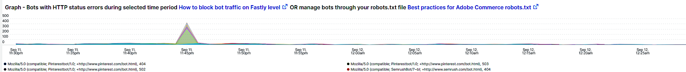

# Het tabblad [!UICONTROL bots]

Dit tabblad bevat informatie die aangeeft hoe u kunt bepalen of en welke [!DNL bots] siteproblemen veroorzaken.

## Overzicht op hoog niveau van [!DNL bots] :

* Een [!DNL bot] is een stuk software dat herhaalde geautomatiseerde taken uitvoert. Met kunstmatige intelligentie en het leren van machines evolueren de taken, de methodes, en de interactie van [!DNL bots]. Er zijn *goed* [!DNL bots] die plaatsen door te kruipen en hen toe te voegen aan de motoren van het Internet ten goede komen. Hierdoor worden internetgebruikers door zoekprogrammaresultaten naar de site geleid. A *goed* [!DNL bot] respecteert typisch grenzen die op [!DNL bot] door een `robots.txt` dossier of montages in een console van de onderzoeksmotor worden geplaatst. Grensgrenzen kunnen de toegang tot de site of delen van de site beperken.
* Kwaadwillig [!DNL bots] negeert het `robots.txt` dossier of zij kunnen van een goed [!DNL bot] door het gebied van de verzoekgebruikersagent van de HTTP- verzoekgegevens bederven. Sommige dingen die kwaadaardig zijn [!DNL bots] doen het volgende:
   * Voeg lading aan een plaats toe om wettige gebruikers toegang tot de plaats te ontkennen.
   * Inhoud zonder toestemming scrubben en opnieuw gebruiken.
   * Registreer valse accounts om e-mailservices of adressen te overstromen of om te leiden naar andere sites ([!DNL SPAM bots]).
   * Maak valse weergaven ([!DNL Viewbots]).
   * Koop producten of tickets ([!DNL Focused bots]).
* Beheren [!DNL bots]
   * [!DNL Observation for Adobe Commerce] heeft weergaven van [!DNL bot] -verkeer:
      * De code toont de totale niet-in cache geplaatste [!DNL bot] activiteit die de lading toont die [!DNL bot] aan een plaats toevoegt en wanneer die lading gebeurt.
      * Hierin worden de [!DNL bots] weergegeven die fouten genereren. Doorgaans geldt dat [!DNL bot] - of IP-adres de hoogste frequentie van fouten heeft als een [!DNL bot] bezig is met het toevoegen van een belasting die siteproblemen veroorzaakt.
      * Het toont [!DNL bot] namen (de gebiedswaarden van de verzoekgebruikersagent) en IP adressen om door te leiden:
         * [!DNL Fastly] (snelheidsbeperkend of [!DNL VCLs] die IP adressen, waaiers, of [!DNL bots] door naamwaarde blokkeren).
         * Goede [!DNL bot] -informatie aan `robots.txt field` toevoegen om de snelheid van sitetoegang te beperken of te beperken.
         * [!DNL Bing] of [!DNL Google bots] beheren via de console van de zoekmachine.

## [!UICONTROL Experimental Potential Malicious Bots frame]

Het **[!UICONTROL Experimental Potential Malicious Bots frame]** -frame wordt uitgevoerd over twaalf afzonderlijke, complexe query&#39;s. Het ontdekt kwaadwillige IP verzoekhandtekeningen en voegt dan de resultaten samen, sommen en sorteert hen door telling in dalende orde. De query&#39;s bevatten een groot aantal gegevenshandtekeningen van CVE-misbruiken en andere kwaadaardige verzoeken. Zelfs wanneer de explosies worden geblokkeerd door beveiligingsoplossingen/patches en een niet-bedreiging vormen voor de site, moet het verzoek nog steeds door de website worden afgehandeld. Het aantal verzoeken kan in een korte periode aanzienlijk worden. Dit kader toont geen totale verzoeken van het IP adres maar eerder verzoeken die signalen hebben die erop wijzen dat het verzoek verdachte bedoeling had.

Controleer of het verkeer verdacht is en niet afkomstig is van een [!DNL Content Distributed Network] (CDN)-adres dat ook geldige aanvragen kan afleveren. Als de verzoeken om van een adres CDN IP worden bepaald, gelieve te contacteren die dienstverlener om te helpen met het blokkeren van het verdachte verkeer door hun netwerk. Als u het adres of verzoek URL moet blokkeren, verwijs naar [ het kwaadwillige verkeer van het Blok voor Adobe Commerce op  [!DNL Fastly]  niveau ](https://experienceleague.adobe.com/docs/commerce-knowledge-base/kb/how-to/block-malicious-traffic-for-magento-commerce-on-fastly-level.html) in de Kennisbank van de Steun van Adobe Commerce.

## [!UICONTROL Rate of HTTP request per second (top 25) during requested time period]

Het **[!UICONTROL Rate of HTTP request per second (top 25) during requested time period]** kader toont de hoogste verzoeken per tweede IP adressen tijdens het geselecteerde tijdkader. Als deze adressen ook in de lijst hierboven zijn, zorg ervoor dat zij geen adressen CDN en kwaadwillig zijn en hen via [!DNL Fastly] blokkeren.

## [!UICONTROL Total Bot traffic by bot name]:

De tabel **[!UICONTROL Total Bot traffic by bot name during selected time period]** bevat de geaggregeerde telling van aanvragen die niet in de cache zijn geplaatst en waarbij het veld [!UICONTROL request_user_agent] een tekenreeks van [!DNL bots] in de waarde heeft. Dit kan wel of niet de naam [!DNL bot] hebben omdat de veldwaarde [!UICONTROL request_user_agent] voor spoofed kan worden gebruikt. De waarde onder de kolom [!UICONTROL Count] is het belangrijkst.

## [!UICONTROL Total Bot Traffic by Bot name/IP address]

 te beheren

De tabel **[!UICONTROL Total Bot Traffic by Bot name/IP address during selected time period How to block bot traffic on Fastly level OR manage bots through your robots.txt file Best practices for Adobe Commerce robots.txt]** bevat dezelfde gegevens als de vorige tabel, maar voegt IP-adressen toe die de aanvragen namens de benoemde [!DNL bot] uitvoeren. Als kwaadwillige [!DNL bots] goed [!DNL bots], zou het IP adres(sen) door websites moeten worden geverifieerd die misbruik IP adressen of door *identificeren wie* de diensten of [!DNL DNS lookups] is. Bijvoorbeeld, [!DNL Google] publiceert hun [[!DNL googlebot]  IP adressen ](https://developers.google.com/search/apis/ipranges/googlebot.json) en [!DNL Microsoft] heeft een controlerend hulpmiddel voor [[!DNL Bingbots] ](https://www.bing.com/webmasters/help/Verify-Bingbot-2195837f).

## [!UICONTROL Graph - Bots with HTTP status errors]

 te beheren

In de grafiek **[!UICONTROL Graph - Bots with HTTP status errors during selected time period How to block bot traffic on Fastly level OR manage bots through your robots.txt file Best practices for Adobe Commerce robots.txt]** worden fouten in [!DNL bots] weergegeven die zichzelf in het veld voor de gebruikersagent van de aanvraag declareren. Dit betekent niet noodzakelijk dat de fout door volume van [!DNL bot] of ander verkeer wordt veroorzaakt. De fouten zouden kunnen zijn dat [!DNL bot] om informatie verzoekt die niet bestaat of er een ander probleem in het verzoek is.

Als er een piek van fouten op IP adressen tijdens plaatsinstabiliteit of stroomonderbreking is, zouden zij in het plaatsprobleem kunnen zijn verdacht.

## [!UICONTROL Table - IPs that do not identify as bots]

In de tabel **[!UICONTROL Table - IPs that do not identify as bots with HTTP status errors during selected time period How to block bot traffic on Fastly level OR manage bots through your robots.txt file Best practices for Adobe Commerce robots.txt]** worden IP-aanvragen weergegeven met niet-200 http-statuscodes die NIET zichzelf identificeren als [!DNL bots] in het veld voor de gebruikersagent van de aanvraag. Deze IP adressen zouden kwaadwillige IP adressen kunnen zijn, vooral als de tellingen hoog voor de geselecteerde tijdspanne zijn.

Als de aantallen niet-200 http statuscode laag zijn en de IP adreswaaiers niet gelijkaardig zijn, zouden de adressen niet aan de plaatskwesties kunnen bijdragen.

## [!UICONTROL Table – Cache Status 'ERROR']

Wanneer IP de adressen een hoge frequentie van fouten produceren, vraag wat zij doen? In de tabel **[!UICONTROL Table – Cache Status 'ERROR' detail table (what are these IPs doing?) How to block bot traffic on Fastly level OR manage bots through your robots.txt file Best practices for Adobe Commerce robots.txt]** wordt de aangevraagde URL weergegeven, samen met de HTTP-statuswaarde voor aanvragen met de cachestatus [!UICONTROL ERROR] . De frequentie wordt beperkt door URL zodat het aantal laag kan zijn. Herinner dat het IP adres duizenden verzoeken tijdens de geselecteerde tijdspanne kan maken. Dit is een weergave tegen maximaal 2000 verzoeken tijdens het tijdframe (de weergavelimiet voor records).

## [!UICONTROL Show 5XX status distribution]

Het frame **[!UICONTROL Show 5XX status distribution across IP addresses (top 200 addresses) How to block bot traffic on Fastly level OR manage bots through your robots.txt file Best practices for Adobe Commerce robots.txt]** is krachtig. Het toont de IP adressen die 5XX http statuscodes tijdens de geselecteerde tijdspanne hebben. Als een IP adres een hoog volume van verzoeken maakt en de plaats wordt beïnvloed aan het punt waar het niet het verkeer kan behandelen, dan zullen de IP adressen die de hoogste frequentie van verzoeken maken typisch het hoogste volume van fouten hebben. 5XX http de statuscodes wijzen typisch op een plaats die worstelt om op verzoeken te antwoorden.

Hoe breder de balk, des te groter het percentage fouten dat het IP-adres bevat in het totale aantal fouten van 5 x gedurende die periode. Nota: een IP adres zou veelvoudige segmenten in de grafiek kunnen hebben als het veelvoudige http statuscodes (voorbeeld 502 en 503 http statussen) heeft.

De typische distributie zou aan de rechterkant van de bar worden aangewezen waar de IP adressen in breedte gelijk zijn of er zouden een paar brede bars met zeer lage aantallen zijn.

Als u de muisaanwijzer boven het staafsegment houdt, wordt het aantal aangegeven fouten tijdens de geselecteerde tijdsperiode weergegeven.

## [!UICONTROL IP cache status (MISS, PASS, ERROR) and HTTP status]

 te beheren

In dit **[!UICONTROL IP cache status (MISS, PASS, ERROR) and HTTP status during selected time period How to block bot traffic on Fastly level OR manage bots through your robots.txt file Best practices for Adobe Commerce robots.txt]** -frame worden het aantal HTTPS-statuscodes en aanvragen die niet in de cache zijn geplaatst, via IP over het geselecteerde tijdframe weergegeven. Dit wijst op de evenredige lading van elk IP adres en het totale volume. Het zal de IP adressen met de meeste verzoeken tonen.

## [!UICONTROL Fastly Cache Summary for selected time period]

Als u op het pictogram [!UICONTROL Error] in de onderstaande grafiek klikt, kunt u de laatste twee grafieken met elkaar vergelijken. Zo kunt u aangeven waar het laden bijdraagt aan siteproblemen.

## [!UICONTROL Graph - IPs that do not identify as bots]

 te beheren

Het **[!UICONTROL Graph - IPs that do not identify as bots without error during selected time period How to block bot traffic on Fastly level OR manage bots through your robots.txt file Best practices for Adobe Commerce robots.txt]** kader toont het gebied van de agentenagent van de verzoekgebruiker, het IP adres, en statuscode voor verzoeken waar het gebied van de agentenagent van de verzoekgebruiker geen [!DNL bot] wijst. Dit kader kan hoge frequentieverzoeken van om het even welk IP adres tonen maar aandacht aan hoge frequentieverzoeken, vooral tijdens een periode waarin de plaats kwesties kan hebben.

## [!UICONTROL Graph - Suspicious Non-Bot traffic]

De grafiek **[!UICONTROL Graph - Suspicious Non-Bot traffic during selected time period]** zoekt een waarde van de de agentenagent van de verzoekgebruiker van Go-http-cliënt maar zal worden uitgebreid om andere verdachte waarden van de agentenagent van de verzoekgebruiker te bekijken. Deze de agentenwaarde van de verzoekgebruiker wordt gebruikt door plaatsen voor het verbinden van de diensten en kan geldig zijn maar ook door kwaadwillige [!DNL bots] gebruikt.

## [!UICONTROL Graph - Bot traffic by Bot name]

In het frame **[!UICONTROL Graph - Bot traffic by Bot name during selected time period]** worden dezelfde gegevens weergegeven als in de naam Totaal aantal bits per [!DNL Bot] tijdens de geselecteerde tabel met tijdpunten boven aan het tabblad. De gegevens worden weergegeven via de tijdlijn, zodat u kunt zien wanneer de aanvragen van de [!DNL bots] worden gedaan en hoe ze worden gedistribueerd.

## [!UICONTROL Graph - Top 250 Bot Names and IP addresses]

 te beheren

In het frame **[!UICONTROL Graph - Top 250 Bot Names and IP addresses during selected time period How to block bot traffic on Fastly level OR manage bots through your robots.txt file Best practices for Adobe Commerce robots.txt]** worden dezelfde gegevens weergegeven als in het vak Totaal [!DNL Bot] verkeer op naam/IP-adres tijdens een geselecteerde tijdsperiode boven aan het tabblad. Het toont de gegevens via de chronologie en beperkt het door IP adres. Dit toont wanneer de verzoeken van [!DNL bots] worden gemaakt, welke IP verzoeken doet, en de verdelingen van de verzoeken.

## [!UICONTROL Blocked Bot name / IP addresses (in Fastly)]

 zijn teruggekeerd

In het frame **[!UICONTROL Blocked Bot name / IP addresses (in Fastly) during selected time period. This graph displays bot traffic and IPs that were returned a 403 Forbidden HTTP Status code]** worden de beide namen en IP-adressen weergegeven die zijn geblokkeerd. In deze grafiek ziet u hoe alle aanvragen zijn geblokkeerd in [!DNL Fastly] .

## [!UICONTROL Blocked non-Bot name / IP addresses (in Fastly)]

Het frame **[!UICONTROL Blocked non-Bot name / IP addresses (in Fastly) during selected time period graph displays non-bot traffic and IPs that were returned a 403 Forbidden HTTP Status code]** bevat IP-adressen die niet worden aangeduid als een [!DNL bot] die zijn geblokkeerd via [!DNL Fastly] .

## [!UICONTROL This table shows the number of user agents per IP address, number of successful, unsuccessful and blocked requests:]

Kwaadwillig [!DNL bots] vaak spoofend van andere [!DNL bots] door de waarde van het [!UICONTROL Request User Agent] gebied. Deze lijst toont hoeveel unieke waarden het IP adres op dat gebied heeft. Hoe hoger de waarde in het veld [!UICONTROL Request User Agent] , hoe meer verdacht het IP-adres is.

## [!UICONTROL IP with non-200 status errors]

Het **[!UICONTROL IP with non-200 status errors – without 403 status]** kader toont de distributie over het geselecteerde tijdkader van IP adressen met de statuscodes van HTTP buiten 200. Wanneer u hogere waarden op één enkel IP of een groep IP adressen ziet, vereisen zij verder onderzoek.

## [!UICONTROL IP with 403 status codes:]

In het frame **[!UICONTROL IP with 403 status codes]** worden niet-in de cache opgeslagen aanvragen zonder [!UICONTROL cache_status=ERROR] weergegeven met een HTTP-status van 403. Dit kan aantonen dat de oorspronkelijke server de bron is van de 403 (niet-geautoriseerd) in plaats van een blok van [!DNL Fastly] .

## [!UICONTROL Top 5 with non-200 status codes]

De tabel **[!UICONTROL Top 5 with non-200 status codes showing cache_status]** toont op IP-/statusniveau de tellingen van elk niveau met de waarde [!UICONTROL cache_status] .

## [!UICONTROL Pageview Latency will show as spikes]

In het frame **[!UICONTROL Pageview Latency will show as spikes on this graph:]** wordt de vertraging van de paginabelasting/API-reactie weergegeven die mogelijk overeenkomt met het [!DNL bot] -verkeer.
