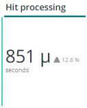

# De [!UICONTROL CDN] tab

Dit tabblad bevat informatie die is gericht op het tabblad [!DNL content delivery network (CDN)]. In het geval van Adobe Commerce Cloud is dit [!DNL Fastly] service.

## [!UICONTROL HIT rate]

De **[!UICONTROL HIT rate]** het kader toont het aantal cacheable verzoeken die in [!UICONTROL HITS] op het laatste moment. Dit geeft aan dat caching is gelukt. De pijl naar rechts toont het percentage boven of onder dezelfde tijd een week geleden.

## [!UICONTROL HIT Processing]

Dit **[!UICONTROL HIT processing]** toont het aantal cacheable verzoeken dat in [!UICONTROL HITS] gedurende de week.

## [!UICONTROL MISS rate]

Dit **[!UICONTROL MISS rate]** het aantal aanvragen dat op het laatste moment door cachegeheugen kan worden opgevraagd. Een fout is wanneer het verzoek niet in het voorgeheugen ondergebracht is, en het verzoek moet aan de oorsprongserver worden overgegaan om de inhoud te dienen. De waarde aan het recht is de vergelijking van verhoging/daling aan het aantal minuten per minuut één week voorafgaand.

## [!UICONTROL MISS time]

## [!UICONTROL HIT Ratio]

## [!UICONTROL Error Percentage]

De **[!UICONTROL Error Percentage]** geeft de waarde van het percentage FOUT van aanvragen weer en geeft de relatieve toename/afname weer ten opzichte van dezelfde tijd een week eerder.

## [!UICONTROL Total Requests]

## [!UICONTROL ERROR rate]

## [!UICONTROL Fastly Cache Average Response for selected time period in seconds]

Dit kader toont de duur in seconden van de cacheable verzoeken, betekenend dat als a `cache_response` is een [!UICONTROL MISS], wordt het gemiddelde voor gemiste reacties in de cache voor de geselecteerde tijd weergegeven.

## [!UICONTROL Fastly Cache Average Response for selected time period in seconds, faceted by POP]

## [!UICONTROL Total Bandwidth (All POPs) during the selected timeframe, compared with 1 week ago (% increase/decrease)]

## [!UICONTROL Requests – Since selected timeframe compared with one week ago]

Dit kader is vergelijkbaar met het overzichtsvak voor [!UICONTROL Total Requests] bovenaan, maar toont het aantal verzoeken van voorgaande weken. Dit zijn allemaal verzoeken, niet alleen cacheable verzoeken (waar `is_cacheable` is waar).

## [!UICONTROL Response Count]

## [!UICONTROL Bandwidth by POP]

## [!UICONTROL Top 5 URLs (5xx or 3xx status codes)]

De **[!UICONTROL Top 5 URLs]** in de weergave worden de bovenste 5 URL&#39;s weergegeven die een foutreactie van 5 x of 3 x hebben ondergaan. Vanwege de ruimtebeperking moet u de muis boven de URL houden om de specifieke foutcode te zien die aan die URL is gekoppeld. (bijvoorbeeld in het rode vak van de bovenstaande afbeelding).

## [!UICONTROL Top 25 URLs (200 status)]

De **[!UICONTROL Top 25 URLs]** frame toont de URL&#39;s die tijdens het geselecteerde tijdframe een 200-status hebben geretourneerd.

## [!UICONTROL Duration by Response Status]

De **[!UICONTROL Duration by Response Status]** in de grafiek worden de reacties op de fouten weergegeven op aantal tijdens de geselecteerde tijdlijn, afhankelijk van de code voor de foutstatus.

## [!UICONTROL Duration by Response Status, top 25 urls]

De **[!UICONTROL Duration by Response Status, top 25 URLs]** in de grafiek worden de bovenste 25 URL&#39;s weergegeven volgens de duur van de reactie in seconden. Mogelijk moet u de muisaanwijzer boven de URL houden om het volledige pad te kunnen zien. Klik ook op die URL om alle URL&#39;s behalve één URL te verwijderen. Vervolgens kunt u andere URL&#39;s toevoegen door er afzonderlijk op te klikken. Als u afzonderlijke URL&#39;s wilt verwijderen, kunt u de toets ingedrukt houden en op elke URL klikken om deze uit de grafiek te verwijderen.

## [!UICONTROL Duration by Response Status, top 25 non-200 status]

De **[!UICONTROL Duration by Response Status, top 25 non-200 status]** grafiek is vergelijkbaar met de laatste grafiek, behalve dat de focus ligt op niet-200 statuscodes of foutstatuscodes. De foutcode en vervolgens de URL worden weergegeven. Mogelijk moet u de muisaanwijzer boven de URL houden om het volledige pad te kunnen zien. Klik ook op die URL om alle URL&#39;s behalve één URL te verwijderen. Vervolgens kunt u andere URL&#39;s toevoegen door er afzonderlijk op te klikken. Als u afzonderlijke URL&#39;s wilt verwijderen, kunt u de toets ingedrukt houden en op elke URL klikken om deze uit de grafiek te verwijderen.

## [!UICONTROL Error Count by POP timeline]

De **[!UICONTROL Error Count by POP timeline]** in een grafiek wordt het aantal statussen van fouten weergegeven in de geselecteerde tijdlijn van het tijdframe, afhankelijk van de foutcode.

## [!UICONTROL Duration by Response status, top 25 client IP, non-200 status]

De **[!UICONTROL Duration by Response status, top 25 client IP, non 200 status]** in de grafiek worden de IP-adressen weergegeven op basis van de gemiddelde duur in de geselecteerde tijdlijn waar zich statusfoutcodes bevonden.

## [!UICONTROL IP Frequency]

De **[!UICONTROL IP Frequency]** het kader telt de (&quot;MISS&quot;en &quot;PASS&quot;) statussen voor elk IP van [!DNL Fastly] logboeken. De verzoeken van het Web met deze statussen zullen de oorsprongsserver bereiken en zullen lading aan de server toevoegen. De top 20 van adressen in frequentie worden getoond. Dit kader kan worden gebruikt om IP aanvallen of bronnen van zware lading op een website te ontdekken. Deze grafiek staat ook op het tabblad Samenvatting en wordt hier geplaatst voor een eenvoudige vergelijking met meer details op het tabblad [!DNL Fastly] loggegevens die op dit tabblad worden weergegeven.
