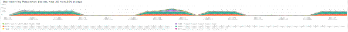
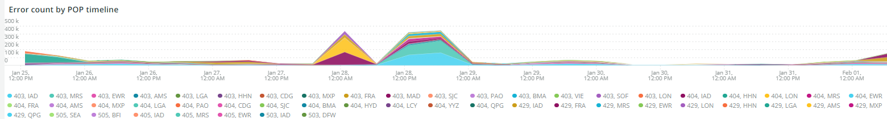

# Het tabblad [!UICONTROL CDN]

Dit tabblad bevat informatie die is gericht op de [!DNL content delivery network (CDN)] . In het geval van Adobe Commerce Cloud is dit de [!DNL Fastly] -service.

## [!UICONTROL HIT rate]

In het frame **[!UICONTROL HIT rate]** wordt het aantal cacheable-aanvragen weergegeven dat op het laatste moment tot [!UICONTROL HITS] heeft geleid. Dit geeft aan dat caching is gelukt. De pijl naar rechts toont het percentage boven of onder dezelfde tijd een week geleden.

## [!UICONTROL HIT Processing]

In dit vak **[!UICONTROL HIT processing]** ziet u het aantal cacheable-aanvragen dat in [!UICONTROL HITS] in de week heeft geresulteerd.

## [!UICONTROL MISS rate]

In dit vak **[!UICONTROL MISS rate]** ziet u het aantal mislukte aanvragen op het laatste moment. Een fout is wanneer het verzoek niet in het voorgeheugen ondergebracht is, en het verzoek moet aan de oorsprongserver worden overgegaan om de inhoud te dienen. De waarde aan het recht is de vergelijking van verhoging/daling aan het aantal minuten per minuut één week voorafgaand aan.

## [!UICONTROL MISS time]

## [!UICONTROL HIT Ratio]

## [!UICONTROL Error Percentage]

In het vak **[!UICONTROL Error Percentage]** wordt de waarde weergegeven van het percentage FOUT bij aanvragen en de relatieve toename/afname ten opzichte van dezelfde tijd een week eerder.

## [!UICONTROL Total Requests]

## [!UICONTROL ERROR rate]

## [!UICONTROL Fastly Cache Average Response for selected time period in seconds]

In dit frame wordt de duur in seconden van de cacheable-aanvragen weergegeven. Als een `cache_response` a [!UICONTROL MISS] is, wordt het gemiddelde voor gemiste cacheantwoorden voor de geselecteerde tijd weergegeven.

## [!UICONTROL Fastly Cache Average Response for selected time period in seconds, faceted by POP]

 worden beperkt

*POP* in deze context verwijst naar een Punt van Aanwezigheid (POP) dat aan functie als pool voor geheim voorgeheugenopslag wordt gevormd. Zie [ Punten van aanwezigheid ](https://developer.fastly.com/learning/concepts/pop/).

## [!UICONTROL Total Bandwidth (All POPs) during the selected timeframe, compared with 1 week ago (% increase/decrease)]

## [!UICONTROL Requests – Since selected timeframe compared with one week ago]

Dit kader is gelijkaardig aan de summiere doos voor [!UICONTROL Total Requests] bij de bovenkant, maar toont de de verzoektellingen van vorige weken. Dit zijn allemaal aanvragen, niet alleen cacheable aanvragen (waar `is_cacheable` true is).

## [!UICONTROL Response Count]

## [!UICONTROL Bandwidth by POP]

## [!UICONTROL Top 5 URLs (5xx or 3xx status codes)]

In de weergave **[!UICONTROL Top 5 URLs]** worden de bovenste 5 URL&#39;s weergegeven die een foutreactie van 5 x of 3 x hebben ondergaan. Vanwege de ruimtebeperking moet u de muis boven de URL houden om de specifieke foutcode te zien die aan die URL is gekoppeld. (bijvoorbeeld in het rode vak van de bovenstaande afbeelding).

## [!UICONTROL Top 25 URLs (200 status)]

In het frame **[!UICONTROL Top 25 URLs]** worden de URL&#39;s weergegeven die tijdens het geselecteerde tijdframe een 200-status hebben geretourneerd.

## [!UICONTROL Duration by Response Status]

In de grafiek **[!UICONTROL Duration by Response Status]** worden de reacties op de fouten weergegeven op aantal tijdens de geselecteerde tijdlijn, afhankelijk van de code voor de foutstatus.

## [!UICONTROL Duration by Response Status, top 25 urls]

In de grafiek **[!UICONTROL Duration by Response Status, top 25 URLs]** worden de bovenste 25 URL&#39;s weergegeven volgens de duur van de reactie in seconden. Mogelijk moet u de muisaanwijzer boven de URL houden om het volledige pad te kunnen zien. Klik ook op die URL om alle URL&#39;s behalve één URL te verwijderen. Vervolgens kunt u andere URL&#39;s toevoegen door er afzonderlijk op te klikken. Als u afzonderlijke URL&#39;s wilt verwijderen, kunt u de toets ingedrukt houden en op elke URL klikken om deze uit de grafiek te verwijderen.

## [!UICONTROL Duration by Response Status, top 25 non-200 status]

De grafiek van **[!UICONTROL Duration by Response Status, top 25 non-200 status]** is vergelijkbaar met de laatste grafiek, behalve dat de focus ligt op niet-200 statuscodes of foutstatuscodes. De foutcode en vervolgens de URL worden weergegeven. Mogelijk moet u de muisaanwijzer boven de URL houden om het volledige pad te kunnen zien. Klik ook op die URL om alle URL&#39;s behalve één URL te verwijderen. Vervolgens kunt u andere URL&#39;s toevoegen door er afzonderlijk op te klikken. Als u afzonderlijke URL&#39;s wilt verwijderen, kunt u de toets ingedrukt houden en op elke URL klikken om deze uit de grafiek te verwijderen.

## [!UICONTROL Error Count by POP timeline]

In de grafiek van **[!UICONTROL Error Count by POP timeline]** wordt het aantal statussen van fouten weergegeven in de geselecteerde tijdlijn van het tijdframe, afhankelijk van de foutcode.

## [!UICONTROL Duration by Response status, top 25 client IP, non-200 status]

De grafiek **[!UICONTROL Duration by Response status, top 25 client IP, non 200 status]** toont de IP adressen door de gemiddelde duur over het geselecteerde tijdsbestek waar er statusfoutcodes waren.

## [!UICONTROL IP Frequency]

Het frame **[!UICONTROL IP Frequency]** telt de statussen (&#39;MISS&#39; en &#39;PASS&#39;) voor elke IP vanuit de logboeken van [!DNL Fastly] . De verzoeken van het Web met deze statussen zullen de oorsprongsserver bereiken en zullen lading aan de server toevoegen. De top 20 van adressen in frequentie worden getoond. Dit kader kan worden gebruikt om IP aanvallen of bronnen van zware lading op een website te ontdekken. Deze grafiek is ook aanwezig op het samenvattingstabblad en wordt hier geplaatst voor een eenvoudige vergelijking met meer details over de loginformatie van [!DNL Fastly] die op dit tabblad wordt weergegeven.
