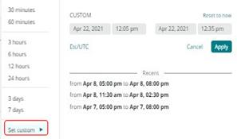
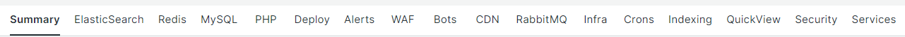

# De tabbladen [!UICONTROL focus] kiezen

De kracht van [!DNL Observation for Adobe Commerce] is het uitlijnen van een groot aantal verschillende gegevensweergaven op dezelfde tijdlijn. [!DNL Observation for Adobe Commerce] kan [!DNL New Relic] -agents presenteren met een verzameld gegevensvoorbeeld en een visuele weergave van systeem- en toepassingslogboeken. Als u over het oplossen van problemencomplexe problemen nadenkt, is het altijd over half-delende gegevens. Wanneer het bekijken van een kwestie op een chronologie, is de eerste vraag: &quot;Wanneer kwam dit voor?&quot; Van direct belang is alles wat er vóór dat moment is gebeurd. Als u precies weet wanneer de uitgave op de tijdlijn heeft plaatsgevonden, kunt u een tijdlijn selecteren vlak voor de uitgave. Mogelijk weet u niet meer wat de details van het probleem zijn, behalve dat uw site langzaam of langzaam is. Bij Adobe Commerce kunnen mogelijke verdachten componentservices, resourceniveaus en het aantal processen dat wordt uitgevoerd, omvatten.

Op de tabbladen van **[!UICONTROL focus]** vindt u informatie die u kan helpen zich te concentreren op gebieden die uw probleem veroorzaken of er een bijdrage aan leveren. U kunt ook voortdurend gegevenssignalen toevoegen aan [!DNL Observation for Adobe Commerce] . Gegevenssignalen kunnen [!DNL New Relic] verzamelde gegevens of tellingen van kritieke fasen, of foutenmeldingen van logboeken zijn. Aangezien foutberichten gecorreleerd zijn aan siteproblemen, kunnen ze worden toegevoegd aan de query&#39;s van [!DNL Observation for Adobe Commerce] om de weergave van kritieke informatie te verbeteren.

