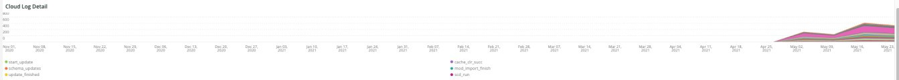

# De [!UICONTROL Deploy] tab

Dit lusje is een poging om kwesties en oorzaken van plaatsingsproblemen snel te isoleren.

## [!UICONTROL Deploy log Deployment Troubleshooter]

De **[!UICONTROL Deploy log Deployment Troubleshooter]** het kader toont een aantal gebeurtenissen van het plaatsingslogboek die over het geselecteerde timeframe voorkwamen. De bedoeling is een overzichtsweergave van implementatieactiviteiten te bieden en de complexiteit van de implementatie door de telling te bepalen. De meer geregistreerde berichten, complexer de plaatsing typisch is.

## [!UICONTROL Deploy State]

De **[!UICONTROL Deploy State]** frame toont de implementatiegebeurtenissen die zich tijdens het geselecteerde tijdframe hebben voorgedaan. De parser voor dit kader zoekt naar deze specifieke signalen:

* &#39;`%NOTICE: Starting generate command%`&#39;) als`start_gen`&#39;
* &#39;`%git apply /app/vendor/magento/ece-tools/patches%`&#39;) als`apply_patches`&#39;
* &#39;`%Set flag: .static_content_deploy%`&#39;) als`SCD`&#39;
* &#39;`%NOTICE: Generate command completed%`&#39;) als`gen_compl`&#39;
* &#39;`%NOTICE: Starting deploy.%`&#39;) als`start_deploy`&#39;
* &#39;`%NOTICE: Deployment completed%`&#39;) als`deploy_compl`&#39;
* &#39;`%NOTICE: Starting post-deploy.%`&#39;) als`start_pdeploy`&#39;
* &#39;`%NOTICE: Post-deploy is complete%`&#39;) als`pdeploy`&#39;
* &#39;`%deploy-complete%`&#39;) als`cl_deploy_compl`&#39;

## [!UICONTROL Deploy Log Detail]

De **[!UICONTROL Deploy Log Detail]** Het kader toont de summiere details van het plaatsingslogboekbericht die over het geselecteerde tijdkader voorkwamen. Het kader ontleedt voor de volgende koorden in de plaatsingslogboeken:

* &#39;`%NOTICE: Starting deploy.%`&#39;) als`start_dply`&#39;
* &#39;`%INFO: Starting scenario(s): scenario/deploy.xml%`&#39;) als`start_scenario`&#39;
* &#39;`%NOTICE: Starting pre-deploy%`&#39;) als`strt_predply`&#39;
* &#39;`%INFO: Restoring patch log file%`&#39;) als`rstr_ptch_log`&#39;
* &#39;`%INFO: Updating cache configuration.%`&#39;) als`updt_cach_config`&#39;
* &#39;`%INFO: Set Redis slave connection%`&#39;) als`redis_sec_conn_set`&#39;
* &#39;`%INFO: Static content deployment was performed during build hook, cleaning old content%`&#39;) als`scd_build_hk`&#39;
* &#39;`%INFO: Clearing pub/static%`&#39;) als`clr_pub_static`&#39;
* &#39;`%NFO: Clearing redis cache:%`&#39;) als`clr_redis_cach`&#39;
* &#39;`%INFO: Clearing var/cache directory%`&#39;) als`clr_var_cach`&#39;
* &#39;`%NOTICE: Enabling Maintenance mode%`&#39;) als`enable_maint_mode`&#39;
* &#39;`%INFO: Disable cron%`&#39;) als`disable_cron`&#39;
* &#39;`%INFO: Trying to kill running cron jobs and consumers processes%`&#39;) als`kill_cron_try`&#39;
* &#39;`%INFO: Running Adobe Commerce cron and consumers processes were not found.%`&#39;) als`no_cron_fnd`&#39;
* &#39;`%NOTICE: Validating configuration%`&#39;) als`validate_config`&#39;
* &#39;`%The following admin data is required to create an admin user during initial installation%`&#39;) als`no_admin`&#39;
* &#39;`%recommended PHP version satisfying the constraint%`&#39;) als`php_ver_constraint`&#39;
* &#39;`%WARNING: Fix configuration with given suggestions:%`&#39;) als`fix_config_sugg`&#39;
* &#39;`%WARNING: [2003] The directory nesting level value for error reporting has not been configured.%`&#39;) als`nest_err_reporting`&#39;
* &#39;`%NOTICE: End of validation%`&#39;) als`end_validation`&#39;
* &#39;`%NOTICE: Starting update.%`&#39;) als`start_update`&#39;
* &#39;`%INFO: Updating env.php.%`&#39;) als`update_php_env`&#39;
* &#39;`%INFO: Updating env.php DB connection configuration.%`&#39;) als`update_php_env_db`&#39;
* &#39;`%INFO: Updating env.php AMQP configuration%`&#39;) als`update_php_env_amqp`&#39;
* &#39;`%INFO: Set search engine to: elasticsearch7%`&#39;) als`set_elastic7`&#39;
* &#39;`%elasticsearch 6.5.4 has passed EOL%`&#39;) als`elastic_ver_EOL`&#39;
* &#39;`%INFO: Set search engine to: elasticsearch6%`&#39;) als`set_elastic6`&#39;
* &#39;`%INFO: Updating secure and unsecure URLs%`&#39;) als`update_urls`&#39;
* &#39;`%INFO: Running setup upgrade.%`&#39;) als`setup_upgrade_run`&#39;
* &#39;`%INFO: Post-deploy hook enabled. Cron enabling, cache cleaning, and pre-warming operations are postponed%`&#39;) als`post_hook_enabled`&#39;
* &#39;`%NOTICE: Maintenance mode is disabled.%`&#39;) als`maint_mode_disabled`&#39;
* &#39;`%INFO: Scenario(s) finished%`&#39;) als`scenario_finished`&#39;
* &#39;`%WARNING: Command maintenance:enable finished with an error. Creating a maintenance flag file%`&#39;) als`enable_maintenance_fail`&#39;
* &#39;`%MySQL server has gone away%`&#39;) als`MySQL_has_gone_away`&#39;

## [!UICONTROL Post Deploy Log Detail]

De **[!UICONTROL Post Deploy Log Detail]** het kader toont de post-opstellings logboekdetails die over het geselecteerde tijdkader voorkwamen. Dit kader is geconcentreerd op bepaalde logboekberichten die de volgende koorden bevatten:

* &#39;`%Disabled maintenance mode%`&#39;) als`disabled_maint_mode`&#39;
* &#39;`%INFO: Starting scenario(s): scenario/post-deploy.xml%`&#39;) als`start_pstdply_scenario`&#39;
* &#39;`%NOTICE: Validating configuration%`&#39;) als`val_config`&#39;
* &#39;`%NOTICE: End of validation%`&#39;) als`end_val_config`&#39;
* &#39;`%INFO: Enable cron%`&#39;) als`cron_enabled`&#39;
* &#39;`%INFO: Create backup of important files.%`&#39;) als`file_backup`&#39;
* &#39;`%INFO: Successfully created backup%`&#39;) als`file_backup_success`&#39;
* &#39;`%INFO: Starting page warming up%`&#39;) als`pg_warmup_start`&#39;
* &#39;`%INFO: Warmed up page:%`&#39;) als`warmed_up_pg`&#39;
* &#39;`%ERROR: Warming up failed:%`&#39;) als`warm_up_pg_err`&#39;
* &#39;`%INFO: Scenario(s) finished%`&#39;) als`scenario_finished`&#39;

## [!UICONTROL Cloud Log Detail]

De **[!UICONTROL Cloud Log Detail]** frame geeft de gegevens van het cloudlog weer die tijdens het geselecteerde tijdsbestek zijn opgetreden. De volgende tekenreeksen worden geparseerd en geretourneerd met het label &#39;AS&#39; hieronder:

* &#39;`%DEBUG: /bin/bash -c "set -o pipefail; php ./bin/magento setup:upgrade%`&#39;) als`start_update`&#39;
* &#39;`%Schema creation/updates:%`&#39;) als`schema_updates`&#39;
* &#39;`%Nothing to import.%`&#39;) als`mod_import_finish`&#39;
* &#39;`%NOTICE: End of update.%`&#39;) als`update_finished`&#39;
* &#39;`%DEBUG: Running step: deploy-static-content%`&#39;) als`scd_run`&#39;
* &#39;`%NOTICE: Skipping static content deploy. SCD on demand is enabled.%`&#39;) als`scd_ondemand`&#39;
* &#39;`%INFO: Clearing%`&#39;) als`clr_dirs`&#39;
* &#39;`%DEBUG: Step "deploy-static-content" finished%`&#39;) als`scd_finished`&#39;
* &#39;`%NOTICE: Skipping static content compression. SCD on demand is enabled.%`&#39;) als`scd_compression_run`&#39;
* &#39;`%INFO: Clearing var/cache directory%`&#39;) als`clr_var_cach`&#39;
* &#39;`%DEBUG: Step "compress-static-content" finished%`&#39;) als`scd_compression_finished`&#39;
* &#39;`%DEBUG: Running step: deploy-complete%`&#39;) als`deploy_finished`&#39;
* &#39;`%INFO: Post-deploy hook enabled. Cron enabling, cache cleaning, and pre-warming operations are postponed to post-deploy stage.%`&#39;) als`Post_deploy_hook_enabled`&#39;
* &#39;`%NOTICE: Maintenance mode is disabled.%`&#39;) als`maint_mode_disabled`&#39;
* &#39;`%INFO: Scenario(s) finished%`&#39;) als`scenario_finished`&#39;
* &#39;`%post-deploy.xml%`&#39;) als`post_deploy_start`&#39;
* &#39;`%NOTICE: Validating configuration%`&#39;) als`validate_config`&#39;
* &#39;`%WARNING: [2003] The directory nesting level value for error reporting has not been configured.%`&#39;) als`nest_err_reporting`&#39;
* &#39;`%NOTICE: End of validation%`&#39;) als`end_validation`&#39;
* &#39;`%INFO: Enable cron%`&#39;) als`enable_cron`&#39;
* &#39;`%INFO: Create backup of important files%`&#39;) als`create_backup`&#39;
* &#39;`%DEBUG: Step "backup" finished%`&#39;) als`backup_finished`&#39;
* &#39;`%INFO: Starting page warming up%`&#39;) als`warmup_start`&#39;
* &#39;`%ERROR: Warming up failed:%`&#39;) als`warm_up_fail`&#39;
* &#39;`%DEBUG: Step "warm-up" finished%`&#39;) als`warmup_finished`&#39;
* &#39;`%DEBUG: Step "time-to-first-byte" finished%`&#39;) als`ttfb_finished`&#39;
* &#39;`%INFO: Scenario(s) finished%`&#39;) als`post_deploy_finished`&#39;
* &#39;`%DEBUG: Running step: pre-build%`&#39;) als`run_pre-build`&#39;
* &#39;`%DEBUG: Flag .static_content_deploy has already been deleted%`&#39;) als`scd_flag_del`&#39;
* &#39;`%DEBUG: Step "pre-build" finished%`&#39;) als`pre-build_completed`&#39;
* &#39;`%NOTICE: Applying patches%`&#39;) als`apply_patches`&#39;
* &#39;`%has been applied%`&#39;) als`patches_applied`&#39;
* &#39;`%DEBUG: Step "apply-patches" finished%`&#39;) als`apply_patches_complete`&#39;
* &#39;`%Deploy using quick strategy%`&#39;) als`quick_strategy_deploy`&#39;
* &#39;`%NOTICE: Running DI compilation%`&#39;) als`di_compliation_start`&#39;
* &#39;`%NOTICE: End of running DI compilation%`&#39;) als`di_compliation_finished`&#39;
* &#39;`%NOTICE: Generating fresh static content%`&#39;) als`gen_frsh_static_content`&#39;
* &#39;`%magento setup:static-content:deploy%`&#39;) als`scd_executing`&#39;
* &#39;`%NOTICE: End of generating fresh static content%`&#39;) als`gen_frsh_static_cont_finished`&#39;
* &#39;`%INFO: Starting scenario(s): scenario/build/transfer.xml%`&#39;) als`start_transferxml`&#39;
* &#39;`%INFO: Trying to kill running cron jobs%`&#39;) als`kill_crons`&#39;
* &#39;`%INFO: Clearing redis cache:%`&#39;) als`clear_redis_cache`&#39;
* &#39;`%INFO: Checking if db exists and has tables%`&#39;) als`db_check`&#39;
* &#39;`%WARNING: [2010] Elasticsearch service is installed at infrastructure layer, but is not used as a search engine.%`) als &#39;`es_not_used`&#39;
* &#39;`%NOTICE: Starting update.%`&#39;) als`starting_update`&#39;
* &#39;`%INFO: Set search engine to: mysql%`&#39;) als`mysql_search`&#39;
* &#39;`%SQLSTATE[HY000] [2006] MySQL server has gone away%`&#39;) als`mysql_gone`&#39;

## [!UICONTROL Count of modules imported during deploy]

De **[!UICONTROL Count of modules imported during deploy]** frame toont het aantal modules dat tijdens plaatsing over het geselecteerde tijdkader wordt ingevoerd.

## [!UICONTROL Deployed module list]

De **[!UICONTROL Deployed module list]** het kader toont opgestelde modules over geselecteerde timeframe.
