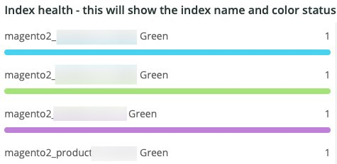

# De [!UICONTROL Elasticsearch] tab

## [!UICONTROL Cluster Status Summary]:

Tijdens de geselecteerde periode wordt de **[!UICONTROL Cluster Status Summary]** frame geeft de kleurstatus weer van de [!DNL Elasticsearch] cluster is voorbij. In dit voorbeeld was de cluster tijdens het geselecteerde tijdframe één keer groen en één keer geel in de status Geel tijdens het geselecteerde tijdframe.

## [!UICONTROL Active Primary Shards]

De **[!UICONTROL Active Primary Shards]** frame geeft de verschillende getallen weer, afhankelijk van het aantal actieve primaire kaarten voor de geselecteerde account [!DNL Elasticsearch] service.

Van [!DNL Elasticsearch]: De definitieve gids [2,x]:

&quot;In [Dynamisch bijwerken van indexen](https://www.elastic.co/guide/en/elasticsearch/guide/2.x/dynamic-indices.html), hebben we uitgelegd dat een spek een Lucene-index is en dat een [!DNL Elasticsearch] index is een verzameling van scheepskaarten. Uw toepassing praat met een index, en [!DNL Elasticsearch] leidt uw verzoeken naar de aangewezen plaatsen. Een plank is de schaaleenheid. De kleinste index die u kunt hebben, is één met één enkele ruit. Dit kan meer dan voldoende zijn voor je behoeften — één enkele kaart kan veel gegevens bevatten — maar het beperkt je mogelijkheden om te schalen.&quot;

Wanneer een index wordt gecreeerd, zijn er verscheidene kaarten die met die index worden gecreeerd. Door gebrek, worden vijf primaire plaatsen toegewezen aan elke nieuwe index, die betekent dat een index over vijf knopen (één shard per knoop) kan worden verspreid. Er zijn ook replicaplanken. Deze zijn hoofdzakelijk voor failover. Replica-kaarten kunnen worden gebruikt voor leesverzoeken.

## [!UICONTROL Active Shards in Cluster]

De **[!UICONTROL Active Shards in Cluster]** frame geeft het totale aantal primaire en replicaweergaven in een [!DNL Elasticsearch] cluster.

## [!UICONTROL Index health - this will show the index name and color status]

In dit frame worden de naam van de index en het aantal statussen van de indexkleur weergegeven. Als u de tabel omlaag schuift, ziet u dezelfde indexnaam met de kleurstatus Geel en Rood. Het getal dat volgt op de 27 indexnaam is het getal van de statuskleur. Als de waarde nul is, waren er geen gevallen waarin de index zich in die kleurstatus bevond tijdens de geselecteerde tijdframes.

## [!UICONTROL Elasticsearch Status by node information]

De **[!UICONTROL Elasticsearch Status by node information]** frame toont de [!DNL Elasticsearch] clusterstatus per kleur en per knooppunt. Hiermee kunt u aangeven welk knooppunt in het dialoogvenster [!DNL Elasticsearch] wordt de status van de geselecteerde tijdlijn geretourneerd.

## [!UICONTROL Elasticsearch index information]

De **[!UICONTROL Elasticsearch index information]** de lijst toont de indexnaam, welke knoop het is, het aantal geïndexeerde documenten, de indexgezondheid, en de indexgrootte in MB op een bepaald ogenblik.

## [!UICONTROL Elasticsearch process CPU %]

De **[!UICONTROL Elasticsearch process CPU %]** frame toont het CPU-percentage van het proces door de [!DNL Elasticsearch] proces over het geselecteerde tijdkader.

## [!UICONTROL Elasticsearch Memory garbage collection]

[!DNL Elasticsearch] is een Java-proces. Als het op toegewezen geheugen laag loopt, zal het huisvuilinzameling in werking stellen om geheugen vrij te maken. Als de huisvuilinzameling frequent is, is het een aanwijzing dat er teveel indexen of schepen voor het toegewezen geheugen kunnen zijn. Er kan een mogelijkheid zijn om de indices en de borden op te schonen of [!DNL Elasticsearch] heeft mogelijk meer geheugen nodig.

## [!UICONTROL Elasticsearch Index information]

Wanneer indexen worden gemaakt en bijgewerkt, kan de indexstatus veranderen.

## [!UICONTROL Elasticsearch Index Size]

De **[!UICONTROL Elasticsearch Index Size]** frame geeft de naam en de grootte van de index voor het geselecteerde tijdframe aan. Het kan problemen met de manier aangeven waarop een site wordt geïndexeerd.

## [!UICONTROL Elasticsearch Errors]

De **[!UICONTROL Elasticsearch Errors]** frame geeft fouten weer met [!DNL Elasticsearch] Net als wanneer er onvoldoende ruimte is, schakelt u over van de status Geel naar Rood, wanneer alle kaarten mislukken, wanneer er parameterproblemen zijn met zoekopdrachten, versiefouten en wanneer alle knooppunten niet beschikbaar zijn.

## [!UICONTROL Elasticsearch Unassigned Shards]:

Niet toegewezen planken zorgen ervoor dat een cluster overschakelt van de status Groen naar de status Geel.
