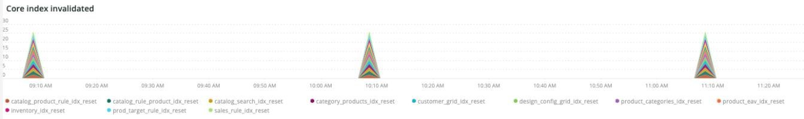
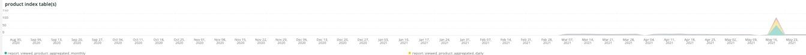

# De [!UICONTROL Indexing] tab

De **[!UICONTROL Indexing]** het lusje probeert om kwesties met het indexeren te verklaren en potentiële oorzaken te identificeren.

## [!UICONTROL Core index invalidated]

De **[!UICONTROL Core index invalidated]** frame bekijkt het indexeren van validatie over een geselecteerd tijdkader. Als indexeren gelijktijdig met andere middel-intensief gebeurt [!DNL crons], zal het een zware last op de plaatshulpmiddelen plaatsen.

* `%Catalog Product Rule indexer has been invalidated%`) als `catalog_product_rule_idx_reset`
* `%Catalog Rule Product indexer has been invalidated%`) als `catalog_rule_product_idx_reset`
* `%Catalog Search indexer has been invalidated%`) als `catalog_search_idx_reset`
* `%Category Products indexer has been invalidated%`) als `category_products_idx_reset`
* `%Customer Grid indexer has been invalidated%`) als `customer_grid_idx_reset`
* `%Design Config Grid indexer has been invalidated%`) als `design_config_grid_idx_`
* `%Product Categories indexer has been invalidated%`) als `product_categories_idx_reset`
* `%Product EAV indexer has been invalidated%`) als `product_eav_idx_reset`
* `%Product Price indexer has been invalidated%`) als `product_price_idx_reset`
* `%Stock indexer has been invalidated%`) als `stock_idx_reset`
* `%Inventory indexer has been invalidated%`) als `inventory_idx_reset`
* `%Inventory indexer has been invalidated%`) als `inventory_idx_reset`
* `%Sales Rule indexer has been invalidated%`) als `sales_rule_idx_reset`

## [!UICONTROL Core index rebuilds]

De **[!UICONTROL Core index rebuilds]** frame bekijkt de rebuilds van de kernindex over een geselecteerd tijdkader. Hier volgen de tekenreeksen die vanuit de logbestanden worden geparseerd om aan te geven dat de index opnieuw is samengesteld.

* `%Catalog Product Rule index has been rebuilt%`) als `catalog_product_rule_idx`
* `%Catalog Rule Product index has been rebuilt%`) als `catalog_rule_product_idx`
* `%Catalog Search index has been rebuilt%`) als `catalog_search_idx`
* `%Category Products index has been rebuilt successfully%`) als `category_products_idx`
* `%Customer Grid index has been rebuilt%`) als `customer_grid_idx`
* `%Design Config Grid index has been rebuilt%`) als `design_config_grid_idx`
* `%Product Categories index has been rebuilt%`) als `product_categories_idx`
* `%Product EAV index has been rebuilt%`) als `product_eav_idx`
* `%Product Price index has been rebuilt%`) als `product_price_idx`
* `%Stock index has been rebuilt%`) als `stock_idx`
* `%Inventory index has been rebuilt successfully%`) als `inventory_idx`
* `%Product/Target Rule index has been rebuilt successfully%`) als `prod_target_rule_idx`
* `%Sales Rule index has been rebuilt successfully%`) als `sales_rule_idx`

## [!UICONTROL catalogsearch index table(s)]

De **[!UICONTROL catalogsearch index table(s)]** frame bekijkt catalogusindextabellen in een geselecteerd tijdkader. Deze vraag bekijkt de duur van om het even welke datastore verrichtingen tegen lijsten met `%catalogsearch%` in de tabelnaam.

## [!UICONTROL product index table(s)]

De **[!UICONTROL product index table(s)]** frame bekijkt de tabellen van de productindex over een geselecteerd tijdsbestek. Deze vraag bekijkt de duur van om het even welke datastore verrichtingen tegen lijsten met `%product%` in de tabelnaam.
