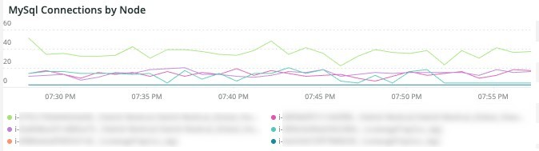
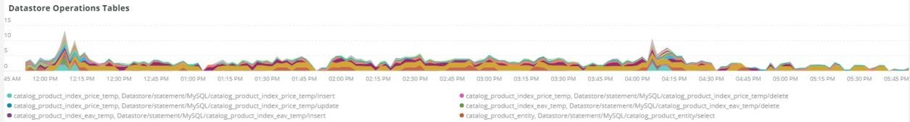

# Het tabblad [!UICONTROL MySQL]

## [!UICONTROL MySQL% free storage by node]

Veel problemen worden veroorzaakt doordat MySQL onvoldoende opslagruimte heeft in de opslag die is toegewezen aan MySQL (`datadir` MySQL configuratie setting, default is `/data/mysql` ) of doordat `tmpdir` onvoldoende opslagruimte heeft. De standaardwaarde `tmpdir` (MySQL-instelling) is `/tmp` . In het **[!UICONTROL MySQL% free storage by node]** -frame wordt gekeken naar `/, /tmp` (als dit als een aparte hoeveelheid wordt gedefinieerd) en het `/data/mysql` -percentage voor vrije opslag. Niet-gecomprimeerde `tmp` tabellen worden vanaf MySQL versie 5.7 (MariaDB versie 10.2) naar een `tmp` tabelruimte in de map `/data/mysql` in het bestand (ibtmp1) geschreven. Dit bestand wordt standaard automatisch zonder limiet uitgebreid. Aangezien het een tabelruimte is, neemt de grootte niet af en wordt de waarde weer ingesteld op 12 MB wanneer MySQL opnieuw wordt gestart.

## [!UICONTROL MySQL Connections by Node]

Het frame **[!UICONTROL MySQL Connections by Node]** geeft periodes van uitval van databaseknooppunten of grote volumes verbindingen aan.

## [!UICONTROL MySQL Node Summary]

In de tabel **[!UICONTROL MySQL Node Summary]** worden de details van databaseknooppunten weergegeven, zoals de softwareversie en het instantietype (grootte).

## [!UICONTROL Galera Number of Nodes in cluster]

In het frame **[!UICONTROL Galera Number of Nodes in cluster]** wordt informatie uit de MySQL-logboeken weergegeven. Als knooppunten zich aansluiten bij een cluster en dit verlaten, worden alleen de berichten voor het geselecteerde tijdframe weergegeven. Als een knooppunt de cluster verlaat vóór het tijdframe, bestaat er geen bericht tijdens dat tijdframe. Als u vermoedt dat de database te kort loopt voor een knooppunt, breidt u de tijdlijn uit naar een langere periode om te zien of u aanvullende informatie kunt zien. Als er tijdens de tijdsperiode informatie is die minder aangeeft dan alle knooppunten in de [!DNL Galera] -cluster, vouwt u het tijdframe uit om te zien of u kunt bepalen wanneer het knooppunt de cluster heeft verlaten.

## [!UICONTROL MySQL shutdowns and starts]

Het frame **[!UICONTROL MySQL shutdowns and starts]** detecteert wanneer een knooppunt wordt afgesloten. De [!DNL Galera] -knooppunten worden verwijderd en worden automatisch verwijderd uit het knooppunt [!DNL Galera] . Dit zal typisch in een nieuw begin van de dienst MySQL resulteren.

## [!UICONTROL Galera log]

In het frame **[!UICONTROL Galera log]** worden de tellingen weergegeven van bepaalde signalen uit de MySQL-logboeken met betrekking tot [!DNL Galera] -knooppunten, hun statussen en de statuswijzigingen van de [!DNL Galera] -cluster.

* &#39;%1047 WSREP heeft nog geen knooppunt voor toepassingsgebruik%&#39;) als &#39;node_not_prep_for_use&#39; voorbereid
* &#39;%\[ERROR\] WSREP: Kan niet lezen van: wsrep_sst_xtrabackup-v2%&#39;) als &#39;xtrabackup_read_fail&#39;
* &#39;%\[ERROR\] WSREP: Proces voltooid met fout: wsrep_sst_xtrabackup-v2 %&#39;) als &#39;xtrabackup_compl_w_err&#39;
* &#39;%\[ERROR\] WSREP: rbr write fail%&#39;) als &#39;rbr_write_fail&#39;
* &#39;%self-leave%&#39;) als &#39;susp_node&#39;
* &#39;%members = 3/3 (join/total)%&#39;) as&#39;3of3&#39;
* &#39;%members = 2/3 (join/total)%&#39;) as&#39;2of3&#39;
* &#39;%members = 2/2%&#39;) als &#39;2of2&#39;
* &#39;%members = 1/2%&#39;) als &#39;1of2&#39;
* &#39;%members = 1/3%&#39;) als &#39;1of3&#39;
* &#39;%members = 1/1%&#39;) als &#39;1of1&#39;
* &quot;%\[Opmerking\] /usr/sbin/mysqld (mysqld 10.%&#39;) as&#39;sql_start&#39;
* &#39;%Quorum: Geen knooppunt met volledige status:%&#39;) als &#39;no_node_count&#39;
* &#39;%WSREP: lid 0%&#39;) als &#39;mem_0&#39;
* &#39;%WSREP: Lid 1.0%&#39;) als &#39;mem_1&#39;
* &#39;%WSREP: lid 2%&#39;) as&#39;mem2&#39;
* &#39;%WSREP: gesynchroniseerd met groep, gereed voor verbindingen%&#39;) als &#39;ready&#39;
* &#39;%/usr/sbin/mysqld, Version:%&#39;) als &#39;mysql_start_mysql.slow&#39;
* &#39;%\[Opmerking\] WSREP: Nieuwe clusterweergave: globale status:%&#39;) als &#39;galera_cluster_view_change&#39;

## [!UICONTROL Galera Log by Host]

Het **[!UICONTROL Galera Log by Host]** -frame is hetzelfde als het **[!UICONTROL Galera log]** -frame, behalve dat het frame wordt uitgesplitst per knooppunt voor hulp bij het oplossen van problemen.

## [!UICONTROL Database performance]

In het **[!UICONTROL Database performance]** -frame worden de databaseprestaties tijdens specifieke aanvragen weergegeven. U kunt elke meting zien door erop te klikken in de gekleurde pictogrammen onder de grafiek. Veel van de metriek die in [ wordt geroepen de Prestaties van het Gegevensbestand MySQL van de Controle met New Relic ](https://newrelic.com/blog/how-to-relic/how-to-monitor-mysql) wordt gevonden in dit kader.

* average(query.queryPerSecond)
* average(query.slowQueriesPerSecond)
* average(db.createdTmpDiskTablesPerSecond)
* average(db.createdTmpFilesPerSecond)
* average(db.tablesLocksWaitedPerSecond)
* average(db.innodb.rowLockTimeAvg)
* average(db.innodb.rowLockWaitsPerSecond)

## [!UICONTROL Transaction Database Call Count]

In het frame **[!UICONTROL Transaction Database Call Count]** wordt het aantal databaseaanroepen weergegeven dat door elke transactiefacet wordt uitgevoerd. Dit lijkt rijgeoriënteerd te zijn en geen verklaringen.

## [!UICONTROL Cron_schedule table updates]

Het frame **[!UICONTROL Cron_schedule table updates]** geeft de maximale duur weer van databaseupdates naar de tabel cron_planning voor de geselecteerde tijdsperiode.

## [!UICONTROL Slow Query Traces]

In het frame **[!UICONTROL Slow Query Traces]** worden de tabel en het aanvraagtype weergegeven waarin trage querysporen voorkomen. Een langzaam vraagspoor wordt gecreeerd voor vraagtransacties die langer dan vijf seconden duren. Van belang voor dit kader zijn de updatequery&#39;s. Als een tabel door de instructies `UPDATE` , `DELETE` en `INSERT` wordt bijgewerkt, kunnen deze gedurende een bepaalde periode tabellen vergrendelen.

Even `SELECT` instructies kunnen rijen vergrendelen bij gebruik met FOR UPDATE.

## [!UICONTROL Datastore Operations tables]

## [!UICONTROL Cron table change]

Het **[!UICONTROL Cron table change]** -frame zoekt naar &#39;kan geen vergrendeling voor een snijtaak verkrijgen:&#39;-foutberichten, samen met een specifieke PHP-geheugenfout en vergrendelingen voor de `cron_schedule` -tabel. Als de `cron_schedule` -tabel is vergrendeld (bijvoorbeeld door een `DELETE` -query die ertegen wordt uitgevoerd), blokkeert deze de uitvoering van andere koronnen.

## [!UICONTROL Deadlocks]

In het frame **[!UICONTROL Deadlocks]** worden de volgende tekenreeksen uit de MySQL-logboeken geparseerd:

* &#39;%PHP Fatale error: allowed memory size of%&#39;) as php_mem_error
* &#39;%get lock; probeer transactie opnieuw te starten, query was: DELETE FROM \&#39;cron_planning%&#39;) as cron_sched_lock_del
* &#39;% vergrendeling voor snijtaak: indexer_reindex_all_invalid%&#39;) als &#39;lock_indexer_reindex_all_invalid%&#39;
* &#39;% vergrendeling voor uitsnijdtaak: cron_planning%&#39;) als &#39;lock_cron_planning&#39;
* &#39;% vergrendeling voor uitsnijdtaak:%&#39;) als &#39;total_cron_lock&#39;
* &#39;%Algemene fout: 1205 Vergrendelingstijd overschreden%&#39;) als &#39;sql_1205_lock&#39;
* &#39;%ERROR 1213 (40001): Deadlock found when try get lock%&#39;) als &#39;sql_1213_lock&#39;
* &#39;%SQLSTATE [ 40001 ]: De mislukking van de rangschikking: 1213 Deadlock found%&#39;) als &quot;sql_1213_lock2&#39;
* &#39;% vergrendeling voor snijtaak: indexer_update_all_views%&#39;) als &#39;lock_indexer_update_all_views&#39;
* &#39;% vergrendeling voor uitsnijdtaak: verkoop_grid_order_factuur_async_insert%&#39;) als &#39;lock_sales_grid_order_factuur_async_insert&#39;,
* &#39;% vergrendeling voor uitsnijdtaak: staging_remove_updates%&#39;) als &#39;lock_staging_remove_updates&#39;
* &#39;% vergrendeling voor uitsnijdtaak: sales_grid_order_dispatch_async_insert%&#39;) als &#39;lock_sales_grid_order_dispatch_async_insert&#39;
* &#39;% vergrendeling voor uitsnijdtaak: amazon_payments_process_queue_restitued%&#39;) als &#39;lock_amazon_payments_process_queue_restitued&#39;
* &#39;% vergrendeling voor uitsnijdtaak: verkoop_send_order_dispatch_emails%&#39;) als &#39;lock_sales_send_order_dispatch_emails&#39;
* &#39;% vergrendeling voor uitsnijdtaak: staging_synchronize_entities_period%&#39;) als &#39;lock_staging_synchronize_entities_period&#39;
* &#39;% vergrendeling voor uitsnijdtaak: indexer_clean_all_changelogs%&#39;) als &#39;lock_indexer_clean_all_changelogs&#39;
* &#39;% vergrendeling voor snijtaak: magento_target_rule_index_reindex%&#39;) als &#39;lock_magento_target_rule_index_reindex&#39;
* &#39;% vergrendeling voor snijtaak: nieuwsbrief_send_all%&#39;) als &#39;lock_newsletter_send_all&#39;
* &#39;% vergrendeling voor snijtaak: nieuwsbrief_send_all%&#39;) als &#39;lock_newsletter_send_all&#39;
* &#39;% vergrendeling voor uitsnijdtaak: verkoop_send_order_emails%&#39;) als &#39;lock_sales_send_order_emails&#39;
* &#39;% vergrendeling voor uitsnijdtaak: sales_send_order_creditmemo_emails%&#39;) als &#39;lock_sales_send_order_creditmemo_emails&#39;
* &#39;% vergrendeling voor snijtaak: sales_grid_order_creditmemo_async_insert%&#39;) als &#39;lock_sales_grid_order_creditmemo_async_insert&#39;
* &#39;% vergrendeling voor uitsnijdtaak: bulk_Cleup%&#39;) als &#39;lock_bulk_Cleup&#39;
* &#39;% vergrendeling voor uitsnijdtaak: flush_preview_quota%&#39;) als &#39;lock_flush_preview_quota&#39;
* &#39;% vergrendeling voor uitsnijdtaak: verkoop_send_order_factuur_emails%&#39;) als &#39;lock_sales_send_order_factuur_emails&#39;
* &#39;% vergrendeling voor uitsnijdtaak: verkoop_send_order_factuur_emails%&#39;) als &#39;lock_sales_send_order_factuur_emails&#39;
* &#39;% vergrendeling voor uitsnijdtaak: captcha_delete_expired_images%&#39;) als &#39;lock_captcha_delete_expired_images&#39;
* &#39;% vergrendeling voor uitsnijdtaak: magento_newrelicreporting_cron%&#39;) als &#39;lock_magento_newrelicreporting_cron&#39;
* &#39;% vergrendeling voor uitsnijdtaak: verouderd_authentication_failure_Cleup%&#39;) als &#39;lock_outdated_authentication_failure_Cleup&#39;
* &#39;% vergrendeling voor uitsnijdtaak: send_notification%&#39;) als &#39;lock_send_notification&#39;
* &#39;% vergrendeling voor snijtaak: magento_giftcardaccount_generage_codes_pool%&#39;) als &#39;lock_magento_giftcardaccount_generage_codes_pool&#39;
* &#39;% vergrendeling voor uitsnijdtaak: catalog_product_frontend_actions_flush%&#39;) als &#39;lock_catalog_product_frontend_actions_flush&#39;
* &#39;% vergrendeling voor uitsnijdtaak: mysqlmq_clean_messages%&#39;) als &#39;mysqlmq_clean_messages&#39;
* &#39;% vergrendeling voor snijtaak: catalog_product_attribute_value_synchronize%&#39;) als &#39;lock_catalog_product_attribute_value_synchronize&#39;
* &#39;% vergrendeling voor snijtaak: ddg_automation_importer%&#39;) als &#39;lock_ddg_automation_importer&#39;
* &#39;% vergrendeling voor snijtaak: ddg_automation_reviews_and_wishlist%&#39;) als &#39;lock_ddg_automation_reviews_and_wishlist&#39;
* &#39;% vergrendeling voor uitsnijdtaak: captcha_delete_old_try%&#39;) als &#39;lock_captcha_delete_old_Try&#39;
* &#39;% vergrendeling voor uitsnijdtaak: catalog_product_outdated_price_values_clean%&#39;) als &#39;lock_catalog_product_outdated_price_values_cleanUp&#39;
* &#39;% vergrendeling voor snijtaak: consumer_runner%&#39;) als &#39;lock_consumer_runner&#39;
* &#39;% vergrendeling voor uitsnijdtaak: ddg_automation_customer_subscriber_gast_sync%&#39;) als &#39;lock_ddg_automation_customer_subscriber_gast_sync&#39;
* &#39;% vergrendeling voor uitsnijdtaak: get_amazon_capture_updates%&#39;) als &#39;lock_get_amazon_capture_updates&#39;
* &#39;% vergrendeling voor snijtaak: get_amazon_authentication_updates%&#39;) als &#39;lock_send_get_amazon_authentication_updates&#39;
* &#39;% vergrendeling voor snijtaak: temando_process_platform_events%&#39;) als &#39;lock_temando_process_platform_events&#39;
* &#39;% vergrendeling voor snijtaak: ddg_automation_status%&#39;) als &#39;lock_ddg_automation_status&#39;
* &#39;% vergrendeling voor snijtaak: ddg_automation_status%&#39;) als &#39;lock_ddg_automation_status&#39;
* &#39;% vergrendeling voor uitsnijdtaak: verkoop_clean_orders%&#39;) als &#39;lock_sales_clean_orders&#39;
* &#39;% vergrendeling voor uitsnijdtaak: catalog_index_refresh_price%&#39;) als &#39;lock_catalog_index_refresh_price&#39;
* &#39;% vergrendeling voor uitsnijdtaak: magento_return_balance_warning_notification%&#39;) als &#39;lock_magento_promise_balance_warning_notification&#39;
* &#39;% vergrendeling voor uitsnijdtaak: analytics_update%&#39;) als &#39;lock_analytics_update&#39;
* &#39;% vergrendeling voor uitsnijdtaak: message_queue_clean_outdated_locks%&#39;) als &#39;lock_message_queue_clean_outdated_locks&#39;
* &#39;% vergrendeling voor uitsnijdtaak: message_queue_clean_outdated_locks%&#39;) als &#39;lock_message_queue_clean_outdated_locks&#39;
* &#39;% vergrendeling voor uitsnijdtaak: staging_apply_version%&#39;) als &#39;lock_staging_apply_version&#39;
* &#39;% vergrendeling voor uitsnijdtaak: magento_return_ends_points%&#39;) als &#39;lock_magento_return_points&#39;
* &#39;% vergrendeling voor uitsnijdtaak: yotpo_yotpo_orders_sync%&#39;) als &#39;lock_yotpo_yotpo_orders_sync&#39;
* &#39;% vergrendeling voor snijtaak: catalog_event_status_checker%&#39;) als &#39;lock_catalog_event_status_checker&#39;
* &#39;% vergrendeling voor snijtaak: ddg_automation_campagne%&#39;) als &#39;lock_ddg_automation_campagne&#39;
* &#39;% vergrendeling voor uitsnijdtaak: bezoeker_clean%&#39;) als &#39;lock_bezoeker_clean&#39;
* &#39;% vergrendeling voor uitsnijdtaak: scconnector_verify_website%&#39;) als &#39;lock_scconnector_verify_website&#39;
* &#39;% vergrendeling voor uitsnijdtaak: ddg_automation_email_templates%&#39;) als &#39;lock_ddg_automation_email_templates&#39;
* &#39;% vergrendeling voor uitsnijdtaak: aggregaat_verkoop_rapport_order_data%&#39;) als &#39;lock_aggregal_sales_report_order_data&#39;
* &#39;% vergrendeling voor snijtaak: ddg_automation_catalog_sync%&#39;) als &#39;lock_ddg_automation&#39;

## [!UICONTROL DB Statistics]

In het frame **[!UICONTROL DB Statistics]** worden per seconde verwijderde, geschreven, gelezen rijen, updates en trage query&#39;s weergegeven.

## [!UICONTROL Request frequency]

## [!UICONTROL Database Errors]

Het **[!UICONTROL Database Errors]** kader toont een verscheidenheid van gegevensbestand [ waarschuwingen en fouten ](https://mariadb.com/kb/en/mariadb-error-codes/):

* &#39;%Geheugengrootte toegewezen voor de tijdelijke tabel is meer dan 20% van de waarde van onschuldig_buffer_pool_size%&#39; als &#39;temp_tbl_buff_pool&#39;
* &#39;%\[ERROR\] WSREP: rbr write fail%&#39;) als &#39;rbr_write_fail&#39;
* &#39;%mysqld: Schijf vol%&#39;) als &#39;disk_full&#39;
* &#39;%Error number 28%&#39;) als &#39;err_28&#39;
* &#39;%rollback%&#39;) als &#39;rollback&#39;
* &#39;%Foreign key-beperking mislukt voor table%&#39;) als &#39;foreign_key_constraint&#39;
* &#39;%Error_code: 1114%&#39;) als &#39;sql_1114_full&#39;%CRITICAL: SQLSTATE [ HY000 ] [ 2006 ] MySQL server is weggegaan%&#39;) als &#39;sql_go&#39;
* &quot;%SQLSTATE [ HY000 ] [ 1040 ] Te veel verbindingen%&quot;) als &quot;sql_1040&quot;
* &#39;%CRITICAL: SQLSTATE [ HY000 ] [ 2002 ]%&#39;) als &quot;sql_2002&quot;
* &quot;%SQLSTATE [ 08S01 ]:%&quot;) als &quot;sql_1047&quot;
* &quot;% [ Waarschuwing ] Geaborteerde connection%&quot;) als &quot;aborted_conn&quot;
* &quot;%SQLSTATE [ 23000 ]: Schending van de de beperkingsbeperking van de integriteit:%&quot;) als &quot;sql_23000&quot;
* &#39;%1205 Lock wait timeout%&#39;) als &#39;sql_1205&#39;
* &quot;%SQLSTATE [ HY000 ] [ 1049 ] Onbekende database%&quot;) als &quot;sql_1049&quot;
* &quot;%SQLSTATE [ 42S02 ]: De lijst van de basis of de mening niet gevonden:%&quot;) als &quot;sql_42S02&quot;
* &#39;%Algemene fout: 1114%&#39;) als &#39;sql_1114&#39;
* &#39;%SQLSTATE [ 40001 ]%&#39;) als &quot;sql_1213&quot;
* &quot;%SQLSTATE [ 42S22 ]: Kolom niet gevonden: 1054 Onbekende kolom%&quot;) als &quot;sq1_1054&quot;
* &#39;%SQLSTATE [ 42000 ]: De fout van de syntaxis of toegangsschending:%&#39;) as&#39;sql_42000&#39;
* &quot;%SQLSTATE [ 21000 ]: Kardinaliteitsschending:%&quot;) als &quot;sql_1241&quot;
* &quot;%SQLSTATE [ 22003 ]:%&quot;) als &quot;sql_22003&quot;
* &quot;%SQLSTATE [ HY000 ] [ 9000 ] Cliënt met IP adres%&quot;) als &quot;sql_9000&quot;
* &#39;%SQLSTATE [ HY000 ]: Algemene fout: 2014%&#39;) als &quot;sql_2014&quot;
* &#39;%1927 Verbinding is gedood%&#39;) als &#39;sql_1927&#39;
* &#39;%1062 \[ERROR\] InnoDB:%&#39;) als &#39;sql_1062_e&#39;
* &quot;&quot;% [ Nota ] WSREP: Het flushing geheugenkaart aan schijf..%&quot;) als &quot;mem_map_flush&quot;
* &#39;%Internal MariaDB error code: 1146%&#39;) as &#39;sql_1146&#39;
* &#39;%Internal MariaDB foutcode: 1062%&#39;) als &#39;sql_1062&#39; * &#39;%1062 [ Waarschuwing ] InnoDB:%&#39;) als &#39;sql_1062_w&#39;
* &#39;%Internal MariaDB error code: 1064%&#39;) as &#39;sql_1064&#39;
* &#39;%InnoDB: bevestiging mislukt in bestand%&#39;) als &#39;assertion_err&#39;
* &#39;%mysqld_safe Aantal processen dat nu wordt uitgevoerd: 0%&#39;) als &#39;mysql_oom&#39;
* &#39;%\[ERROR\] mysqld heeft signaal%&#39;) als &#39;mysql_sigterm&#39;
* &#39;%1452 Cannot add%&#39;) as &#39;sql_1452&#39;
* &#39;%ERROR 1698%&#39;) als &#39;sql_1698&#39;
* &#39;%SQLSTATE [ HY000 ]: Algemene fout: 3%&#39;) als &quot;cnt_wrt_tmp&quot;
* &#39;%Algemene fout: 1 %&#39;) als &#39;sql_syntax&#39;
* &#39;%42S22%&#39;) als &#39;sql_42S22&#39;
* &#39;%InnoDB: Error (Duplicate key)%&#39;) as &#39;innodb_dup_key&#39; FROM Log TIMESERIES

## [!UICONTROL DB Error Table]

In het frame **[!UICONTROL DB Error Table]** wordt dezelfde informatie weergegeven als in het frame **[!UICONTROL Database Errors]** , maar u kunt dit per knooppunt en in een tabelindeling zien. Zie {de Codes van de Fout van 0} MariaDB ](https://mariadb.com/kb/en/mariadb-error-codes/) voor meer informatie.[

## [!UICONTROL Database Traces]

In het **[!UICONTROL Database Traces]** -frame worden de databasetraces per type in de geselecteerde tijdlijn weergegeven.

## [!UICONTROL Database processes]

In het frame **[!UICONTROL Database processes]** worden de databaseprocessen, -omgevingen en -knooppuntid&#39;s weergegeven.

## [!UICONTROL MySQL Non-Sleeping Threads by Node]

In het frame **[!UICONTROL MySQL Non-Sleeping Threads by Node]** worden de verbindingsverbindingen met de database weergegeven. Dit kader toont de actieve draden.

## [!UICONTROL MySQL Running and Sleeping Threads by environment]

 in werking stellen

In het frame **[!UICONTROL MySQL Running and Sleeping Threads by environment]** worden zowel actieve als slaapverbindingen met de database weergegeven. Als er verbindingen met het gegevensbestand zijn waar de langzame vragen naar slaap zijn gegaan, zullen er slaapverbindingen zijn. De slaapverbindingen kunnen gegevensbestandvragen zijn die door gesloten rijen of lijsten worden geblokkeerd. Deze slaapverbindingen houden ook PHP arbeidersverbindingen vast.

## [!UICONTROL MySQL mem used by node]

 wordt gebruikt

In het frame **[!UICONTROL MySQL mem used by node]** wordt het knooppuntgebruik van MySQL weergegeven. Op grotere sites kan dit frame bestaan uit doorlopende balken met geheugencapaciteit van GB.

## [!UICONTROL Database mysql-slow.log]

In het frame **[!UICONTROL Database mysql-slow.log]** worden de typen queryinstructies weergegeven die zich in het `mysql-slow.log` -bestand binnen de geselecteerde tijdlijn bevonden.
