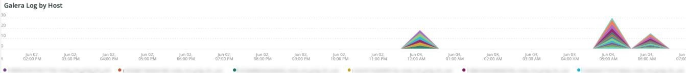

# De [!UICONTROL MySQL] tab

## [!UICONTROL MySQL% free storage by node]

Veel problemen worden veroorzaakt doordat MySQL onvoldoende opslagruimte heeft in de opslagruimte die is toegewezen aan MySQL (`datadir` MySQL configuratie setting, default is `/data/mysql`) of de `tmpdir` er is bijna geen ruimte meer. De standaardwaarde `tmpdir` (MySQL-instelling) is `/tmp`. De **[!UICONTROL MySQL% free storage by node]** frame kijkt naar de `/, /tmp` (indien gedefinieerd als een afzonderlijke montage) en de `/data/mysql` percentage vrije opslag. Vanaf MySQL versie 5.7 (MariaDB versie 10.2), niet-gecomprimeerd `tmp` tabellen worden geschreven naar een `tmp` tabelruimte in de `/data/mysql` in het bestand (ibtmp1). Dit bestand wordt standaard automatisch zonder limiet uitgebreid. Aangezien het een tabelruimte is, neemt de grootte niet af en wordt de waarde weer ingesteld op 12 MB wanneer MySQL opnieuw wordt gestart.

## [!UICONTROL MySQL Connections by Node]

De **[!UICONTROL MySQL Connections by Node]** frame geeft periodes van uitval van databaseknooppunten of hoge volumes van verbindingen aan.

## [!UICONTROL MySQL Node Summary]

De **[!UICONTROL MySQL Node Summary]** de lijst toont de details van de gegevensbestandknoop zoals softwareversie en instantietype (grootte).

## [!UICONTROL Galera Number of Nodes in cluster]

De **[!UICONTROL Galera Number of Nodes in cluster]** het kader toont informatie van de logboeken MySQL. Als knooppunten zich aansluiten bij een cluster en dit verlaten, worden alleen de berichten voor het geselecteerde tijdframe weergegeven. Als een knooppunt de cluster verlaat vóór het tijdframe, bestaat er geen bericht tijdens dat tijdframe. Als u vermoedt dat de database te kort loopt voor een knooppunt, breidt u de tijdlijn uit naar een langere periode om te zien of u aanvullende informatie kunt zien. Als er tijdens de tijdperiode informatie is die minder aangeeft dan alle knooppunten in de [!DNL Galera] , breidt het tijdkader uit om te zien of kunt u bepalen wanneer de knoop de cluster verliet.

## [!UICONTROL MySQL shutdowns and starts]

De **[!UICONTROL MySQL shutdowns and starts]** frame detecteert wanneer een knooppunt wordt afgesloten. De [!DNL Galera] knooppunten worden verwijderd en zelf uit de [!DNL Galera] knooppunt. Dit zal typisch in een nieuw begin van de dienst MySQL resulteren.

## [!UICONTROL Galera log]

De **[!UICONTROL Galera log]** het kader toont de tellingen van bijzondere signalen van de logboeken MySQL betreffende [!DNL Galera] knooppunten, hun statussen en de statuswijzigingen van de [!DNL Galera] cluster.

* &#39;%1047 WSREP heeft nog geen knooppunt voor toepassingsgebruik%&#39;) als &#39;node_not_prep_for_use&#39; voorbereid
* WSREP &#39;%\[ERROR\]: Kan niet lezen van: wsrep_sst_xtrabackup-v2%&#39;) als &#39;xtrabackup_read_fail&#39;
* WSREP &#39;%\[ERROR\]: Proces voltooid met fout: wsrep_sst_xtrabackup-v2 %&#39;) als &#39;xtrabackup_compl_w_err&#39;
* WSREP &#39;%\[ERROR\]: rbr write fail%&#39;) als &#39;rbr_write_fail&#39;
* &#39;%self-leave%&#39;) als &#39;susp_node&#39;
* &#39;%members = 3/3 (join/total)%&#39;) as&#39;3of3&#39;
* &#39;%members = 2/3 (join/total)%&#39;) as&#39;2of3&#39;
* &#39;%members = 2/2%&#39;) als &#39;2of2&#39;
* &#39;%members = 1/2%&#39;) als &#39;1of2&#39;
* &#39;%members = 1/3%&#39;) als &#39;1of3&#39;
* &#39;%members = 1/1%&#39;) als &#39;1of1&#39;
* &quot;%\[Opmerking\] /usr/sbin/mysqld (mysqld 10.%&#39;) as&#39;sql_start&#39;
* &#39;%Quorum: Geen knooppunt met volledige status:%&#39;) als &#39;no_node_count&#39;
* &#39;%WSREP: Lid 0%&#39;) als &#39;mem_0&#39;
* &#39;%WSREP: Lid 1,0%&quot;) als &quot;mem_1&quot;
* &#39;%WSREP: Lid 2%&#39;) als &#39;mem2&#39;
* &#39;%WSREP: Gesynchroniseerd met groep, gereed voor verbindingen%&#39;) als &#39;ready&#39;
* &#39;%/usr/sbin/mysqld, Version:%&#39;) als &#39;mysql_start_mysql.slow&#39;
* &quot;%\[Nota\] WSREP: Nieuwe clusterweergave: globale status:%&#39;) als &#39;galera_cluster_view_chng&#39;

## [!UICONTROL Galera Log by Host]

De **[!UICONTROL Galera Log by Host]** frame is gelijk aan **[!UICONTROL Galera log]** frame, behalve dat wordt het gebroken door knoop om met het oplossen van problemen te helpen.

## [!UICONTROL Database performance]

De **[!UICONTROL Database performance]** het kader toont gegevensbestandprestaties tijdens specifieke verzoeken. U kunt elke meting zien door erop te klikken in de gekleurde pictogrammen onder de grafiek. Veel van de meetgegevens die worden aangeroepen in [De Prestaties van het Gegevensbestand MySQL met Nieuw Relic controleren](https://newrelic.com/blog/how-to-relic/how-to-monitor-mysql) vindt u in dit frame.

* average(query.queryPerSecond)
* average(query.slowQueriesPerSecond)
* average(db.createdTmpDiskTablesPerSecond)
* average(db.createdTmpFilesPerSecond)
* average(db.tablesLocksWaitedPerSecond)
* average(db.innodb.rowLockTimeAvg)
* average(db.innodb.rowLockWaitsPerSecond)

## [!UICONTROL Transaction Database Call Count]

De **[!UICONTROL Transaction Database Call Count]** het kader toont het aantal gegevensbestandvraag die door elke transactiefacet wordt gemaakt. Dit lijkt rijgeoriënteerd te zijn en geen verklaringen.

## [!UICONTROL Cron_schedule table updates]

De **[!UICONTROL Cron_schedule table updates]** Het kader toont de maximumduur van gegevensbestandupdates aan de cron_planning lijst voor de geselecteerde tijdspanne.

## [!UICONTROL Slow Query Traces]

De **[!UICONTROL Slow Query Traces]** het kader toont de lijst en verzoektype waar de langzame vraagsporen bestaan. Een langzaam vraagspoor wordt gecreeerd voor vraagtransacties die langer dan vijf seconden duren. Van belang voor dit kader zijn de updatequery&#39;s. Als een tabel wordt bijgewerkt door `UPDATE`, `DELETE`, en `INSERT` instructies, kunnen ze tabellen gedurende een bepaalde periode vergrendelen.

Even `SELECT` instructies kunnen rijen vergrendelen bij gebruik met FOR UPDATE.

## [!UICONTROL Datastore Operations tables]

## [!UICONTROL Cron table change]

De **[!UICONTROL Cron table change]** frame zoekt naar &#39;kan lock for cron job niet verkrijgen:&#39; foutberichten, samen met een specifieke PHP-geheugenfout en vergrendelingen voor de functie `cron_schedule` tabel. Als de `cron_schedule` tabel is vergrendeld (bijvoorbeeld een `DELETE` vraag die tegen het wordt in werking gesteld), zal het andere kronnen van het lopen blokkeren.

## [!UICONTROL Deadlocks]

De **[!UICONTROL Deadlocks]** frame bekijkt de volgende tekenreeksen die uit de MySQL-logboeken zijn geparseerd:

* &#39;%PHP Fatale fout: Toegestane geheugengrootte van%&#39;) als php_mem_error
* &#39;%get lock; Probeer transactie opnieuw te starten, query was: DELETE VAN \&quot;cron_planning%&quot;) als cron_sched_lock_del
* &#39;% vergrendeling voor uitsnijdtaak: indexer_reindex_all_invalid%&#39;) als &#39;lock_indexer_reindex_all_invalid%&#39;
* &#39;% vergrendeling voor uitsnijdtaak: cron_planning%&#39;) als &#39;lock_cron_planning&#39;
* &#39;% vergrendeling voor uitsnijdtaak:%&#39;) als &#39;total_cron_lock&#39;
* &#39;%Algemene fout: 1205 Vergrendelingstijd overschreden%&#39;) als &#39;sql_1205_lock&#39;
* &#39;%FOUT 1213 (40001): Deadlock gevonden tijdens poging lock% te krijgen) als &#39;sql_1213_lock&#39;
* &#39;%SQLSTATE[40001]: Fout in serienummering: 1213 Deadlock found%&#39;) als &#39;sql_1213_lock2&#39;
* &#39;% vergrendeling voor uitsnijdtaak: indexer_update_all_views%&#39;) als &#39;lock_indexer_update_all_views&#39;
* &#39;% vergrendeling voor uitsnijdtaak: sales_grid_order_factuur_async_insert%&#39;) als &#39;lock_sales_grid_order_factuur_async_insert&#39;,
* &#39;% vergrendeling voor uitsnijdtaak: staging_remove_updates%&#39;) als &#39;lock_staging_remove_updates&#39;
* &#39;% vergrendeling voor uitsnijdtaak: sales_grid_order_dispatch_async_insert%&#39;) als &#39;lock_sales_grid_order_dispatch_async_insert&#39;
* &#39;% vergrendeling voor uitsnijdtaak: amazon_payments_process_queue_restitued%&#39;) als &#39;lock_amazon_payments_process_queue_references&#39;
* &#39;% vergrendeling voor uitsnijdtaak: sales_send_order_dispatch_emails%&#39;) als &#39;lock_sales_send_order_dispatch_emails&#39;
* &#39;% vergrendeling voor uitsnijdtaak: staging_synchronize_entities_period%&#39;) als &#39;lock_staging_synchronize_entities_period&#39;
* &#39;% vergrendeling voor uitsnijdtaak: indexer_clean_all_changelogs%&#39;) als &#39;lock_indexer_clean_all_changelogs&#39;
* &#39;% vergrendeling voor uitsnijdtaak: magento_targetRule_index_reindex%&#39;) als &#39;lock_magento_targetRule_index_reindex&#39;
* &#39;% vergrendeling voor uitsnijdtaak: newsletter_send_all%&#39;) als &#39;lock_newsletter_send_all&#39;
* &#39;% vergrendeling voor uitsnijdtaak: newsletter_send_all%&#39;) als &#39;lock_newsletter_send_all&#39;
* &#39;% vergrendeling voor uitsnijdtaak: sales_send_order_emails%&#39;) als &#39;lock_sales_send_order_emails&#39;
* &#39;% vergrendeling voor uitsnijdtaak: sales_send_order_creditmemo_emails%&#39;) als &#39;lock_sales_send_order_creditmemo_emails&#39;
* &#39;% vergrendeling voor uitsnijdtaak: sales_grid_order_creditmemo_async_insert%&#39;) als &#39;lock_sales_grid_order_creditmemo_async_insert&#39;
* &#39;% vergrendeling voor uitsnijdtaak: bulk_Cleup%&#39;) als &#39;lock_bulk_Cleup&#39;
* &#39;% vergrendeling voor uitsnijdtaak: flush_preview_quota%&#39;) als &#39;lock_flush_preview_quota&#39;
* &#39;% vergrendeling voor uitsnijdtaak: sales_send_order_factuur_emails%&#39;) als &#39;lock_sales_send_order_factuur_emails&#39;
* &#39;% vergrendeling voor uitsnijdtaak: sales_send_order_factuur_emails%&#39;) als &#39;lock_sales_send_order_factuur_emails&#39;
* &#39;% vergrendeling voor uitsnijdtaak: captcha_delete_expired_images%&#39;) als &#39;lock_captcha_delete_expired_images&#39;
* &#39;% vergrendeling voor uitsnijdtaak: magento_newrelicreporting_cron%) als &#39;lock_magento_newrelicreporting_cron&#39;
* &#39;% vergrendeling voor uitsnijdtaak: verouderd_authentication_errors_clean%&#39;) als &#39;lock_outdated_authentication_failure_clean&#39;
* &#39;% vergrendeling voor uitsnijdtaak: send_notification%&#39;) als &#39;lock_send_notification&#39;
* &#39;% vergrendeling voor uitsnijdtaak: magento_giftcardaccount_generage_codes_pool%&#39;) als &#39;lock_magento_giftcardaccount_generage_codes_pool&#39;
* &#39;% vergrendeling voor uitsnijdtaak: catalog_product_frontend_actions_flush%&#39;) als &#39;lock_catalog_product_frontend_actions_flush&#39;
* &#39;% vergrendeling voor uitsnijdtaak: mysqlmq_clean_messages%&#39;) als &#39;mysqlmq_clean_messages&#39;
* &#39;% vergrendeling voor uitsnijdtaak: catalog_product_attribute_value_synchronize%&#39;) als &#39;lock_catalog_product_attribute_value_synchronize&#39;
* &#39;% vergrendeling voor uitsnijdtaak: ddg_automation_importer%&#39;) als &#39;lock_ddg_automation_importer&#39;
* &#39;% vergrendeling voor uitsnijdtaak: ddg_automation_reviews_and_wishlist%&#39;) als &#39;lock_ddg_automation_reviews_and_wishlist&#39;
* &#39;% vergrendeling voor uitsnijdtaak: captcha_delete_old_try%&#39;) als &#39;lock_captcha_delete_old_paths&#39;
* &#39;% vergrendeling voor uitsnijdtaak: catalog_product_outdated_price_values_cleanUp%&#39;) als &#39;lock_catalog_product_outdated_price_values_cleanUp&#39;
* &#39;% vergrendeling voor uitsnijdtaak: consumer_runner%&#39;) als &#39;lock_consumer_runner&#39;
* &#39;% vergrendeling voor uitsnijdtaak: ddg_automation_customer_subscriber_gast_sync%&#39;) als &#39;lock_ddg_automation_customer_subscriber_gast_sync&#39;
* &#39;% vergrendeling voor uitsnijdtaak: get_amazon_capture_updates%&#39;) als &#39;lock_get_amazon_capture_updates&#39;
* &#39;% vergrendeling voor uitsnijdtaak: get_amazon_authentication_updates%&#39;) als &#39;lock_send_get_amazon_authentication_updates&#39;
* &#39;% vergrendeling voor uitsnijdtaak: temando_process_platform_events%&#39;) als &#39;lock_temando_process_platform_events&#39;
* &#39;% vergrendeling voor uitsnijdtaak: ddg_automation_status%&#39;) als &#39;lock_ddg_automation_status&#39;
* &#39;% vergrendeling voor uitsnijdtaak: ddg_automation_status%&#39;) als &#39;lock_ddg_automation_status&#39;
* &#39;% vergrendeling voor uitsnijdtaak: sales_clean_orders%&#39;) als &#39;lock_sales_clean_orders&#39;
* &#39;% vergrendeling voor uitsnijdtaak: catalog_index_refresh_price%&#39;) als &#39;lock_catalog_index_refresh_price&#39;
* &#39;% vergrendeling voor uitsnijdtaak: magento_return_balance_warning_notification%&#39;) als &#39;lock_magento_return_balance_warning_notification&#39;
* &#39;% vergrendeling voor uitsnijdtaak: analytics_update%&#39;) als &#39;lock_analytics_update&#39;
* &#39;% vergrendeling voor uitsnijdtaak: messagequeue_clean_outdated_locks%&#39;) als &#39;lock_message_queue_clean_outdated_locks&#39;
* &#39;% vergrendeling voor uitsnijdtaak: messagequeue_clean_outdated_locks%&#39;) als &#39;lock_message_queue_clean_outdated_locks&#39;
* &#39;% vergrendeling voor uitsnijdtaak: staging_apply_version%&#39;) als &#39;lock_staging_apply_version&#39;
* &#39;% vergrendeling voor uitsnijdtaak: magento_return_ends_points%&#39;) als &#39;lock_magento_return_ends_points&#39;
* &#39;% vergrendeling voor uitsnijdtaak: yotpo_yotpo_orders_sync%&#39;) als &#39;lock_yotpo_yotpo_orders_sync&#39;
* &#39;% vergrendeling voor uitsnijdtaak: catalog_event_status_checker%&#39;) als &#39;lock_catalog_event_status_checker&#39;
* &#39;% vergrendeling voor uitsnijdtaak: ddg_automation_campagne%&#39;) als &#39;lock_ddg_automation_campagne&#39;
* &#39;% vergrendeling voor uitsnijdtaak: bezoeker_clean%&#39;) als &#39;lock_bezoeker_clean&#39;
* &#39;% vergrendeling voor uitsnijdtaak: scconnector_verify_website%&#39;) als &#39;lock_scconnector_verify_website&#39;
* &#39;% vergrendeling voor uitsnijdtaak: ddg_automation_email_templates%&#39;) als &#39;lock_ddg_automation_email_templates&#39;
* &#39;% vergrendeling voor uitsnijdtaak: aggregaat_verkoop_rapport_order_data%&#39;) als &#39;lock_aggregal_sales_report_order_data&#39;
* &#39;% vergrendeling voor uitsnijdtaak: ddg_automation_catalog_sync%) als &#39;lock_ddg_automation

## [!UICONTROL DB Statistics]

De **[!UICONTROL DB Statistics]** frame weergeeft verwijdert , schrijft , leest , werkt en verwerkt query &#39; s per seconde .

## [!UICONTROL Request frequency]

## [!UICONTROL Database Errors]

De **[!UICONTROL Database Errors]** frame geeft diverse databases weer [waarschuwingen en fouten](https://mariadb.com/kb/en/mariadb-error-codes/):

* &#39;%Geheugengrootte toegewezen voor de tijdelijke tabel is meer dan 20% van de waarde van &#39;innodb_buffer_pool_size%&#39; als &#39;temp_tbl_buff_pool&#39;
* WSREP &#39;%\[ERROR\]: rbr write fail%&#39;) als &#39;rbr_write_fail&#39;
* &#39;%mysqld: Schijf vol%&#39;) als &#39;disk_full&#39;
* &#39;%Error number 28%&#39;) als &#39;err_28&#39;
* &#39;%rollback%&#39;) als &#39;rollback&#39;
* &#39;%Foreign key-beperking mislukt voor table%&#39;) als &#39;foreign_key_constraint&#39;
* &#39;%Error_code: 1114%&#39;) als &#39;sql_1114_full&#39;&#39;%CRITICAL: SQLSTATE[HY000] [2006] MySQL-server is weggegaan (%&#39;) als &#39;sql_away&#39;
* &#39;%SQLSTATE[HY000] [1040] Te veel verbindingen%&#39;) als &#39;sql_1040&#39;
* &#39;%CRITICAL: SQLSTATE[HY000] [2002]%&#39;) als &#39;sql_2002&#39;
* &#39;%SQLSTATE[08S01]:%&#39;) als &#39;sql_1047&#39;
* &#39;%[Waarschuwing] Afgebroken connection%&#39;) als &#39;aborted_conn&#39;
* &#39;%SQLSTATE[23000]: Schending van integriteitsbeperking:%&#39;) als &#39;sql_23000&#39;
* &#39;%1205 Lock wait timeout%&#39;) als &#39;sql_1205&#39;
* &#39;%SQLSTATE[HY000] [1049] Onbekende database%&#39;) als &#39;sql_1049&#39;
* &#39;%SQLSTATE[42S02]: Basistabel of -weergave niet gevonden:%&#39;) als &#39;sql_42S02&#39;
* &#39;%Algemene fout: 1114%&#39;) als &#39;sql_1114&#39;
* &#39;%SQLSTATE[40001]%&#39;) als &#39;sql_1213&#39;
* &#39;%SQLSTATE[42S22]: Kolom niet gevonden: 1054 Onbekende kolom%&#39;) als &#39;sq1_1054&#39;
* &#39;%SQLSTATE[42000]: Syntaxisfout of toegangsfout:%&#39;) als&#39;sql_42000&#39;
* &#39;%SQLSTATE[21000]: Kardinaliteitsovertreding:%&#39;) als &#39;sql_1241&#39;
* &#39;%SQLSTATE[2003]:%&#39;) als &#39;sql_2003&#39;
* &#39;%SQLSTATE[HY000] [9000] Client met IP-adres%&#39;) als &#39;sql_9000&#39;
* &#39;%SQLSTATE[HY000]: Algemene fout: 2014%&#39;) als &#39;sql_2014&#39;
* &#39;%1927 Verbinding is gedood%&#39;) als &#39;sql_1927&#39;
* &#39;%1062 \[ERROR\] InnoDB:%&#39;) als &#39;sql_1062_e&#39;
* &#39;&#39;%[Opmerking] WSREP: Geheugenkaart naar schijf spoelen...%&#39;) als &#39;mem_map_flush&#39;
* &#39;%Internal MariaDB error code: 1146%&#39;) als &#39;sql_1146&#39;
* &#39;%Internal MariaDB error code: 1062%&#39;) als &#39;sql_1062&#39; * &#39;%1062&#39; [Waarschuwing] InnoDB:%&#39;) als &#39;sql_1062_w&#39;
* &#39;%Internal MariaDB error code: 1064%&#39;) als &#39;sql_1064&#39;
* &#39;%InnoDB: Bevestigingsfout in bestand%&#39;) als &#39;assertion_err&#39;
* &#39;%mysqld_safe Aantal processen dat nu wordt uitgevoerd: 0%&#39;) als &#39;mysql_oom&#39;
* &#39;%\[ERROR\] mysqld heeft signaal%&#39;) als &#39;mysql_sigterm&#39;
* &#39;%1452 Cannot add%&#39;) as &#39;sql_1452&#39;
* &#39;%ERROR 1698%&#39;) als &#39;sql_1698&#39;
* &#39;%SQLSTATE[HY000]: Algemene fout: 3%&#39;) als &#39;cnt_wrt_tmp&#39;
* &#39;%Algemene fout: 1 %&#39;) als &#39;sql_syntax&#39;
* &#39;%42S22%&#39;) als &#39;sql_42S22&#39;
* &#39;%InnoDB: Fout (Dubbele sleutel)%&#39;) als &#39;innodb_dup_key&#39; VAN LOKTIJDSTEMMEN

## [!UICONTROL DB Error Table]

De **[!UICONTROL DB Error Table]** frame geeft dezelfde informatie weer als de **[!UICONTROL Database Errors]** frame, maar u kunt het per knoop en in een lijstformaat zien. Zie [MariaDB-foutcodes](https://mariadb.com/kb/en/mariadb-error-codes/) voor meer informatie .

## [!UICONTROL Database Traces]

De **[!UICONTROL Database Traces]** het kader toont de gegevensbestandsporen door type over de geselecteerde chronologie.

## [!UICONTROL Database processes]

De **[!UICONTROL Database processes]** frame toont de databaseprocessen, -omgevingen en -knooppuntid&#39;s.

## [!UICONTROL MySQL Non-Sleeping Threads by Node]

De **[!UICONTROL MySQL Non-Sleeping Threads by Node]** het kader toont de verbindingsdraden aan het gegevensbestand. Dit kader toont de actieve draden.

## [!UICONTROL MySQL Running and Sleeping Threads by environment]

De **[!UICONTROL MySQL Running and Sleeping Threads by environment]** frame toont zowel actieve als slaapverbindingen met de database. Als er verbindingen met het gegevensbestand zijn waar de langzame vragen naar slaap zijn gegaan, zullen er slaapverbindingen zijn. De slaapverbindingen kunnen gegevensbestandvragen zijn die door gesloten rijen of lijsten worden geblokkeerd. Deze slaapverbindingen houden ook PHP arbeidersverbindingen vast.

## [!UICONTROL MySQL mem used by node]

De **[!UICONTROL MySQL mem used by node]** het kader toont het knoopgebruik van geheugen door MySQL. Op grotere sites kan dit frame bestaan uit doorlopende balken met geheugencapaciteit van GB.

## [!UICONTROL Database mysql-slow.log]

De **[!UICONTROL Database mysql-slow.log]** het kader toont de types van vraagverklaring die in `mysql-slow.log` bestand over de geselecteerde tijdlijn.

