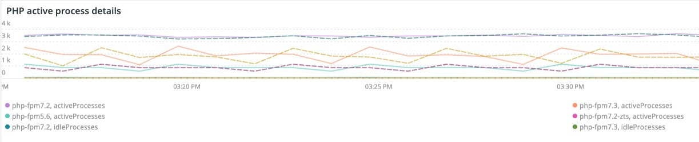

# De [!UICONTROL PHP] tab

De **PHP** Dit tabblad geeft PHP-procesproblemen weer om een diepgaande analyse te geven van PHP-problemen.

## [!UICONTROL PHP active process details]

De **[!UICONTROL PHP active process details]** frame toont de PHP processen, inclusief php-fpm, over de geselecteerde tijdsperiode.

## [!UICONTROL PHP process load (# of PHP processes and % of CPU load)]

De **[!UICONTROL PHP process load (# of PHP processes and % of CPU load)]** frame toont de CPU load van PHP-FPM processen over de geselecteerde tijdsperiode.

## [!UICONTROL PHP Memory detail]

De **[!UICONTROL PHP Memory detail]** frame toont het geheugengebruik van PHP processen over het geselecteerde tijdsbestek.

## [!UICONTROL PHP CPU Utilization]

De **[!UICONTROL PHP CPU Utilization]** frame toont het CPU-procentuele gebruik van PHP processen over de geselecteerde tijdsperiode.

## [!UICONTROL PHP Process states]

De **[!UICONTROL PHP Process states]** frame toont de PHP processtatus over het geselecteerde tijdframe. Het wordt weergegeven wanneer PHP-processen worden beëindigd en opnieuw worden gestart. Wees voorzichtig met afgesloten PHP-processen die geen nieuwe start laten zien.

* %NOTICE: Beëindigen...%&#39;) als &#39;php_term&#39;
* MELDING &#39;%: afscheid nemen, afscheid nemen!%&#39;) als &#39;php_exit&#39;
* MELDING &#39;%: fpm is actief, pid%&#39;) als &#39;fpm_start&#39;
* %NOTICE: ready (ready) voor handle connections(%&#39;) als &#39;php_ready&#39;

## [!UICONTROL PHP Errors]

De **[!UICONTROL PHP Errors]** frame toont het aantal PHP-arbeidersfouten in de geselecteerde tijdlijn. Foutberichten die worden geparseerd en weergegeven, zijn:

* &#39;%worker_connections are not genoeg%&#39;) als &#39;worker&#39;
* &#39;%PHP Fatale fout: Geheugengrootte toegestaan!%&#39;) als &#39;mem_size&#39;
* &#39;%exited on signaal 11 (SIGSEGV)%&#39;) as &#39;sig_11&#39;
* &#39;%exited on signaal 7 (SIGBUS)%&#39;) as &#39;sig_7&#39;
* &#39;%rise pm.start_servers%&#39;) als &#39;pmstart_serv&#39;
* &#39;%max_children%&#39;) als &#39;max_children_cnt&#39;
* &#39;%PHP Fatale fout: Toegestane geheugengrootte van%&#39;) als &#39;mem_exhst_coun&#39;
* &#39;%Kan geheugen voor pool%&#39;) niet toewijzen als &#39;opc_mem_count&#39;
* &#39;%Warning Interned String buffer overflow%&#39;) als &#39;opc_str_buf&#39;
* &#39;%Illegal string offsetl%&#39;) als &#39;opc_sv_comments&#39;
* &#39;%PHP Fatale fout: Uncaught RedisException: leesfout bij verbinding%&#39;) als &#39;php_exc&#39;

## [!UICONTROL PHP processes count]

De **[!UICONTROL PHP processes count]** frame toont een aantal PHP processen over het geselecteerde tijdsbestek.

## [!UICONTROL Database Errors]

De **[!UICONTROL Database Errors]** frame geeft databasefouten weer over de geselecteerde tijdlijn. Voorbeelden van geparseerde fouten zijn:

* &#39;%Geheugengrootte toegewezen voor de tijdelijke tabel is meer dan 20% van de waarde van onschuldig_buffer_pool_size%&#39;) als &#39;temp_tbl_buff_pool&#39;
* WSREP &#39;%\[ERROR\]: rbr write fail%&#39;) als &#39;rbr_write_fail&#39;
* &#39;%mysqld: Schijf vol%&#39;) als &#39;disk_full&#39;
* &#39;%Error number 28%&#39;) als &#39;err_28&#39;
* &#39;%rollback%&#39;) als &#39;rollback&#39;
* &#39;%Foreign key-beperking mislukt voor table%&#39;) als &#39;foreign_key_constraint&#39;
* &#39;%Error_code: 1114%&#39;) als &#39;sql_1114_full&#39;
* &#39;%CRITICAL: SQLSTATE[HY000] [2006] MySQL-server is weggegaan (%&#39;) als &#39;sql_away&#39;
* &#39;%SQLSTATE[HY000] [1040] Te veel verbindingen%&#39;) als &#39;sql_1040&#39;
* &#39;%CRITICAL: SQLSTATE[HY000] [2002]%&#39;) als &#39;sql_2002&#39;
* &#39;%SQLSTATE[08S01]:%&#39;) als &#39;sql_1047&#39;
* &#39;%[Waarschuwing] Afgebroken connection%&#39;) als &#39;aborted_conn&#39;
* &#39;%SQLSTATE[23000]: Schending van integriteitsbeperking:%&#39;) als &#39;sql_23000&#39;
* &#39;%1205 Lock wait timeout%&#39;) als &#39;sql_1205&#39;
* &#39;%SQLSTATE[HY000] [1049] Onbekende database%&#39;) als &#39;sql_1049&#39;
* &#39;%SQLSTATE[42S02]: Basistabel of -weergave niet gevonden:%&#39;) als &#39;sql_42S02&#39;
* &#39;%Algemene fout: 1114%&#39;) als &#39;sql_1114&#39;
* &#39;%SQLSTATE[40001]%&#39;) als &#39;sql_1213&#39;
* &#39;%SQLSTATE[42S22]: Kolom niet gevonden: 1054 Onbekende kolom%&#39;) als &#39;sq1_1054&#39;
* &#39;%SQLSTATE[42000]: Syntaxisfout of toegangsfout:%&#39;) als &#39;sql_42000&#39;
* &#39;%SQLSTATE[21000]: Kardinaliteitsovertreding:%&#39;) als &#39;sql_1241&#39;
* &#39;%SQLSTATE[2003]:%&#39;) als &#39;sql_2003&#39;
* &#39;%SQLSTATE[HY000] [9000] Client met IP-adres%&#39;) als &#39;sql_9000&#39;
* &#39;%SQLSTATE[HY000]: Algemene fout: 2014%&#39;) als &#39;sql_2014&#39;
* &#39;%1927 Verbinding is gedood%&#39;) als &#39;sql_1927&#39;
* &#39;%1062 \[ERROR\] InnoDB:%&#39;) als &#39;sql_1062_e&#39;
* &#39;%[Opmerking] WSREP: Geheugenkaart naar schijf spoelen...%&#39;) als &#39;mem_map_flush&#39;
* &#39;%Internal MariaDB error code: 1146%&#39;) als &#39;sql_1146&#39;
* &#39;%Internal MariaDB error code: 1062%&#39;) als &#39;sql_1062&#39; * &#39;%1062&#39; [Waarschuwing] InnoDB:%&#39;) als &#39;sql_1062_w&#39;
* &#39;%Internal MariaDB error code: 1064%&#39;) als &#39;sql_1064&#39;
* &#39;%InnoDB: Bevestigingsfout in bestand%&#39;) als &#39;assertion_err&#39;
* &#39;%mysqld_safe Aantal processen dat nu wordt uitgevoerd: 0%&#39;) als &#39;mysql_oom&#39;
* &#39;%\[ERROR\] mysqld heeft signaal%&#39;) als &#39;mysql_sigterm&#39;
* &#39;%1452 Cannot add%&#39;) as &#39;sql_1452&#39;
* &#39;%ERROR 1698%&#39;) als &#39;sql_1698&#39;
* &#39;%SQLSTATE[HY000]: Algemene fout: 3%&#39;) als &#39;cnt_wrt_tmp&#39;
* &#39;%Algemene fout: 1 %&#39;) als &#39;sql_syntax&#39;
* &#39;%42S22%&#39;) als &#39;sql_42S22&#39;
* &#39;%InnoDB: Error (Duplicate key)%&#39;) as &#39;innodb_dup_key&#39;

## [!UICONTROL Database traces]

De **[!UICONTROL Database traces]** frame geeft traceerinformatie voor de database weer. Dit frame wordt uitgelijnd op de APM-transactieoverzichtsweergave voor de geselecteerde tijdlijn.

## [!UICONTROL Database mysql-slow.log]

De **[!UICONTROL Database mysql-slow.log]** het kader toont de types van vraagverklaring die in `mysql-slow.log` bestand over de geselecteerde tijdlijn.
