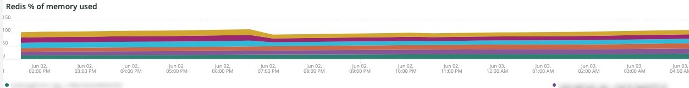

# De [!DNL Redis] tab

## [!UICONTROL Redis Node summary]

De **[!UICONTROL Redis Node summary]** omvat alle knooppunten in een omgeving. In het bovenstaande voorbeeld staan de knooppunten voor gedeelde staging. Er zijn één primaire en twee secundaire werknemers in productie en ook een primaire en twee secundaire staging.

## [!UICONTROL Redis node detail]

De **[!UICONTROL Redis node detail]** frame verwijst naar de omgeving; [!DNL Redis] rol, softwareversie en knooppuntgrootte.

## [!UICONTROL Redis node roles timeline]

De **[!UICONTROL Redis node roles timeline]** frame geeft het verlies van [!DNL Redis] diensten in het bijzonder. Als een lijn dips, wijst het erop dat de bepaalde rol die de lijn vertegenwoordigt een knoop of knopen heeft verloren.

## [!UICONTROL Connection to Redis]

De **[!UICONTROL Connection to Redis]** frame geeft de waarde net.connectedClients weer vanuit de [!DNL New Relic Redis] voorbeeldgegevens. Het toont de verbindingentelling door [!DNL New Relic] application (environment) en node.

## [!UICONTROL Commands per second by node]

De **[!UICONTROL Commands per second by node]** frame toont de [!DNL Redis] opdrachten per knooppunt per seconde gedurende de geselecteerde tijdlijn.

## [!UICONTROL Redis % of memory used]

De **[!UICONTROL Redis % of memory used]** frame geeft het percentage weer van het maximale geheugen dat door de [!DNL Redis] servers.

## [!UICONTROL Redis used memory]

De **[!UICONTROL Redis used memory]** frame toont het knoopgebruik van geheugen in GB/MB.

## [!UICONTROL Redis changes since last db save]

[!DNL Redis] is een geheugeningezetene en slaat de informatie op voor opslag. De **[!UICONTROL Redis changes since last db save]** frame geeft het aantal wijzigingen in het geheugen aan dat is opgetreden sinds de laatste database naar de opslaglocatie is opgeslagen. Zie [Redis persistentie](https://redis.io/docs/manual/persistence/) voor meer uitleg over [!DNL Redis's] persistentie.

## [!UICONTROL Redis synchronization from Log]

De **[!UICONTROL Redis synchronization from Log]** frame richt zich op de fouten die tijdens [!DNL Redis] synchroniseren of fouten die optreden als gevolg van synchronisatieproblemen. Voor meer informatie over [!DNL Redis], zie [[!DNL Redis] Documentatie](https://redis.io/docs/).
