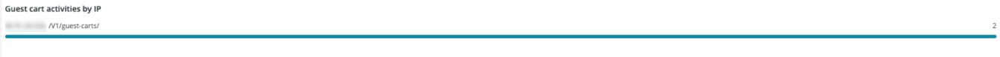

# De [!UICONTROL Security] tab

De **[!UICONTROL Security]** tab geeft uitleg over beveiligingsproblemen en isoleert de mogelijke oorzaken ervan. Verder worden de frames van de tab beschreven.

## [!UICONTROL API calls by IP, details by URL]

De **[!UICONTROL API calls by IP, details by URL]** frame toont een aantal API-aanroepen door IP over een geselecteerd tijdframe. Dit kader toont het IP adres en API URL die door dat IP adres werden betreden.

## [!UICONTROL Forgot Password]

De **[!UICONTROL Forgot Password]** het toegangskader toont het aantal pogingen van het vergeten wachtwoord over een geselecteerd tijdsbestek. De hoge activiteit tegen een IP adres kan een aanval op de plaats zijn.

## [!UICONTROL Create Account access]

De **[!UICONTROL Create Account access]** frame geeft het aantal nieuwe accountactiviteiten weer over een geselecteerd tijdsbestek. De hoge activiteit van één enkel IP adres kan op een aanval wijzen.

## [!UICONTROL POST activities]

De **[!UICONTROL POST activities]** frame toont de `POST` activiteiten voor de site, aangestuurd op `client_ip` van de [!DNL Fastly] logboeken. Het toont ook URL die door het IP adres wordt betreden.

## [!UICONTROL POST activities summary table]

De **[!UICONTROL POST activities summary table]** frame toont overzicht `POST` activiteiten voor de site, aangestuurd op `client_ip` van de [!DNL Fastly] logboeken. Het toont ook de telling voor URL die door het IP adres wordt betreden. Het aantal is voor het geselecteerde tijdframe.

## [!UICONTROL POST activities details table]

De **[!UICONTROL POST activities details table]** frame toont de `POST` activiteiten voor de locatie vanuit de [!DNL Fastly] logboeken. Het toont ook alle details van [!DNL Fastly] logboek voor deze verzoeken. Het is beperkt tot de laatste 2000 verzoeken.

## [!UICONTROL Guest Carts activities]

De **[!UICONTROL Guest Carts activities]** Het kader toont het aantal activiteiten van het gastwinkelwagentje over een geselecteerd tijdskader, beperkt door IP adres en URL betreden. Gastkaarten kunnen worden gebruikt bij een tekenaanval. Dit kader toont het totale aantal verzoeken waar gast-winkelwagentjes&#39; URLs worden betreden.

## [!UICONTROL API – forgot password, create account by Countries]

De **[!UICONTROL API – forgot password, create account by Countries]** frame toont het aantal gemaakte accounts en verzoeken om een vergeten wachtwoord opnieuw in te stellen over een geselecteerd tijdsbestek. Ook het land van oorsprong van het verzoek kan worden vermeld. Dit kader is gericht op het land van oorsprong van het verzoek.

## [!UICONTROL API - forgot password, create account by Countries and IP address]

De **[!UICONTROL API - forgot password, create account by Countries and IP address]** frame toont het aantal gemaakte accounts en verzoeken om een vergeten wachtwoord opnieuw in te stellen over een geselecteerd tijdsbestek. Het kan het IP-adres, de benaderde URL en het land van oorsprong van het verzoek ook weergeven. Dit kader wordt geconcentreerd op de telling van IP.

## [!UICONTROL Guest cart activities by IP]

De **[!UICONTROL Guest cart activities by IP]** het kader toont de activiteiten van het gastwinkelwagentje door IP over een geselecteerd tijdkader.

## [!UICONTROL Guest cart activities by Countries]

De **[!UICONTROL Guest cart activities by Countries]** frame toont gastcartactiviteiten per land over een geselecteerd tijdsbestek.

