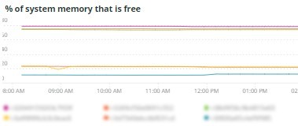
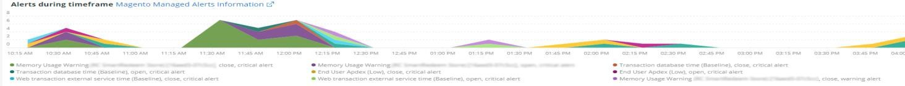
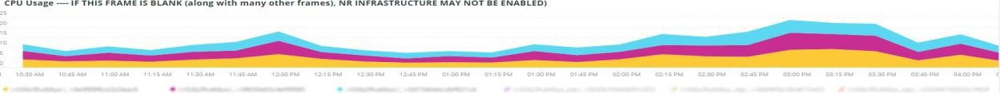
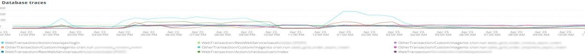
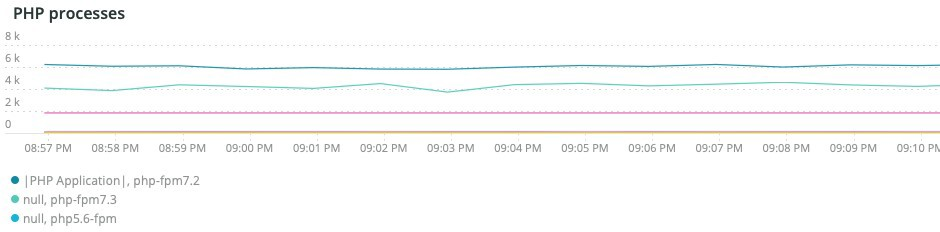
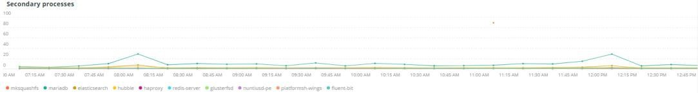
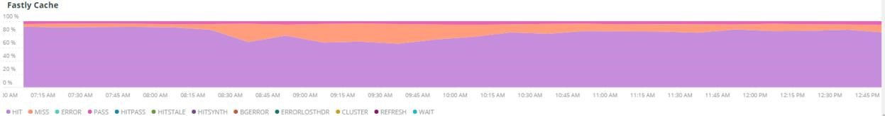
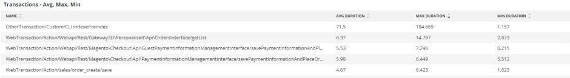
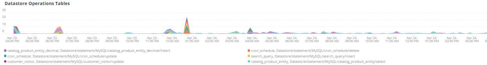

# Het tabblad [!UICONTROL Summary]

Het tabblad [!UICONTROL Summary] van [!DNL Observation for Adobe Commerce] is bedoeld om snel een aantal problemen te zien die sites ervaren om u te helpen bij het automatisch oplossen of identificeren van mogelijke hoofdoorzaken van siteproblemen. De extra lusjes verstrekken diepgaande niveauinformatie over componentendiensten, gegevensbestand, infrastructuur, en processtaten.

## [!UICONTROL Transaction Overview]

### [&#x200B; wat is een transactie?](https://docs.newrelic.com/docs/apm/transactions/intro-transactions/transactions-new-relic-apm/#:%7E:text=transactions%20are%20reported.-,Wat%20is%20a%20transactie%3F,werk%20in%20a%20software%20application.&text=For%20APM%2C%20it%20will%20will%20vaak,when%20the%20response%20is%20sent)

&quot;Bij [!DNL New Relic] wordt een transactie gedefinieerd als één logische eenheid van het werk in een softwaretoepassing. Specifiek, verwijst het naar de functievraag en methodevraag die omhoog die eenheid van het werk maken. Het verwijst vaak naar een Webtransactie, die een activiteit vertegenwoordigt die gebeurt van wanneer de toepassing een Webverzoek aan ontvangt wanneer de reactie wordt verzonden.&quot;

### Soorten transacties:

**Web:** de transacties van het Web worden in werking gesteld met een verzoek van HTTP. Voor de meeste organisaties, vertegenwoordigen deze klant-centric interactie en zijn daarom de belangrijkste transacties om te controleren.

**niet-Web:** de niet-Webtransacties worden niet in werking gesteld met een Webverzoek. Ze kunnen processen van niet-webworkers, achtergrondprocessen, scripts, activiteit in de wachtrij van berichten en andere taken omvatten.

Als je kijkt naar het bovenstaande frame van **[!UICONTROL Transaction Overview]** , waren er bijna 53.000 transacties met een gemiddelde APDEX score van 0,76, en 95% van deze transacties gebeurde in minder dan 2,313 seconden. Dit zou een kader zijn waarin een strakkere tijdslijn kan wijzen op een afwijking van dat huidige gemiddelde als er een APDEX-hit is tijdens een korte periode.

## [!UICONTROL 404 page errors frame]

Het **[!UICONTROL 404 page errors]** kader maakt een lijst van [&#x200B; URI &#x200B;](https://en.wikipedia.org/wiki/Uniform_Resource_Identifier) en de telling van 404 paginafouten voor geselecteerde timeframe.

## [!UICONTROL % of Storage Free frame]

In het frame **[!UICONTROL % of Storage Free]** wordt het gemiddelde percentage weergegeven dat vrij is van de opslagbevestigingen in alle knooppunten van uw cluster. Als u bijvoorbeeld een cluster met drie knooppunten hebt, wordt in het frame \&lt;mount point\>, \&lt;environment name\> weergegeven. Dit frame kan misleidend zijn als er een variatie is tussen drie knooppunten. Een voorbeeld van een variantie zou zijn als de `/data/mysql` mount point free een verschillende waarde over de drie knoopclusters was. Er is een frame onder het tabblad [!UICONTROL MySQL] dat de koppelingspunten op knooppuntnaam instelt om nauwkeuriger te zien wat de `/data/mysql` -opslagruimte op elk knooppunt is.

## [!UICONTROL % of system memory that is free frame]

**% van systeemgeheugen dat vrije** kader is toont, door knoop, de hoeveelheid systeemgeheugen die op elke knoop vrij is.

## [!UICONTROL Swap memory free in bytes]

In het frame **[!UICONTROL Swap memory free in bytes]** wordt per knooppunt de hoeveelheid SWAP-geheugen weergegeven die vrij is op het knooppunt.

## [!UICONTROL CPU % by host]

Het totaal van alle omgevingen en knooppunten wordt weergegeven in het **[!UICONTROL CPU % by host]** -frame. Schakel de niet-productieomgevingen uit. Let ook op gevallen waarin niet alle knooppunten voor de productieomgeving aanwezig zijn. Voor meer uiteinden op hoog gebruik van CPU, verwijs naar [&#x200B; de prestaties problemen oplossen gebruikend New Relic op Adobe Commerce &#x200B;](https://experienceleague.adobe.com/docs/commerce-knowledge-base/kb/troubleshooting/miscellaneous/troubleshoot-performance-using-new-relic-on-magento-commerce.html?lang=nl-NL).

## [!UICONTROL Alerts during timeframe]

In **[!UICONTROL Alerts during timeframe]** worden alle waarschuwingen weergegeven, inclusief de waarschuwingen die door Adobe Commerce zijn toegevoegd. [!UICONTROL Managed Alerts]

## [!UICONTROL CPU Usage]

Als het frame **[!UICONTROL CPU Usage]** leeg is, geeft dit aan dat de infrastructuurtoepassing van [!DNL New Relic] niet is ingeschakeld. Als uw site op Starter staat, worden deze gegevens niet weergegeven. Als uw plaats op Pro is, open a [&#x200B; steunkaartje &#x200B;](https://experienceleague.adobe.com/docs/commerce-knowledge-base/kb/help-center-guide/magento-help-center-user-guide.html?lang=nl-NL) om [!DNL New Relic Infrastructure] te hebben toegelaten voor uw plaats.

## [!UICONTROL Average Response Time]

In de grafiek **[!UICONTROL Average Response Time]** wordt de gemiddelde responstijd voor transacties (web en andere) weergegeven.

## [!UICONTROL Long duration cron_schedule updates]

De tabel **[!UICONTROL cron_schedule]** wordt geschreven aan het begin en einde van de snijtaken. Bij lange duur kunnen cron-taken vertraging bij het bijwerken van deze tabel aangeven. Dit kan een aanwijzing zijn voor een tijdelijke back-up of een probleem met de planning van de crons.

## [!UICONTROL Response Code]

Het frame **[!UICONTROL Response Code]** is een goede indicatie van het webverkeer en de antwoordcode van aanvragen. Het zijn [!DNL New Relic's] transactiegegevens, en het wordt beperkt door `httpResponseCode` teruggekeerd.

## [!UICONTROL Web Traffic volume compared with one week ago Magento Managed Alerts Information]

Dit kader toont het relatieve volume van het Webverkeer van de afgelopen week en de huidige week.

## [!UICONTROL Deployment Log Entries]

Het **[!UICONTROL Deployment Log Entries]** kader toont een aantal plaatsing en de ingangen van het wolkenlogboek en beperkt de tellingen door de naam van het plaatsingslogboek.

## [!UICONTROL Deployment State]

Het **[!UICONTROL Deployment State]** kader facetteert bepaalde plaatsingsfasen van opstellen logboeken. Hier volgen enkele voorbeelden van fasen die in het logbestand en de facetnaam zijn geteld:

**Phases van het Logboek van de Plaatsing:**

* &#39;%Starten genereert opdracht%&#39;) als &#39;start_gen&#39;
* &#39;%git apply /app/vendor/magento/ece-tools/patches%&#39;) as &#39;apply_patches&#39;
* &#39;%vlag instellen: .static_content_implementatie%&#39;) als &#39;SCD&#39;
* &#39;%NOTICE: opdracht genereren voltooid%&#39;) als &#39;gen_compl&#39;
* &#39;%NOTICE: Implementatie voltooid%&#39;) als &#39;implementatie_compl&#39;
* &#39;%NOTICE: Na implementatie starten.%&#39;) als &#39;start_implementatie&#39;
* &#39;%NOTICE: PostImplementation is complete%&#39;) als &#39;implementatie&#39;
* &#39;%implementatie-complete%&#39;) als &#39;cl_implementatie_compl&#39;

## [!UICONTROL IP Frequency]

Het frame **[!UICONTROL IP Frequency]** telt de statussen (&#39;MISS&#39; en &#39;PASS&#39;) voor elke IP vanuit de logboeken van [!DNL Fastly] . De verzoeken van het Web met deze statussen bereiken de oorsprongsserver en zullen lading aan de server toevoegen. De top 20 van adressen in frequentie worden getoond. Dit kader kan worden gebruikt om IP aanvallen of bronnen van zware lading op een website te ontdekken.

## [!UICONTROL IP Response – top 20 URLs in duration]

In het frame **[!UICONTROL IP Response – top 20 URLs in duration]** worden de URL&#39;s weergegeven met de langste duur als reactie. Dit kan grote afbeeldingsbestanden of pagina&#39;s, API&#39;s of pagina&#39;s met de langste responsduur aangeven.

## [!UICONTROL API Calls by IP]

Het frame **[!UICONTROL API Calls by IP]** helpt bij het identificeren van zwaar verkeer op basis van de API&#39;s en de IP-adressen die aanvragen indienen via de API-URL&#39;s.

## [!UICONTROL API Calls by IP, details by URL]

Het frame **[!UICONTROL API Calls by IP, details by URL]** bevat details over zwaar verkeer op basis van de API&#39;s en details van de URL&#39;s die de aanvragen indienen.

## [!UICONTROL IP Frequency Rate per minute]

Soms is het moeilijk om te zien welk IP adres de meeste verzoeken op de andere kaders heeft. Het **[!UICONTROL IP Frequency Rate per minute]** kader toont het tarief per minuut per IP adres.

## [!UICONTROL Potential Bots]

Het **[!UICONTROL Potential Bots]** kader kijkt naar verzoeken met een request_user_agent naam zoals NULL of &#39;%bot%&#39;. Doorgaans volgt de request_user_agent &#39;%bot%&#39; request_user_agent de beleidsinstellingen in het `robots.txt` -bestand.

## [!UICONTROL Transaction Errors]

In het frame **[!UICONTROL Transaction Errors]** wordt het aantal transactiefouten van [!DNL New Relic] weergegeven.

## [!UICONTROL Nginx access by node]

Het **[!UICONTROL Nginx access by node]** -frame kijkt naar de tellingen van het `access.log` bij knooppunt. Het is nuttig om te zien of is de lading gelijkmatig verdeeld. Het toont vaak wanneer een knoop daalt. Het kader toont ook de lading over de plaats.

## [!UICONTROL Galera Log]

[[!DNL Galera] &#x200B;](https://galeracluster.com/library/galera-documentation.pdf) wordt gebruikt voor de gegevensbestandcluster. Dit frame is gericht op bepaalde signalen uit de [!UICONTROL Galera] -cluster. De signalen richten zich op knopen die en de cluster ingaan verlaten, die normaal gedrag is om de integriteit van gegevensbestandgegevens te handhaven. De knooppunten blijven gesynchroniseerd als de clusterstatus van [!UICONTROL Galera] verandert.

**Lijst van [!UICONTROL Galera] staatsveranderingen:**

* &#39;%1047 WSREP heeft nog geen knooppunt voor toepassingsgebruik%&#39;) als &#39;node_not_prep_for_use&#39; voorbereid
* &#39;%\[ERROR\] WSREP: Kan niet lezen van: wsrep_sst_xtrabackup-v2%&#39;) als &#39;xtrabackup_read_fail&#39;
* &#39;%\[ERROR\] WSREP: Proces voltooid met fout: wsrep_sst_xtrabackup-v2 %&#39;) als &#39;xtrabackup_compl_w_err&#39;
* &#39;%\[ERROR\] WSREP: rbr write fail%&#39;) als &#39;rbr_write_fail&#39;
* &#39;%self-leave%&#39;) als &#39;susp_node&#39;
* &#39;%members = 3/3 (join/total)%&#39;) als &#39;3of3&#39;
* &#39;%members = 2/3 (join/total)%&#39;) als &#39;2of3&#39;
* &#39;%members = 2/2%&#39;) as &#39;2of2&#39; * &#39;%members = 1/2%&#39;) as &#39;1of2&#39; * &#39;%members = 1/3%&#39;) as &#39;1of3&#39;
* &#39;%members = 1/1%&#39;) als &#39;1of1&#39;
* &quot;%\[Opmerking\] /usr/sbin/mysqld (mysqld 10.%&#39;) als &#39;sql_start&#39;
* &#39;%Quorum: Geen knooppunt met volledige status:%&#39;) als &#39;no_node_count&#39;
* &#39;%WSREP: lid 0%&#39;) als &#39;mem_0&#39;
* &#39;%WSREP: Lid 1.0%&#39;) als &#39;mem_1&#39;
* &#39;%WSREP: lid 2%&#39;) als &#39;mem2&#39;
* &#39;%WSREP: gesynchroniseerd met groep, gereed voor verbindingen%&#39;) als &#39;ready&#39;
* &#39;%/usr/sbin/mysqld, Version:%&#39;) als &#39;mysql_start_mysql.slow&#39;
* &#39;%\[Opmerking\] WSREP: Nieuwe clusterweergave: globale status:%&#39;) als &#39;galera_cluster_view_change&#39;

Deze signalen kunnen op opslag, geheugen, of vraagkwesties wijzen als de staat vaak verandert.

## [!UICONTROL Database errors]

**Lijst van ontdekte gegevensbestandfouten of berichten:**

* &#39;%Geheugengrootte toegewezen voor de tijdelijke tabel is meer dan 20% van de waarde van onschuldig_buffer_pool_size%&#39;) als &#39;temp_tbl_buff_pool&#39;
* &#39;%\[ERROR\] WSREP: rbr write fail%&#39;) als &#39;rbr_write_fail&#39;
* &#39;%mysqld: Schijf vol%&#39;) als &#39;disk_full&#39;
* &#39;%Error number 28%&#39;) als &#39;err_28&#39;
* &#39;%rollback%&#39;) als &#39;rollback&#39;
* &#39;%Foreign key-beperking mislukt voor table%&#39;) als &#39;foreign_key_constraint&#39;
* &#39;%Error_code: 1114%&#39;) als &#39;sql_1114_full&#39;
* &#39;%CRITICAL: SQLSTATE\[HY000\] \[2006\] MySQL-server has away%&#39;) als &#39;sql_went&#39;
* &#39;%SQLSTATE\[HY000\] \[1040\] Te veel verbindingen%&#39;) als &#39;sql_1040&#39;
* &#39;%CRITICAL: SQLSTATE\[HY000\] \[2002\]%&#39;) als &#39;sql_2002&#39;
* &#39;%SQLSTATE\[08S01\]:%&#39;) als &#39;sql_1047&#39;
* &#39;%\[Waarschuwing\] Afgebroken verbinding%&#39;) als &#39;aborted_conn&#39;
* &#39;%SQLSTATE\[23000\]: schending van integriteitsbeperking:%&#39;) als &#39;sql_23000&#39;
* &#39;%1205 Lock wait timeout%&#39;) als &#39;sql_1205&#39;
* &#39;%SQLSTATE\[HY000\] \[1049\] Onbekende database%&#39;) als &#39;sql_1049&#39;
* &#39;%SQLSTATE\[42S02\]: Basistabel of weergave niet gevonden:%&#39;) als &#39;sql_42S02&#39;
* &#39;%Algemene fout: 1114%&#39;) als &#39;sql_1114&#39;
* &#39;%SQLSTATE\[40001\]%&#39;) als &#39;sql_1213&#39;
* &#39;%SQLSTATE\[42S22\]: kolom niet gevonden: 1054 Onbekende kolom%&#39;) als &#39;sq1_1054&#39;
* &#39;%SQLSTATE\[42000\]: syntaxisfout of toegangsfout:%&#39;) als &#39;sql_42000&#39;
* &#39;%SQLSTATE\[21000\]: schending van kardinaliteit:%&#39;) als &#39;sql_1241&#39;
* &#39;%SQLSTATE\[2003\]:%&#39;) als &#39;sql_2003&#39;
* &#39;%SQLSTATE\[HY000\] \[9000\] Client with IP address%&#39;) als &#39;sql_9000&#39;
* &#39;%SQLSTATE\[HY000\]: Algemene fout: 2014%&#39;) als &#39;sql_2014&#39;
* &#39;%1927 Verbinding is gedood%&#39;) als &#39;sql_1927&#39;
* &#39;%1062 \[\ERROR\] InnoDB:%&#39;) als &#39;sql_1062_e&#39;
* &quot;%\[Nota\] WSREP: Het leegmaken van geheugenkaart aan schijf..%&quot;) als &quot;mem_map_flush&quot;
* &#39;%Internal MariaDB error code: 1146%&#39;) as &#39;sql_1146&#39;
* &#39;%Internal MariaDB error code: 1062%&#39;) as &#39;sql_1062&#39; * &#39;%1062 \[Warning\] InnoDB:%&#39;) as &#39;sql_1062_w&#39;
* &#39;%Internal MariaDB error code: 1064%&#39;) as &#39;sql_1064&#39;
* &#39;%InnoDB: bevestiging mislukt in bestand%&#39;) als &#39;assertion_err&#39;
* &#39;%mysqld_safe Aantal processen dat nu wordt uitgevoerd: 0%&#39;) als &#39;mysql_oom&#39;
* &#39;%\[ERROR\] mysqld heeft signaal%&#39;) als &#39;mysql_sigterm&#39;
* &#39;%1452 Cannot add%&#39;) as &#39;sql_1452&#39;
* &#39;%ERROR 1698%&#39;) als &#39;sql_1698&#39;
* &#39;%SQLSTATE\[HY000\]: Algemene fout: 3%&#39;) als &#39;cnt_wrt_tmp&#39;
* &#39;%Algemene fout: 1 %&#39;) als &#39;sql_syntax&#39;
* &#39;%42S22%&#39;) als &#39;sql_42S22&#39;
* &#39;%InnoDB: Error (Duplicate key)%&#39;) as &#39;innodb_dup_key&#39;

## [!UICONTROL Database traces]

Het **[!UICONTROL Database traces]** kader kijkt gegevens van het [&#x200B; sql spoor &#x200B;](https://docs.newrelic.com/docs/apm/transactions/transaction-traces/transaction-traces-database-queries-page/) entiteit van [!DNL New Relic] en keert de weg van het spoor terug.

## [!UICONTROL Database mysql-slow.log]

Het **[!UICONTROL Database mysql-slow.log]** kader doet een telling van ingangen in [&#x200B; mysql-slow.log &#x200B;](https://dev.mysql.com/doc/refman/5.7/en/slow-query-log.html) door het type van vraagverzoek. Tijdframes worden visueel geïsoleerd die van belang kunnen zijn voor het mysql-slow.log (traag querylogboek). De vragen van lijsten zonder indexen of vragen die grote lijsten bijwerken kunnen andere vragen blokkeren.

## [!UICONTROL Redis synchronization from Log]

[[!DNL Redis] &#x200B;](https://redis.io/about/) is een open bron (BSD vergunning) opslag van de in-geheugengegevensstructuur die als gegevensbestand, geheime voorgeheugen, en berichtbroker wordt gebruikt. Het kan gegevensbestand en zittingscaching doen als gevormd. Het **[!UICONTROL Redis synchronization from Log]** kader concentreert zich op [[!DNL Redis]  synchronisatie &#x200B;](https://redis.io/docs/latest/operate/oss_and_stack/management/replication/). Hoe groter de [!DNL Redis] dataset, des te waarschijnlijker dat er problemen met de synchronisatie (meer gegevens om gesynchroniseerd te houden) zullen zijn.

**[!DNL Redis]fouten en berichten:**

* &#39;%SLAVE-synchronisatie: Geen ruimte meer over op apparaat%&#39;) als &#39;spatie&#39;
* &#39;%Server gestart, Redis version%&#39;) als &#39;serv_start&#39;
* &#39;%De server is nu klaar om verbindingen te accepteren (%&#39;) als &#39;ready&#39;
* &#39;%Verbinding met stramien verbroken.%&#39;) als &#39;mstr_lost&#39;
* &#39;%+sdown sentinel%&#39;) als &#39;+sentinal&#39;
* &#39;%-sdown sentinel%&#39;) als &#39;-sentinal&#39;
* &#39;%-sdown slave%&#39;) als &#39;-slave&#39;, &#39;%+sdown slave%&#39;) als &#39;+slave&#39;
* &#39;%-failover-abort-not-selected master mymaster%&#39;) als &#39;-failover&#39;
* &#39;%+failover-abort-not-selected master mymaster%&#39;) als &#39;+failover&#39;
* &#39;%Partiële resynchronisatie niet mogelijk (geen hoofdmap in cache)%&#39;) als &#39;part_sync_err&#39;
* &#39;%MASTER heeft replicatie afgebroken met een fout: ERR Can%&#39;) als &#39;mstr_sync_err&#39;
* &#39;%Master biedt geen ondersteuning voor PSYNC of heeft een foutstatus (%&#39;) als &#39;mstr_psync_err&#39;
* &#39;%SLAVE sync: Voltooid met success%&#39;) als &#39; slv_sync_suc&#39;
* &#39;%MASTER heeft replicatie afgebroken met een fout: ERR Can%&#39;) als &#39;mstr_sync_err,coun&#39;
* &#39;%OOM opdracht niet toegestaan bij gebruik van geheugen%&#39;) als &#39; max_mem_err&#39;
* &#39;%CredisException(code: 0): read error on connection%&#39;) as &#39;credits_read_error&#39;
* &#39;%Uncaught RedisException:%&#39;) as &#39;redis_excp_err&#39;
* &#39;%psync gepland om te sluiten ASAP voor het overwinnen van outputbuffer%&#39;) als &#39;output_buf_err&#39;

## [!UICONTROL PHP process states]

Het gedrag van PHP proces(en) van de manier hangt van de [&#x200B; configuratie &#x200B;](https://www.php.net/manual/en/install.fpm.configuration.php) af. De configuratie is complex, met vele variabelen en opties. Het frame **[!UICONTROL PHP process states]** helpt u te begrijpen wanneer PHP-processen worden beëindigd en opnieuw worden gestart.

### [!UICONTROL PHP errors]

Het frame **[!UICONTROL PHP errors]** toont het aantal PHP-fouten met workers over de geselecteerde tijdlijn. Voor meer informatie, verwijs naar [&#x200B; de montages van Adobe Commerce PHP &#x200B;](../../installation/prerequisites/php-settings.md).

**PHP fouten en berichten:**

* &#39;%worker_connections are not genoeg%&#39;) als &#39;worker&#39;
* &#39;%PHP Fatale error: Allowed memory size!%&#39;) als &#39;mem_size&#39;
* &#39;%exited on signaal 11 (SIGSEGV)%&#39;) as &#39;sig_11&#39;
* &#39;%exited on signaal 7 (SIGBUS)%&#39;) as &#39;sig_7&#39;
* &#39;%rise pm.start_servers%&#39;) als &#39;pmstart_serv&#39;
* &#39;%max_children%&#39;) als &#39;max_children_cnt&#39;
* &#39;%PHP Fatale error: allowed memory size of%&#39;) as &#39;mem_exhst_coun&#39;
* &#39;%Kan geheugen voor pool%&#39;) niet toewijzen als &#39;opc_mem_count&#39;
* &#39;%Warning Interned String buffer overflow%&#39;) als &#39;opc_str_buf&#39;
* &#39;%Illegal string offsetl%&#39;) als &#39;opc_sv_comments&#39;
* &#39;%PHP Fatal error: Uncaught RedisException: read error on connection%&#39;) as &#39;php_exc&#39;

## [!UICONTROL PHP processes]

[&#x200B; PHP-FPM &#x200B;](https://php-fpm.org/) is a [!UICONTROL FastCGI Process Manager] die door [!DNL Nginx] wordt gebruikt. Om over systeemvereisten te leren, verwijs naar [&#x200B; PHP versievereisten die aan de versies van Adobe Commerce &#x200B;](../../installation/system-requirements.md) worden in kaart gebracht. Het frame **[!UICONTROL PHP processes]** toont het aantal PHP-processen dat op een bepaald moment in de geselecteerde tijdlijn wordt uitgevoerd.

## [!UICONTROL Secondary processes]

Secundaire processen kunnen de reactie van de site beïnvloeden. Het frame **[!UICONTROL Secondary processes]** geeft een proces of processen aan die mogelijk laden toevoegen aan de site. Het gegevensbestand heeft hoofdzakelijk de secundaire processen die lopen.

## [!UICONTROL Traffic vs Week Ago]

Het frame **[!UICONTROL Traffic vs Week Ago]** bekijkt het websiteverkeer (aanvragen) vanuit de cachestatus [!DNL Fastly] waarbij de gebruiker zich aanmeldt bij de status MISS (MISS), PASS (PASS). Deze verzoeken voegen lading aan de oorsprongservers toe. In dit frame wordt het vergelijkende webaanvraagvolume van de huidige week en de afgelopen week geleden tijdens hetzelfde tijdsbestek weergegeven.

## [!UICONTROL Fastly Cache]

Het frame **[!UICONTROL Fastly Cache]** toont een geaggregeerde weergave van de cachestatus van aanvragen uit de [!DNL Fastly] -logboeken. Als u ERROR selecteert, zal het het percentage fouten in de verzoeken tonen. Dit neemt doorgaans toe wanneer de oorspronkelijke server niet snel genoeg reageert op paginaverzoeken.

## [!UICONTROL Page Rendering]

In het frame **[!UICONTROL Page Rendering]** wordt de gemiddelde weergaveduur van de pagina in de huidige week van de bron van de paginaweergave [!DNL New Relic] weergegeven in vergelijking met de vorige week tijdens dezelfde periode.

## [!UICONTROL Page loading detail]

 tonen

In het **[!UICONTROL Page loading detail]** -frame worden de gebeurtenissen beschreven die de pagina laden. Het geeft de betekenis van deze facetten nader. Hier is de vraag die voor dit kader in werking wordt gesteld:

`SELECT percentile(timeToResponseStart, 50) AS 'first byte', percentile(firstPaint, 50) as 'First paint', percentile(firstContentfulPaint, 50) as 'First contentful paint', percentile(timeToDomContentLoadedEventEnd, 50) AS 'DOM content loaded', percentile(duration, 50) AS 'Window load + AJAX' FROM BrowserInteraction TIMESERIES`

## [!UICONTROL Transactions – Avg, Max, Min]

De transactieduur is in seconden. Afhankelijk van de transactie kan het invloed hebben op andere transacties als deze al lang lopen. De onder naam vermelde transacties en de duur ervan gelden voor de specifieke periode. Als er een beknopt uitgiftetijdpad is, wijzigt u de datum-/tijdkiezer van [!DNL Observation for Adobe Commerce] in dat korte tijdkader.

## [!UICONTROL Admin Activities]

Het frame **[!UICONTROL Admin Activities]** identificeert transacties met een beheerder.

## [!UICONTROL Order transactions (default?)]

Het **[!UICONTROL Order transactions (default?)]** -frame zoekt naar transacties `request.headers.host` van transacties, waarbij de naam = `WebTransaction/Action/checkout/onepage/success` . Als de URL voor het succes van de bestelling anders is, heeft dit frame geen gegevens.

## [!UICONTROL Elasticsearch Index information]

**[de statussen van Elasticsearch:](https://www.elastic.co/guide/en/elasticsearch/reference/current/cluster-health.html)**

* Groen: alle schachten worden toegewezen.
* Geel: alle primaire schaden worden toegewezen, maar een of meer replicaweerten worden niet toegewezen. Als een knooppunt in de cluster uitvalt, zijn sommige gegevens mogelijk niet beschikbaar totdat dat knooppunt wordt gerepareerd.
* Rood: een of meer primaire kaarten zijn niet toegewezen, dus sommige gegevens zijn niet beschikbaar. Dit kan kort tijdens clusteropstarten voorkomen aangezien de primaire plaatsen worden toegewezen.

## [!UICONTROL Elasticsearch Errors]

**[!DNL Elasticsearch]errors:**

* &#39;%all shards failed%&#39; as &#39;all_shards_failed&#39;
* &#39;%NoNodesAvailableException%&#39; as &#39;no_live_nodes&#39;
* &#39;%PHP Fatale error: Uncaught Error: Wrong parameters for Elasticsearch%&#39; as &#39;wrong_param&#39;
* &#39;%U kunt dit probleem verhelpen door de Elasticsearch-service op uw Magento Cloud-infrastructuur te upgraden naar versie%&#39; als &#39;ver_err&#39;
* &#39;%clusterstatus gewijzigd van \[YELLOW\] in \[RED\] (reason:%&#39; als &#39;yel_red&#39;
* &#39;%No space left on device%&#39; as &#39;no_space&#39;
* &#39;% Kan &lbrack;SearchRequest&lbrace;searchType=%&#39; niet uitvoeren als &#39;failed_query&#39;

## [!UICONTROL Cron view]

In het frame **[!UICONTROL Cron view]** wordt gezocht naar het uitsnijdlog voor de balans tussen het aantal kronen dat is gestart en het aantal kronnen dat is afgewerkt.

## [!UICONTROL Cron error]

**de fouten van het Gewas van cron.log:**

* &#39;%_stg%&#39; als &#39;stg_crons&#39;
* &#39;%Could not get lock for cron job%&#39; as &#39;cron_lock&#39;
* &#39;%General error: 2006 MySQL server has away%&#39; as &#39;mysql_has_away_away&#39;
* &#39;%error%&#39; als &#39;error&#39;
* &#39;%Algemene fout: 1205 Vergrendeltijd overschreden%&#39; als sql_1205_cron

## [!UICONTROL cron_schedule table updates]

Het **[!UICONTROL cron_schedule table updates]** kader kijkt naar maximumduur in seconden waar de datastore- verrichtingen de cron_planning lijst impliceren. Deze eigenschap is afhankelijk van het type SQL-aanvraag.

## [!UICONTROL Datastore Operations Tables]

In dit **[!UICONTROL Datastore Operations Tables]** -frame worden de bovenste 25 bewerkingen weergegeven op tijdsduur, tabelnaam en SQL-aanvraagtype. Houd de muisaanwijzer boven de punten om details te bekijken van welke tabel wordt geopend en van welk type verzoek.

## [!UICONTROL Cache Flush]

{de flushes van 0} Geheime voorgeheugen ontdekte:**&#x200B;**

* &#39;%config%&#39; als &#39;config_cache_flushed&#39;
* &#39;%layout%&#39; als &#39;layout_cache_flush&#39;
* &#39;%block_html%&#39; als &#39;block_html_cache_flush&#39;
* &#39;%collections%&#39; as &#39;collections_cache_flush&#39;
* &#39;%reflectie%&#39; als &#39;reflectie_cache_flush&#39;
* &#39;%db_ddl%&#39; als &#39;db_ddl_cache_flush&#39;
* &#39;%compiled_config%&#39; als &#39;compiled_config_cache_flush&#39;
* &#39;%eav%&#39; als &#39;eav_cache_flush&#39;
* &#39;%customer_notification%&#39; als &#39;cust_notif_cache_flush&#39;
* &#39;%config_integration%&#39; als &#39;config_integ_cache_flush&#39;
* &#39;%config_integration_api%&#39; als &#39;config_integ_api_cache_flush&#39;
* &#39;%full_page%&#39; als &#39;full_page_cache_flush&#39;
* &#39;%config_webservice%&#39; als &#39;config_webserv_cache_flush&#39;
* &#39;%translate%&#39; als &#39;translate_cache_flush&#39;
