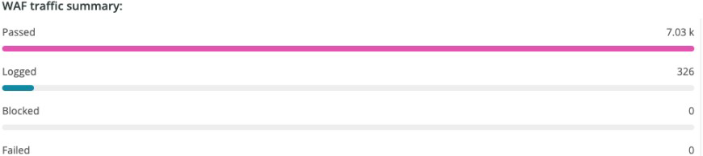
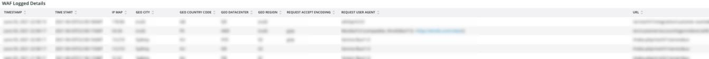

# De [!DNL WAF] tab

De **[!DNL WAF]** het lusje toont verkeer dat wordt overgegaan en door [!DNL firewall].

## [!DNL WAF traffic summary]

De **[!DNL WAF traffic summary]** het kader toont een telling van verkeer overgegaan, het programma geopend, geblokkeerd, en ontbroken door [!DNL firewall].

## [!DNL WAF Top 10 blocked IP Addresses]

De **[!DNL WAF Top 10 blocked IP Addresses]** het kader toont de hoogste 10 meest geblokkeerde IP adressen door [!DNL firewall].

## [!DNL WAF Top 10 countries for blocked requests]

De **[!DNL WAF Top 10 countries for blocked requests]** frame toont een aantal geblokkeerde aanvragen voor landen binnen de top 10 voor geblokkeerde aanvragen van de [!DNL firewall].

## [!DNL WAF Top 10 logged IP Addresses]

De **[!DNL WAF Top 10 logged IP Addresses]** het kader toont IP adressen in top 10 geregistreerde IP adressen door [!DNL firewall].

## [!DNL Top 10 WAF Rules Executed and Logged by IP address]

De **[!DNL Top 10 WAF Rules Executed and Logged by IP address]** het kader toont IP adressen die in hoogste 10 het vaakst passende zijn [!DNL firewall] regels.

## [!DNL WAF Logged Details]

De **[!DNL WAF Logged Details]** frame toont aanvragen die zijn geregistreerd door [!DNL firewall], inclusief details zoals tijdstempel, plaats, regio en datacenter.

## [!DNL WAF Blocked Details]

De **[!DNL WAF Blocked Details]** frame toont aanvragen die door de [!DNL firewall], inclusief details zoals tijdstempel, plaats, regio en datacenter.
