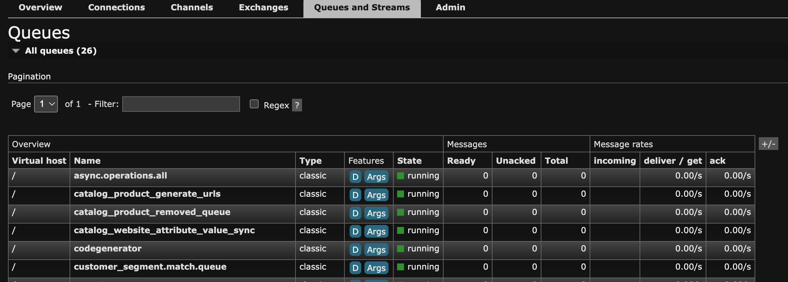

# Migreren naar ActiveMQ

ActiveMQ (Apache ActiveMQ Artemis) is een krachtige, multi-protocol berichtmakelaar die een alternatief voor RabbitMQ voor de behandeling van berichtrijen in Adobe Commerce verstrekt.

Vanaf 2.4.8-p3, 2.4.7-p8, 2.4.6-p13 en 2.4.5-p16, steunt Adobe Commerce ActiveMQ als broker van de berichtrij. Dit verstrekt extra flexibiliteit voor installaties op-gebouw om tussen RabbitMQ en ActiveMQ te kiezen die op hun infrastructuurvereisten en deskundigheid wordt gebaseerd.

## Voordat u begint

Controleer voordat u de migratie start het volgende:

1. Controleer de huidige configuratie van RabbitMQ in `app/etc/env.php` .
1. Maak een volledige back-up van de database en de codebase.
1. Controleer of uw installatie voldoet aan de systeemvereisten voor ActiveMQ.
1. Plan een onderhoudsvenster om de migratie te voltooien.

## Migratiepad

Het migreren naar ActiveMQ is een eenvoudig proces, maar het is essentieel om ervoor te zorgen dat alle lopende berichten worden verwerkt alvorens van makelaars te veranderen.

Bij deze migratieinstructies wordt ervan uitgegaan dat Adobe Commerce de enige toepassing is die de berichtenwachtrij-broker gebruikt.

### Stap 1: Plaats de site in de onderhoudsmodus

1. Plaats de plaats in [ Wijze van het Onderhoud ](../../installation/tutorials/maintenance-mode.md):

   ```shell
   bin/magento maintenance:enable
   ```

1. Controleren of de onderhoudsmodus is ingeschakeld:

   ```shell
   bin/magento maintenance:status
   ```

### Stap 2: RabbitMQ-berichtentelling controleren

Controleer voordat u verdergaat of alle berichten in RabbitMQ zijn verwerkt. Gebruik een van de volgende methoden:

#### Methode A: RabbitMQ Management Dashboard gebruiken

1. Open de beheerinterface van RabbitMQ op `http://<host>:15672`
1. Standaardreferenties: `guest/guest`
1. Navigeer aan het **lusje van de Opsommingen**
1. Verifieer alle rijen tonen **0 berichten**

   

#### Methode B: De opdrachtregel rabbitmqctl gebruiken

1. Controleer alle rijen en hun berichttellingen:

   ```shell
   rabbitmqctl list_queues name messages consumers
   ```

   

1. Gedetailleerde rijgegevens controleren:

   ```shell
   rabbitmqctl list_queues name messages messages_ready messages_unacknowledged consumers
   ```

   

### Stap 3: In behandeling zijnde berichten

Als de berichten in om het even welke rijen in behandeling zijn, proces hen alvorens te werk te gaan.

1. Bekijk de lijst met beschikbare consumenten:

   ```shell
   bin/magento queue:consumers:list
   ```

1. Consumenten verwerken als groep of per wachtrij met afzonderlijke berichten:

   - **de consumenten van het Proces als groep**

     ```shell
     bin/magento cron:run --group=consumers
     ```

     >[!NOTE]
     >
     >Als de uitsnede al op uw systeem wordt uitgevoerd, hoeft u `bin/magento cron:run --group=consumers` niet handmatig uit te voeren. In plaats daarvan, verifieer dat de berichten door de berichttellingen te controleren gebruikend de bevelen van Stap 2 worden verwerkt.

   - **Proces een specifieke berichtrij**

     ```shell
     bin/magento queue:consumers:start <consumer_name> --max-messages=<number>
     ```

     Bijvoorbeeld om asynchrone bewerkingen te verwerken:

     ```shell
     bin/magento queue:consumers:start async.operations.all --max-messages=1000
     ```

     >[!NOTE]
     >
     >De parameter `--max-messages` beperkt het aantal berichten dat moet worden verwerkt voordat de consument stopt. Pas deze waarde aan op basis van de grootte van de wachtrij.

   - **het berichtverwerking van de Monitor**

     Ononderbroken tellen van het controlebericht tot alle rijen leeg zijn:

     ```shell
     # Check every few seconds until 0 messages remain
     watch -n 5 "rabbitmqctl list_queues name messages | grep -v '^Listing' | grep -v '0$'"
     ```

### Stap 4: Controleren of alle berichten zijn verwerkt

Alvorens aan de volgende stap te werk te gaan, zorg **alle rijen tonen 0 berichten**. Voer de verificatieopdrachten opnieuw uit vanuit Stap 2.

>[!WARNING]
>
>Ga niet verder met de volgende stap als er berichten onverwerkt blijven. Het gegevensverlies kan voorkomen als u makelaars schakelt terwijl de berichten nog in behandeling zijn.

### Stap 5: Consumenten en kruisbanen stoppen

1. Alle actieve gebruikers in de wachtrij met berichten stoppen:

   ```shell
   # If using supervisor
   supervisorctl stop all
   
   # Or manually kill consumer processes
   pkill -f "queue:consumers:start"
   ```

1. Snijtaken uitschakelen:

   ```shell
   bin/magento cron:remove
   ```

1. Controleren of snijtaken zijn verwijderd:

   ```shell
   crontab -l
   ```

### Stap 6: Huidige configuratie back-up

Maak een back-up van uw huidige configuratie:

```shell
cp app/etc/env.php app/etc/env.php.backup.rabbitmq
```

### Stap 7: RabbitMQ optioneel verwijderen

U kunt RabbitMQ verwijderen als dit niet meer nodig is.

### Stap 8: ActiveMQ installeren en configureren in Adobe Commerce

Om installatie ActiveMQ en configuratietaken zoals het vormen van het protocol van STOMP te voltooien en de verbinding te verifiëren, zie de [ Gids van de Installatie en van de Configuratie ](../../installation/prerequisites/activemq.md).

### Stap 9: Cron-taken opnieuw installeren

1. Nadat de tests met succes zijn voltooid, installeert u de snijtaken opnieuw:

   ```shell
   bin/magento cron:install
   ```

1. Controleren of uitsnijdtaken zijn gepland:

   ```shell
   crontab -l
   ```

### Stap 10: Onderhoudsmodus uitschakelen

1. Nadat u hebt gecontroleerd of alles correct werkt, schakelt u de onderhoudsmodus uit:

   ```shell
   bin/magento maintenance:disable
   ```

1. Controleren of de onderhoudsmodus is uitgeschakeld:

   ```shell
   bin/magento maintenance:status
   ```

### Stap 11: Het systeem controleren

Controleer uw systeem 24-48 uur na migratie om ervoor te zorgen dat alle rijverrichtingen correct functioneren:

- Controleer regelmatig de Console van het Web ActiveMQ voor berichtproductie
- Toepassingslogboeken controleren op fouten met betrekking tot wachtrijen
- Verifieer dat de asynchrone verrichtingen (config bewaart, uitvoert, etc.) werken
- Snijlogboeken controleren om ervoor te zorgen dat consumenten actief zijn

```shell
# Monitor system logs for queue activity
tail -f var/log/system.log | grep -i queue

# Monitor cron logs
tail -f var/log/cron.log

# Check running consumer processes
ps aux | grep "queue:consumers:start"
```

## Terugdraaien

Als er problemen optreden tijdens of na de migratie, kunt u terugdraaien naar RabbitMQ:

1. Onderhoudsmodus inschakelen:

   ```shell
   bin/magento maintenance:enable
   ```

1. Stop alle consumenten en schakel de kroon uit:

   ```shell
   pkill -f "queue:consumers:start"
   bin/magento cron:remove
   ```

1. De vorige configuratie herstellen:

   ```shell
   cp app/etc/env.php.backup.rabbitmq app/etc/env.php
   ```

1. RabbitMQ starten (indien gestopt):

   ```shell
   sudo systemctl start rabbitmq-server
   ```

1. Cache wissen:

   ```shell
   bin/magento cache:flush
   ```

1. Uitsnijden opnieuw installeren:

   ```shell
   bin/magento cron:install
   ```

1. Onderhoudsmodus uitschakelen:

   ```shell
   bin/magento maintenance:disable
   ```

Na het voltooien van de migratie zijn geen verdere wijzigingen in de configuratiewaarde nodig.

