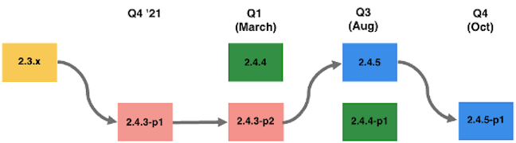
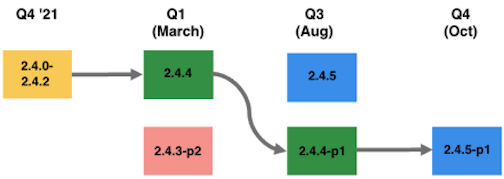

# Aanbevolen upgradepaden voor 2022

Een eCommerce-implementatie is een evolutie: deze is nooit echt voltooid. Uw bedrijf moet één stap voor trends blijven door de nieuwste mogelijkheden en functionaliteit te introduceren die uw klanten erbij houdt. Door deze extra mogelijkheden neemt het energieverbruik en de algehele complexiteit van de implementatie toe.

Enkele algemene factoren die het vereiste inspanningsniveau voor uw verbeteringsproject beïnvloeden omvatten, maar zijn niet beperkt tot:

| Technische complexiteit | Planning en strategie |
|-----------------------------------------------------------|--------------------------------------------------------------|
| Omvang van aanpassingen | Duidelijkheid van vereisten, het nemen van beslissingen en bereik |
| Aantal extensies | Uw upgradfrequentie |
| Aantal integraties met derden (OMS, ERP) | Uw teststrategie |
| Codering naar beste praktijken |  |

Hieronder volgen door Adobe Commerce aanbevolen paden om uw site gedurende 2022 veilig en krachtig te houden.

## Bijwerken vanuit versies 2.3.0-2.3.6 (optie 1)

U kunt van om het even welke lijn 2.3.x naar 2.4.3 gaan. Maar hoe langer u zonder upgrade gaat, des te meer moeite is het om rechtstreeks naar 2.4.3 te gaan, aangezien de basis van de code meer is gewijzigd.

Bijvoorbeeld, als u op 2.3.4 bent die in Januari 2020 vrijgegeven, bent u op een versie die bijna twee jaar oud is zodat is de codebasis van 2.4.3 in vergelijking met 2.3.4 veel groter. Daarom raadt Adobe u aan om vaak een upgrade uit te voeren omdat het inspanningsniveau nog hoger is als u de upgrade langere tijd vertraagt.

Zodra u op 2.4.3 bent, dan in Q1 kunt u veilig blijven door 2.4.3-p2 te nemen, wat een lage inspanning is aangezien het een lichte veiligheidsversie is. Vervolgens kunt u in het derde kwartaal de volledige patch 2.4.5 en een andere patch voor lichte beveiliging gebruiken om veilig te blijven in het vierde kwartaal. Voor dit pad zijn tegen eind 2022 twee upgrades met een hoge inspanning nodig.

## Bijwerken vanuit versies 2.3.0-2.3.6 (optie 2)

U kunt ook in maart 2022 een upgrade uitvoeren van 2.3.x rechtstreeks naar 2.4.4. Vanaf 2.4.4, kunt u het lichte veiligheidspatch in Q3 dan nemen, dan aan 2.4.5-p1 versie in Q4, die alle updates omvat die in 2.4.5 versie en extra veiligheidspatches waren.

Belangrijke overwegingen bij het bepalen van de twee opties:

| Optie 1: Upgrade naar 2.4.3-p1 of -p2 | Optie 2: Upgrade uitvoeren naar 2.4.4 of 2.4.4-p1 |
|--------------------------------------------------------------------------------------------------------------------|--------------------------------------------------------------------------------------------------------------------------------------------------|
| Vereist 2 significante verbeteringen vóór eind 2022 om veilig te blijven, PCI volgzaam, en kwaliteitssteun te ontvangen | Vereist 1 significante verbetering en 1 laag-middelmatige inspanningsupgrade vóór eind 2022 om veilig te blijven, PCI-volgzaam, en kwaliteitssteun te ontvangen |
| Hiermee kunt u mogelijk sneller een ondersteunde, PCI-compatibele versie gebruiken | Mogelijk wordt een langer venster weergegeven totdat u een ondersteunde, PCI-compatibele versie bereikt, aangezien de 2.3-regel in april 2022 EOL bereikt |
| Tijdbepaling: kan de overgang naar een nieuwe PHP versie vertragen tot later in het jaar (augustus) | Tijdbepaling: kan eerder in het jaar (maart) beginnen met een nieuwe PHP versie |

## Upgrade uitvoeren vanaf 2.3.7 (optie 1)

Aangezien u op de recentste versie 2.3.7 bent, bent u op een lijn die slechts veiligheidsversies krijgt. In Q1 van ’22 geeft Adobe de laatste versie van 2.3, die 2.3.7-p3 is, samen met een veiligheidsversie (2.4.3-p2) en een volledige versie (2.4.4) vrij.

Uw eerste optie zou zijn om 2.3.7-p3 te nemen en de recentste veiligheidsmoeilijke situaties te krijgen. Dan, in Augustus, kon u de 2.4.5 versie nemen. Tot slot kunt u in het vierde kwartaal de lichte veiligheidsrelease gebruiken op basis van de volledige 2.4.5 release. In dit scenario, zou u een paar maanden op een versie EOL zijn tot u 2.4.5 neemt. 2.3.x biedt momenteel echter geen ondersteuning voor kwaliteit en u hebt dan de meest recente beveiligingkwetsbaarheden die zijn gerepareerd.

## Upgrade uitvoeren vanaf 2.3.7 (optie 2)

Uw tweede optie zou de 2.3.7-p3 versie nemen om de recentste veiligheidsmoeilijke situaties snel te krijgen, aangezien de veiligheidspatches voor uw huidige lijn een lage inspanning zijn om uit te voeren, dan kunt u de verbetering aan 2.4.4 beginnen.

In augustus, kon u 2.4.4-p1, wat een lichte veiligheidsversie zou zijn, dan in Q4 2.4.5-p1 nemen, die alle updates inbegrepen in 2.4.5 en de recentste veiligheidsversies omvat.

U kunt ook van 2.3.7-p3 naar 2.4.4-p1 gaan, maar merk op dat 2.4.4-p1 een &quot;zware lift&quot;is aangezien u hoofdzakelijk alle updates inbegrepen in 2.4.4 en de veiligheidsupdates in 2.4.4-p1 krijgt. Het is aan u en uw team om te beslissen of u deze zwaardere lift wilt starten naar de 2.4.4-lijn in maart of augustus.

Belangrijke overwegingen bij het bepalen van de twee opties:

| Optie 1: Upgrade naar 2,3,7-p3 en vervolgens naar 2,4,5 | Optie 2: Upgrade naar 2.3.7-p3 en vervolgens naar 2.4.4 |
|--------------------------------------------------------------------------------------------------------------------|-----------------------------------------------------------------------------------------------------------------------------------------------------|
| De nieuwste beveiligingsupdates ontvangen met eerst een beveiligingspatch voor lage inspanning | De nieuwste beveiligingsupdates ontvangen met eerst een beveiligingspatch voor lage inspanning |
| Vereist 1 significante verbetering vóór eind 2022 om veilig te blijven, PCI-Volgzaam, en kwaliteitssteun te ontvangen | Vereist 1 significante verbetering en 1 laag-middelmatige inspanningsupgrade vóór eind 2022 om veilig te blijven, PCI-volgzaam, en kwaliteitssteun te ontvangen |
| Neem een langer venster totdat u in april een ondersteunde, PCI-compatibele versie bereikt die voldoet aan EOL | Tijdbepaling: kan eerder in het jaar (maart) beginnen met een nieuwe PHP versie |
| Timingoverwegingen: kan een hogere inspanningsupgrade uitstellen tot augustus | Timingoverwegingen: kan in maart een hogere inspanningsupgrade starten en in oktober een lage upgrade uitvoeren |

## Upgrade uitvoeren vanaf 2.4.0-2.4.2

Aangezien u op 2.4.0-2.4.2 bent, adviseren wij dat u aan 2.4.4 in Q1 bevordert. Dit is een relatief hoge inspanning vanwege de breukveranderingen in 2.4.4 veroorzaakt door de overstap naar PHP 8.1. De rest van de upgrades voor het jaar zijn echter minder inspanningen, dus u hoeft in 2022 slechts één inspanningsupgrade op een hoger niveau uit te voeren.

## Upgrade uitvoeren vanaf 2.4.3

Aangezien u op 2.4.3 bent, zou het nemen van 2.4.3-p2 in Q1 de minste hoeveelheid inspanning zijn. In augustus kon je de release van 2.4.5 nemen. Tot slot kunt u in het vierde kwartaal de lichte veiligheidsrelease gebruiken op basis van de volledige 2.4.5 release. In dit scenario voert u slechts één inspanningsupgrade op een hoger niveau uit in 2022.
