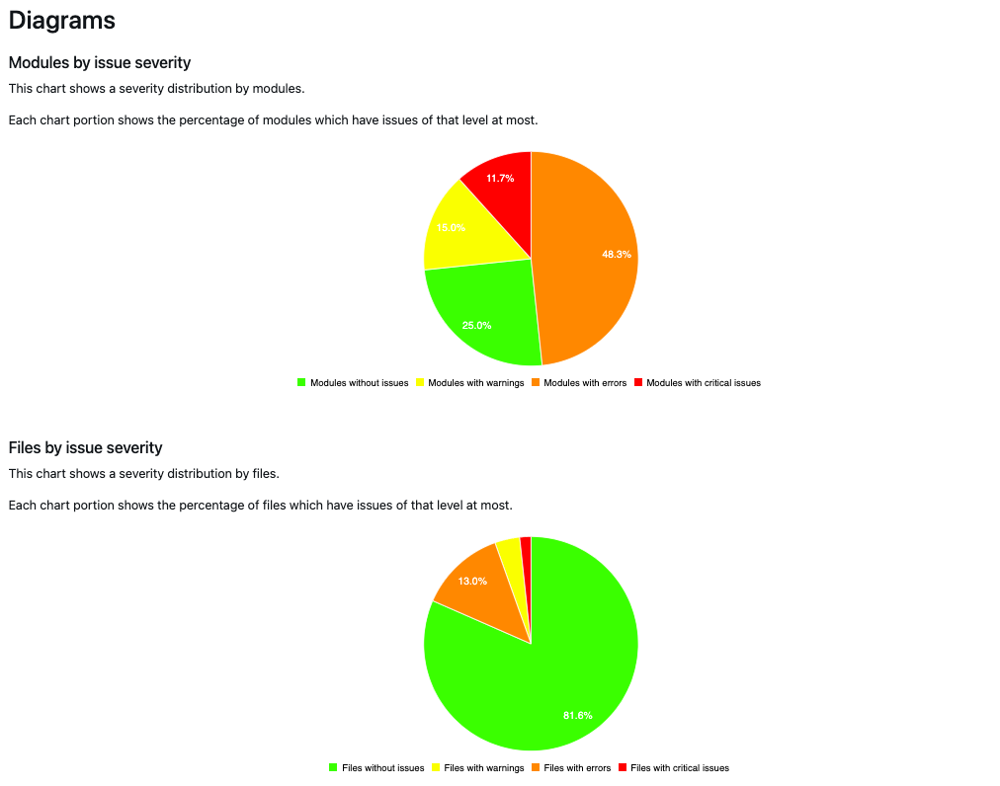
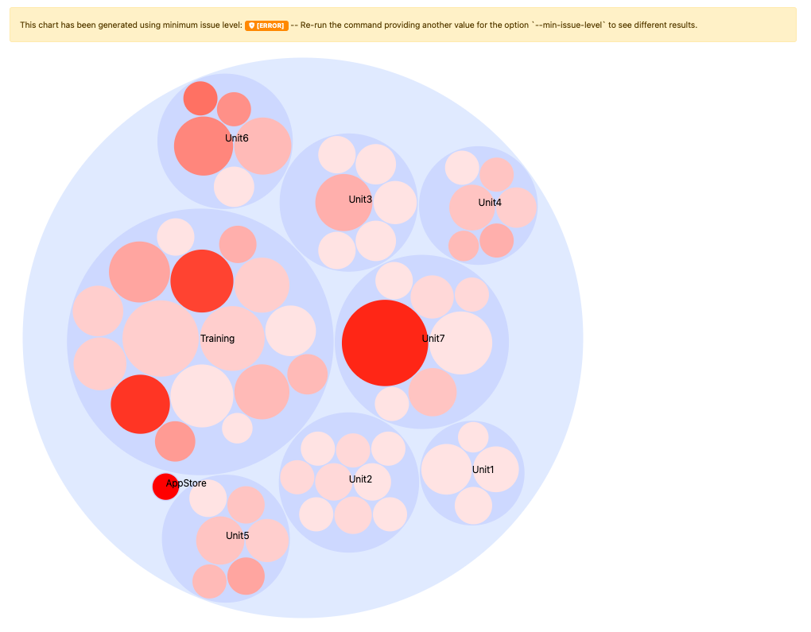

# Rapporten

{{commerce-only}}

Als resultaat van de analyse, kan [!DNL Upgrade Compatibility Tool] een rapport uitvoeren dat een lijst van kwesties voor elk dossier bevat die zijn strengheid, foutencode, en foutenbeschrijving specificeren. Het rapport wordt door [!DNL Upgrade Compatibility Tool] in twee verschillende indelingen geëxporteerd:

- A [&#x200B; JSON dossier &#x200B;](reports.md#json-file).
- Een [&#x200B; rapport van HTML &#x200B;](reports.md#html-report).

Zie het volgende bevel-lijn interfacevoorbeeld van een rapport:

```text
File: /app/code/Custom/CatalogExtension/Controller/Index/Index.php
------------------------------------------------------------------
 * [WARNING][1131] Line 10: Extending from class 'Magento\Framework\App\Action\Action' that is @deprecated on version '2.4.4'
 * [ERROR][1328] Line 10: Implemented interface 'Magento\Framework\App\Action\HttpGetActionInterface' that is non API on version '2.4.4'
```

Controleer het [&#x200B; onderwerp van de het berichtverwijzing van de Fout &#x200B;](../upgrade-compatibility-tool/error-messages.md) voor meer informatie over de verschillende fouten dit rapport kan veroorzaken.

Dit verslag bevat ook een gedetailleerde samenvatting die het volgende laat zien:

- *Huidige versie*: de versie die momenteel is geïnstalleerd.
- *Versie van het Doel*: de versie waarnaar u wilt upgraden.
- *de tijd van de Uitvoering*: de hoeveelheid tijd de analyse nam om het rapport (mm :ss) te bouwen.
- *Modules die update* vereisen: het percentage modules dat compatibiliteitsproblemen bevat en moet worden bijgewerkt.
- *Dossiers die update* vereisen: het percentage bestanden dat compatibiliteitsproblemen bevat en moet worden bijgewerkt.
- *Totale kritieke fouten*: het aantal aangetroffen kritieke fouten.
- *Totale fouten*: het aantal gevonden fouten.
- *Totale waarschuwingen*: het aantal gevonden waarschuwingen.
- *piekgebruik van het Geheugen*: de maximale hoeveelheid geheugen die [!DNL Upgrade Compatibility Tool] tijdens de uitvoering heeft bereikt.

Zie het volgende bevel-lijn interfacevoorbeeld:

```text
 ----------------------------- ----------------- 
  Current version               2.4.1            
  Target version                2.4.4            
  Execution time                1m:8s            
  Modules that require update   71.67% (43/60)   
  Files that require update     18.05% (96/532)  
  Total critical issues         24               
  Total errors                  159              
  Total warnings                53               
  Memory peak usage             902.00 MB        
 ----------------------------- ----------------- 
```

## JSON-bestand

U kunt de JSON-bestandsuitvoer ophalen terwijl u de [!DNL Upgrade Compatibility Tool] uitvoert op een opdrachtregelinterface. Het `JSON` -bestand bevat exact dezelfde informatie als wordt weergegeven op de [!DNL Upgrade Compatibility Tool] -uitvoer:

- Een lijst met geïdentificeerde problemen.
- Een samenvatting van de analyse.

Voor elke ondervonden kwestie, verstrekt het rapport gedetailleerde informatie zoals de ernst en de beschrijving van het probleem.

Dit `JSON` -bestand exporteren naar een andere uitvoermap:

```shell
bin/uct upgrade:check <dir> --json-output-path[=JSON-OUTPUT-PATH]
```

Waar de argumenten als volgt zijn:

- `<dir>` : Adobe Commerce-installatiemap.
- `[=JSON-OUTPUT-PATH]` : Padmap om het `JSON` -uitvoerbestand te exporteren.

>[!NOTE]
>
> Het standaardpad voor de uitvoermap is `var/output/[TIME]-results.json` .

## HTML-rapport

U kunt het HTML-rapport ophalen terwijl u het gereedschap uitvoert op een opdrachtregelinterface of via de [!DNL Site-Wide Analysis Tool] . Het HTML-verslag bevat ook:

- Een lijst met geïdentificeerde problemen.
- Een samenvatting van de analyse.


U kunt tijdens de [!DNL Upgrade Compatibility Tool] -analyse eenvoudig door de geïdentificeerde problemen navigeren.

U kunt de problemen in het rapport filteren op basis van het minimale emissieniveau (de standaardwaarde is `WARNING` ).

In de rechterbovenhoek bevindt zich een vervolgkeuzelijst waarin u een ander niveau kunt selecteren. De lijst met geïdentificeerde problemen wordt dienovereenkomstig gefilterd.


>[!NOTE]
>
> De kwesties met lager uitgifteniveau worden geschrapt maar u krijgt een bericht zodat bent u altijd op de hoogte van de geïdentificeerde kwesties per module.

Het HTML-rapport bevat ook vier verschillende grafieken:

- **Modules door uitgave strengheid**: Toont strengheidsverdeling door modules.
- **Dossiers door uitgave strengheid**: Hiermee geeft u de verdeling van de ernst per bestand weer.
- **Modules die door totaal aantal kwesties** worden bevolen: Toont de 10 meest gecompromitteerde modules rekening houdend met waarschuwingen, fouten, en kritieke fouten.
- **Modules met relatieve grootte en kwesties**: Hoe meer bestanden een module bevat, hoe groter de cirkel. Hoe meer problemen een module heeft, hoe meer rood de cirkel wordt weergegeven.

Deze grafieken staan u toe om de modules te identificeren die het meest gecompromitteerd zijn en degenen die meer werk vereisen om een verbetering uit te voeren.



De HTML-rapportdiagrammen worden ook dienovereenkomstig bijgewerkt, met de enige uitzondering op `Modules with relative sizes and issues` , die wordt gegenereerd met de `min-issue-level` die oorspronkelijk is ingesteld.

Als u verschillende resultaten voor het `Modules with relative sizes and issues` diagram wilt zien, moet u het bevel opnieuw in werking stellen die een andere waarde voor de `--min-issue-level` optie verstrekken.



Dit HTML-rapport exporteren naar een andere uitvoermap:

```shell
bin/uct upgrade:check <dir> --html-output-path[=HTML-OUTPUT-PATH]
```

Waar de argumenten als volgt zijn:

- `<dir>` : Adobe Commerce-installatiemap.
- `[=HTML-OUTPUT-PATH]` : Padmap om het `.html` -uitvoerbestand te exporteren.

>[!NOTE]
>
> Het standaardpad voor de uitvoermap is `var/output/[TIME]-results.html` .
